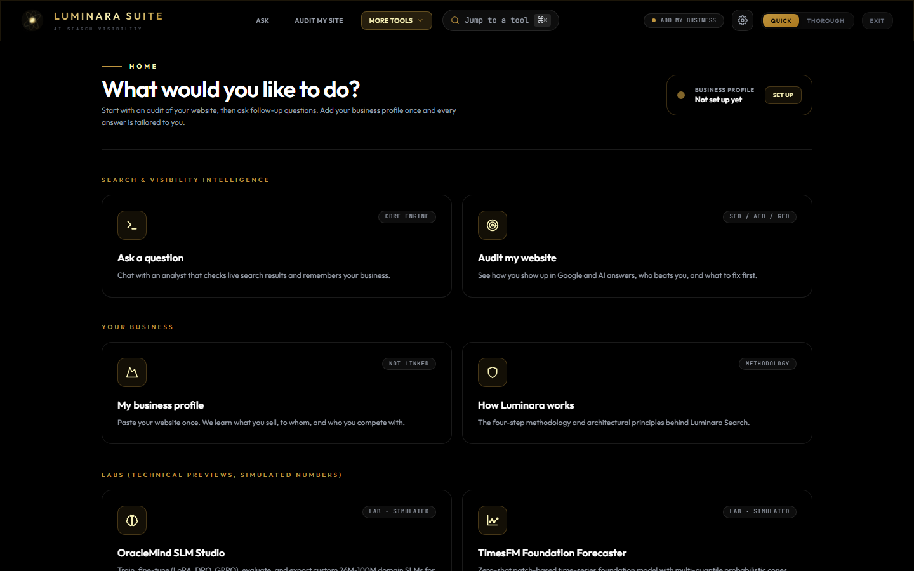
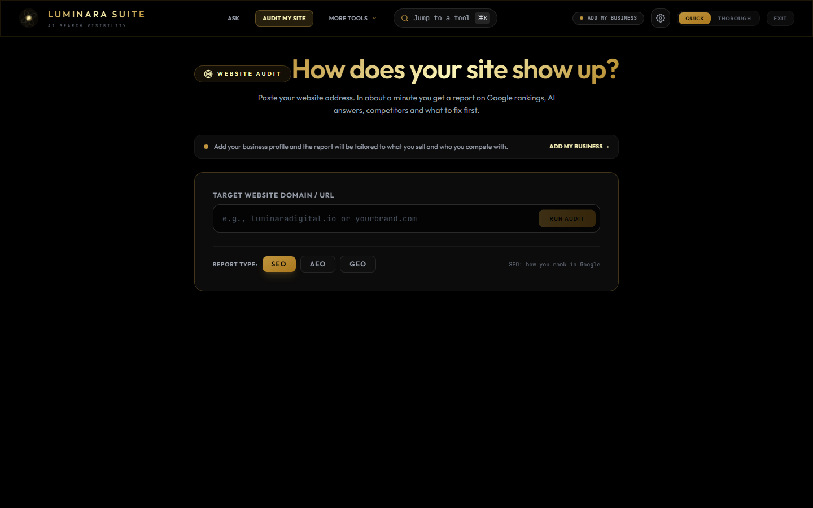
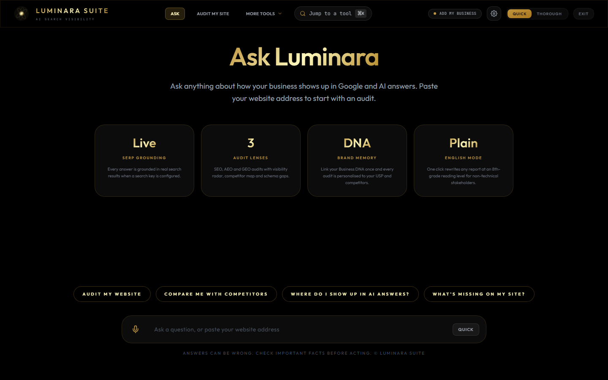
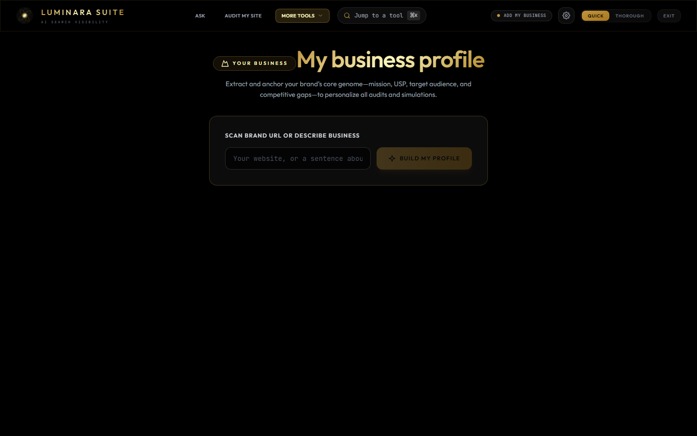
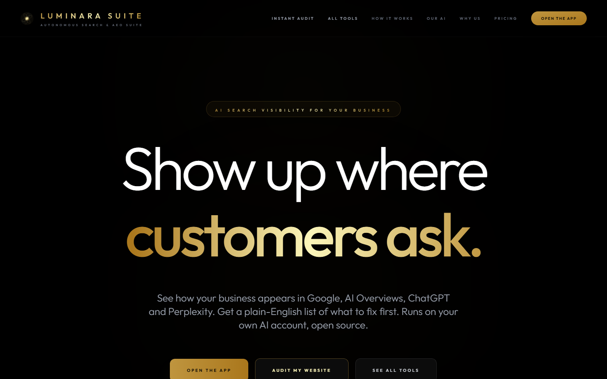

<div align="center">
  <h1>Luminara Suite</h1>
  <p><strong>Open-source AI search visibility: see how your brand shows up in Google, AI Overviews, ChatGPT and Perplexity, then get a plain-English action plan.</strong></p>
  <p>
    <a href="https://luminarasuite.com">luminarasuite.com</a> ·
    <a href="#quick-start">Quick start</a> ·
    <a href="#bring-your-own-keys">Bring your own keys</a> ·
    <a href="#deploy-cloudflare--telegram-mini-app">Deploy</a> ·
    <a href="CONTRIBUTING.md">Contribute</a>
  </p>
  <p>
    
    
    
  </p>
</div>

---

<p align="center">
  
</p>

## What it does

Luminara Suite is a web app and Telegram Mini App for **Answer Engine Optimization (AEO)**: the practice of getting your brand cited by AI answers, not just ranked by Google.

- **Instant Audit**: enter a domain, get an SEO / AEO / GEO brief grounded in a live scrape of the site and live search results, with a visibility radar, competitor map, schema gaps and prioritised recommendations.
- **Oracle Agent**: a chat analyst with conversation memory that pulls fresh search evidence when a question needs it and cites its sources.
- **Business DNA**: extract your mission, USP, audience and competitors once; every audit and answer is personalised to it.
- **Plain English mode**: one click rewrites any report at an 8th-grade reading level for non-technical stakeholders.
- **Strategy tools**: red-team stress test, data analyst, thought organiser, grounded market research.
- **Telegram Mini App**: the same product inside Telegram, with Stars payments and TON wallet connect.

It runs on **your own AI account**: Groq, NVIDIA NIM or Ollama (local or cloud), with Gemini as an optional fallback. No Luminara account is needed to self-host.

<table>
  <tr>
    <td width="50%"></td>
    <td width="50%"></td>
  </tr>
  <tr>
    <td align="center"><sub>Audit my website</sub></td>
    <td align="center"><sub>Ask a question, with plain-English rewrite and sources</sub></td>
  </tr>
  <tr>
    <td width="50%"></td>
    <td width="50%"></td>
  </tr>
  <tr>
    <td align="center"><sub>Business profile that personalises every answer</sub></td>
    <td align="center"><sub>luminarasuite.com</sub></td>
  </tr>
</table>

> **Labs.** OracleMind SLM Studio, the TimesFM forecaster and the Archy harness are demonstrations. Their numbers are simulated and the UI says so. They are kept for exploration, not measurement.

## Quick start

```bash
git clone https://github.com/LuminaraDigital/Luminara-Search-Oracle-Agent.git
cd Luminara-Search-Oracle-Agent
npm ci
npm run dev
```

Open http://localhost:3000, click the gear icon, and paste a key from one of:

| Provider | Where to get a key | Notes |
|---|---|---|
| Groq | https://console.groq.com/keys | Fastest. Default model `openai/gpt-oss-120b`. |
| NVIDIA NIM | https://build.nvidia.com/settings/api-keys | NVIDIA's API blocks browsers, so calls are relayed through the Worker with your key (never stored). Needs `npm run cf:dev` or the hosted site. |
| Ollama | Local daemon at `http://127.0.0.1:11434` needs no key. Cloud keys: https://ollama.com/settings/keys | Local runs fully offline. |
| Google Gemini (optional) | https://aistudio.google.com/apikey | Fallback model, Google Search grounding, and Live Voice. |
| Tavily (optional) | https://tavily.com | Live SERP evidence for audits and chat. |
| Firecrawl (optional) | https://firecrawl.dev | Scrapes the audited site for real on-page evidence. |

Keys are stored in your browser only.

## Bring your own keys

Luminara never needs your keys on its servers. In the browser build every provider is called directly from your device. Two exceptions are relayed through the Cloudflare Worker because the vendor blocks browser requests: NVIDIA NIM, and Gemini when you use the hosted key. Relayed requests carry your key in the `x-provider-key` header and the Worker forwards it without storing it.

On luminarasuite.com, hosted keys exist for convenience. They are only used when a request carries a valid Telegram Mini App sign-in **or** a verified Firebase Auth ID token, are metered per user (25 free requests per day by default), and are unlimited on a paid plan. Nobody can consume the hosted keys anonymously. Bring-your-own-key in Settings is never gated.

## SEO methodology (playbooks)

Audits and answers follow a published methodology rather than whatever the model improvises. The
[claude-seo](https://github.com/AgriciDaniel/claude-seo) skill set (MIT, by AgriciDaniel and contributors)
is vendored under `.claude/skills/` so Claude Code users of this repo get the full `/seo` skills, and
`scripts/build-playbooks.mjs` compiles the methodology into `services/skills/playbooks.generated.json`
for the app:

| Audit focus | Playbooks injected |
|---|---|
| SEO | scoring rules, technical SEO (9 categories), content quality / E-E-A-T, Schema.org status |
| AEO | scoring rules, AI search (AI Overviews, ChatGPT, Perplexity), Schema.org |
| GEO | scoring rules, AI search, content quality |
| Lenses (optional) | Local business, Online store, Content quality, Structured data, Search experience |

Reports carry a Health Score (0-100) with the playbook weights, Critical / High / Medium / Low findings,
and for every recommendation a "how we'd know it failed" check and a leading indicator. Deprecation rules
(no HowTo schema, FAQPage earns no rich result, INP not FID) are enforced in the prompt. Anything not
observable from the scrape and search evidence is reported as "not measured".

Edit the skill files, run `npm run playbooks`, commit the JSON. Attribution: [THIRD_PARTY_NOTICES.md](THIRD_PARTY_NOTICES.md).

## Architecture

```
Browser / Telegram Mini App  (React 19, Vite, Tailwind)
   │  direct calls with your keys ──────────────► Groq · Ollama · Tavily · Firecrawl · Exa
   │
   └─ /api/* ─► Cloudflare Worker (worker/)
                 ├─ /api/providers/:id/*   allow-listed proxy: BYOK relay or metered hosted keys
                 ├─ /api/sidecars/:id/*    relay to self-hosted Writing check / Results tracking
                 ├─ /api/auth/session      Telegram or Firebase identity for the current request
                 ├─ /api/telegram/auth     validates Mini App initData (HMAC-SHA256)
                 ├─ /api/telegram/invoice  Telegram Stars checkout
                 ├─ /api/telegram/webhook  bot commands, payments → KV
                 └─ static assets          the built app, SPA fallback
```

Key files: [`App.tsx`](App.tsx) (shell and routing), [`services/geminiService.ts`](services/geminiService.ts) (audit and chat pipelines), [`services/aiProviderService.ts`](services/aiProviderService.ts) (Groq / NIM / Ollama with failover), [`services/apiClient.ts`](services/apiClient.ts) (proxy and BYOK relay), [`worker/`](worker/) (Cloudflare Worker), [`services/telegram/tma.ts`](services/telegram/tma.ts) (Telegram bridge).

## Scripts

| Command | What it does |
|---|---|
| `npm run dev` | Vite dev server on :3000 |
| `npm run cf:dev` | Build and run the full Worker on :8787 (copy `.dev.vars.example` to `.dev.vars`) |
| `npm test` | Unit tests (vitest) |
| `npm run typecheck` | TypeScript, app and worker |
| `npm run build` | Typecheck + production build |
| `npm run deploy` | Build and `wrangler deploy` |
| `npm run tg:setup` | Register webhook, menu button and commands with Telegram |
| `npm run secrets:check` | Fail if credential-shaped strings or secret files are in the tree |
| `npm run prepare` | Point git at `.githooks` (secret scan on commit and push) |

Secrets never belong in git. Use `.env` / `.dev.vars` (gitignored) and `wrangler secret put` for production. GitHub secret scanning and push protection are enabled on this repo; local hooks and CI run `secrets:check` as a second line of defense. After clone, run `npm install` once so hooks install.

## Deploy: Cloudflare + Telegram Mini App

One Worker serves everything. Provider keys and the bot token live in Worker secrets only.

```bash
npx wrangler login
npx wrangler kv namespace create LUMINARA_KV      # paste the id into wrangler.jsonc
npx wrangler secret put BOT_TOKEN                 # from @BotFather
npx wrangler secret put TELEGRAM_WEBHOOK_SECRET   # any long random string
npx wrangler secret put GROQ_API_KEY              # hosted keys are optional; add the ones you offer
npx wrangler secret put TAVILY_API_KEY
npx wrangler secret put FIRECRAWL_API_KEY
npm run deploy
```

Add your domain to Cloudflare first; `wrangler.jsonc` declares `luminarasuite.com` as a custom domain (change it for your own deployment). Then in `@BotFather` run `/newbot`, then `/newapp` with the Web App URL set to your domain, and wire the bot:

```bash
BOT_TOKEN=... TELEGRAM_WEBHOOK_SECRET=... WEBAPP_URL=https://your-domain/ npm run tg:setup
```

Gating is configured in `wrangler.jsonc` vars: `REQUIRE_TG_AUTH` (hosted keys need Telegram or Firebase sign-in), `FIREBASE_PROJECT_ID` (enables Firebase ID token verification), `FREE_DAILY_LIMIT`, `REQUIRE_SUBSCRIPTION`. Web signup/signin uses Firebase Auth (`VITE_FIREBASE_*` in `.env`); the Worker verifies tokens with Google JWKS (no Admin SDK private key). Plans and Stars prices are in [`worker/telegramBot.ts`](worker/telegramBot.ts). Telegram's Mini App policy allows TON assets only; the TON Connect manifest is in `public/`.

### Firebase Auth setup (web signup / signin)

1. Create a Firebase project and enable **Authentication** → Email/Password (and optionally Google).
2. Register a Web app; copy the config into `.env` as `VITE_FIREBASE_API_KEY`, `VITE_FIREBASE_AUTH_DOMAIN`, `VITE_FIREBASE_PROJECT_ID`, `VITE_FIREBASE_APP_ID` (optional: messaging sender id, storage bucket).
3. Set the same project id on the Worker: `FIREBASE_PROJECT_ID` in `wrangler.jsonc` vars (or `.dev.vars` for local).
4. Under Authentication → Settings → Authorized domains, add `luminarasuite.com`, `www.luminarasuite.com`, and `localhost`.
5. Open **Settings** in the app → Overview → Account to sign up or sign in. Hosted Cloudflare keys then accept `Authorization: Bearer <Firebase ID token>`.

A static Docker image (no Worker) is also available: `docker build -t luminara-suite .`

## Writing check and results tracking (self-hosted, free)

Two optional helpers run next to the crawler. **Writing check** grades how clearly a page reads and lists wording fixes in the report. **Results tracking** shows real visitors to the site and how many arrived from AI assistants such as ChatGPT and Perplexity, so a business owner can see whether the fixes worked. Both are free, open-source tools you host yourself; the app only ever reads from them.

Under the hood these are [LanguageTool](https://languagetool.org) (LGPL-2.1) and [Umami](https://umami.is) (MIT). Both are used over HTTP only and are not bundled into the app; see [THIRD_PARTY_NOTICES.md](THIRD_PARTY_NOTICES.md).

Operator steps:

1. Put a long random string in `.env` as `UMAMI_APP_SECRET`, then start the whole helper stack (crawler on :3001, writing check on :8010, tracking dashboard on :3002):
   ```bash
   docker compose up -d
   ```
2. Open http://localhost:3002, sign in with the default `admin` / `umami` and change the password right away.
3. In the dashboard add the website, then paste the tracking snippet it gives you into the site's pages.
4. Create an API key in the dashboard (Profile, API keys), or plan to use the username and password.
5. For the hosted app, expose both services behind HTTPS with any reverse proxy, then point the Worker at them:
   ```bash
   # wrangler.jsonc vars (public config)
   #   "LANGUAGETOOL_URL": "https://writing.your-domain",
   #   "UMAMI_URL": "https://stats.your-domain"      # or https://api.umami.is for Umami Cloud
   npx wrangler secret put UMAMI_API_KEY            # or UMAMI_USERNAME + UMAMI_PASSWORD
   npm run deploy
   ```
   `/api/health` then reports `sidecars: { languagetool: true, umami: true }` and the app uses the relay at `/api/sidecars/<id>/...`. The relay only forwards the read-only endpoints the report needs, and callers follow the same Telegram sign-in rule as hosted keys (no daily quota).
6. Local development without the Worker: add `LANGUAGETOOL_URL`, `UMAMI_URL` and `UMAMI_API_KEY` to `.env` (no `VITE_` prefix) and the Vite dev server proxies the same `/api/sidecars/...` paths for you. See `.env.example`.

Users can also enter their own service URL in Settings, in which case the browser calls it directly.

## Business model and moat

The code is open. The business is the hosted service and what it accumulates:

- **Plans** (Telegram Stars or card): Starter for 2 sites with monthly AI-visibility re-checks; Growth for 10 sites with weekly tracking and alerts; Agency with white-label reports and client workspaces.
- **Done-for-you**: schema and content fixes shipped by Luminara Digital Agency, priced per finding.
- **The dataset**: weekly, per-vertical records of how AI engines answer commercial queries. Every audit improves with every other customer. That compounds; a prompt does not.

Commercial licensing and trademarks: [COMMERCIAL-LICENSE.md](COMMERCIAL-LICENSE.md).

## Roadmap

1. Real AI-visibility measurement: query ChatGPT, Gemini, Perplexity and Google AI Overviews and record whether the brand is cited.
2. Findings as trackable cards with an evidence drawer, instead of one long report.
3. Weekly re-runs with diffs and alerts.
4. Real technical signals (PageSpeed, rank data) in the audit.
5. Agency workspaces, white-label PDF export, share links.

## Contributing

Issues and pull requests are welcome. Read [CONTRIBUTING.md](CONTRIBUTING.md) (DCO sign-off and the contributor license grant) and [SECURITY.md](SECURITY.md).

## License

[GNU AGPL-3.0](LICENSE) © Luminara Digital Agency. "Luminara", "Luminara Suite", "Oracle Agent" and the logo are trademarks and are not covered by the code license.
