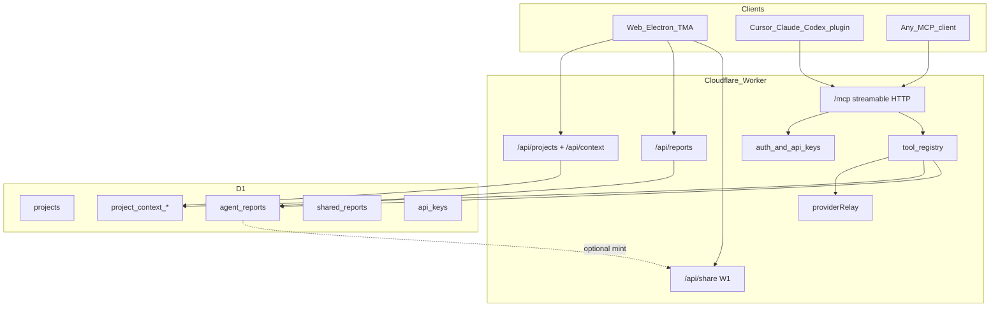

# Agent MCP Product Surface (APS)

**Goal:** Add OpenSEO-class agent productivity as an **additive** layer on Luminara (Workers + D1 + React). Agents and the app share the same projects, memory, tools, and durable reports. Methodology skills stay; a thin product skill + MCP layer binds them to real data.

**Date:** 2026-09-18  
**Status:** In progress (A0-A8 implemented in tree; paid DFS live calls still `not_measured` stubs)  
**Companion plan:** [`e2e-visibility-agent-platform.md`](./e2e-visibility-agent-platform.md) (W0-W1 done; W2-W8 continue in parallel where noted)  
**Pattern library:** `C:\Users\lumin\Desktop\open-seo-ref` (do not fork into product)

---

## Locked product decisions

1. **MCP is a first-class product surface**, not Agency-only theater. Chat (Oracle / Instant Audit) remains; every durable SEO action must also be reachable via MCP tools that call the same services as the app.
2. **Project is the MCP unit of work.** One project = one primary domain under one account, with optional `client_id` for Agency workspaces. Do not invent a second SEO product graph that ignores Business DNA / agency clients.
3. **Shared project memory is free** (no DataForSEO / hosted credit spend). Typed sections + competitors + key pages + research log. Agents and UI read/write the same store.
4. **Reports are artifacts; chat is a pointer.** Agent workflows save HTML (or structured report JSON + rendered HTML) via `save_report`. Chat returns verdict + one action + link. Existing W1 share links remain for human distribution.
5. **Methodology stays; product skills are thin.** Keep `.claude/skills/seo*` as references compiled into playbooks. Add ~8-10 product skills under `plugins/luminara/skills/` that always: load context → check research log → call MCP → save report.
6. **Tiered MCP access (revise W0 blanket).** Free MCP tools for signed-in Growth+ (and Agency). Paid research tools require Agency `apiAccess` **or** BYOK DataForSEO via relay. Free plan: web app only (no MCP).
7. **Paywall on execution, not first insight.** Onboarding / Instant Audit strategy write to project context is free (bounded cost). Rank tracking, briefs, coach loops that spend credits are gated.
8. **No TanStack / dual-DB / OpenSEO fork.** Implement Luminara-shaped equivalents. Pattern library only.
9. **Deploy** only after explicit operator approval (same rule as Level 4 / e2e plan).

### Entitlement matrix (APS)

| Capability | free | starter | growth | agency |
|------------|------|---------|--------|--------|
| Web Instant Audit / Oracle (existing) | yes | yes | yes | yes |
| Project context UI (read/write) | local only | sync | sync | sync + clients |
| MCP free tools (`whoami`, projects, context, list/get/save_report) | no | no | yes | yes |
| MCP paid research (keywords, SERP, backlinks, DFS visibility) | no | BYOK via app only | BYOK via MCP | BYOK + hosted metered |
| `/api/oracle`, `/api/audit/run` (e2e W6-W7) | no | no | no | yes (`apiAccess`) |
| Share links (W1) | no | no | yes | yes |
| Plugin install | public package | public | public | public |

Exact credit numbers stay aligned with existing Sentinel / provider quota middleware; APS only adds **tool annotations** and **research-log gates**.

---

## Relationship to existing e2e waves

| e2e wave | APS interaction |
|----------|-----------------|
| W0-W1 | Done. Reuse `api_keys`, `shared_reports`, `requireApiAccess` (will be **split** into free-MCP vs paid-API). |
| W2 Findings | APS reports can deep-link finding ids later; do not block APS A1-A3. |
| W3-W5 | Feed MCP tools once services exist (visibility, PSI, GSC). Stub tool with `not_measured` until then. |
| W6 Oracle DO | Consumes same tool registry as MCP after A1. |
| W7 MCP stub | **Superseded by APS A1-A4.** Replace 501 placeholder with real MCP; keep `/api/audit/run` in W7. |
| W8 Vectorize | Project context prose can later embed; research log stays relational. |

**Recommended coding order:** A0 → A1 → A2 → A3 → A4 → A5 → A6 → A7 → A8, with W2+ continuing on a separate PR track when staffed.



---

## Architecture decisions (ADR-style)

### ADR-1: Project model

**Decision:** New D1 table `projects` (not only localStorage agency clients).

```
projects
  id TEXT PK                    -- proj_...
  account_id TEXT NOT NULL
  client_id TEXT NULL           -- Agency client when set
  domain TEXT NOT NULL           -- normalized host
  name TEXT NOT NULL
  default_location_code TEXT NULL
  default_language_code TEXT NULL
  created_at, updated_at INTEGER
  UNIQUE (account_id, domain, client_id)
```

**Why:** MCP needs a stable `projectId`. Agency `AgencyClient` stays the org UX; sync creates/links a project per client domain. Personal Growth users get projects from DNA domains / Instant Audit target.

**Not chosen:** Reusing only `agency_workspaces` localStorage (invisible to Worker MCP). Pure domain string as id (collides across clients).

### ADR-2: Project context shape

**Decision:** Hybrid typed sections + normalized lists + research log (OpenSEO 0010 pattern, Luminara tables).

```
project_context_sections
  project_id, key, title?, content, updated_at, updated_by  -- user|oracle|mcp|onboarding
  PK (project_id, key)

project_competitors
  id, project_id, domain, name?, notes?, updated_at, updated_by
  UNIQUE (project_id, domain)

project_key_pages
  id, project_id, url, role, topic?, notes?, updated_at, updated_by
  UNIQUE (project_id, url)

project_research_log
  id, project_id, entry_date, summary, created_by, created_at
```

Typed keys: `business_overview`, `current_goal`, `positioning`, `writing_preferences`.  
Caps: ~4k chars/section; ≤20 custom sections; ≤100 competitors/key pages; research log prune 90 days.

**Bridge from BusinessDNA:** On first `get_project_context`, if sections empty and DNA exists for account/client, seed:
- `business_overview` ← name, mission, audience, industry
- `positioning` ← usp + perceivedGaps
- competitors ← `dna.competitors[]`
Mark `updated_by: 'onboarding'` / `'oracle'`. DNA remains source for chat prompts until UI migrates; context becomes MCP source of truth.

### ADR-3: Agent reports vs shared reports

**Decision:** New `agent_reports` for MCP/app artifacts; keep `shared_reports` for public tokens.

```
agent_reports
  id, project_id, account_id
  title, summary            -- summary ≤2500 chars markdown
  html                      -- self-contained; hard cap 500 KB
  skill                     -- product skill slug
  created_by_label          -- "cursor" | "claude" | "web" | ...
  created_by_user_id
  size_bytes
  share_id NULL             -- FK soft-link to shared_reports.id when minted
  created_at, updated_at
  UNIQUE (project_id, title)
```

Viewer: sandboxed iframe (`sandbox` without `allow-same-origin`), CSP `default-src 'none'; style-src 'unsafe-inline'; img-src data:;`. Reuse W1 public share by minting from report HTML/markdown when user clicks Share.

**Not chosen:** Stuffing HTML into `shared_reports.report_json` (wrong auth model). R2 for v1 (D1 is enough for tens of KB).

### ADR-4: MCP transport and auth

**Decision:** Streamable HTTP MCP at `POST/GET https://luminarasuite.com/mcp` (Cloudflare Agents MCP or `@modelcontextprotocol/sdk` server adapter already used in ecosystem).

Auth v1:
- `Authorization: Bearer <api_key>` (hash lookup in `api_keys`)
- Session cookie for browser-based MCP clients / Settings “connect”

Auth v2 (plugin polish, A5):
- OAuth 2.1 + PKCE resource server (pattern: OpenSEO `oauth-provider.ts`), scopes `mcp:free` / `mcp:research`

**Tool registry:** Single `services/tools/registry.ts` used by MCP and later Oracle (W6). Each tool declares: `creditClass: 'free' | 'paid'`, Zod input/output, `readOnlyHint`, handler → service → D1.

### ADR-5: Free vs paid tool split (replace blanket `/mcp` Agency gate)

**Decision:** Split path guards:

- `/mcp` authenticated + plan ≥ growth for **connection**
- Per-tool: free tools always; paid tools need `apiAccess` **or** valid BYOK DataForSEO headers / stored encrypted key bag relay

Update `worker/apiAccess.ts`:
- Keep Agency-only for `/api/oracle`, `/api/audit`, `/api/tools` admin
- Add `guardMcpRoute` + `assertToolEntitlement(toolName)`

### ADR-6: Product skills vs methodology skills

**Decision:**

| Layer | Path | Role |
|-------|------|------|
| Methodology | `.claude/skills/seo*` | Deep references; playbook compile source |
| Product skills | `plugins/luminara/skills/*` | Thin MCP workflows |
| In-app | `services/skills/playbooks.generated.json` | Unchanged compile path |
| Coach | `plugins/luminara/skills/luminara-coach` | Orientation; hands off to product skills |

Product skill invariant (every workflow skill):
1. `get_project_context` (resolve via `list_projects`)
2. If research log has same job within 30 days, reuse and say so
3. Call MCP tools (never invent metrics)
4. Deliver via `luminara-report` → `save_report`
5. Chat: ≤3 bullets + link; no novel

### ADR-7: Credits / research log

**Decision:** Paid tool handlers append research log on success:

`"{tool}: {inputs}. Verdict: {one-line}. Credits: {n|byok}"`

Skills instruct agents to call `get_project_context` and skip paid calls when a matching log exists. Tool descriptions start with `Uses no credits.` or `Uses paid DataForSEO credits unless BYOK.`

Hosted metering: reuse `quotaMiddleware` / provider relay cost fields; do not invent a second ledger in v1.

### ADR-8: Onboarding strategy (free aha)

**Decision:** Extend Instant Audit completion path (not a separate SAM clone):

1. User enters domain (existing)
2. Bounded scrape (existing crawler / enrichment SSRF guards)
3. Cheap signal: domain overview + keyword ideas **only if** DFS available; else strategy from scrape + playbooks only, labeled `not_measured` where needed
4. Stream / show strategy (positioning, themes, do-this-next)
5. Persist to project context (create project if needed)
6. CTA: Track / Brief / Coach → plan gate

Cost guardrails: one free strategy run per project per 24h on hosted keys; BYOK uncapped; email/Firebase identity required for hosted spend.

---

## Wave map (APS)

| Wave | Theme | User / AI value | Depends on |
|------|-------|-----------------|------------|
| **A0** | Control plane | Faster coding agents; public specs | none |
| **A1** | MCP skeleton + free tools | Agents can auth and list projects | A0, W0 |
| **A2** | Project memory | AI remembers business across sessions | A1 |
| **A3** | Agent reports + viewer | Chat-as-pointer; durable HTML | A2, W1 |
| **A4** | Paid research tool pack (MVP) | Real keywords/SERP/backlinks/audit status | A2, providerRelay |
| **A5** | Plugin package + OAuth | Install once in Cursor/Claude/Codex | A3, A4 |
| **A6** | Thin product skills | Repeatable workflows | A5 |
| **A7** | Credit discipline + UI meters | Trust + less waste | A4 |
| **A8** | Free strategy onboarding | Activation before paywall | A2, Instant Audit |

Each wave: schema/API as needed, services, UI or plugin, tests, exit criteria. Pause for operator review before production deploy.

---

## A0: Agent-engineering control plane

### Work

1. Root [`AGENTS.md`](../../AGENTS.md) + short [`CLAUDE.md`](../../CLAUDE.md) pointing at it: stack (Workers/D1/React), APS invariants, no em dashes, prefer edit over create, papercuts rule, link to this plan and e2e plan.
2. Create [`specs/`](../../specs/) public design records (what/why/alternatives; no line numbers, no secrets):
   - `0001-mcp-product-surface.md`
   - `0002-project-memory.md`
   - `0003-agent-reports.md`
   - `0004-mcp-entitlements-and-credits.md`
   - `0005-product-skills-and-plugin.md`
3. [`.agents/PAPERCUTS.md`](../../.agents/PAPERCUTS.md) + optional `papercuts` skill stub.
4. Vendor or adapt OpenSEO `deslop` under `.agents/skills/deslop/` (license check; MIT) for report prose; wire product report skill to invoke it.
5. Cross-link from e2e plan: W7 MCP superseded by APS A1+.

### Exit

- [ ] Specs exist and match ADRs above
- [ ] New agent session reading `AGENTS.md` knows MCP + context + report rules
- [ ] No product code required

### Files

- `AGENTS.md`, `CLAUDE.md`, `specs/0001`-`0005`, `.agents/PAPERCUTS.md`, `.agents/skills/deslop/**`, edit `docs/plans/e2e-visibility-agent-platform.md` (W7 note)

---

## A1: MCP skeleton + free project tools

### Work

1. Migration `0006_agent_mcp_product_surface.sql`: `projects` (+ indexes).
2. `worker/mcp/` (or `worker/mcpServer.ts` + `worker/mcp/tools/`):
   - Transport + CORS (`mcp-session-id`, protocol version headers)
   - `whoami`, `list_projects`, `create_project`
3. `services/projects/projectService.ts` + Worker routes `GET/POST /api/projects` for the app.
4. Auth: API key create/list/revoke UI in Settings (Growth+); hash at rest (table exists).
5. Replace 501 stub in `worker/index.ts` for `/mcp` with real handler; **do not** require Agency for free tools.
6. Tool catalogue component or Settings panel listing available MCP tools (hand-maintained like OpenSEO `AvailableTools.tsx`).
7. Tests: vitest MCP list/call with mock env; unauthorized 401; free plan 403; growth key succeeds `whoami`.

### Exit

- [ ] MCP Inspector or vitest client: `tools/list` includes free tools
- [ ] `create_project` + `list_projects` round-trip in D1
- [ ] Agency-only routes still 403 without `apiAccess`

### Files

- `migrations/0006_*.sql`, `worker/mcp/**`, `worker/index.ts`, `worker/apiAccess.ts`, `services/projects/**`, `services/apiClient.ts`, Settings API key UI, `tests/mcp*.test.ts`

---

## A2: Shared project memory

### Work

1. Same migration or `0007_project_context.sql`: sections, competitors, key pages, research log.
2. `ProjectContextService` + Zod schemas shared by Worker and (isomorphic) client types in `services/agentCore/types.ts` / `types.ts`.
3. MCP: `get_project_context`, `update_project_context` (patch op union; free).
4. REST: `GET/PATCH /api/projects/:id/context` for app Settings → “Project context” page (sidebar under AI or Client settings).
5. Seed from BusinessDNA when empty; show `missingSections` in tool text output.
6. App: after Instant Audit / DNA save, offer “Save to project context”.
7. Tests: patch ops, caps, missingSections, DNA seed, RBAC (other account 404).

### Exit

- [ ] Two MCP sessions see same context after `update_project_context`
- [ ] UI edit visible to MCP `get_project_context`
- [ ] Caps enforced with agent-readable errors

### Files

- migration, `worker/mcp/tools/project-context.ts`, `services/projects/projectContextService.ts`, context settings UI, tests

---

## A3: Report-as-artifact

### Work

1. Table `agent_reports`; MCP `save_report`, `list_reports`, `get_report` (`includeHtml` default false).
2. Validation: title uniqueness, summary length, HTML ends with `</html>`, size ≤ 500 KB, reject backticks / `${` guidance in skill (Codex template literal hazard).
3. App: Reports list + sandboxed viewer; “Copy chat blurb” (verdict from summary).
4. Optional: mint W1 share from report (Growth+).
5. Product skill `luminara-report` (starter HTML template adapted to Luminara tokens; light print-safe CSS; no scripts).
6. Oracle / Instant Audit UI: when server save available, prefer link over pasting full markdown into chat transcript.

### Exit

- [ ] `save_report` → open in app viewer → print CSS works
- [ ] `list_reports` returns summaries only (no HTML)
- [ ] Malformed HTML rejected with instructive error
- [ ] Share mint optional path tested

### Files

- migration, `worker/mcp/tools/report-tools.ts`, `services/reports/agentReportService.ts`, `components/reports/**`, `plugins/luminara/skills/luminara-report/SKILL.md`, tests

---

## A4: Paid research tool pack (MVP)

Ship a **minimum** tool set that unblocks product skills (not all ~40 OpenSEO tools on day one).

### MVP tools (paid or BYOK)

| Tool | Backing | Notes |
|------|---------|-------|
| `research_keywords` | DataForSEO Labs | Via `providerRelay` |
| `get_keyword_metrics` | DataForSEO | Bulk hydrate |
| `get_serp_results` | DataForSEO / Tavily fallback labeled | |
| `get_domain_overview` | DataForSEO | |
| `get_backlinks_overview` | DataForSEO | |
| `run_site_audit` / `get_audit_status` | Existing crew or queued W7 | Status-first if queue not ready |
| `get_visibility_snapshot` | W4 router when ready | Else `not_measured` |

### Also free (if data connected)

- `get_search_console_performance` when GSC OAuth (W5) exists; until then omit or CSV-backed stub documented as unavailable.

### Work

1. Implement tools with Zod I/O, `mcpResponse({ text, structuredContent, meta: { creditsCharged } })`.
2. Auto `appendResearchLog` on paid success.
3. Entitlement checks per tool.
4. Fixture tests with mocked DFS; never invent volumes.

### Exit

- [ ] Keyword research skill path works end-to-end against mocks
- [ ] Without key: clear `not_configured` / `not_measured`, no fake numbers
- [ ] Research log entry written

---

## A5: Cursor / Claude / Codex plugin

### Work

1. `plugins/luminara/` package:
   - `mcp.json` → `https://luminarasuite.com/mcp` (and docs for self-host URL)
   - `.cursor-plugin` / `.claude-plugin` / `.codex-plugin` manifests
   - README: install, OAuth/API key, example prompts
2. OAuth 2.1 for hosted MCP (Growth+), API key fallback.
3. Public docs page: `/docs/mcp` and `/docs/skills/setup` (static HTML under `public/` or existing docs path).
4. Marketplace submission artifacts as needed (chatgpt-app style optional later).

### Exit

- [ ] Fresh Cursor install: plugin → auth → `whoami` + `list_projects` succeeds
- [ ] Self-host doc shows Worker URL override

### Files

- `plugins/luminara/**`, OAuth modules under `worker/mcp/oauth*`, `public/docs/**`

---

## A6: Thin product skills

### Ship set (v1)

1. `luminara-coach` - orientation; no credits unless asked
2. `luminara-project-setup` - interview → `update_project_context`
3. `luminara-report` - HTML save rules (used by others)
4. `luminara-audit` - context → audit tools → report (wraps methodology references)
5. `luminara-keyword-research`
6. `luminara-competitor-analysis`
7. `luminara-visibility` - honest engine badges
8. `luminara-local` - when local signals matter

Each skill: MCP tool list, research-log check, deliver via `luminara-report`, point at methodology skill for depth (“for schema details see seo-schema reference”).

Update `luminara-seo` wrapper to prefer product skills when MCP connected.

### Exit

- [ ] Coach → setup → audit → report path documented and manually smoke-tested
- [ ] Skills never instruct `claude-seo run *.py` when MCP available

---

## A7: Credit / spend discipline

### Work

1. Every tool description includes credit class sentence.
2. Settings: “MCP usage” strip - credits remaining / BYOK active; last research log entries.
3. Soft warn in MCP meta when research log shows duplicate job within 30 days (tool still runs if agent forces).
4. Hosted daily caps wired through existing quota; tests for 429 body text that agents can follow.

### Exit

- [ ] Duplicate research within 30 days surfaces in `get_project_context` research log and coach skill copy
- [ ] Paid call without entitlement returns instructive 403 JSON/MCP error

---

## A8: Free strategy onboarding

### Work

1. Instant Audit post-run: “Save strategy to project” creates/updates project + context sections + starter key pages.
2. Bounded hosted DFS (if any): overview + keyword ideas only; hard cost ceiling; identity required.
3. UI: strategy panel with missingSections prompts; CTAs for paid execution (track / brief) respect plan.
4. MCP: same persistence so plugin users who run `luminara-project-setup` after web onboarding see continuity.
5. Analytics events: `strategy_saved`, `strategy_cta_clicked` (no PII).

### Exit

- [ ] New Growth user: domain → strategy in context without payment
- [ ] Paid CTA blocked on free plan with upgrade path
- [ ] Abuse: second hosted strategy run inside 24h refused with clear message

---

## File touch map (primary)

| Area | Create / modify |
|------|-----------------|
| Plans / specs | this doc; `specs/0001`-`0005`; `AGENTS.md`; e2e W7 note |
| D1 | `migrations/0006_*.sql`, optional `0007_*.sql` |
| Worker MCP | `worker/mcp/**`, `worker/index.ts`, `worker/apiAccess.ts`, `worker/env.ts` |
| Projects / context / reports | `services/projects/**`, `services/reports/**` |
| Tools | `services/tools/registry.ts`, providerRelay already has dataforseo |
| UI | Project context settings, Reports viewer, API keys, Instant Audit strategy CTA |
| Plugin / skills | `plugins/luminara/**` |
| Tests | `tests/mcp*`, `projectContext*`, `agentReports*`, `mcpEntitlements*` |
| Playbooks | only if product skill copy must inject; prefer not to bloat JSON |

---

## Security and ops

- API keys hashed; show secret once on create.
- OAuth tokens encrypted at rest (same pattern as planned GSC tokens).
- Report HTML sandboxed; no scripts; sanitize on save.
- SSRF: paid scrape/audit targets use existing enrichment allowlists.
- Rate limit `/mcp` per account and per IP.
- Logging: never log raw keys, report HTML bodies, or full scrape markdown.
- Privacy policy + README: document MCP, project memory, agent reports, credit classes before deploy.
- Grep touched files for em dash (U+2014); count must be zero.

---

## Verification gate (every APS wave)

1. `npm run typecheck`
2. Targeted `npx vitest run` for wave suites
3. `npm run build`
4. Manual smoke: `npm run cf:dev` + MCP Inspector for `/mcp`
5. Em dash grep on touched files
6. Update this doc: mark wave Done with date
7. Operator approval before `npm run deploy`

## Program done when

- [ ] Growth+ user connects Cursor plugin, completes project setup, runs audit skill, opens report link in app
- [ ] Project context edits in UI appear in MCP `get_project_context`
- [ ] Chat/agent replies with verdict + link, not full HTML
- [ ] Paid tools refuse cleanly without keys; with BYOK return real metrics
- [ ] Research log prevents silent re-spend in coach guidance
- [ ] Free strategy onboarding persists context; execution CTAs gated
- [ ] `AGENTS.md` + specs describe the system; e2e W7 points here
- [ ] Methodology skills remain available as references; no OpenSEO fork in tree as product code

---

## Implementation order for the coding agent

Start at **A0**, then **A1 → A2 → A3 → A4 → A5 → A6 → A7 → A8**. Prefer one PR per wave. Do not skip A0 (specs prevent drift). Do not implement OpenSEO UI stack. When a wave needs a W4/W5/W7 service that is not ready, ship the MCP tool returning structured `not_measured` / `not_implemented` with a stable error code rather than blocking the whole APS track.

**Parallelism:** W2 Findings and A2 Context can proceed in parallel (different tables). W6 Oracle should wait until A1 registry exists so chat and MCP share tools.

---

## Task index (session-sized)

See [`../../tasks/todo.md`](../../tasks/todo.md) for the checklist used by coding sessions. Each checkbox maps to one S/M task under the wave above.
