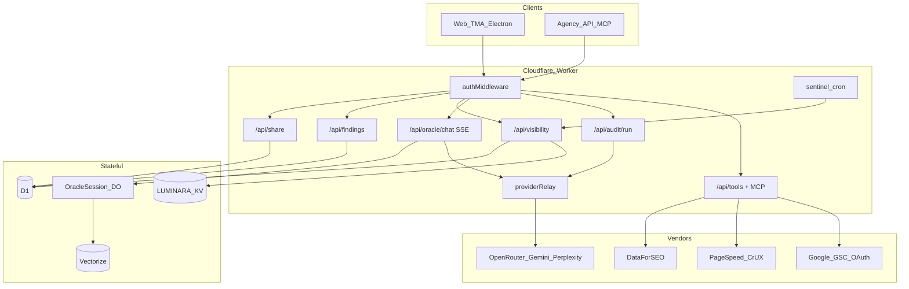
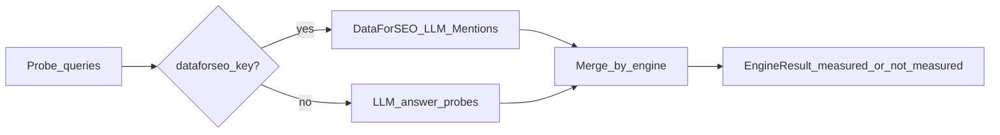

# End-to-End Visibility + Agent Platform Plan

**Goal:** Close every listed user-flow and AI-agent-flow gap end to end: shareable reports, finding work items, true AI-visibility measurement, hosted weekly tracking, PageSpeed/rank/GSC in Instant Audit, then server Oracle/audit APIs, production tool/MCP runtime, real Harness agents, unified tool calling, Durable Object chat sessions, and hosted edge memory.

**Date:** 2026-09-13  
**Status:** W0 + W1 done (2026-09-13). W2 next (findings board).

## Locked product decisions

1. **AI visibility = hybrid stack (all three modes in one router)**
   - **DataForSEO primary** when BYOK or hosted `DATAFORSEO_LOGIN` / `DATAFORSEO_PASSWORD` is present: LLM Mentions for ChatGPT + Google AI Overview.
   - **LLM answer probes** when DataForSEO is absent (or for engines DataForSEO does not cover): OpenRouter / Gemini / Perplexity APIs with structured citation parsing.
   - **Never invent** ChatGPT / AIO / Perplexity citation rows. Missing key or failed probe → `measurementStatus: 'not_measured'` with reason. UI and reports must show that label, not a fake score.
2. **Share links** are signed, revocable, read-only public report pages (optional password). Agency white-label branding applies when the owner has `whiteLabelPdf`.
3. **Findings** are first-class D1 work items derived from crew `AuditFinding[]` plus report enrichment, not markdown-only.
4. **Agency `apiAccess`** gates `/api/oracle/*`, `/api/audit/*`, and MCP HTTP. Flag is enforced in Worker, not marketing-only.
5. **OracleMind / TimesFM** stay Labs (simulated, labeled). **Agent Matrix** non-oracle rows become real OpenRouter (or configured) providers; remove fake “Execution Output” for Claude-class agents.
6. **Deploy** only after explicit operator approval (same rule as Level 4 plan).

## Non-goals (this program)

- Stripe card checkout (separate billing track).
- SOC 2 Type 1 engagement (checklist only).
- Replacing Telegram Stars / TON / license keys.
- Making OracleMind / TimesFM production measurement tools.

---

## Architecture (target)

### AI visibility router (locked)

Per engine:

| Engine | Primary | Fallback | If both fail / no key |
|--------|---------|----------|------------------------|
| ChatGPT | DataForSEO `platform=chat_gpt` | OpenRouter GPT answer probe | `not_measured` |
| Google AIO | DataForSEO `platform=google` | Gemini `googleSearch` / SERP AIO block if present | `not_measured` |
| Perplexity | Perplexity or OpenRouter Sonar probe | (none from DataForSEO today) | `not_measured` |
| Classic SERP SoV | Keep Tavily / local SERP | unchanged | keep current path |

---

## Wave map

| Wave | Theme | Ships user value | Depends on |
|------|--------|------------------|------------|
| W0 | Foundations: D1 schema, shared types, entitlement gates, isomorphic config | none (platform) | - |
| W1 | Shareable report links | Agency share URLs | W0 |
| W2 | Findings as work items + evidence drawer | Trackable cards | W0, shares report id from W1 |
| W3 | Hosted weekly tracking (KV/D1 mirror + alerts) | Cross-device trends | W0 |
| W4 | True AI-visibility hybrid loop | Honest multi-engine cards | W0, feeds W3 |
| W5 | PageSpeed / rank / GSC in Instant Audit UI | Technical signals | W0 |
| W6 | Server Oracle chat + DO session + unified tools | `/api/oracle/chat`, Agency API start | W0 |
| W7 | Server audit run + tool registry + MCP HTTP | `/api/audit/run`, MCP | W4, W5, W6 |
| W8 | Hosted Vectorize memory + real Agent Matrix | Cross-device mem0, real harness LLMs | W6 |

Each wave has: schema/API, services, UI, tests, exit criteria. Do not start Wn+1 until Wn exit criteria pass locally (`typecheck`, targeted vitest, `build`).

---

## W0: Foundations

### Work

1. **D1 migration `0005_visibility_agent_platform.sql`**
   - `shared_reports` (id, token_hash, owner_account_id, client_id nullable, report_json, branding_json, password_hash nullable, expires_at, revoked_at, created_at)
   - `audit_runs` (id, account_id, client_id, domain, focus, status, created_at, completed_at, report_ref)
   - `audit_findings` (id, audit_run_id, account_id, stable_key, category, severity, title, description, evidence_json, status, owner, due_at, updated_at)
   - `visibility_snapshots` (id, account_id, domain, focus, measured_at, metrics_json, engine_breakdown_json)
   - `gsc_oauth_tokens` (account_id, refresh_token_enc, scopes, updated_at)
   - `api_keys` (id, account_id, key_hash, name, last_used_at) for Agency API
2. **Shared types** in `services/agentCore/types.ts` + `types.ts`:
   - Extend `AuditFinding` with `status: 'open' | 'in_progress' | 'done' | 'wont_fix'`, `owner?: string`, `auditRunId`, `stableKey`.
   - `EngineVisibilityResult { engine, measurementStatus, method, cited, evidence[], errorReason? }`.
3. **Isomorphic config seam:** extract `services/config/runtimeKeys.ts` so Worker can inject hosted/BYOK keys without `window`/`localStorage`. `configService.ts` remains browser adapter.
4. **Enforce `apiAccess`:** `worker/authMiddleware.ts` + new `requireApiAccess(env, identity)` for future `/api/oracle`, `/api/audit`, `/api/tools`, `/mcp`. Mirror caps already in [`services/plans/planEntitlements.ts`](../../services/plans/planEntitlements.ts) and [`worker/telegramBot.ts`](../../worker/telegramBot.ts).
5. **Provider allowlist:** add `dataforseo` to [`worker/providerRelay.ts`](../../worker/providerRelay.ts) (Basic auth header from `x-provider-key` or hosted secrets). Add Settings tab fields for DataForSEO login/password (store only in browser key bag / relay header; never commit).

### Exit

- [x] Migration applies locally (sqlite test helper loads 0005).
- [x] Unit tests for `runtimeKeys`, `requireApiAccess`, extended `AuditFinding` types.
- [x] `npm run typecheck` green.

---

## W1: Shareable report links

### Work

1. **Worker** [`worker/shareService.ts`](../../worker/shareService.ts) (new):
   - `POST /api/share/reports` (auth): body = audit markdown + enrichments + optional finding ids; returns `{ url, token, expiresAt }`.
   - `GET /api/share/reports/:token` (public): returns sanitized report JSON; rate-limit; honor revoke/expiry/password.
   - `DELETE /api/share/reports/:id` (auth): revoke.
2. **Public SPA route:** path `/share/:token` → `SharedReportView`; `/verify/:digest` → `VerifyAttestationView`.
3. **Fix PoA gap:** `/verify/:digest` SPA wired to GET `/api/agent/attest`.
4. **UI:** “Copy share link” on ReportDisplay; Growth+/Agency via `shareLinks`.
5. **Security:** token = 256-bit random; store only SHA-256 hash in D1; strip secret keys from payload.

### Exit

- [x] Create → open anonymous GET → revoke → 404 (`tests/shareReports.test.ts`).
- [x] Password gate + free-plan 403.
- [x] No secrets in shared JSON (sanitize fixture).

---

## W2: Findings as work items

### Work

1. **Pipeline:** After `crewOrchestrator.runAuditCrew()` and `generateAuditReport()`, map crew `AuditFinding[]` + Trust Pack / empirical gaps into `audit_findings` via:
   - Client: `services/audit/findingBoardService.ts` (optimistic local + sync).
   - Worker: `POST /api/findings/bulk`, `PATCH /api/findings/:id`, `GET /api/findings?domain=`.
2. **Stable keys:** `stableKey = hash(domain|category|titleNormalized)` so weekly re-runs upsert status instead of duplicating open cards.
3. **UI:**
   - `FindingBoard` (kanban or filterable list: Open / In progress / Done).
   - `FindingEvidenceDrawer` (reuse patterns from [`EmpiricalEvidenceDrawer.tsx`](../../components/audit/EmpiricalEvidenceDrawer.tsx)): evidenceSource, howWeKnowItFailed, leadingIndicator, critic fields, deep link to share report section.
4. **Wire** [`InstantAuditView.tsx`](../../components/audit/InstantAuditView.tsx): pass structured findings into `ReportDisplay` instead of markdown-only Fix list as the sole source of truth; keep markdown for narrative.
5. **Agency:** findings scoped by `agencyWorkspaceService` active `client_id`.

### Exit

- Audit produces N cards; change status; reload / other device (via D1) keeps status.
- Diff against prior run marks resolved vs new vs still-open.
- Tests for stableKey upsert and RBAC (owner only).

---

## W3: Hosted weekly tracking

### Work

1. **Mirror:** Extend [`visibilityHistoryService.ts`](../../services/visibility/visibilityHistoryService.ts):
   - On `record()`, also `POST /api/visibility/snapshots` when signed in.
   - `GET /api/visibility/trends?domain=` merges D1 + local (D1 wins for remote points).
2. **Sentinel** [`worker/sentinel.ts`](../../worker/sentinel.ts):
   - On cron, after security probe, call visibility probe job (W4 router) for registered domains; write `visibility_snapshots`; compare to previous; Telegram alert on citation-rate drop beyond threshold (reuse `sendTelegramAlert`).
   - Persist last engine breakdown on `SentinelTarget` or D1 only (prefer D1).
3. **UI:** [`VisibilityTrendsCard.tsx`](../../components/audit/VisibilityTrendsCard.tsx) loads remote trends when authed; show “Hosted” vs “This device only”.
4. **Workspace sync:** keep `luminara_visibility_history_v1` as offline cache; D1 is source of truth for paid Sentinel users.

### Exit

- Two browsers, same account, same trend points after audit.
- Sentinel cron test (unit with mocked fetch) writes snapshot + alert path.

---

## W4: True AI-visibility hybrid loop

### Work

1. **`services/visibility/engineVisibilityRouter.ts`** (new):
   - Input: domain, brand, queries[], available keys.
   - Output: `EngineVisibilityResult[]` per engine + aggregate citation rate **only over measured engines**.
2. **`services/visibility/dataForSeoMentionsService.ts`**: Live LLM Mentions Search Mentions via provider relay; map to evidence rows (question, answer snippet, sources, platform).
3. **`services/visibility/llmAnswerProbeService.ts`**: For each query, call configured providers; parse brand/domain citation; store raw answer hash for auditability.
4. **Replace/extend** [`empiricalCitationService.ts`](../../services/audit/empiricalCitationService.ts):
   - Keep Tavily SERP path as `engine: 'web_serp'`.
   - Compose with router for chatgpt / google_aio / perplexity.
5. **Report UI:** Update Empirical / SoV cards to show per-engine badges: Measured (DataForSEO) | Measured (LLM probe) | Not measured.
6. **Copy honesty:** Landing / audit claims must match measurementStatus (no “ChatGPT cited you” without measured chatgpt).
7. **Quota:** DataForSEO and probe calls count toward hosted daily limit when using hosted keys; BYOK unlimited for that vendor.

### Exit

- With DataForSEO key: ChatGPT + AIO rows measured.
- Without: LLM probes run if OpenRouter/Gemini/Perplexity present; else not_measured.
- Fixture tests never assert invented citations.
- Integration test with mocked DFS + mocked OpenRouter.

---

## W5: PageSpeed / rank / GSC in Instant Audit

### Work

1. **PageSpeed + CrUX:** `services/technical/pageSpeedService.ts` → Google PSI v5 (BYOK `PAGESPEED_API_KEY` or hosted). Return LCP/INP/CLS field+lab; never mention FID.
2. **Rank:** Prefer DataForSEO SERP when keyed; else Tavily position heuristic already in empirical path; label method.
3. **GSC:**
   - Keep CSV upload path in [`gscAnalyticsService.ts`](../../services/mcp/gscAnalyticsService.ts); **remove silent simulate-on-parse-failure for production UI** (simulate only behind Labs flag).
   - Add Google OAuth connect: Worker routes `GET /api/gsc/oauth/start`, `GET /api/gsc/oauth/callback`, `POST /api/gsc/sync`; store refresh token encrypted in `gsc_oauth_tokens`.
4. **UI:** Mount `GscPanel` + `PageSpeedPanel` inside Instant Audit / ReportDisplay; show Not connected / Not measured when absent.
5. **Playbook injection:** Pass PSI/GSC/rank summaries into `generateAuditReport` prompt as verified evidence blocks.

### Exit

- Audit with PSI key shows CWV card with source URL timestamp.
- GSC CSV + OAuth paths both produce non-simulated summaries in UI.
- Simulated GSC unreachable from default product path.

---

## W6: Server Oracle chat + Durable Objects + unified tools

### Work

1. **Bindings** in [`wrangler.jsonc`](../../wrangler.jsonc): Durable Object `OracleSession`, optional Vectorize index binding (created in W8; declare stub ok).
2. **Package:** add `@cloudflare/agents` (or minimal DO chat class if Agents SDK version conflicts; prefer Agents SDK).
3. **`POST /api/oracle/chat`** (SSE):
   - Auth + `apiAccess` for API keys; session cookie for web optional feature-flag `VITE_SERVER_ORACLE=1` then default on.
   - Load DNA/workspace from D1; run ported `gatherSearchEvidence` + `streamWithFailover` on Worker using `proxyProvider` internally.
   - Persist turns on DO; emit tool stage events compatible with existing UI `toolExecutions`.
4. **Unified tool calling** in [`services/llm/providers/GroqProvider.ts`](../../services/llm/providers/GroqProvider.ts) (and NIM, OpenRouter, Ollama):
   - Wire `GenerateOptions.tools` → OpenAI `tools` / `tool_choice`.
   - Parse `tool_calls`; Worker tool loop executes registry tools (search, scrape, psi, visibility_probe) then continues.
   - Gemini keeps googleSearch/codeExecution; also map app tools where possible.
5. **Client:** `apiClient.streamOracleChat()`; App can use server path when entitled, else existing browser `streamQuery` (BYOK self-host remains browser-first).

### Exit

- curl SSE chat with Agency API key returns tokens + sources.
- Groq tool call invokes `live_search` in test with mock.
- Browser BYOK path still works without server Oracle.

---

## W7: Server audit + tool registry + MCP

> **APS override (2026-09-18):** Production MCP, project memory, agent reports, plugin, and product skills are specified in [`agent-mcp-product-surface.md`](./agent-mcp-product-surface.md) (waves A1-A6). That plan pulls MCP earlier than Oracle DO and tiers Growth+ free MCP tools vs Agency paid API. W7 below keeps **queued `/api/audit/run`** and registry convergence; do not re-implement a second MCP server here.

### Work

1. **`POST /api/audit/run`** (Agency `apiAccess`):
   - Enqueue long work: Cloudflare Queue or DO alarm / Workflow; do not block HTTP 30s+.
   - Reuse `CrewOrchestrator` + audit services with Worker-safe fetch (SSRF guards from [`worker/enrichmentService.ts`](../../worker/enrichmentService.ts)).
   - On complete: write `audit_runs`, findings bulk, visibility snapshot, optional auto-share.
   - `GET /api/audit/runs/:id` status + result.
2. **Tool registry** `services/tools/registry.ts`: single list of tools used by Oracle, audit crew, and APS MCP (extend APS A1 registry; do not fork a parallel list).
3. **MCP HTTP:** implemented under APS A1+ (`/mcp`). W7 only verifies audit tools are registered and callable from that server.
4. **Playbooks stay JSON**; MCP does not re-parse `.claude/skills` at runtime. Skills remain compile → `playbooks.generated.json`. Product skills live under `plugins/luminara/` (APS A6).

### Exit

- Agency API starts audit, polls to completed findings.
- MCP inspector / vitest client lists tools and calls `pagespeed` mock (via APS MCP).
- `apiAccess: false` → 403 on `/api/audit/*`; Growth+ may still use free MCP tools per APS entitlements.

---

## W8: Hosted memory + real Agent Matrix

### Work

1. **Vectorize:** index `luminara-memory`; embed via Workers AI or OpenRouter embeddings; store fact ids in D1.
2. **Port** [`mem0MemoryEngine.ts`](../../services/agentCore/mem0MemoryEngine.ts): dual-write localStorage + `POST /api/memory/facts`; include mem0 keys in workspace sync as backup blob until Vectorize warm.
3. **Oracle DO** retrieves top-k facts per turn (server) / browser retrieves via API when signed in.
4. **Agent Matrix** [`agentMatrixService.ts`](../../services/harness/agentMatrixService.ts): map `claude` → OpenRouter Anthropic model; remove simulated template branch for any agent with a configured provider; keep simulate only if user enables “Demo agents” toggle (default off in advanced UI).
5. **Labs:** OracleMind / TimesFM unchanged labels.

### Exit

- Sign-in device B sees memory facts from device A chat.
- Dispatch to “Claude” agent returns real model text when OpenRouter key set; otherwise explicit “provider not configured”, not fake audit prose.

---

## File touch map (primary)

| Area | Create / modify |
|------|-----------------|
| D1 | `migrations/0005_visibility_agent_platform.sql` |
| Worker | `worker/index.ts`, `authMiddleware.ts`, `providerRelay.ts`, `shareService.ts`, `findingsService.ts`, `visibilityStore.ts`, `oracleChat.ts`, `auditRun.ts`, `gscOAuth.ts`, `mcpServer.ts`, `env.ts`, `wrangler.jsonc` |
| Visibility | `engineVisibilityRouter.ts`, `dataForSeoMentionsService.ts`, `llmAnswerProbeService.ts`, `empiricalCitationService.ts`, `visibilityHistoryService.ts` |
| Findings / share | `findingBoardService.ts`, `FindingBoard.tsx`, `FindingEvidenceDrawer.tsx`, `SharedReportView.tsx`, `ReportDisplay.tsx`, `InstantAuditView.tsx` |
| Technical | `pageSpeedService.ts`, `gscAnalyticsService.ts`, GSC/PSI panels |
| Agent | `services/tools/registry.ts`, LLM providers tool wiring, `agentMatrixService.ts`, DO class under `worker/agents/` |
| Config / plans | `planEntitlements.ts`, Settings API key tabs, `runtimeKeys.ts` |
| Tests | `tests/share*`, `findings*`, `engineVisibility*`, `pageSpeed*`, `oracleApi*`, `mcp*`, `visibilityHosted*` |
| Docs | README roadmap checkboxes; this plan status |

---

## Entitlements (updates)

| Capability | free | starter | growth | agency |
|------------|------|---------|--------|--------|
| Share links | no | no | yes | yes |
| Finding board | local only | sync | sync | sync + clients |
| Hosted visibility / Sentinel | 0 | existing caps | existing | existing |
| DataForSEO hosted | no | metered | metered | metered |
| `/api/oracle`, `/api/audit`, MCP | no | no | no | yes (`apiAccess`) |
| Vectorize memory | no | yes signed-in | yes | yes |

Exact numbers can match existing Sentinel/domain caps in moat plan.

---

## Security and ops checklist

- Share tokens hashed at rest; public GET rate-limited.
- OAuth tokens encrypted; secrets only via `wrangler secret put`.
- SSRF allowlist for scrape/PSI target URLs (reuse enrichment guards).
- Audit jobs: timeout, cancel, per-account concurrency limit.
- Logging: no raw provider keys; no shared-report PII beyond user-authored report.
- README + Privacy Policy: document DataForSEO, GSC OAuth, share links, hosted memory before deploy.

---

## Verification gate (every wave)

1. `npm run typecheck`
2. Targeted `npx vitest run` for wave suites
3. `npm run build`
4. Manual smoke on `npm run cf:dev` for Worker routes
5. Grep touched files for Unicode em dash (U+2014); count must be zero
6. Update this doc: mark wave Done with date

## Program done when

- [ ] Anonymous user opens a Growth/Agency share URL and sees white-label report
- [ ] Findings board tracks status across devices; weekly re-audit upserts stable keys
- [ ] AI-visibility card shows per-engine Measured (DFS) / Measured (probe) / Not measured; never fabricates
- [ ] Hosted trends + Sentinel alerts use D1 snapshots
- [ ] Instant Audit shows PSI + GSC (CSV or OAuth) + rank method label
- [ ] Agency API SSE chat + queued audit + MCP tools/list work with `apiAccess`
- [ ] Groq/NIM tool loop executes registry tools
- [ ] DO session + Vectorize memory retrieve on server chat
- [ ] Agent Matrix Claude-class is real or explicitly unconfigured
- [ ] README roadmap items 1-5 updated to reflect shipped state

---

## Implementation order for the coding agent

Start at **W0**, then **W1 → W2 → W3 → W4 → W5 → W6 → W7 → W8**. Do not skip W0. Prefer small PRs per wave. After each wave, pause for operator review before production `npm run deploy`.
