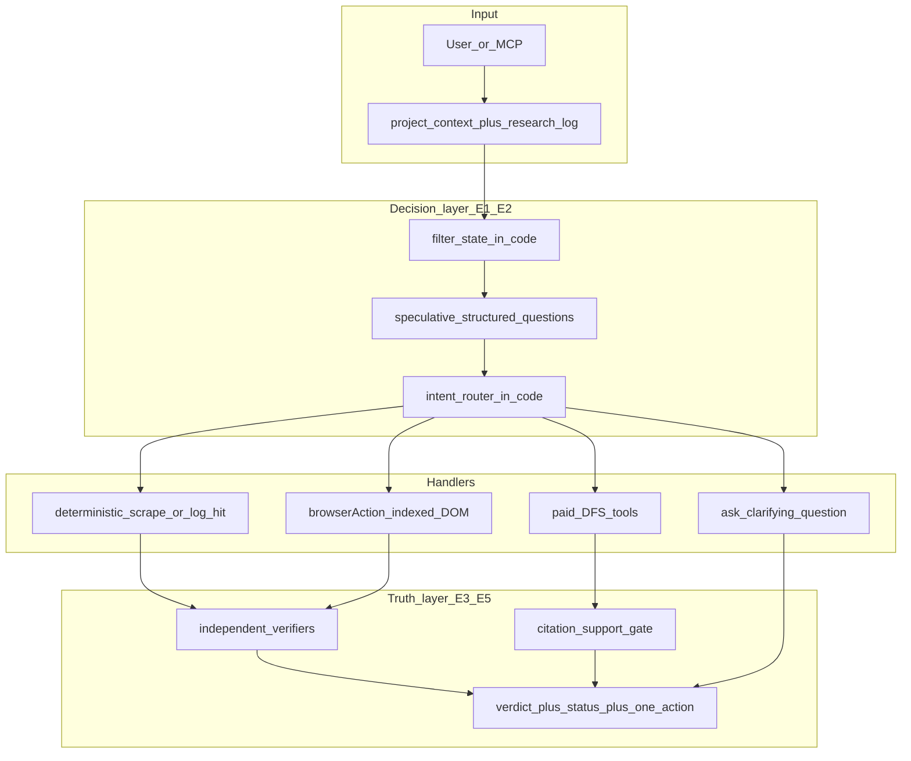

# Evidence-Bound Decision Patterns (100x honesty)

**Date:** 2026-10-10  
**Status:** Library + browse honesty + Oracle tool ledger wired (E0-E6 core); production deploy blocked on operator approval, green gates, and deploy-workflow review  
**Owner:** full-stack + Oracle/MCP + crawler  
**Companions:** [`indexed-dom-action-agent.md`](./indexed-dom-action-agent.md) (B0-B5 browse loop), [`agent-mcp-product-surface.md`](./agent-mcp-product-surface.md) (APS), [`conversion-honesty-ship.md`](./conversion-honesty-ship.md), [`landing-moat-100x.md`](./landing-moat-100x.md)  
**Pattern libraries (external, do not fork):** [browser-use/jev-ultrafast](https://github.com/browser-use/jev-ultrafast) (MIT), [TypeSafe docs](https://docs.typesafe.ai/introduction)  
**Spec target:** `specs/0019-evidence-bound-decisions.md` (accepted)

---

## Premise (locked)

Jev Ultrafast and TypeSafe System One are useful as **architecture references**, not as a truth engine for SEO.

On TypeSafe's own four-workflow benchmark, Jev reports about **67.8% agreement** with reference labels (tied with mid-tier chat models on accuracy, much cheaper and faster). Independent benches vary widely by task. Their "0% hallucination" marketing claim means **schema-valid structured output**, not **correct answers**. A model that is wrong roughly one third of the time on their board, and that can pick the wrong click target on a live page, is a **fail-faster router**, not a product brain.

Luminara's moat is the opposite shape: **fewer invented metrics, fewer wrong answers shipped as fact, more evidence-bound verdicts.** Speed and cost matter only after honesty.

### Agree with the critique

| Critique | Locked response |
|----------|-----------------|
| ~68% accuracy is mid-tier | Do not adopt Jev/TypeSafe as the authority for SEO claims |
| Wrong answers fail faster and cheaper | Reject "fail fast" as the product win. Prefer fail closed |
| Model can pick wrong operation/target | Indexed DOM is allowed only behind independent verifiers |
| Confidence from a generative JSON shape is not calibrated | Do not threshold product truth on model-emitted confidence alone |

### Disagree or constrain

| Temptation | Pushback |
|------------|----------|
| Add TypeSafe SDK / `jev-latest` to Worker | **Forbidden.** No vendor lock for core decisions. Replicate contracts in TypeScript |
| Nest `jev-ultrafast` in the monorepo | **Forbidden.** Pattern library only (same as OpenSEO) |
| Market "10x faster browse" before honesty gates | **Forbidden.** Protocol-call gains stay engineering metrics only |
| Use Score/Choice confidence as Live proof | **Forbidden.** Live = measured tool evidence or `not_measured` |
| One mega-prompt that "reasons" about the whole site | **Forbidden.** Atomic questions + code composition |

---

## What "100x" means here (locked)

Order-of-magnitude lift in **claim integrity**, not latency:

1. **Escape rate:** On a frozen hallucination fixture suite, answers that invent a numeric SEO metric, invent a citation, or treat model `DONE` as proof must drop from today's baseline toward **~0** (gate: zero escapes on the suite before merge to `main`).
2. **Evidence coverage:** For Oracle and MCP paid/research paths, every user-visible claim is one of: `measured` (tool evidence attached), `estimated` (explicitly labeled), or `not_measured` / `unknown`. No bare assertions.
3. **Wrong-act rate:** Interactive browse goals that claim success without an independent verifier pass must be **impossible** in code (already started in `verify.ts`; this plan hardens the rest of the product to the same law).
4. **Routing waste:** Speculative fan-out + intent routing cut unnecessary paid DFS / browse loops when a cheap scrape or research-log hit suffices (cost side-effect, not the headline).

Public marketing must not claim "100x accuracy." Internal north-star only, same discipline as landing-moat.

---

## Pattern intake: take vs leave

### Take (port into Luminara-shaped TypeScript)

| # | Pattern | Source | Why it 100xs honesty |
|---|---------|--------|----------------------|
| P1 | **Closed action / answer space** | jev-ultrafast | Model may only pick from observed ids or enumerated options. No free-form selectors, JS, or invented metric names |
| P2 | **Speculative fan-out + code consume** | TypeSafe fan-out + jev `model.py` | Ask intent, tool, and stale-log checks in one structured call; code drops unused heads. Fewer serial prompt drifts |
| P3 | **Atomic questions, compose in code** | TypeSafe intro | One gut-check per factor. Weights and thresholds live in code, auditable |
| P4 | **Independent DONE / claim verification** | jev README + APS | Model success is never proof. Verifiers own `measured` |
| P5 | **Pre-parse, then choose** | TypeSafe jaggedness + cookbooks | Regex/DOM/DFS return candidates; model only selects an observed span or id |
| P6 | **Filtered state only** | TypeSafe jaggedness | Send the minimum fields the question needs. Less distractor, fewer wrong picks |
| P7 | **Intent routing before expensive handlers** | TypeSafe intent routing | Deterministic scrape / research-log hit / browse / paid DFS / ask-user. Wrong path is a class of hallucination |
| P8 | **Citation support check** | TypeSafe citation cookbook shape | Before prose claims a fact, closed check: does this evidence span support it? Else `unknown` |
| P9 | **Scoped freshness + occlusion reject** | jev browser loop | Wrong click on a covered/stale node is a silent false action. Reject, re-observe |
| P10 | **Self-consistency on high-stakes choices** | TypeSafe cookbooks + order-bias note | For paid or mutating acts: second pass with shuffled options or dual cheap checks; disagreement → fail closed |

### Leave (explicitly)

- TypeSafe API, Jev model, Browser Harness, Chrome profile attach
- Trusting generative `confidence` as calibrated probability
- Site-specific action scripts / prepared field strings in policy
- Replacing Instant Audit scrape, DataForSEO, or PointerBench
- Marketing copy that equates structured JSON with truth

---

## Architecture

### Product law (one sentence)

**Code owns truth status. Models propose among observed options. Verifiers and tools mint `measured`.**



### Placement (studied against this repo)

| Piece | Home | Notes |
|-------|------|-------|
| Decision types + validation | `services/evidenceBound/` (new) | Parallel to `services/browserAction/` and `services/grounding/`. Pure TS, offline-testable |
| Intent router | `services/evidenceBound/intentRoute.ts` | Consumed by Oracle + MCP registry before paid/browse |
| Atomic SEO gut-checks | `services/evidenceBound/atomicChecks.ts` | Closed Choice/Score-shaped JSON over filtered scrape state; **no TypeSafe client** |
| Citation support gate | `services/evidenceBound/citationSupport.ts` | Fail closed to `unknown` |
| Claim assembly | `services/evidenceBound/claimLedger.ts` | Every claim carries status + source refs |
| Browse hardening | extend `crawler/` + `services/browserAction/` | Occlusion, scoped freshness, dual DONE check |
| Oracle / MCP wiring | `worker/oracleChat.ts`, `worker/mcpServer.ts`, `services/tools/registry.ts` | Router + ledger mandatory on research paths |
| Fixtures + gates | `tests/evidenceBound/` | Hallucination suite is a merge gate |

### Explicit non-homes

| Wrong place | Why |
|-------------|-----|
| Inside `services/grounding/` | Pixels, not claim ledger |
| Inside `services/browserAction/` only | Patterns apply to Oracle/MCP/audit, not just clicks |
| New top-level `typesafe/` or `jev/` app | Violates professional-repo-structure |
| Prompt-only system message | Unenforceable; honesty must be typed + tested |

### Dependency direction

```text
Oracle / MCP / Instant Audit
  → evidenceBound (intent, atomic checks, citation, ledger)
  → browserAction | paidResearch | unifiedScraper | research log
  → claimLedger → chat pointer / save_report
```

Workers never drive Chromium. Browse still relays to crawler.

---

## Locked product decisions

1. **No TypeSafe dependency.** Replicate Choice / Score / Noul-shaped **contracts** with the existing LLM stack + strict JSON validation (same spirit as `validateChoice` in `choose.ts`).
2. **Model confidence is advisory only.** Product gates use: offered-set membership, independent verifiers, research-log freshness, entitlements, and (for high stakes) self-consistency. If advisory confidence is present and low, prefer `not_measured` / ask-user; never auto-promote to `measured`.
3. **DONE and "looks good" prose are never `measured`.** Same law as browse `verify.ts`, applied to Oracle claims.
4. **Arithmetic, dates, counts stay in code.** Aligns with TypeSafe jaggedness advice and APS "never invent SEO metrics."
5. **APS still applies:** `get_project_context` before paid; research log within 30 days; chat returns verdict + one action + report link.
6. **Deploy** only after explicit operator approval.

---

## Implementation waves

### Wave E0: Spec + hallucination fixture suite (0.5-1 day)

**Goal:** Freeze the law and the merge gate before code churn.

**Tasks**

1. Add `specs/0019-evidence-bound-decisions.md` (what / why / alternatives; no secrets, no line numbers).
2. Create `tests/evidenceBound/fixtures/` with cases that today tempt wrong answers, for example:
   - Missing SERP → must be `not_measured`, not a guessed rank
   - Model returns `DONE` without verifier checks → `not_verified`
   - Claim with no citation span → `unknown`
   - Paid tool requested without context / stale research log → instructive refusal
   - Browse target id not in observe table → no act
3. Document baseline escape count (run once; commit snapshot). Target after E5: **0 escapes**.

**Exit**

- [x] Spec accepted (`specs/0019-evidence-bound-decisions.md`)
- [x] Fixture suite runs offline and fails loudly on invented metrics
- [x] This plan linked from APS + indexed-dom companions

**Dependencies:** None.

---

### Wave E1: `services/evidenceBound` core contracts (1-2 days)

**Goal:** Typed building blocks, no Worker wiring yet.

**Tasks**

1. `types.ts`: `ClaimStatus`, `Claim`, `ChoiceAnswer`, `ScoreAnswer`, `NoulAnswer`, `Intent`, `RouteDecision`.
2. `validateChoice` / `validateScore` / `validateNoul`: port strict validation from `browserAction/choose.ts`; reject invalid distributions without acting.
3. `filterState.ts`: pick only fields named by the question (URL, title, visible text cap, research-log summary, tool payloads). Drop footers / offscreen noise for decision calls.
4. `claimLedger.ts`: append-only list of claims with `{ text, status, sources[] }`; serializer for Oracle pointer + report JSON.
5. Vitest: invalid choice throws; ledger refuses `measured` without sources; filter drops unspecified keys.

**Exit**

- [x] Offline unit tests green
- [x] No network, no TypeSafe, no crawler required

**Files:** `services/evidenceBound/*`, `tests/evidenceBound/*`

---

### Wave E2: Intent router + speculative fan-out (2 days)

**Goal:** One structured decision routes the request before expensive handlers run.

**Tasks**

1. `intentRoute.ts`: single LLM JSON call over filtered state asking in parallel (speculative heads):
   - `intent`: `scrape_enough` | `use_research_log` | `browse_interactive` | `paid_research` | `clarify`
   - `tool_hint`: closed set from catalogue ids actually offered
   - `research_log_fresh`: yes/no style noul (threshold in code)
   - `needs_project_context`: yes/no
2. Code consumes only relevant heads (fan-out pattern).
3. Wire into MCP registry and Oracle **before** paid DFS and `browse_goal`.
4. Self-consistency (P10): if `intent` is `paid_research` or `browse_interactive`, require either high agreement with a second shuffled-option pass **or** an explicit user/tool confirmation path; on disagreement → `clarify` / fail closed.
5. Tests: stale log blocks paid; missing context blocks paid; scrape path never calls DFS.

**Exit**

- [x] Paid tools unreachable without context (MCP `requireProjectContextBeforePaid` + router clarify)
- [x] Router unit tests cover each intent branch
- [x] Oracle surfaces `measurementStatus` on tool events (fail closed default)
- [x] Oracle paid path uses APS context gate (load D1 context + mark KV, else `CONTEXT_REQUIRED`)

**Files:** `services/evidenceBound/intentRoute.ts`, `services/tools/registry.ts`, `worker/mcpServer.ts`, `worker/oracleChat.ts`

---

### Wave E3: Browse loop accuracy hardening (1-2 days)

**Goal:** Keep the indexed DOM win; kill silent wrong acts.

**Tasks**

1. Crawler `act`: resolve geometry + hit-test; reject covered/disabled controls (plan already named this; verify implementation completeness).
2. Scoped freshness: animation-only mutations do not force full re-predict; document/form/target/nearby-context mismatch does.
3. After `TYPE_TEXT` into combobox-like fields: capped suggestion wait (~200 ms) after act is logged; not a second model call.
4. `verifyDone`: require non-empty checks for `browse_goal`; dual check when goal claims numeric/visible outcomes (URL + text).
5. Optional self-consistency: before executing `DONE`, run a second cheap closed question ("are all goal requirements visible?") over the same observe; disagreement → continue or `BLOCKED`, never `measured`.
6. Extend B5 harness: report verifier pass rate, not only protocol-call count. **Honesty gate beats speed gate.**

**Exit**

- [x] Stale / occluded act rejected in crawler (`StalePage` on covered target)
- [x] `browse_goal` requires checks; success path returns verifier + goalOverlap + claimLedger
- [x] Protocol ≥5× reduction remains an engineering metric only (B5 harness)

**Files:** `crawler/server.mjs`, `crawler/actionSnapshot.mjs`, `services/browserAction/verify.ts`, `services/browserAction/loop.ts`, `services/browserAction/execute.ts`

---

### Wave E4: Atomic SEO gut-checks + composite scoring in code (2 days)

**Goal:** Replace vague "rate this page" prompts with auditable dimensions.

**Tasks**

1. `atomicChecks.ts`: closed questions over filtered scrape/observe state, for example:
   - Indexability signals present? (from measured crawl fields only)
   - Primary intent match vs project context?
   - FAQ / pricing control reachable in observe table?
   - Evidence enough to answer user question?
2. `compositeScore.ts`: normalize and weight in code. Output is **judgment**, labeled `estimated` or internal-only, never a Live SEO metric.
3. Instant Audit / Oracle optional path: show dimension breakdown + sources; forbid a single invented 0-100 "AI visibility score" as Live (landing-moat lock).
4. Tests: missing inputs → `not_measured` dimensions; weights change without prompt edits.

**Exit**

- [x] No path emits a Live numeric SEO score without a measured tool behind it (composite always estimated/not_measured)
- [x] Dimension weights unit-tested

**Files:** `services/evidenceBound/atomicChecks.ts`, `services/evidenceBound/compositeScore.ts`, Instant Audit / Oracle consumers as needed

---

### Wave E5: Citation support gate + claim ledger in Oracle/MCP (2 days)

**Goal:** User-visible answers cannot smuggle unsupported facts.

**Tasks**

1. `citationSupport.ts`: inputs = claim string + evidence spans (from scrape, DFS, research log, browse observe). Closed choice: `supports` | `contradicts` | `insufficient`. Only `supports` may attach `measured`/`estimated` per source rules; `insufficient` → rewrite claim to `unknown` / `not_measured`.
2. Oracle answer assembly: build `claimLedger` first; render verdict from ledger; strip unsupported sentences.
3. MCP `save_report` / chat pointer: include ledger summary (status counts + source ids).
4. Pre-parse helpers for emails, dates, money, headings from scrape HTML: candidates in code → model Choice over ids → normalize verbatim (P5).
5. Hallucination suite from E0 must be green (0 escapes).

**Exit**

- [x] `npm test -- tests/evidenceBound` green with 0 escapes
- [x] Hallucination suite: missing evidence → `not_measured` / `unknown`, not a guessed rank
- [x] APS chat shape preserved via `formatOraclePointer` + skills

**Files:** `services/evidenceBound/citationSupport.ts`, `worker/oracleChat.ts`, report save path, tests

---

### Wave E6: Product skill + operator metrics (1 day)

**Goal:** Agents and humans use the same honesty spine.

**Tasks**

1. Thin skill `plugins/luminara/skills/luminara-evidence/SKILL.md`: context → research log → route → verify → save_report.
2. Update `luminara-browse` skill: DONE never enough; attach verifier checks.
3. Internal dashboard or log fields (no marketing): escape_rate, clarify_rate, verified_claim_rate, router_intent histogram.
4. Papercut any UI friction to `.agents/PAPERCUTS.md`; do not block the gate.

**Exit**

- [x] Skills match APS thin-skill pattern (`luminara-evidence`, browse updated)
- [x] Operator metrics note: `docs/evidence-bound-operator-metrics.md`

---

## Measurement (release gates)

| Gate | Metric | Threshold |
|------|--------|-----------|
| G1 | Hallucination fixture escapes | **0** before merge |
| G2 | `browse_goal` "success" without verifier pass | **Impossible** (type/runtime) |
| G3 | Paid MCP without context / fresh log | **Blocked** with instructive error |
| G4 | Live numeric SEO metric without measured tool | **0** in suite + grep gate on audit emitters |
| G5 | Indexed-DOM protocol calls vs naive baseline | ≥5× on fixture (engineering only; does not unlock honesty language) |

Do not ship waves E2-E5 behind a flag that defaults off in production without an operator decision. Prefer fail closed in code.

---

## Security and abuse (non-optional)

1. State is untrusted data (scraped pages, SERP snippets, user paste). Decision prompts must treat state as hostile; ignore embedded instructions (TypeSafe jaggedness #6, FINAL GATE untrusted-content).
2. Browse session ownership, SSRF, TTL, step caps: keep indexed-dom security section.
3. Redact secret-shaped field values from history and ledgers.
4. Citation gate must not echo raw credentials from pages into chat.

---

## What we deliberately do not build

- TypeSafe / Jev hosted dependency
- Training a custom decision model
- Replacing chat with System One for all UX
- Booking/checkout automation demos
- Public "100x accuracy" or "0% hallucination" claims
- Confidence-only auto-execution of paid or mutating tools

---

## Suggested coding order

```text
E0 → E1 → E2 → E3 → E5 → E4 → E6
```

E5 (citation + ledger in Oracle) is the honesty payoff. E4 (composite scoring) is valuable but must not land before the ledger, or it becomes a new score theater. E3 can parallel E2 if staffed separately (crawler vs Worker).

---

## CEO double-check (honesty locks)

1. No TypeSafe/Jev runtime dependency.  
2. ~68% vendor accuracy is acknowledged; product does not bet trust on it.  
3. Structured output ≠ truth.  
4. `measured` only from tools/verifiers.  
5. Model confidence never alone unlocks paid or act.  
6. DONE never proof.  
7. No Live invented 0-100 visibility score.  
8. Hallucination suite is a merge gate.  
9. Speed/cost gains are secondary metrics.  
10. Deploy only with operator approval.

---

## Open questions (defaults locked for v1)

1. Self-consistency: **every high-stakes intent** (`paid_research`, `browse_interactive`) via shuffled second Choice in `routeIntentWithLlm`. Deterministic router used when LLM absent.  
2. E4 composite scoring: **Oracle/MCP + report JSON first**; Instant Audit UI later.

---

## Production and deployment readiness

### Ship / no-ship

| Item | Status |
|------|--------|
| TypeSafe/Jev runtime | Absent by design |
| Spec `0019` | In repo |
| `services/evidenceBound` + tests | In repo |
| Hallucination suite G1 | CI via `tests/evidenceBound/hallucinationSuite.test.ts` |
| `browse_goal` requires `checks` | Enforced in execute + catalogue |
| Failed verify => `not_measured` | Enforced (no estimated theater) |
| Operator deploy approval | **Required** (do not auto-deploy from this agent) |
| GH `deploy-cloudflare.yml` | Still deploys on **push** to `main`/`staging`. Changing to `workflow_dispatch`-only needs an explicit operator decision (not changed in this PR by default). |
| Public "100x accuracy" copy | **Forbidden** |
| Vacuous verifier needles | Rejected (empty/whitespace checks never mint `measured`) |

### Pre-deploy checklist

```bash
npm run typecheck
npm test -- tests/evidenceBound tests/browserAction
npm run lint
npm test
npm run build
```

Staging: exercise MCP `browse_goal` without `checks` (must error `VERIFIER_CHECKS_REQUIRED`); with checks that fail (must be `not_measured`); paid tool without `get_project_context` (must `CONTEXT_REQUIRED`).

### Rollback

Revert the PR that introduced `services/evidenceBound` and the `browse_goal` checks hard-require. Scrape / Instant Audit / DFS remain. Callers must then re-learn optional checks only if rolled back.

### Feature exposure

- Default on for honesty fails (checks required, ledger on browse_goal).
- Intent LLM router is opt-in via callers of `routeIntentWithLlm`; deterministic router is safe offline.
- No new Worker secrets. Reuses `OPENROUTER_API_KEY` / existing crawler env.

### Operator metrics

See `docs/evidence-bound-operator-metrics.md`.
