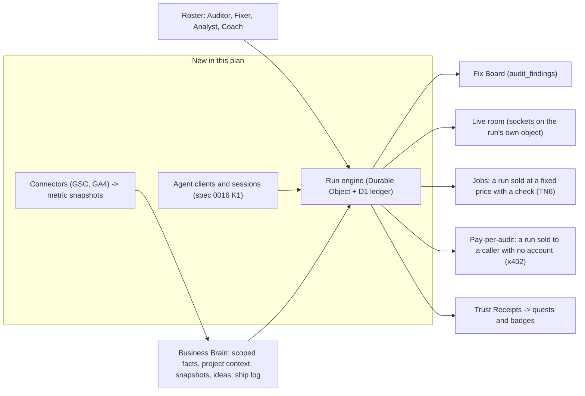

# Founder Swarm and Business Brain: additive plan (Track SW)

**Status:** v0.1 - draft under review (section 22). No code written. Nothing in this plan is implemented.  
**Date:** 2026-10-10  
**Owner:** Luminara Digital (owner gate before every production step)  
**Sources:** owner brief of 2026-10-10 (AI at the foundation, agents that do the work, a business brain, agent swarms, a services marketplace run by AI, a fun founder community, desktop where it fits); three research notes supplied with it (fit against five YC requests, an open-source pattern list, an x402 batch); seven read-only audits run on 2026-10-10 (backend and D1, AI stack, payments and chain, front end and desktop, deploy, existing plans, external standards)  
**Baseline:** `main`, `origin/main` and `origin/staging` all at `88547dc`. The working tree on `main` carries another session's uncommitted files (section 1.1).  
**Companions (binding):** [`zoro-concepts-implementation-plan.md`](./zoro-concepts-implementation-plan.md) (its section 2 rules bind this plan), [`verifiable-flow-memory-10x-ship.md`](./verifiable-flow-memory-10x-ship.md) (V: run ledger, scoped memory), [`oracle-operations-layer-additive-plan.md`](./oracle-operations-layer-additive-plan.md) (Ops: Sign-off Desk, Beacon, Sealed Lane, flag helper), [`trust-network-additive-plan.md`](./trust-network-additive-plan.md) (TN: receipts, Agent Jobs), [`allora-concepts-implementation-plan.md`](./allora-concepts-implementation-plan.md) (retest loop), [`lora-jetton-production-ship.md`](./lora-jetton-production-ship.md) (rules J1 to J7), `specs/0009`, `specs/0015`, `specs/0016`, `specs/0017`, APS invariants in `AGENTS.md`.

---

## 0. Verdict

### 0.1 The one insight

The brief asks for seven things: agents that do the work, a named roster, a business brain, a founder workbench, multiplayer, a services marketplace, and agentic commerce with a community around it. Each one needs the same missing capability:

> Work that runs on the server, under a named agent, against what Luminara knows about one business, inside a spend limit, ending in a result that a rule can check.

None of the parts exist on the server today:

| The brief assumes | What the code does today | Evidence |
|---|---|---|
| Agents do the audit | The seven-role crew runs in the browser tab. Board findings come from four fixed rules; the crew calls no model | `services/agentCore/crewOrchestrator.ts:200`, `:270-271`; `services/agentCore/agents/playbookAuditorAgent.ts:78`, `:99`, `:114`, `:130`; V plan section 1 "Audit location" |
| Work continues after the founder leaves | One daily cron, and one queue consumer that runs a single tool or returns a `not_measured` shell | `wrangler.jsonc:11-13`; `worker/scheduledJobs.ts:20-22`; `worker/auditQueue.ts:263-294` |
| The server can call a model reliably | The Oracle path is a hand-rolled fetch naming a model the repo's own comment says was shut down on 2026-08-16, with no fallback | `worker/oracleChat.ts:260-279`; `services/llm/nativeModelDefaults.ts:6` |
| Agents have identities and limits | Spend is summed per account only; per-agent caps and sessions are "Planned" | `worker/budgets.ts:325-339`; `specs/0016-agent-passport.md:23` |
| One place holds the business's knowledge | Facts are account-wide text rows read by keyword overlap over the newest 50; Search Console is a CSV upload; no Google Analytics code was found | `migrations/0008_memory_facts.sql:3-9`; `worker/memoryRag.ts:261-277`; `components/audit/GscPanel.tsx:25-42` |
| People can watch and steer together | The one Durable Object stores chat turns over plain fetch; org roles exist as schema with no invite route | `worker/oracleSession.ts:16-38`; `migrations/0003_enterprise_orgs_rbac.sql:13-21` |
| Agents can be paid and can pay | Stars and TON subscriptions settle against fixed plan prices; the pay-per-call routes return 503 then 404 | `worker/telegramBot.ts:290-318`; `worker/index.ts:996-1002` |

So this plan adds three things and builds the rest as views over them:

1. **One runtime.** A Durable Object per run, indexed by a D1 ledger (SW1).
2. **One identity and limit model.** The Agent Passport tables that spec 0016 already calls for, with the Ops plan's Agent Seats folded in as TN decision D2 recommends (SW2).
3. **One data intake.** Read-only connectors that turn outside numbers into typed rows an agent can cite (SW4).



### 0.2 The brief, concept by concept

| Concept in the brief | Decision | Lands in | Note |
|---|---|---|---|
| AI does the work, not helps with it | Take | SW1, SW2 | Server-side runs that end in a deliverable and a check |
| Named roster (Auditor, Scout, Coach) | Take, renamed where it collides | SW2 | "Scout" already names a Visibility Level, a crew role and a view (decision 8) |
| elizaOS character files and plugins | Adapt: idea only | SW2 | MIT, but Node 24 or Bun only, with no workerd build. Roster entries are typed data in our own shape |
| OpenAI Agents SDK guardrails | Adapt: idea only | SW2 | Its Workers support is labelled experimental. The three guardrail points are implemented natively |
| Cloudflare Agents SDK to run agents | Decide by spike | SW1-0 | `agents` 0.28.0 is still 0.x. Default: use the platform Durable Object APIs directly |
| Hermes and OpenClaw memory patterns | Adapt | SW4 | Through V3 scoped memory. No second store |
| Business Brain: ideas and data in one place | Take | SW4 | Typed rows in D1. No graph store (V non-goal stands) |
| Google Analytics "and more" | Take Search Console and GA4 first | SW4 | OAuth, read-only scopes, encrypted refresh tokens |
| Kaneo-style Fix list | Take, as a view | SW3 | `audit_findings` already has status, owner and due date. No new table |
| Memos-style "shipped today" | Take | SW3 | New `ship_notes` |
| Busabase-style memory | Covered | SW4 | Same thing as the Business Brain |
| Krayin-style leads pipeline | Take, small | SW3 | New `leads`; capture on shared reports |
| Multiplayer: watch, direct, hand off | Take | SW7 | Sockets on the run object; org invites |
| OpenCove war-room canvas | Adapt: a grid, not a canvas | SW7 | Idea only |
| A Fiverr replacement for our categories | Adapt: first-party Jobs | SW6 | TN6 already decided this shape. Third-party sellers stay legal-gated |
| "Always results" | Take, as a rule | SW6 | Money is kept only when the acceptance check passes |
| x402 pay-per-audit for AI agents | Take | SW5 | USDC `exact` scheme through a facilitator. The Worker holds no key |
| ClawRouter | Skip | none | A local model router for the paying side. Nothing in it for a seller |
| A founder's agent pays within a cap | Split | SW2, SW10 | Inside Luminara: yes, caps on hosted spend. Paying third parties from the founder's own funds needs a key that can move money, so it is gated |
| Bounties in Stars or TON between founders | Defer, design recorded | SW10 | Stars cannot be paid out to another user; a peer marketplace needs the legal review TN decision D5 already requires |
| TON Acton for contracts | Keep for later | SW10 | Already the toolchain in `contracts/ton` (`Acton.toml:8`). It has no native Windows build: WSL or CI only |
| TonWeb for Worker-side checks | Skip | none | Unmaintained since 2024. The repo already uses `@ton/core` and verifies over HTTP APIs |
| TON soulbound badges | Split | SW9, SW10 | Badges as signed receipts now; an on-chain TEP-85 item later, gated |
| Zealy-style quests and streaks | Take, on existing tables | SW9 | `user_missions` and the streak already exist |
| Guild-style gating | Reference only | TN8 | Gated groups are TN8 Circles, parked at TN decision D6 |
| BuidlGuidl builder ladder | Adapt | SW9 | One ladder: the existing four levels gain verified inputs |
| XMTP payment requests | Skip | none | No Telegram or TON relevance found; its decentralised network is not confirmed live |
| Desktop-specific agents | Adapt | SW8 | The server does the work. Desktop adds notifications, tray status and save-to-folder |
| The compliance pivot and "proving you are human" (YC list) | Skip | none | One is a pivot, not a feature; receipts prove domain control, not humanity |

### 0.3 Corrections to the brief

1. **A swarm today would be theatre.** The crew is seven labels over deterministic steps (`crewOrchestrator.ts:200`). That is not a weakness to hide: deterministic steps are cheap and checkable. SW1 ships the first unattended run with exactly one model call, the summary. Model-planned steps arrive in SW2 behind evals. Product copy does not say "swarm" until two agents hand work to each other on the server.
2. **Stars bounties between founders cannot be built as described.** The Bot API has no method that sends Stars to an arbitrary user and no escrow or split primitive. The only money-out call is a refund of one specific charge to its payer (`worker/telegramBot.ts:956-970`). A gift sent by a bot cannot be converted to Stars.
3. **Telegram constrains the rails.** Its bot developer terms require digital goods and services sold in a Mini App to be sold for Stars (section 6.2), and require Mini Apps with crypto features to use TON only and not promote other chains' assets (section 7). So Jobs are Stars-only inside Telegram, and the x402 rail (USDC on Base) is an API surface that never appears in the Mini App.
4. **x402 has moved on from what the notes describe.** The current version is 2: headers `PAYMENT-REQUIRED`, `PAYMENT-SIGNATURE` and `PAYMENT-RESPONSE`, with CAIP-2 network ids. It is governed by the x402 Foundation under the Linux Foundation. The public `x402.org` facilitator is testnet-only. The existing `worker/q402` code is version-1 shaped with custom TON and XDC schemes (`worker/q402/types.ts:8-17`), which is not what an outside agent's client speaks.
5. **A cap is only real where the system can enforce it.** Inside Luminara the cost ledger can enforce one. For payments to third parties out of the founder's own money, something would have to hold a key, and rule J1 forbids that. That part is gated (SW10).
6. **The goal is not a massive database.** It is a small typed one that an agent can cite. Every number an agent reports must point at a row with a source and a fetch time (APS invariant 5).
7. **Scale honesty.** Zoro's log recorded 5 user rows in production and 0 on staging on 2026-10-01 (`zoro-concepts-implementation-plan.md:711`). Marketplace, multiplayer and community features mean nothing without users, so horizon 2 does not start until horizon 1 is in use (section 0.5).
8. **This plan stands on unfinished work in five other plans.** Section 3 lists every dependency with its state on `main` today, and the shortest path through them to the first unattended result.

### 0.4 Earlier decisions this plan asks the owner to reverse or confirm

Nothing here is reversed silently. Each row is an owner decision in section 20, with a safe default.

| # | Earlier decision | Where | What the brief needs | Handling here | Decision |
|---|---|---|---|---|---|
| 1 | "No marketplace, community forum, partner directory" | `virality-activation-loops.md:21`, `:264` | A Jobs catalogue and community quests | Jobs stay first-party, the shape TN section 0.2 approved on 2026-10-07 | 1 |
| 2 | x402 settlement "Rejected for now" | `specs/0016-agent-passport.md:39` | Pay-per-audit | Receive-only, settled by a facilitator, outside the Mini App | 5 |
| 3 | "No new chain" | `trust-network-additive-plan.md:83`; Zoro non-goals (`:34`) | USDC on Base | No contract, no key in the Worker, no anchoring | 5 |
| 4 | "Tap-to-earn or a visible coin balance: rejected" | `specs/0009-referrals-and-retention.md:30` | "A fun place to be" | This plan adds no balance. Another session's uncommitted work adds one (section 1.2, hazard 9) | 9 |
| 5 | "Team seats / invite UI" is a non-goal | `virality-activation-loops.md:265` | Multiplayer | Minimal invites, scoped to live rooms | 10 |
| 6 | Server-side audit execution is "Not a work order" | V plan `:528`, decision 5 (`:603`) | Unattended audits | SW1 delivers it on a Durable Object instead of the queue | 3 |
| 7 | Preload IPC is "version, openExternal, update events" | `desktop-windows-electron.md:19` | Desktop surfaces | Three narrow additions. No local runner | 12 |
| 8 | Watches parked until Ops Phase 2 exits | Ops plan `:180` | Scheduled runs | Not reversed. SW8 waits for the same controls | none |
| 9 | Bounties "Defer"; third-party marketplace "Legal review first, no build" | TN plan `:267-268` | Bounties | Not reversed. Design recorded in SW10 | 13 |
| 10 | Agent SBT paused; "no custom contract" | Zoro plan `:7`, `:34` | Soulbound badges | Not reversed. Receipts now; chain later, gated | 14 |

### 0.5 Phases and horizons

| Phase | Ships | Migration (by name) | Flag | Horizon |
|---|---|---|---|---|
| SW0 | Decisions, platform facts, hazards fixed, prerequisites landed | none | none | 1 |
| SW1 | Run engine and the server-side Auditor | `swarm_runs` | `SWARM_RUNS_ENABLED` | 1 |
| SW2 | Roster; per-agent caps and sessions (spec 0016 K1, K2); approvals inside runs; handoffs; Fixer and Coach | `agent_passport_k1` | `SWARM_ROSTER_ENABLED`; Ops's `AGENT_SEATS` and `AGENT_SEAT_CAPS` for outside keys | 1 |
| SW3 | Workbench: Fix Board, Ship Log, Leads | `ship_log`, `leads_pipeline` | `SHIP_LOG_ENABLED`, `LEADS_ENABLED` | 1 |
| SW4 | Business Brain: connectors, snapshots, Analyst, Brain view | `brain_connectors` | `CONNECTORS_ENABLED`, `BRAIN_ENABLED` | 1 |
| SW5 | Pay-per-audit for outside agents (x402) | `x402_payments` | `X402_AUDIT_ENABLED` | 2 |
| SW6 | Jobs: fixed-price work, money kept only on a passed check (implements TN6) | `agent_jobs` | `AGENT_JOBS_ENABLED` (TN's name) | 2 |
| SW7 | Live rooms, org invites, agency war room | `live_rooms` | `LIVE_ROOMS_ENABLED`, `ORG_INVITES_ENABLED` | 2 |
| SW8 | Watches (scheduled runs) and desktop surfaces | `swarm_watches` | `SWARM_WATCHES_ENABLED` | 2 |
| SW9 | Quests and badge receipts | none | `QUESTS_ENABLED` | 2 |
| SW10 | Gated designs: bounties, on-chain badges, third-party sellers, outward agent payments, desktop folder bridge | design only | decision-gated | 3 |

**Horizon rule.** Horizon 1 is specified to task level. Each horizon 2 phase starts with a re-baseline task and does not start until horizon 1's promotion criteria hold in production (sections 6 to 9). Horizon 3 is design, not a work order.

**Lanes.** SW3 is mostly front end and can start as soon as SW0 exits, in parallel with SW1. SW5 needs only SW1.

### 0.6 Non-goals (locked)

- **No custody.** The Worker holds no key that can move funds and never releases funds between users (TN section 0.4). The one existing money-out path stays as it is: the bot token can refund a Stars charge to the account that paid it.
- **No token mechanics.** LORA has no role in this plan. J5 stands: checkout stays off. No yield, no staking, no point with a cash value.
- **No "verified" label without a Worker verifier.** No invented number, score, rank or uplift. A missing number reads `not_measured`.
- **No second budget system, approval table, facts table or findings table** (Ops section 13; V section 0.6).
- **No "hire an agent" or org-chart metaphor in copy** (Ops section 5).
- **No Telegram message the user did not opt into.** No blasts from a cron (`specs/0009-referrals-and-retention.md:18`, `:29`).
- **No router rewrite of `worker/index.ts` and no state-library migration of `App.tsx`.**
- **No local agent runner on the desktop** (Ops section 13).
- **No x402, USDC or Base surface inside the Telegram Mini App.**
- **No autonomous publishing to a founder's site.** Agents prepare; the founder ships. The schema already forbids a `published` asset (`migrations/0014_weekly_decision_loop.sql:65-66`).

### 0.7 What "ready" means here

SW0 to SW4 are specified to task level against code read on 2026-10-10 and checked by independent review (section 22). Every later phase begins with a re-baseline task that re-checks its citations before code is written. Every SQL block in this plan was executed on SQLite with migrations 0001 to 0020 applied, and again with V's `run_ledger` and `scoped_memory` applied first. No latency, cost or conversion number is claimed anywhere in this plan: each is measured by a named task before it gates anything.

---

## 1. Baseline (2026-10-10)

### 1.1 Verified

Rows marked **D** were read directly while writing this plan. The rest come from the specialist audits and were re-checked by the technical review (section 22).

| Area | Finding | Evidence |
|---|---|---|
| Branches **D** | `main`, `origin/main` and `origin/staging` are all at `88547dc`. Ten linked worktrees exist under `.claude/worktrees/` | `git log`, `git worktree list` |
| Working tree **D** | `main` carries uncommitted work from another session: `services/referrals/rules.ts`, `worker/env.ts`, `worker/ideaScout.ts`, `worker/index.ts`, `worker/providerRelay.ts`, `worker/referrals.ts`, `wrangler.jsonc`; untracked `worker/workersAiFallback.ts`, two tests and `docs/plans/gamified-builder-ecosystem-tma-plan.md` | `git status --short` |
| Identity **D** | The tenant key is `users.account_id`; `billingId()` returns `accountId || id`. Linking rewrites only `users.account_id`, so rows keyed by the losing account are orphaned in every other table | `worker/workerUtils.ts:98-100`; `worker/userStore.ts:330-338` |
| Orgs **D** | Each account gets a personal org `org_<accountId>` with the user as `owner`. Roles `owner, admin, analyst, auditor, viewer` exist in schema. No invite or join route exists | `worker/enterpriseStore.ts:76-91`; `migrations/0003_enterprise_orgs_rbac.sql:13-21` |
| Plans **D** | Tiers are free, starter, growth, agency. `scheduledReaudit` is none, monthly, weekly, daily; `teamSeats` is 1, 1, 3, 10 and is client display only. The Worker mirror has no `teamSeats` | `services/plans/planEntitlements.ts:16`, `:23`, `:35-85`; `worker/telegramBot.ts:128-149` |
| Route guards **D** | `PROTECTED_API_ROUTES` requires identity; a second pattern list sends `/oracle`, `/audit`, `/tools` to the Agency check | `worker/authMiddleware.ts:151-192`; `worker/apiAccess.ts:16-20` |
| Background work **D** | One cron (`0 8 * * *`) mapped to `sentinel`, `privacy_purge`, `domain_recheck`; an unmapped cron runs every job. One queue whose handler treats every batch as an audit job. One Durable Object class that stores chat turns | `wrangler.jsonc:11-13`, `:138-158`; `worker/scheduledJobs.ts:10-36`; `worker/index.ts:2059-2071`; `worker/oracleSession.ts:1-40` |
| Queue audit **D** | The consumer runs one hosted `get_domain_overview` when a project id is present, else returns a `not_measured` shell. Its own note calls the crew port "incremental". Errors are caught into status `failed`, so queue retries rarely fire | `worker/auditQueue.ts:263-306` |
| Server model call **D** | Oracle chat posts to Groq with `llama-3.3-70b-versatile`, no timeout and no fallback; a non-2xx ends the stream with an error. The repo's defaults file says that model was shut down on 2026-08-16 | `worker/oracleChat.ts:260-279`; `services/llm/nativeModelDefaults.ts:6-8` |
| Client crew **D** | `CREW_PROFILES` defines seven roles; the graph is built with `maxIterations: 12`. The four board findings are fixed rule ids | `services/agentCore/crewOrchestrator.ts:200`, `:270-271`; `services/agentCore/agents/playbookAuditorAgent.ts:78`, `:99`, `:114`, `:130` |
| Tool gates **D** | In `callTool` the budget halt runs first, then approval lookup and governance, then scope, plan and project-context gates. A cost event is recorded only after a successful paid tool, at a flat 1 cent | `worker/mcpServer.ts:427-443`, `:472-476`, `:513-552`; `worker/budgets.ts:36-37` |
| Cost ledger **D** | `cost_events` carries `run_id`, `credential_kind`, `credential_id`. The window total is a `SUM` per account. Model tokens are not metered on the server | `migrations/0012_budget_policies.sql:34-45`; `migrations/0019_agent_passport_k0.sql:6-10`; `worker/budgets.ts:292-339` |
| Budget scope **D** | `budget_policies.scope_type` allows only `account` and `project`. Production enforcement is `hard`, staging `soft` | `migrations/0012_budget_policies.sql:11`; `wrangler.jsonc:133`, `:247`, `:334` |
| Approvals **D** | `mcp_action_requests` holds `tool_name`, `args_json`, `status`, `expires_at`, `kind`. It has no `args_hash`, requester or consumed marker | `migrations/0011_mcp_action_requests.sql:4-15`; `migrations/0013_mcp_action_requests_kind.sql:8` |
| Untrusted content **D** | `wrapUntrustedContent` fences text and neutralises forged markers. The client tool loop folds tool results into the next prompt unfenced | `utils/untrustedContent.ts:12-27`; `services/tools/runToolLoop.ts:73-75` |
| Memory **D** | `memory_facts` has no project column. Without a vector provider, retrieval is keyword overlap over the newest 50 rows. Vectorize is not bound | `migrations/0008_memory_facts.sql:3-9`; `worker/memoryRag.ts:100-105`, `:261-277`; `wrangler.jsonc:135` |
| Project context **D** | Per project: typed sections, competitors, key pages, a research log, and reports | `migrations/0006_agent_mcp_product_surface.sql:4-87` |
| Findings **D** | `audit_findings` has `status`, `owner`, `due_at` and a unique key `(account_id, domain, stable_key)`. Statuses are `open, in_progress, done, wont_fix`. The bulk save still takes the row id from the client | `migrations/0005_visibility_agent_platform.sql:36-54`; `services/agentCore/types.ts:112`; `worker/findingsService.ts:166` |
| Prepared assets **D** | `prepared_assets` links to a finding or a weekly decision; status is `draft, ready, exported`, and a CHECK forbids `published` | `migrations/0014_weekly_decision_loop.sql:54-67` |
| Missions and levels **D** | Three weekly missions; levels explorer, scout, builder, operator; `user_missions` is unique on `(account_id, mission_key, week_key)`; credits are `referral_rewards` rows of kind `hosted_scout_credit`, unique on `(account_id, reason)` | `services/referrals/rules.ts:20-41` at `HEAD`; `migrations/0012_referrals_missions.sql:32-41`, `:72-81`; `worker/referrals.ts:76`, `:480` |
| Connectors **D** | `gsc_oauth_tokens` exists with one row per account and no reader. `GOOGLE_OAUTH_CLIENT_ID` and `_SECRET` are typed and unread. Search Console data arrives as a CSV upload in the browser | `migrations/0005_visibility_agent_platform.sql:72-77`; `worker/env.ts:178-179`; `components/audit/GscPanel.tsx:25-42` |
| Stars checkout **D** | Pre-checkout takes the plan id from the payload and requires `total_amount === plan.stars`. The invoice payload is `<planId>:<userId>`. Credit uses the user id from the payload, falling back to the sender | `worker/telegramBot.ts:290-318`, `:323-333`, `:929-954` |
| Stars refund **D** | `refundStarPayment(user_id, telegram_payment_charge_id)` reverses one charge | `worker/telegramBot.ts:956-970` |
| Money rule **D** | "Claim before granting entitlement"; helpers fail closed; never KV-only | `worker/paymentLedger.ts:1-5` |
| Pay-per-call today **D** | `/q402/supported` answers; `/q402/verify`, `/settle`, `/audit` return 503 while the constant is false, then fall through to 404. The route tests the constant, not `isQ402SettlementLive(env)`. Types are x402 version 1 with schemes `ton/*` and `xdc/*` | `worker/index.ts:991-1003`; `worker/q402/facilitator.ts:52-57`; `worker/q402/types.ts:8-57` |
| Chains **D** | The chain registry knows `ton` and `xdc`. `viem` and `@ton/core` are dependencies. Jetton masters: USDT set, LORA empty on both networks | `services/chain/chainRegistry.ts:10`; `package.json`; `worker/tonPayment.ts:53-65` |
| Trust receipts **D** | Receipts are Ed25519-signed rows minted by `issueTrustReceipt`; claims include `audit_run`, `fix_retested`, `agent_job_delivered`. Both trust flags are `"false"` in all three blocks. The flag helper treats unset as on when `ENVIRONMENT` is unset | `worker/trustReceipts.ts:37-42`, `:84-104`; `services/trust/receiptTypes.ts:8-19`; `wrangler.jsonc:120-121`, `:235-236`, `:324-325` |
| Deploy **D** | Pushes to `staging` and `main` each run secrets check, env validation, typecheck, `npm test`, build, D1 migrate, deploy, smoke. The two jobs are independent. No backup step. Lint, coverage and evals run only in CI | `.github/workflows/deploy-cloudflare.yml:26-30`, `:44-83`, `:88-92`; `.github/workflows/ci.yml:45-52` |
| Smoke lists **D** | `REQUIRED_D1_MIGRATIONS` stops at 0017; `REQUIRED_D1_TABLES` has no Launchpad or Trust table | `scripts/smoke-check.mjs:23-58` |
| Privacy **D** | Export and delete lists are separate hand-kept lists. Delete does not remove projects, reports, audit runs, findings, API keys or cost events | `worker/privacyService.ts:116-134`, `:166-212` |
| Tests **D** | Vitest; D1 tests run on `node:sqlite` with every file in `migrations/` applied in sorted order; coverage floors 35/35/25/35 | `tests/helpers/sqliteD1.ts:26-32`; `vitest.config.ts:49-54` |
| Front end **D** | No router: one view enum. Telegram bottom nav and the public-view set are separate lists a new view must join | `components/telegram/TelegramBottomNav.tsx:13-25`; `services/auth/useAppAuth.ts:41-59` |
| Roster-like UI **D** | `AgentMissionControl` renders one card per crew profile from in-memory events. `BrandMemoryView` has six tabs | `components/audit/AgentMissionControl.tsx:156-160`; `components/suite/BrandMemoryView.tsx:166-173` |
| Desktop **D** | The preload exposes seven calls and one event. IPC handlers ignore the sender | `electron/preload.cjs:8-21`; `electron/main.cjs:309-330` |
| CSP **D** | `connect-src` already allows `https:` and `wss:`; `frame-src` names `accounts.google.com`; `form-action` is `'self'` | `worker/security.ts:21-30` |
| TON contracts | `contracts/ton` targets Acton 1.2.0 with one Tolk contract and no tests; the LORA jetton is tested and not deployed; three Solidity contracts are tested and not deployed | `contracts/ton/Acton.toml:8`; `contracts/jetton/deployments.json:2-3`; `contracts/README.md` |

External facts, each checked against a primary source on 2026-10-10:

| Fact | Source |
|---|---|
| x402 is at version 2. HTTP transport: `PAYMENT-REQUIRED`, `PAYMENT-SIGNATURE`, `PAYMENT-RESPONSE`; networks are CAIP-2 ids. Packages `@x402/core`, `@x402/evm`, `@x402/mcp` are at 2.28.0, Apache-2.0 | `github.com/x402-foundation/x402` specs; npm registry |
| A facilitator exposes `/verify`, `/settle`, `/supported`. With one, a seller needs only a `payTo` address. The CDP facilitator needs an API key, gives 1,000 free settlements a month, and screens payers. `x402.org/facilitator` is testnet only | `docs.x402.org`; `docs.cdp.coinbase.com/x402` |
| x402 over MCP: a paid tool returns `isError: true` with the requirements in `structuredContent`; the client retries with `params._meta["x402/payment"]` | x402 `specs/transports-v2/mcp.md` |
| No Bot API method sends Stars to an arbitrary user. `refundStarPayment` reverses one charge. Owner withdrawal has a 1,000 Star minimum and a hold of up to 21 days | `core.telegram.org/bots/api`; `telegram.org/tos/bot-developers` |
| Digital goods and services in a Mini App must be sold for Stars. Mini Apps with crypto features must use TON only and TON Connect | `telegram.org/tos/bot-developers` sections 6.2, 7; `core.telegram.org/bots/blockchain-guidelines` |
| `agents` (Cloudflare Agents SDK) is 0.28.0, MIT. `McpAgent` is deprecated. SQLite-backed Durable Objects exist on the Free plan. Paid plan limits: 30 s CPU per request by default, 10,000 subrequests; Free: 10 ms CPU, 50 subrequests | `developers.cloudflare.com/agents`, `/workers/platform/limits` |
| TEP-85 (soulbound token) is Active; its reference item is FunC. Acton is the official Tolk-first toolchain; Blueprint is deprecated in its favour | `github.com/ton-blockchain/TEPs`; `github.com/ton-blockchain/acton` |
| Google scopes `analytics.readonly` and `webmasters.readonly` are not on the restricted list. An app left in Testing is capped at 100 users and its refresh tokens expire after 7 days | `developers.google.com/identity/protocols/oauth2`; `support.google.com/cloud/answer/15549945` |
| Licences: Kaneo, Memos, Busabase, Krayin, OpenCove, Hermes Agent, OpenClaw, elizaOS are MIT. Zealy is proprietary. Guild.xyz publishes source with no licence file | each project's repository |

### 1.2 Hazards found during the audits

These are defects in the tree today. None is owned by this plan, and three have a separate task raised for them. They are listed because each one would undermine a phase below.

| # | Hazard | Evidence | Blocks | Handling |
|---|---|---|---|---|
| 1 | Production requires App Check for email sign-up and sign-in since `88547dc`, but the production build is given no App Check site key, so those calls would return 401. Top-level and production `vars` disagree | `wrangler.jsonc:108`, `:314`; `worker/appCheck.ts:124-177`; `worker/authCredentialGateway.ts:223`, `:307`; `.github/workflows/deploy-cloudflare.yml:57`, `:119` | Any web sign-in soak | Separate task raised. Not confirmed against the live site |
| 2 | Public `/api/health` returns only `{ ok: true }` since `88547dc`, while the client still reads `plans`, `ton`, `jettonCheckout`, `trust` and other fields from it | `worker/index.ts:294-300`; `services/apiClient.ts:117-147`; `components/telegram/TelegramAccountPanel.tsx:23`; `components/paywall/paymentOptions.ts:27-55` | Every client feature flag in this plan | Separate task raised. SW0-4 depends on its outcome |
| 3 | With `TRUST_RECEIPTS_ENABLED` on, the gateway route would mint a public, `worker_verified`, `domain_control` receipt for any domain a signed-in user names, from constants: status 200, length 2500 and the SHA-256 of the empty string. No fetch happens | `worker/oracleGateway.ts:116-127`, `:146-165`; `worker/index.ts:1840-1851` | Turning on receipts (SW5, SW6, SW9) | Separate task raised. SW0 gate |
| 4 | The queue consumer calls a hosted paid tool with no budget check and no cost event | `worker/auditQueue.ts:269-283` | Nothing here (SW1 does not use the queue) | Recorded for the V plan's queue hardening |
| 5 | The q402 settle path has replay, proofless-claim, pending-transaction and decimal defects | `worker/q402/tonAdapter.ts`, `xdcAdapter.ts`, `facilitator.ts` (blockchain audit) | Nothing here while it stays off | SW5 does not reuse it. Recorded for the q402 plan |
| 6 | Account deletion skips several account-keyed tables, and account linking orphans rows | `worker/privacyService.ts:166-212`; `worker/userStore.ts:330-338` | Rule 2.6 for every new table | V2-1, V2-1b (section 3) |
| 7 | Smoke lists stop at migration 0017 | `scripts/smoke-check.mjs:23-58` | The first SW migration | Ops Phase 0 item 5 (section 3) |
| 8 | Numbers with no measurement behind them on paths agents would reuse: `healthScore = 74`; Sentinel starts each target with `cited = true` and only changes it when a search key is set | `services/decision/fastDecisionService.ts:297`; `worker/sentinel.ts:154-157` | The number rule (2.9) | SW0-3 |
| 9 | Another session's uncommitted work adds a visible points balance ("Lumens"), ranks, a daily check-in and a community feed, with no flag, and its plan proposes Stars escrow bounties | `services/referrals/rules.ts` (modified); `docs/plans/gamified-builder-ecosystem-tma-plan.md:67-95` | SW9 | Decision 9. This plan does not edit that session's files |

### 1.3 Not verified (each is resolved by a named task)

- The Workers plan tier, which sets CPU, subrequest and D1 limits (SW0-1).
- Which migrations are applied on each remote database, and which secrets are set (SW0-1).
- Whether hosted model keys exist on staging; Zoro's log said none (SW0-1; Zoro decision 9).
- Whether hazards 1 and 2 are live in production (their own tasks).
- Whether any non-Stars checkout renders inside the Mini App for a digital plan today (SW0-5).
- Whether `@x402/core` and `@x402/evm` bundle and run under workerd (SW5-0).
- Whether a rollback across a Durable Object class migration is refused by wrangler, as its documentation suggests (SW1-0).
- Whether hibernating WebSockets work with the gradual deployment the Ops plan wants (SW7-0).
- The USDC contract address and decimals on Base and Base Sepolia: read from the facilitator's `/supported` response in SW5-0, never typed from memory.
- Real cost per run, in cents (SW1-9 measures it; nothing is priced before then).
- Whether Google classes the two read-only scopes as sensitive (SW4-0 reads it in the Cloud Console).

---

## 2. Rules for every task

The Zoro plan's section 2 applies (gates, flags, release, rollback, migrations, privacy, double-check, licence keys), with the V plan's section 2.1 deltas. The deploy audit found several of those statements out of date. This section records only the corrections and additions.

| # | Rule | Why |
|---|---|---|
| 2.1 | **Release path.** Branch from `origin/staging`. PR to `staging`; after the staging checks, a PR from `staging` to `main` with a merge commit. `main` is branch-protected and requires the "Build, Test & Smoke Validation" check, so Zoro 2.3 step 7's direct push works only by admin bypass. No production step without an explicit owner yes in chat | Deploy audit; `AGENTS.md:34`; V decision 8 |
| 2.2 | **Back up before merging a migration.** The deploy workflow applies D1 migrations on merge with no backup (`deploy-cloudflare.yml:59-67`, `:121-129`). The operator runs `npm run db:backup:staging` (or `CONFIRM_PROD_BACKUP=1 npm run db:backup:prod`) and records the Time Travel bookmark first | Zoro 2.3; deploy audit |
| 2.3 | **Flags.** Every flag in this plan is a string compared with `=== 'true'`, so unset means off in every environment. It is declared `"false"` in all three `wrangler.jsonc` blocks with identical top-level and production values, typed in `worker/env.ts`, documented in `.env.staging.example`, `.env.production.example` and `.dev.vars.example`, reported in the admin health block (`worker/index.ts:311-346`) and in the public flag surface (SW0-4). The Trust helper's "unset is on in local dev" rule (`worker/trustReceipts.ts:37-42`) is not copied | Two conventions exist today |
| 2.4 | **One production flag change per release, 24 hours apart** (Ops section 6). New flags reach production `"false"` | Ops plan `:130` |
| 2.5 | **Migrations.** Referred to by name; the number is taken at PR time (next free on disk today: 0021; the 0011 to 0013 duplicates stay). Expand-only. `CREATE ... IF NOT EXISTS`. INTEGER millisecond timestamps. Each file and table is added to `scripts/smoke-check.mjs` in the same PR | Zoro 2.5 |
| 2.6 | **Privacy.** Every new account-keyed table is added to `collectExportPayload`, its `processors` list and `softDeleteAccount` (`worker/privacyService.ts:116-134`, `:166-212`), and to the account-link move helper (V2-1b), in the PR that creates it, with a test | Zoro 2.6 |
| 2.7 | **Durable Objects.** A new class ships in its own release, with its `migrations` tag and bindings in all three blocks, before any feature calls it, so later rollbacks stay on the far side of the class migration. Every object has a D1 index row that stores its name as created (`object_name`), because objects cannot be listed; account deletion calls the object's purge route before deleting the row | V plan section 6.1 lesson |
| 2.8 | **Money.** Claim in D1 before granting; fail closed; never KV-only (`worker/paymentLedger.ts:1-5`). Every money state change is a conditional `UPDATE ... WHERE status = ?` that must change exactly one row | Existing rule |
| 2.9 | **Numbers.** A number in any agent output must cite an evidence row, a snapshot row or a tool result from the same run. The validator blocks a deliverable that carries an uncited number. A value that was not measured is written `not_measured`, never estimated silently | APS invariant 5 |
| 2.10 | **Untrusted content.** Crawled pages, connector strings, user notes, lead messages and anything a model wrote in an earlier run are wrapped with `wrapUntrustedContent` before they enter a prompt. A run that has read untrusted content is `sealed`: it may not call a write tool without a bound, single-use approval (Ops F3) | Ops plan section 4 |
| 2.11 | **Chain.** The agent sends no transaction on any network and holds no key (J1). Automated tests use a mock facilitator and fixtures. Every live payment drill, testnet included, is an owner step | Owner rule of 2026-10-07 |
| 2.12 | **Shared tree.** Other sessions work in this checkout. Re-run `git status --short` before each commit; stage by explicit path; never `git add -A`; never edit another session's plan file | Recorded practice |
| 2.13 | **Copy.** No em dashes. No "hire", "employee" or org-chart wording for agents. "Verified" appears only beside a receipt | `AGENTS.md:17`; Ops section 5 |
| 2.14 | **Double-check.** After every task: its acceptance test, typecheck, targeted tests, and a grep for the regression it could cause. After every phase: full gates on a green Linux CI run, staging smoke, the phase's owner check, and a re-read of this plan's section against the merged code, correcting whichever is wrong | Zoro 2.7; Allora 2.2 |
| 2.15 | **Licence keys.** The 55 existing keys keep redeeming. Check with `scripts/verify-license-vault.mjs` before and after each production deploy (`describeLicenseKey` has no route or CLI caller). No phase adds a dependency to redemption | Zoro 2.8, corrected |

---

## 3. Prerequisite ledger

This plan does not restate designs owned by other plans. Each row is work that must be on `main` before the phase named in the last column starts. The owning plan's task id is used in commits and in both execution logs. "State" was checked on `main` at `88547dc`.

| # | Capability | Owner | State on `main` today | Needed by |
|---|---|---|---|---|
| P1 | Hazards 1, 2 and 3 fixed (section 1.2) | Their own tasks | Open | SW1 soak (1, 2); any receipt flag (3) |
| P2 | Findings rows get server-minted ids | V0-8 | Not on `main`. Present on unmerged branch `claude/nervous-murdock-568385` (`27128a0`); `worker/findingsService.ts:166` still takes the client id | SW1, SW3 |
| P3 | Workspace sync no longer overwrites newer data | V0-1 | Not on `main`. Present on unmerged `feat/v0-verifiable-flow` | SW4 (reads Business DNA from the blob) |
| P4 | Server model call with timeout, fallback and a live model id | V0-2, Zoro P1-4 (`callHosted`) | Not started: no `callHosted` symbol exists; `worker/oracleChat.ts:267` unchanged | SW1 |
| P5 | Run ledger: `audit_evidence`, `finding_observations`, `audit_runs.origin`, the `/runs` writer, privacy and link move for them | V2-1, V2-1b, V2-5 | Not started: no `worker/runLedger.ts`, no `worker/accountLinkMove.ts` | SW1 |
| P6 | Owner decision on server-side audits and hosted keys for the summary step | V decision 5; decision 3 here | Open | SW1 |
| P7 | Flag helper with KV override and account allow-list; migration lint; smoke preflight before deploy; production job needs staging; smoke lists caught up | Ops Phase 0 items 5 to 8 | Not started: no `worker/featureFlags.ts` | SW1 (first migration, first canary) |
| P8 | A 15-minute ops cron and error reporting from `scheduled` and `queue` | Ops Phase 0 item 9 | Not started | SW1 (stuck-run alert) |
| P9 | `ExecutionContext` passed into MCP; approvals bound to an args hash and requester, single-use, with expiry enforced | Ops Phase 1, F1 | Not started: `worker/index.ts:1605` passes no context; no `args_hash` column | SW2 |
| P10 | Beacon attention feed | Ops Phase 1, F2 | Not started | SW2 (optional: the roster view polls run events without it) |
| P11 | Sealed Lane: trust stored at run start; a sealed run cannot write without a bound approval | Ops Phase 2, F3 | Not started | SW2 (hard: Fixer reads crawled pages and writes assets) |
| P12 | Agent Passport K1 and K2, with Agent Seats merged in | spec 0016; Ops F4; TN decision D2 | Planned, no schema. SW2 implements it as designed in section 7; decision 2 confirms the merge | SW2 |
| P13 | Scoped memory: `memory_facts` gains project, domain, kind, hash; conversation index | V3-1, V3-1b | Not started | SW4 |
| P14 | Trust Receipts switched on after soak, with a signing key set | TN1 | Code on `main`, flags `"false"` everywhere | SW1 (hard: V2-11 lets an evidence row say `worker` only when a receipt backs it), SW6, SW9 |
| P15 | Fix retest: a server re-check that a shipped fix is live | Allora (`decision_checks`); TN `fix_retested` | Awaiting owner gate | SW2 (Fixer's closing check) |
| P16 | Findings board hydrates from the server | V2-9 | Not started | SW3 |

**If a prerequisite stalls.** This plan does not fork it. The phase that needs it waits, and the stall is reported to the owner with the unblock that would clear it. The one exception is P12, which no plan has designed in detail: SW2 owns that design.

**Shortest path to the first unattended result:** P1 (hazards 2 and 3), P2, P4, P5, P6, P7, P8, P14, then SW1. Everything else can follow.

---

## 4. Architecture

### 4.1 Run engine

One Durable Object class, `SwarmRun`, with one instance per run. The object is the run's state machine, its step scheduler, and from SW7 its live room.

**Why an object per run, and not the queue or a Workflow.** The queue has no per-run state and cannot be watched live. A Workflow has durable steps but no sockets. An object gives one-at-a-time execution per run for free, alarms to continue after each step, hibernating sockets for watchers, and private storage. Each alarm is a fresh invocation, so each step gets its own CPU and subrequest allowance.

**Why not adopt a framework by default.** The engine needs three platform features: storage, alarms, and hibernating WebSockets. The Cloudflare Agents SDK wraps the same three and adds state sync, but it is at 0.28.0, and the D1 ledger below is the source of truth either way. SW1-0 is a time-boxed spike that adopts it only if it removes code without constraining the ledger.

**States.**

```
queued -> running -> completed
             |  \-> failed | cancelled | budget_halted | expired
             +-> waiting_approval -> running
             +-> paused -> running
```

**One step per alarm.** On each alarm the object:

1. Loads its state. Stops if cancelled or paused.
2. Checks the deadline, `max_steps` (default 24, hard limit 40 by CHECK), and the kill switch (flag off means stop and mark `cancelled` with `error_code = 'FLAG_OFF'`).
3. Checks money, in this order: account budget halt (`isBudgetHalted`), session budget, agent monthly cap (section 4.4). A failed check ends the run as `budget_halted`.
4. Claims the step by writing `(seq, 'started')` to its own storage before doing anything with a side effect.
5. Executes exactly one step: one fetch, one tool call or one model call. Tool calls go through the same governance function MCP uses, so there is one policy path.
6. Appends one event row to D1 and its own storage, updates `steps_done`, and sets the next alarm.

A step that was started but not finished when the object restarts is retried once, with the same idempotency key (`<run_id>:<seq>`), then fails the run. Side-effect tools must accept that key.

**The D1 ledger** is what the app lists, what privacy export and deletion reach, and what the sweeper watches:

- `swarm_runs`: one row per run (SQL in section 6.2).
- `swarm_run_events`: an append-only feed, redacted, capped at 400 events per run. Summaries are at most 500 characters; `detail_json` at most 4 KB and never holds raw tool arguments, page text or prompt text.

**Links to what exists.** Each run opens a `run_provenance` row with a new surface value `swarm_run` (the column is free text; only the TypeScript union at `worker/runProvenance.ts:21-26` grows), so parent chains keep working. An audit run also writes the `audit_runs`, `audit_evidence` and `finding_observations` rows defined by V2, with `fetcher = 'worker'`.

**A sweeper** on the Ops 15-minute cron marks any open run whose `updated_at` is older than its deadline plus 10 minutes as `expired`, and raises an alert. It counts expired runs; it does not hide them.

### 4.2 Roster

A roster entry is typed data, not a class. The shape borrows the idea of an elizaOS character file and nothing else:

```ts
// services/swarm/roster.ts (shared by the Worker and the UI; no DOM, no Node)
type RosterAgent = {
  id: 'auditor' | 'fixer' | 'analyst' | 'coach' | 'prospector';
  displayName: string;            // owner decision 8
  purpose: string;                // at most 140 chars, shown on the passport (TN4)
  skillSlug: string;              // row in agent_skills; bundled prompt is the fallback
  plan: 'fixed' | 'model';        // fixed = a deterministic step list
  tools: string[];                // allow-list of tool names
  riskCeiling: 'read' | 'write';  // no roster agent is 'destructive'
  maxSteps: number;
  defaultSessionCapCents: number;
  deadlineSeconds: number;
  handoffTo: RosterAgent['id'][];
  deliverable: 'findings' | 'prepared_asset' | 'digest' | 'decision_card' | 'report';
  acceptanceCheck: string;        // id of a deterministic check
};
```

| Agent | Job | Plan | Writes | Acceptance check | Phase |
|---|---|---|---|---|---|
| Auditor | Crawl a site, apply the playbook rules, record evidence, summarise | fixed | findings, evidence, report | Every finding has a rule id and either an evidence ref or `not_measured` | SW1 |
| Fixer | For one open finding, prepare the fix asset; after the founder ships, retest | model, bounded | `prepared_assets` (never `published`) | The asset validates (JSON-LD parses, robots or `llms.txt` parses); the retest passes or the finding stays open | SW2 |
| Coach | Propose the week's Decision Card from open findings and the latest digest | model, bounded | a `weekly_decisions` draft | The card cites a finding id that exists and is open | SW2 |
| Analyst | Turn connector snapshots into a weekly digest and Brain facts | fixed, then one model call | digest report, `memory_facts` | Every number equals a `metric_snapshots` row | SW4 |
| Prospector | Idea checks and lead research lists (the brief's "Scout") | model, bounded | report | Every row has a source URL that resolves | SW6 |

The existing Sentinel cron job appears on the roster as a read-only status card. It is not rebuilt.

**Handoff.** An agent hands off by asking the engine to start a child run for an agent in its `handoffTo` list. The child's cap is carved out of the parent's remaining session budget and can never exceed it. The parent records a `handoff` event and waits or finishes, as its plan says. There is no free-form agent-to-agent chat.

### 4.3 Guardrails

Three checkpoints, the same three the OpenAI Agents SDK names, implemented on this stack:

| Point | What runs | Blocks |
|---|---|---|
| Input | Everything not written by Luminara's own code is fenced (rule 2.10). The run's trust becomes `sealed` the moment it reads untrusted content | Nothing by itself; it sets up the next two |
| Tool | The existing `decideToolCall` with the run's trust, the agent's allow-list and risk ceiling, and the money checks. A sealed run's write needs a bound single-use approval (P9, P11) | The tool call. The run moves to `waiting_approval` or fails |
| Output | A deliverable is structured JSON with a `claims` array. Each claim that carries a number names its evidence. The validator checks that the evidence exists in this run and that the number matches | The deliverable. The run fails with `error_code = 'UNCITED_NUMBER'`; nothing is shown as a result |

The output check is the difference from today, where validators annotate text after it has streamed (`worker/oracleChat.ts`, AI audit). A run's deliverable is not streamed, so it can be refused.

**Loop limits for model-planned agents (SW2).** At most `maxSteps` steps; at most two model calls per step; three consecutive tool calls with identical arguments end the run (`RepeatDetector` exists in `services/agentCore` and is test-only today); a per-step timeout; a per-run deadline.

### 4.4 Spend

One ledger, no balances. Every hosted cost a run causes is a `cost_events` row:

- `credential_kind = 'roster'`, `credential_id = <agent id>`: no new column, and the existing index `idx_cost_events_credential` serves the per-agent total.
- `run_id` = the provenance run id; `session_id` (new, nullable) = the K1 session.
- Model calls are metered from the provider's reported token usage through a rate card in code; `source = 'token_meter'`. Until SW0-6 lands, a model call has no cost row at all.

Three limits, checked before every step, smallest wins (spec 0016 "bounded loss stated before consent"):

| Limit | Stored in | Computed as |
|---|---|---|
| Account monthly budget | `budget_policies` (exists) | Existing `SUM` over the account's window |
| Agent monthly cap | `agent_clients.monthly_cap_cents` | `SUM(billed_cents)` where `credential_kind = 'roster'` and `credential_id = ?` in the window |
| Session budget and per-call cap | `agent_sessions` | `SUM(billed_cents)` where `session_id = ?` |

A fourth, global limit protects Luminara: `SWARM_DAILY_SPEND_CAP_CENTS`. It has no default. If it is unset, `SWARM_RUNS_ENABLED` is treated as off and the admin health block says why.

A step's worst case is reserved before it runs (the per-call cap, or the tool's rate-card price) and compared against the remaining amount, so two concurrent steps cannot both pass on the last cent. Reservation lives in the run object's storage; the ledger records only actual spend.

### 4.5 Business Brain

The Brain is not a new store. It is five existing or planned stores, one new one, and one read function:

| Part | Store | State |
|---|---|---|
| Typed facts per project | `memory_facts` with V3 columns | P13 |
| Sections, competitors, key pages, research log | `project_*` tables | Exists |
| Ideas | `idea_scouts` | Exists |
| Findings and decisions | `audit_findings`, `weekly_decisions` | Exists |
| Ship log | `ship_notes` | SW3 |
| Outside numbers | `metric_snapshots` | SW4 (new) |
| Business DNA | The workspace blob, read-only on the server, fenced | Exists; stays in the blob (V decision) |

The read function is V3's context assembler, a pure function in `services/`. Agents and both chat paths call the same one. This plan adds two blocks to it: the latest snapshot totals and the last five ship notes.

### 4.6 Where each thing appears

| Capability | Telegram Mini App | Web | Desktop | MCP and API |
|---|---|---|---|---|
| Start and watch a run | Yes | Yes | Yes | `start_run`, `get_run`, `list_runs` |
| Approve a step | Yes (one tap) | Yes | Yes, plus a native notification | No: bearer credentials cannot approve (Ops F1) |
| Fix Board | Read and status change | Full board | Full board | Finding tools belong to the WDL plan |
| Ship Log | `/shipped` to the bot, and in app | Yes | Yes | `add_ship_note` |
| Connect Google data | Link out to web (popups are unreliable in the Mini App) | Yes | Yes | No |
| Brain view | Read | Full | Full | `get_brain_digest` |
| Leads | No | Yes (Agency) | Yes | No |
| Jobs | Stars checkout | Hand-off to Stars | Hand-off to Stars | `list_jobs`, `quote_job` |
| Pay-per-audit (x402) | Never shown | Docs page only | No | `POST /x402/audit` |
| Live room | Watch and approve | Full | Full | No |
| Quests and badges | Yes | Yes | Yes | No |

---

## 5. SW0 - Reconcile and unblock

**Goal:** no user-visible change. The owner has decided what this plan needs decided, the platform facts are recorded, the hazards are closed, and the prerequisites for SW1 are on `main`.

| ID | Task | Files | Acceptance |
|---|---|---|---|
| SW0-0 | Record owner decisions 1 to 17 in section 20. Open one docs PR that adds a one-line supersession note to each committed plan or spec in section 0.4 whose decision the owner changed. Do not edit the uncommitted plan from another session; list its conflicts for the owner instead | this document; `docs/plans/virality-activation-loops.md`; `specs/0016-agent-passport.md`; `docs/plans/desktop-windows-electron.md` | Each note names this plan and the decision number. `git diff --stat` touches only `docs/` and `specs/` |
| SW0-1 | Operator, read-only. Record: the Workers plan tier; `wrangler d1 migrations list` for both databases; the names, not values, of the secrets set per environment; whether hosted model keys exist on staging; the `users` row count per environment | section 1 of this document | Each line of 1.3 it resolves moves to 1.1 with evidence. **Stop condition:** if the plan tier is Free, SW1 cannot start (10 ms CPU and 50 subrequests per request) |
| SW0-2 | Walk the prerequisite ledger. For P1 to P8 and P14, record the commit that landed each one, or the branch it waits on | section 3 | The "State" column carries commit ids. Anything still open is reported to the owner with what would unblock it |
| SW0-3 | Remove the two unmeasured numbers on paths agents reuse (hazard 8). The health score is derived from measured inputs or omitted. Sentinel starts each target as not checked and reports `not_measured` when no search ran | `services/decision/fastDecisionService.ts:297`; `worker/sentinel.ts:154-157`; tests | A fixture with no search key sends no alert and makes no "cited" claim. Grep finds no literal health score in `services/decision/` |
| SW0-4 | Public flag surface. Once hazard 2 is resolved, fix the one public, non-sensitive shape the client reads feature flags from, and add a small `isFeatureOn(name)` client helper. Every UI flag in this plan reads from it | `worker/index.ts:294-300`; `services/apiClient.ts:117-147`; new test | A test pins the public shape: flag booleans only, with no provider inventory, pricing internals or admin booleans. With a flag off, its view is hidden and its routes return 404 |
| SW0-5 | Telegram terms check. Record what the Mini App offers today for non-Stars payment of a digital plan. `resolvePaymentOptions` exposes the TON tab whenever TON is available, in or out of Telegram (`components/paywall/paymentOptions.ts:42-55`) | this document | The finding and decision 11 are recorded. If the owner chooses Stars-only inside Telegram, a follow-up is raised under the payments owner, not built here |
| SW0-6 | Token metering. A rate card file (provider, model, cents per million input and output tokens, each with the price-page URL and the date it was read) and `recordModelCost`, which writes one `cost_events` row with `source = 'token_meter'` from the usage the provider reports. Wired into the P4 model client | new `services/swarm/rateCard.ts`; `worker/budgets.ts:292-322`; tests | A recorded response with usage 1,000 in and 500 out writes one row whose cents equal the rate-card arithmetic rounded up to a whole cent. A response with no usage block writes a row at that call's maximum possible cost with `source = 'token_meter_missing'`, so spend is never under-counted. The task ships no guessed price: an operator enters each one from the provider's page |
| SW0-7 | Spec `specs/<next>-swarm-runs.md`: what, why, alternatives. No line numbers | `specs/` | Reviewed with this plan |

**Order:** SW0-0 and SW0-1 first (they can stop the plan). SW0-3, SW0-6 and SW0-7 in parallel. SW0-4 after hazard 2. SW0-2 last.

**SW0 double-check:** every decision in section 20 has an answer or its default written beside it; section 1.3 has shrunk; no file outside the task's list changed; all gates green.

**Rollback:** revert the PRs. No runtime data is touched.

---

## 6. SW1 - Run engine and the server-side Auditor

**Goal:** a signed-in founder taps "Run it for me", closes the app, and returns to findings on the board backed by evidence the Worker fetched. This is the first thing in the product that an agent does with nobody watching.

**Needs:** P1 (hazards 2 and 3), P2, P4, P5, P6, P7, P8, P14; decisions 3 and 7.

### 6.1 Design

**Routes.** A new `/swarm` prefix with its own entry in `PROTECTED_API_ROUTES` (guests get 401). It is not added to the Agency pattern list (`worker/apiAccess.ts:16-20`).

| Method | Path | Does |
|---|---|---|
| POST | `/swarm/runs` | Body `{ agentId, projectId, idempotencyKey }`. Admission, then 201 with the run id. A repeat with the same key returns the first run |
| GET | `/swarm/runs` | Account-scoped list, newest first, filter by project and status, at most 50 |
| GET | `/swarm/runs/:id` | One run. Another account's id returns 404 |
| GET | `/swarm/runs/:id/events?after=<seq>` | At most 100 events after `seq` |
| POST | `/swarm/runs/:id/pause`, `/resume`, `/cancel` | Conditional state change; 409 when the run is not in a state that allows it |

**Admission, in order.** Flag on and the global daily cap set; identity; the project belongs to the account; the project's domain passes the existing public-host check; the plan's allowance (open runs and runs per UTC day, decision 7); the account is not budget-halted; receipt signing is available (P14); insert the ledger row; create the object and start it. A refusal at any step writes no row and returns a specific code.

**The Auditor's fixed step list.**

| # | Step | Evidence written |
|---|---|---|
| 1 | Fetch `robots.txt` | One evidence row: URL, status, hash, fetch time |
| 2 | Fetch the home page | One row |
| 3 | Fetch `sitemap.xml`; choose up to 8 pages from it by a fixed rule (shortest paths first) | One row |
| 4 | Fetch `llms.txt` | One row; a 404 is evidence too |
| 5 to 12 | Fetch each chosen page | One row each |
| 13 | Apply the four playbook rules to the fetched content | None; rules are pure functions over the evidence |
| 14 | Write evidence, one observation per finding, and finding upserts through the V2 writer in one batch | Uses V2's caps (50 findings, 40 evidence items) |
| 15 | One model call: a summary as JSON `{ verdict, oneAction, claims[] }` | The call is metered (SW0-6) |
| 16 | Output check (section 4.3). Save the report (`agent_reports`) | none |
| 17 | Mint one `audit_run` receipt over the run's evidence hashes | The receipt id is stored on the run |

Every fetch goes through `fetchPublicUrl` (`worker/security.ts:327`), which already re-validates the host. Limits: at most 12 fetches per run, 1 MB per response, a 10 s timeout each, and the site's `robots.txt` is obeyed for our user agent (a block becomes a finding, not a bypass). The task that lists which audit fetches already pass through the Worker (V2-0) decides the user agent; SW1 does not introduce a second crawler identity.

The Auditor calls no paid tool in this phase. Its only hosted cost is the one summary call, which is why every plan can be allowed to run it.

**The rules are shared, not copied.** The four rules live in `services/agentCore/agents/playbookAuditorAgent.ts` and V2-3 gives each a stable rule id. SW1 moves them into pure functions that take fetched content and return findings, used by both the browser crew and the server. A parity test runs both against the same fixture.

**Front end.** A "Run it for me" button beside the existing audit action in `components/audit/InstantAuditView.tsx`, a run status strip that polls `GET /swarm/runs/:id` every 5 s while visible and stops when hidden, and a short "Runs" list. Findings arrive on the existing board through `GET /findings` (P16). No new top-level view in this phase.

**MCP.** Three free-class tools on the existing server: `start_run`, `get_run`, `list_runs`. They follow the existing Growth+ gate. The run itself is metered wherever it is started from.

### 6.2 Migration `swarm_runs`

```sql
CREATE TABLE IF NOT EXISTS swarm_runs (
  id TEXT PRIMARY KEY,
  account_id TEXT NOT NULL,
  project_id TEXT,
  agent_id TEXT NOT NULL,
  kind TEXT NOT NULL CHECK (kind IN ('audit','fix','digest','decision','research','job','paid_audit')),
  origin TEXT NOT NULL CHECK (origin IN ('user','mcp','watch','job','handoff','x402')),
  status TEXT NOT NULL CHECK (status IN ('queued','running','waiting_approval','paused','completed','failed','cancelled','budget_halted','expired')),
  trust TEXT NOT NULL DEFAULT 'standard' CHECK (trust IN ('standard','sealed')),
  parent_run_id TEXT,
  provenance_run_id TEXT,
  audit_run_id TEXT,
  subject_kind TEXT,
  subject_id TEXT,
  session_id TEXT,
  cap_cents INTEGER NOT NULL DEFAULT 0 CHECK (cap_cents >= 0),
  max_steps INTEGER NOT NULL CHECK (max_steps BETWEEN 1 AND 40),
  steps_done INTEGER NOT NULL DEFAULT 0,
  object_name TEXT NOT NULL,
  idempotency_key TEXT,
  deliverable_kind TEXT,
  deliverable_ref TEXT,
  error_code TEXT,
  created_at INTEGER NOT NULL,
  started_at INTEGER,
  updated_at INTEGER NOT NULL,
  finished_at INTEGER
);
CREATE INDEX IF NOT EXISTS idx_swarm_runs_account ON swarm_runs(account_id, created_at DESC);
CREATE INDEX IF NOT EXISTS idx_swarm_runs_project ON swarm_runs(account_id, project_id, created_at DESC);
CREATE INDEX IF NOT EXISTS idx_swarm_runs_open ON swarm_runs(status, updated_at)
  WHERE status IN ('queued','running','waiting_approval','paused');
CREATE UNIQUE INDEX IF NOT EXISTS idx_swarm_runs_idem ON swarm_runs(account_id, idempotency_key)
  WHERE idempotency_key IS NOT NULL;
CREATE INDEX IF NOT EXISTS idx_swarm_runs_parent ON swarm_runs(parent_run_id)
  WHERE parent_run_id IS NOT NULL;

CREATE TABLE IF NOT EXISTS swarm_run_events (
  run_id TEXT NOT NULL,
  seq INTEGER NOT NULL,
  account_id TEXT NOT NULL,
  at INTEGER NOT NULL,
  kind TEXT NOT NULL CHECK (kind IN ('plan','step','tool','model','guardrail','approval','instruction','handoff','state','deliver','error')),
  actor TEXT NOT NULL,
  summary TEXT NOT NULL,
  detail_json TEXT,
  cost_cents INTEGER NOT NULL DEFAULT 0,
  PRIMARY KEY (run_id, seq)
);
CREATE INDEX IF NOT EXISTS idx_swarm_events_account ON swarm_run_events(account_id, at);
```

- `object_name` is the Durable Object's name as created. Account linking re-keys `account_id` and never `object_name` (rule 2.7).
- The insert uses `ON CONFLICT(account_id, idempotency_key) WHERE idempotency_key IS NOT NULL DO NOTHING`, repeating the index's `WHERE` clause (V rule 2.1).
- Every state change is a conditional update, for example `UPDATE swarm_runs SET status = 'running', started_at = ?, updated_at = ? WHERE id = ? AND status = 'queued'`, and proceeds only when one row changed.
- No foreign keys, matching `audit_findings.audit_run_id`. Handlers check ownership.
- Events older than 90 days are purged by the existing `privacy_purge` job; the run row stays.

### 6.3 Operator steps

1. Create nothing by hand for the object: the class is declared in `wrangler.jsonc` with a new `migrations` tag (`v2-swarm-run`, `new_sqlite_classes: ["SwarmRun"]`) appended after `v1-oracle-session` (`wrangler.jsonc:144-146`), and a `SWARM_RUN` binding in all three `durable_objects` blocks (`:138-142`, `:197-201`, `:286-290`).
2. That declaration ships as its own release with an empty class (SW1-1), on staging and then production, before any route uses it (rule 2.7).
3. Set `SWARM_DAILY_SPEND_CAP_CENTS` per environment. Staging: 500. Production: the owner's number (decision 7). Unset keeps the feature off.
4. Confirm `RECEIPT_SIGNING_KEY` is set in the environment (P14).

### 6.4 Tasks

| ID | Task | Files | Acceptance |
|---|---|---|---|
| SW1-0 | Re-baseline and spikes. Re-check section 1 citations. Spike A: an alarm-driven object with SQLite storage runs 20 steps under `wrangler dev` and survives a forced restart mid-step. Spike B: adopt the Agents SDK or not (section 4.1). Spike C: read wrangler's documented behaviour for rollback across a class migration and test it on staging with the empty class | this document; a scratch branch | Section 4.1 and rule 2.7 corrected to match what was observed. The framework decision is recorded with the reason |
| SW1-1 | Empty `SwarmRun` class, binding and `migrations` tag in all three blocks, typed in `worker/env.ts`. Own release | `worker/swarmRun.ts` (new); `worker/index.ts:142`; `worker/env.ts`; `wrangler.jsonc` | `wrangler deploy --dry-run` passes for both environments. After the staging release, `wrangler deployments list` shows the class and the app behaves as before |
| SW1-2 | Migration `swarm_runs`; smoke lists; flag and cap var in three blocks, env typing, example env files, admin health; privacy export and delete; link move | `migrations/`; `scripts/smoke-check.mjs:23-58`; `worker/privacyService.ts:116-134`, `:166-212`; the V2-1b helper; `wrangler.jsonc`; `worker/env.ts` | Applies clean on a database at 0020. After deleting an account no row with its id remains in either table and its objects have been purged. After a link, both tables hold no row under the losing id |
| SW1-3 | Ledger and admission service: create, list, get, conditional state changes, plan allowance, global cap, concurrency count | new `worker/swarmService.ts`; tests on `tests/helpers/sqliteD1.ts` | Two concurrent starts with one idempotency key yield one run. A start over the plan's open-run limit returns `RUN_LIMIT`. With the global cap unset every start returns `SWARM_OFF`. Another account's run id returns 404 |
| SW1-4 | The step loop in the object (section 4.1): claim, execute, append, schedule; deadline, `max_steps`, kill switch; retry-once on an interrupted step; purge route | `worker/swarmRun.ts`; tests with a fake clock and fake storage | A run of 5 fake steps completes with events 1 to 5. Killing the object after the claim of step 3 and restarting runs step 3 once more and no step twice. Flag off mid-run ends it `cancelled` with `FLAG_OFF`. Step 41 is impossible (CHECK and code) |
| SW1-5 | Shared rule functions and the Auditor step list; parity with the browser crew | `services/agentCore/agents/playbookAuditorAgent.ts`; new `services/swarm/auditorPlan.ts`; tests | On the shared fixture, server and browser produce the same finding keys. Each finding has a rule id and an evidence ref or `not_measured` |
| SW1-6 | Evidence and findings writes through the V2 writer with `fetcher = 'worker'`; the `audit_run` receipt | `worker/runLedger.ts` (from P5); `worker/trustReceipts.ts:101`; `worker/swarmRun.ts` | A completed run has evidence rows whose hashes match the fetched bytes and one receipt naming them. With signing unavailable, admission refuses and no row says `worker` |
| SW1-7 | Summary call through the P4 client, metered; output check; report save | `worker/swarmRun.ts`; `worker/agentOutputValidators.ts`; `worker/agentReportService.ts`; eval fixtures | A recorded summary with a number that matches no evidence fails the run with `UNCITED_NUMBER` and saves no report. A clean one saves a report under 500,000 bytes and writes one cost row |
| SW1-8 | Routes, protected-route entry, provenance surface, README route map, rate limits; MCP tools | `worker/index.ts`; `worker/authMiddleware.ts:151-192`; `worker/runProvenance.ts:21-26`; `worker/mcpServer.ts`; `worker/README.md` | Flag off: 404. Guest: 401. Free signed-in user within allowance: 201. `/audit/run` still requires Agency (existing test passes) |
| SW1-9 | Front end: button, status strip, runs list, feature-flag read | `components/audit/InstantAuditView.tsx`; new `components/swarm/RunStatusStrip.tsx`; new `services/swarm/swarmClient.ts` | Static-markup tests for each run state. Polling stops when the tab is hidden (spy). Flag off renders nothing new |
| SW1-10 | Sweeper and alerts on the Ops 15-minute cron: expire stale open runs; alert on any expiry, on a run that ended `budget_halted`, and on the global cap reaching 80 percent | `worker/scheduledJobs.ts:10-22`; `worker/index.ts:2059-2068`; `tests/scheduledJobs.test.ts` | A run open past its deadline plus 10 minutes becomes `expired` and one alert is raised. The job list test names the new job |
| SW1-11 | Soak script: start, poll and verify runs against sites the owner controls; report n, duration p50 and p95, cost per run, terminal states | new `scripts/soak-swarm.mjs` | Output is a JSON report suitable for attaching to the promotion PR |

**Order:** SW1-0; SW1-1 alone as a release; SW1-2 with its privacy and link move in one PR; SW1-3 to SW1-7 in the Worker lane; SW1-8; SW1-9; SW1-10; SW1-11.

**SW1 double-check:** grep for any write of `fetcher = 'worker'` outside the run object; confirm the Agency pattern list is unchanged; confirm a deleted account leaves no ledger rows and no object storage; confirm no code path starts a run when the global cap is unset; confirm the summary prompt contains fenced content only.

**Scripted soak:** 7 days on staging with the flag on, the script run each day.

**Promote when:** the script has completed at least 50 runs; every run reached a terminal state and none was expired by the sweeper; every finding carries a rule id and an evidence ref or `not_measured`; no summary failed open (a validator failure fails the run, which is counted and reported, not hidden); duration and cost per run are recorded with n; the owner has started a run on a site they control, closed the app, and found the result later. **Production gets** the migration and code with the flag off. Turning it on is its own one-line PR, first for an allow-list of dogfood accounts (P7), then for everyone after 24 hours.

**Rollback:** flag off stops admission and ends open runs at their next step. Code fault: `wrangler rollback` to the last version that still includes the class. Tables stay.

---

## 7. SW2 - Roster, caps, approvals, handoffs

**Goal:** named agents with visible limits. A founder can see what each agent may do and spend before it starts, approve a risky step in one tap, and watch one agent pass work to another.

**Needs:** SW1 promoted; P9, P11, P12, P15; decisions 2 and 8. P10 is optional.

### 7.1 Design

**Agent Passport K1, as one design.** Spec 0016 lists K1 ("Agent client caps + spending sessions") as planned with no schema, the Ops plan's F4 proposes `agent_seats` keyed by API key, and TN decision D2 says to merge them before either is built. This section is that merged design. If the owner declines decision 2, only roster agents use these tables and F4 stays as written.

- **`agent_clients`** is tier 2 of spec 0016's three tiers: one row per thing that can act for an account. `kind` is `api_key` (ref is `api_keys.id`), `oauth` (ref is the MCP OAuth client id) or `roster` (ref is the roster agent id). It carries what F4 asked for (`risk_ceiling`, `tool_allowlist_json`, `monthly_cap_cents`) and what TN4 asked for (`purpose`, self-declared `model`).
- An API-key client is inserted only through `INSERT ... SELECT FROM api_keys WHERE id = ? AND account_id = ? AND revoked_at IS NULL`, so a client can never attach to another account's key (F4's rule).
- **`agent_sessions`** is tier 3: one row per task, with a budget, an optional per-call cap, a tool scope and an expiry. A session's budget can never exceed its client's remaining month, which can never exceed the account's remaining month. The approval screen shows that worst case before consent (spec 0016, item 2).
- **`cost_events.session_id`** attributes spend to the session (spec 0016, item 3). Spend is always a `SUM` over the ledger; there is no mutable counter.

**Session flow for a roster run.** On start the engine requests a session for the agent's default cap. If the cap is at or under the client's `approval_threshold_cents`, the session is active at once. Otherwise it is `pending` and the run waits for the founder. The request is an `mcp_action_requests` row with `kind = 'session'` (the column is free text, `migrations/0013_mcp_action_requests_kind.sql:8`), so there is no parallel approval table.

**Enforcement.** For roster runs the three limits in section 4.4 are always enforced by the engine. For outside API keys and OAuth clients, enforcement follows the Ops flags `AGENT_SEATS` (ceiling and allow-list) and `AGENT_SEAT_CAPS` (caps and sessions), each `off`, `observe` or `enforce`, parsed by the Ops helper (P7). This plan adds no second flag for them.

**K2.** `estimate_cost(tool, args)` returns the rate-card price before a call, and a refused paid call carries a `PAYMENT_REQUIRED` envelope naming the missing budget. Both are spec 0016's design.

**Approvals inside a run.** When a step needs approval the engine creates a bound request (args hash, requester `roster:<agent>:<run>`, trust) through the Ops F1 path, moves the run to `waiting_approval`, and sets an alarm to re-check every 30 s until the request's expiry. An approval is consumed once. A denial or an expiry fails the step; the agent's plan says whether the run continues without it.

**Model-planned agents.** Fixer and Coach choose their next tool from an allow-list. The server loop is a port of the client loop (`services/tools/runToolLoop.ts:64-108`) with every tool result fenced, which the client loop does not do today. Limits are in section 4.3.

**Fixer.** Input: one open finding. It reads the finding's evidence, writes a `prepared_assets` row linked to the finding (`status = 'draft'`, then `ready` when the asset validates), and stops. It never publishes. When the founder marks the fix shipped, a follow-up run asks the retest verifier (P15) to check the live site; a pass moves the finding to `done` with a `fix_retested` receipt, a fail leaves it `in_progress` with the reason. Fixer reads crawled content and writes, so it is always `sealed` and every write is an approved write until the owner sets a threshold for that agent.

**Coach.** Input: the project's open findings and, from SW4, the latest digest. It drafts one Weekly Decision Card and stops. The founder accepts or edits it. Coach sends no Telegram message; it appears in the roster view and, when P10 exists, in Beacon.

**Roster view.** A new `SWARM` view built on the layout of `components/audit/AgentMissionControl.tsx:156-227`, restyled with design tokens (that file uses raw colour classes today). One card per agent: purpose, limits, month-to-date spend from the ledger, current run, last result, and pause. A feed of run events. An approvals strip. It polls every 5 s while visible; sockets arrive in SW7.

**Evals.** A new trajectory suite beside the seven text cases in `evals/`: recorded tool-call transcripts with the expected step order, guardrail outcomes and final state, including an injection corpus (a crawled page that asks the agent to write a report and to call a paid tool). The suite runs in CI and, new in this phase, in the deploy workflow, which runs no evals today (`.github/workflows/deploy-cloudflare.yml:44-57`).

### 7.2 Migration `agent_passport_k1`

```sql
CREATE TABLE IF NOT EXISTS agent_clients (
  id TEXT PRIMARY KEY,
  account_id TEXT NOT NULL,
  kind TEXT NOT NULL CHECK (kind IN ('api_key','oauth','roster')),
  ref_id TEXT NOT NULL,
  label TEXT NOT NULL,
  purpose TEXT,
  model TEXT,
  risk_ceiling TEXT NOT NULL DEFAULT 'write' CHECK (risk_ceiling IN ('read','write','destructive')),
  tool_allowlist_json TEXT,
  monthly_cap_cents INTEGER CHECK (monthly_cap_cents IS NULL OR monthly_cap_cents >= 0),
  approval_threshold_cents INTEGER CHECK (approval_threshold_cents IS NULL OR approval_threshold_cents >= 0),
  status TEXT NOT NULL DEFAULT 'active' CHECK (status IN ('active','paused','revoked')),
  created_at INTEGER NOT NULL,
  updated_at INTEGER NOT NULL,
  UNIQUE (account_id, kind, ref_id)
);

CREATE TABLE IF NOT EXISTS agent_sessions (
  id TEXT PRIMARY KEY,
  account_id TEXT NOT NULL,
  agent_client_id TEXT NOT NULL,
  project_id TEXT,
  purpose TEXT,
  budget_cents INTEGER NOT NULL CHECK (budget_cents >= 0),
  per_call_cap_cents INTEGER CHECK (per_call_cap_cents IS NULL OR per_call_cap_cents >= 0),
  tool_scope_json TEXT,
  status TEXT NOT NULL CHECK (status IN ('pending','active','closed','exhausted','expired','revoked')),
  requested_by TEXT NOT NULL,
  approved_by TEXT,
  approved_at INTEGER,
  expires_at INTEGER NOT NULL,
  created_at INTEGER NOT NULL,
  closed_at INTEGER
);
CREATE INDEX IF NOT EXISTS idx_agent_sessions_client ON agent_sessions(account_id, agent_client_id, created_at DESC);
CREATE INDEX IF NOT EXISTS idx_agent_sessions_open ON agent_sessions(status, expires_at)
  WHERE status IN ('pending','active');

ALTER TABLE cost_events ADD COLUMN session_id TEXT;
CREATE INDEX IF NOT EXISTS idx_cost_events_session ON cost_events(account_id, session_id, created_at)
  WHERE session_id IS NOT NULL;
```

- One `ALTER`, not idempotent: confirm the file is unapplied before running (Zoro 2.5).
- The per-agent total is `SELECT COALESCE(SUM(billed_cents), 0) FROM cost_events WHERE account_id = ? AND credential_kind = 'roster' AND credential_id = ? AND created_at >= ? AND created_at < ?`. It was checked to use `idx_cost_events_credential`.
- The existing account-window total (`worker/budgets.ts:331-335`) has no credential filter, so roster spend counts toward the account budget with no change to that query.
- `agent_clients` is not re-keyed on account link: after a link, the surviving account keeps its own rows and the losing account's rows are deleted, because a cap is a setting, not history. `agent_sessions` rows move.
- `budget_policies` is not altered (Ops F4's rule).

### 7.3 Tasks

| ID | Task | Files | Acceptance |
|---|---|---|---|
| SW2-0 | Re-baseline. Confirm P9, P11, P15 are on `main` and read their final shapes. Record decision 2 | this document | Section 7 corrected against the merged Ops and Allora code |
| SW2-1 | Migration; smoke lists; privacy export and delete; link rule above | `migrations/`; `scripts/smoke-check.mjs`; `worker/privacyService.ts`; link helper | Applies clean after `swarm_runs`. A cross-account API-key insert changes zero rows (test) |
| SW2-2 | Client and session service: create client, request, approve, close, expire; the three-limit check with reservation | new `worker/agentPassport.ts`; `worker/budgets.ts`; tests | A session request above the client's remaining month is refused with the remaining amount. Two concurrent steps that each fit alone but not together: exactly one runs. An expired session's next step ends the run `budget_halted` |
| SW2-3 | Roster manifest and default client rows created on first use; owner can edit cap, threshold, pause | new `services/swarm/roster.ts`; `worker/swarmService.ts`; route `/swarm/agents` | A new account sees four agents with default limits and zero spend. Pausing an agent refuses new runs and lets the current step finish |
| SW2-4 | `estimate_cost` and the `PAYMENT_REQUIRED` envelope (spec 0016 K2) on MCP and on run steps | `worker/mcpServer.ts`; `services/swarm/rateCard.ts`; tests | An estimate equals the cost row written by the same call on a fixture. A refused call names the limit that refused it |
| SW2-5 | Approvals inside runs through the F1 path, `kind = 'session'` and `kind = 'tool'`; wait, resume, expiry | `worker/swarmRun.ts`; `worker/mcpGovernance.ts`; tests | Approve: the run resumes within one alarm tick and the approval is consumed. Same approval reused by a second step: refused. Expiry: the step fails. A bearer credential cannot approve (existing F1 test extended) |
| SW2-6 | Server tool loop with fencing, repeat detection, per-step and per-run limits | new `worker/swarmToolLoop.ts`; `services/agentCore/` detectors; tests | A fixture model that repeats one call three times ends the run `failed` with `REPEAT`. Every tool result in the next prompt is inside an untrusted fence (snapshot) |
| SW2-7 | Sealed trust for runs: stored at start, tightened on ingest, enforced on write, inherited by child runs | `worker/swarmRun.ts`; the F3 hook in `worker/mcpGovernance.ts` | Injection corpus: a page that asks for a report save is ingested; the save needs an approval; a child run started after the ingest is sealed too |
| SW2-8 | Fixer: plan, asset validators, retest follow-up | new `services/swarm/fixerPlan.ts`; `worker/swarmRun.ts`; validators | A schema finding yields a JSON-LD asset that parses and is `ready`. No row ever has `status = 'published'` (the CHECK also refuses it). A failed retest leaves the finding `in_progress` |
| SW2-9 | Coach: plan and the decision-card draft | new `services/swarm/coachPlan.ts`; `worker/weeklyDecisionService.ts` | The draft cites an open finding that exists. With no open finding it returns "nothing to decide" and writes nothing |
| SW2-10 | Handoff: child run with a carved cap; events on both runs | `worker/swarmService.ts`; `worker/swarmRun.ts` | A child cannot be started for an agent outside `handoffTo`. Child cap above parent's remaining budget is refused. Provenance shows the parent link |
| SW2-11 | Roster view; nine registration points for a new view | `types.ts`; `App.tsx`; `components/telegram/TelegramBottomNav.tsx:13-25`; `components/harness/OmnibarModal.tsx`; `services/telegram/startParam.ts`; `utils/marketingRoutes.ts`; new `components/swarm/RosterView.tsx` | Static-markup tests per card state. No new hex colour (the honesty gate fails typecheck on one). The view is absent from `PUBLIC_APP_VIEWS` |
| SW2-12 | Trajectory evals in CI and in the deploy workflow | `evals/`; `.github/workflows/ci.yml`; `.github/workflows/deploy-cloudflare.yml` | A transcript that skips the output check fails the suite. The deploy job fails when the suite fails |

**Order:** SW2-0; SW2-1; SW2-2 to SW2-4; SW2-5 to SW2-7 (the security core, reviewed together); SW2-8 to SW2-10; SW2-11; SW2-12 before any promotion.

**SW2 double-check:** no path spends without a session (grep for `recordCostEvent` callers and confirm each roster call passes one); no roster agent has ceiling `destructive`; the injection corpus passes with the flags on and the regression suites the Ops plan names pass with them off; copy check for the word "swarm" before a handoff has shipped.

**Scripted soak:** 14 days on staging, matching the Ops plan's observe window for Sealed Lane.

**Promote when:** the trajectory suite is green on the release commit; the cap drill, approval drill and injection drill above all pass on staging; no run in the soak spent above its session; the owner has approved one Fixer write from Telegram and from the web. Production order: migration and code with flags off; `SWARM_ROSTER_ENABLED` for the allow-list; then everyone.

**Rollback:** `SWARM_ROSTER_ENABLED` off hides the view and refuses model-planned agents; the Auditor keeps working. Tables and the new column stay.

---

## 8. SW3 - Workbench: Fix Board, Ship Log, Leads

**Goal:** the three things a founder touches every day, each with an agent on the other side of it. This phase is mostly front end and can start when SW0 exits.

**Needs:** P2, P16; SW0-4. Leads needs decision 15.

### 8.1 Design

**Fix Board.** A board view over `GET /findings`: four columns for the four statuses that already exist (`open`, `in_progress`, `done`, `wont_fix`). Moving a card is the existing `PATCH /findings/:id`. No new table and no new route. When SW2 is on, a card gains "Give to Fixer", which starts a run with the finding as its subject; the link from finding to run lives on the run (`subject_kind = 'finding'`), so `audit_findings` is not altered. The board is a new `FIX_BOARD` view on web and desktop and a compact list in the Mini App.

**Ship Log.** One short note per thing shipped, the Memos idea. A note may name a finding and a URL. It starts as `self_reported`. "Check it" asks the TN5 `live_deploy` verifier, when that exists, to fetch the URL; a pass upgrades the note to `worker_verified` with a receipt. Notes can be added in the app, by sending `/shipped <text>` to the bot (the user starts it, so it is not a blast), and by an agent through MCP. Adding a note that names a finding completes the existing "ship one fix" weekly mission, which is self-attested today.

**Leads.** A small pipeline, the Krayin idea and none of its code. Sources: a contact form that the owner of a shared report can switch on for that link, a manual add, and later the Prospector's research lists. Five stages: `new`, `contacted`, `qualified`, `won`, `lost`. Agency plan only (decision 15).

The public form is the one unauthenticated write this plan adds, so it is narrow:

- Off by default, per share link. The toggle lives in the link's existing `branding_json`.
- `POST /share/reports/:token/lead` accepts name, email, company, website and a message of at most 1,000 characters, plus a honeypot field. It returns the same 200 whether or not a row was written.
- Rate limits through the existing dual limiter: 5 per IP per hour and 50 per link per day.
- The form shows who receives the details and links the privacy policy. The consent text version and time are stored with the row.
- Luminara sends nothing to the lead. The message is untrusted content wherever an agent later reads it (rule 2.10).
- Leads are other people's personal data. They are deleted with the account, exported with it, and purged after 12 months without an update.

### 8.2 Migrations `ship_log` and `leads_pipeline`

```sql
-- ship_log
CREATE TABLE IF NOT EXISTS ship_notes (
  id TEXT PRIMARY KEY,
  account_id TEXT NOT NULL,
  project_id TEXT,
  finding_id TEXT,
  body TEXT NOT NULL CHECK (length(body) BETWEEN 1 AND 2000),
  url TEXT,
  source TEXT NOT NULL CHECK (source IN ('app','telegram','mcp','agent')),
  verification TEXT NOT NULL DEFAULT 'self_reported' CHECK (verification IN ('self_reported','worker_verified')),
  receipt_id TEXT,
  run_id TEXT,
  shipped_on TEXT NOT NULL,
  created_at INTEGER NOT NULL
);
CREATE INDEX IF NOT EXISTS idx_ship_notes_account ON ship_notes(account_id, shipped_on DESC, created_at DESC);
CREATE INDEX IF NOT EXISTS idx_ship_notes_project ON ship_notes(account_id, project_id, shipped_on DESC);
```

```sql
-- leads_pipeline
CREATE TABLE IF NOT EXISTS leads (
  id TEXT PRIMARY KEY,
  account_id TEXT NOT NULL,
  project_id TEXT,
  source TEXT NOT NULL CHECK (source IN ('share_report','share_teaser','manual','import','agent_research')),
  source_ref TEXT,
  name TEXT,
  email TEXT,
  company TEXT,
  website TEXT,
  message TEXT,
  stage TEXT NOT NULL DEFAULT 'new' CHECK (stage IN ('new','contacted','qualified','won','lost')),
  consent_text_version TEXT,
  consent_at INTEGER,
  dedupe_hash TEXT,
  created_at INTEGER NOT NULL,
  updated_at INTEGER NOT NULL
);
CREATE INDEX IF NOT EXISTS idx_leads_account_stage ON leads(account_id, stage, updated_at DESC);
CREATE UNIQUE INDEX IF NOT EXISTS idx_leads_dedupe ON leads(account_id, dedupe_hash)
  WHERE dedupe_hash IS NOT NULL;
```

- `shipped_on` is a UTC date (`YYYY-MM-DD`), so "today" is one equality.
- `dedupe_hash` is a hash of the lowercased email plus the source link. The form's insert is `ON CONFLICT(account_id, dedupe_hash) WHERE dedupe_hash IS NOT NULL DO UPDATE SET updated_at = excluded.updated_at`, so a repeat submission refreshes one row.
- Two migrations, two PRs (one concern per PR).

### 8.3 Tasks

| ID | Task | Files | Acceptance |
|---|---|---|---|
| SW3-0 | Re-baseline. Confirm P2 and P16 are on `main`; read the final findings client | this document | Section 8 corrected |
| SW3-1 | Fix Board view: columns, card, move, filter by project; registration points | new `components/workbench/FixBoardView.tsx`; `services/audit/findingBoardService.ts`; `types.ts`; `App.tsx` | Static-markup test per column state. A move calls `PATCH` once and reverts on a non-2xx. A second browser on the same account shows the same board after reload |
| SW3-2 | `ship_log` migration, privacy hooks, link move, smoke lists; routes `GET` and `POST /ship-notes`, `DELETE /ship-notes/:id`; protected-route entry; rate limit | `migrations/`; new `worker/shipLog.ts`; `worker/index.ts`; `worker/authMiddleware.ts`; `worker/privacyService.ts`; `worker/README.md` | Flag off: 404. An empty or 2,001-character body is refused. Another account's note id returns 404. Deleting the account removes its notes |
| SW3-3 | Ship Log UI and the mission link; `/shipped` bot command; MCP `add_ship_note` | new `components/workbench/ShipLogView.tsx`; `worker/telegramBot.ts`; `worker/mcpServer.ts`; `worker/referrals.ts` | A note naming a finding completes the week's ship mission once. `/shipped` from a Telegram user with no linked account replies with a link to sign in and writes nothing |
| SW3-4 | "Give to Fixer" on a card (behind `SWARM_ROSTER_ENABLED`) | `components/workbench/FixBoardView.tsx`; `services/swarm/swarmClient.ts` | With the flag off the button is absent. With it on, one click starts one run whose subject is that finding |
| SW3-5 | `leads_pipeline` migration, privacy hooks, 12-month purge in `privacy_purge`, smoke lists; owner routes `GET /leads`, `POST /leads`, `PATCH /leads/:id`, `DELETE /leads/:id`; Agency gate | `migrations/`; new `worker/leads.ts`; `worker/index.ts`; `worker/authMiddleware.ts`; `worker/privacyService.ts` | A non-Agency account gets 402 with the upgrade code. A lead untouched for 12 months is purged by the job (fake clock) |
| SW3-6 | Public form: per-link toggle, route, limits, honeypot, consent text; privacy policy text | `worker/shareService.ts`; `worker/leads.ts`; `components/audit/` shared report view; `worker/privacyPolicy.ts` | Toggle off: the route returns 200 and writes nothing. Honeypot filled: 200 and nothing written. Sixth post from one IP in an hour: 429. A stored message containing a forged fence marker is neutralised when read back into a prompt |
| SW3-7 | Leads view: list, stage change, note | new `components/workbench/LeadsView.tsx` | Static-markup test per stage. Hidden for plans without the entitlement |

**Order:** SW3-0; SW3-1; SW3-2 and SW3-3; SW3-4 when SW2 is on; SW3-5 to SW3-7 after decision 15.

**SW3 double-check:** `audit_findings` has no new column (schema diff); the public route is the only unauthenticated write added; privacy export shows notes and leads; no em dash in new copy.

**Promote when:** the owner has moved a finding across the board on staging in the Mini App and on the web, added a note three ways, and submitted the public form once with it on and once with it off. Each of the two flags is its own production release.

**Rollback:** flags off. Tables stay.

---

## 9. SW4 - Business Brain

**Goal:** the numbers a founder already has, in Search Console and Google Analytics, become rows that agents read and cite, next to everything else Luminara knows about the business.

**Needs:** P3, P13; SW1 promoted; decisions 4 and 6; the operator steps in 9.3.

### 9.1 Design

**Two tables for access, one for numbers.** A Google consent grant covers every property the user can see, so the token belongs to a grant, not to a property. `connector_grants` holds one encrypted refresh token per consent. `connector_sources` holds one row per property the user chose to attach to a project. `metric_snapshots` holds the numbers. The existing `gsc_oauth_tokens` table (one row per account, no reader) is left unused; nothing in this plan drops a table.

**OAuth flow.**

1. `POST /connectors/google/start` (signed in) creates a random `state` and a PKCE verifier, stores `{ accountId, userId, projectId, verifier }` in KV under the hash of `state` for 10 minutes, sets a short-lived `HttpOnly`, `SameSite=Lax` cookie holding a second nonce, and returns Google's authorisation URL with `access_type=offline`, `prompt=consent` and the two read-only scopes.
2. `GET /connectors/google/callback` loads and deletes the `state` record (single use), requires the cookie nonce to match it, and exchanges the code with the verifier. The cookie binds the callback to the browser that started the flow, so an attacker cannot get a victim to attach the victim's Google data to the attacker's account.
3. The Worker lists what the grant can see (Search Console sites; Analytics account summaries) and the user picks which to attach.
4. `DELETE /connectors/grants/:id` revokes the token at Google, then deletes the grant, its sources and their snapshots.

Connecting happens on web and desktop. Inside the Mini App the Brain view shows the connection state and a link that opens the web app, because Google popups are unreliable there.

**Token storage.** AES-256-GCM with a key from a new secret, `CONNECTOR_TOKEN_KEY`, one per environment. A random 12-byte IV per row; the grant id and account id as additional authenticated data, so a ciphertext copied to another row fails to decrypt. The stored value carries a key id so the key can be rotated: new writes use the new key, reads try the id named in the row. Access tokens are never stored.

**Sync.** A new hourly cron (`15 * * * *`, mapped in `CRON_JOBS` in the same PR, because an unmapped cron runs every job) owns one job, `connector_sync`. Each tick takes the 25 sources synced longest ago and at least 20 hours ago. For each: refresh an access token, fetch, upsert, stamp `last_synced_at`. `invalid_grant` marks the grant `needs_reauth` and tells the owner in the app. Three failures in a row pause the source.

| Source | Daily totals (the last 5 finished days, re-fetched because both sources revise recent days) | Trailing 28 days |
|---|---|---|
| Search Console | clicks, impressions, CTR, average position | top 25 queries and top 25 pages by clicks |
| GA4 | sessions, engaged sessions, total users, key events | sessions by default channel group; top 25 landing pages |

Metric and dimension names are confirmed against each API's schema in SW4-0, not typed from memory. A property that returns no rows writes no rows; the Brain shows `not_measured` for it.

**Volume.** About 8 daily-total rows per source per day, kept 16 months, plus a few hundred trailing-window rows that are replaced each day. The purge runs in the existing `privacy_purge` job.

**The Analyst.** A fixed plan: load this week's and last week's totals; compute the changes in code; pick the largest movers by a fixed rule; then one model call that writes the digest around numbers it is handed. The output check (section 4.3) refuses any number that is not one of those rows or a difference of two of them. The digest is saved as a report, and up to five typed facts go to `memory_facts` with `kind` and `project_id` (P13). The Analyst has ceiling `read` plus those two writes and is `sealed`, because query strings and page titles come from outside.

**Brain view.** The existing `BrandMemoryView` (`components/suite/BrandMemoryView.tsx:166-173`) gains three tabs: "Sources" (connect, attach, disconnect, last sync), "Numbers" (a table of the latest totals with source and fetch time on every cell) and "Ship log". `GET /brain/:projectId/digest` returns what the context assembler would give an agent, so a founder can read exactly what the agents read.

**Consent and policy.** The consent screen at connect time says, in plain words, what is fetched, that it is stored as daily totals and top lists, that agents will read it, and that summaries of it are sent to the model provider that writes the digest. The privacy policy (`worker/privacyPolicy.ts`) and the Google OAuth verification submission say the same. Whether Google's user-data policy allows that last use for these scopes is a question for the verification review and for counsel (decision 6); until it is answered the Analyst's model call is off and the digest is the code-computed table alone.

### 9.2 Migration `brain_connectors`

```sql
CREATE TABLE IF NOT EXISTS connector_grants (
  id TEXT PRIMARY KEY,
  account_id TEXT NOT NULL,
  provider TEXT NOT NULL CHECK (provider IN ('google')),
  scopes TEXT NOT NULL,
  refresh_token_enc TEXT NOT NULL,
  token_kid TEXT NOT NULL,
  status TEXT NOT NULL DEFAULT 'active' CHECK (status IN ('active','needs_reauth','revoked')),
  connected_by TEXT NOT NULL,
  created_at INTEGER NOT NULL,
  updated_at INTEGER NOT NULL
);
CREATE INDEX IF NOT EXISTS idx_connector_grants_account ON connector_grants(account_id, provider);

CREATE TABLE IF NOT EXISTS connector_sources (
  id TEXT PRIMARY KEY,
  grant_id TEXT NOT NULL,
  account_id TEXT NOT NULL,
  project_id TEXT NOT NULL,
  source TEXT NOT NULL CHECK (source IN ('gsc','ga4')),
  external_id TEXT NOT NULL,
  external_label TEXT,
  status TEXT NOT NULL DEFAULT 'active' CHECK (status IN ('active','paused','needs_reauth','removed')),
  last_synced_at INTEGER,
  last_error_code TEXT,
  consecutive_failures INTEGER NOT NULL DEFAULT 0,
  created_at INTEGER NOT NULL,
  updated_at INTEGER NOT NULL,
  UNIQUE (account_id, project_id, source, external_id)
);
CREATE INDEX IF NOT EXISTS idx_connector_sources_due ON connector_sources(status, last_synced_at);
CREATE INDEX IF NOT EXISTS idx_connector_sources_grant ON connector_sources(grant_id);

CREATE TABLE IF NOT EXISTS metric_snapshots (
  source_id TEXT NOT NULL,
  account_id TEXT NOT NULL,
  project_id TEXT NOT NULL,
  source TEXT NOT NULL CHECK (source IN ('gsc','ga4')),
  metric TEXT NOT NULL,
  dim_kind TEXT NOT NULL CHECK (dim_kind IN ('total','query','page','channel','country','device')),
  dim_value TEXT NOT NULL DEFAULT '',
  period_start TEXT NOT NULL,
  period_days INTEGER NOT NULL CHECK (period_days IN (1, 7, 28)),
  value REAL NOT NULL,
  fetched_at INTEGER NOT NULL,
  PRIMARY KEY (source_id, metric, dim_kind, dim_value, period_start, period_days)
);
CREATE INDEX IF NOT EXISTS idx_metric_snapshots_project
  ON metric_snapshots(account_id, project_id, source, metric, dim_kind, period_start);
```

- The snapshot write is an upsert on the full primary key that updates `value` and `fetched_at`, so a re-fetched day replaces itself.
- The due query is `SELECT id FROM connector_sources WHERE status = 'active' AND (last_synced_at IS NULL OR last_synced_at < ?) ORDER BY last_synced_at IS NOT NULL, last_synced_at LIMIT 25`.
- On account link, grants, sources and snapshots move to the surviving account. A `(project, source, external_id)` collision keeps the surviving account's row.
- The privacy export lists grants without the token column.

### 9.3 Operator steps

1. A Google Cloud project with the Search Console API, the Analytics Data API and the Analytics Admin API enabled; an OAuth consent screen with the two read-only scopes; redirect URIs for staging and production.
2. `GOOGLE_OAUTH_CLIENT_ID` and `GOOGLE_OAUTH_CLIENT_SECRET` set per environment (both are already typed, `worker/env.ts:178-179`); `CONNECTOR_TOKEN_KEY` generated and set per environment.
3. Publish the consent screen and submit it for verification. An app left in Testing is capped at 100 users and its refresh tokens expire after 7 days, which would break the daily sync, so staging must not be mistaken for proof that production will keep working.
4. Record what the Cloud Console says about each scope's class and the verification outcome in this document.

### 9.4 Tasks

| ID | Task | Files | Acceptance |
|---|---|---|---|
| SW4-0 | Re-baseline; confirm P3 and P13; confirm metric and dimension names against both API schemas; record the scope classes; write the consent text and have the owner approve it | this document; a fixtures folder with recorded API responses | Section 9 corrected. The fixtures are the only source of field names in code |
| SW4-1 | Migration; smoke lists; privacy export without tokens; delete with revoke; link move; flags | `migrations/`; `scripts/smoke-check.mjs`; `worker/privacyService.ts`; link helper; `wrangler.jsonc`; `worker/env.ts` | Applies clean. Deleting an account calls revoke for each grant (spy) and leaves no rows |
| SW4-2 | Token crypto: seal, open, key id, rotation | new `worker/connectorCrypto.ts`; tests | A token sealed for one grant fails to open under another grant id. A row sealed with the previous key still opens after rotation. The plaintext never appears in a log line (log spy) |
| SW4-3 | OAuth start and callback; state, verifier, cookie binding; property listing and attach; disconnect | new `worker/connectors.ts`; `worker/index.ts`; `worker/authMiddleware.ts`; `worker/README.md` | A callback with a valid `state` and no cookie is refused. A replayed `state` is refused. A callback for account A cannot attach to account B's project. Secrets unset: every route returns `not_configured` |
| SW4-4 | Fetchers for both sources against recorded fixtures; snapshot upsert; error mapping | new `worker/connectorSync.ts`; fixtures; tests | Fixture in, exact rows out. A 429 backs off and does not count as a failure. `invalid_grant` marks `needs_reauth` and stops syncing that grant |
| SW4-5 | Hourly cron and job mapping; batch of 25; pause after three failures; 16-month purge | `wrangler.jsonc:11-13`; `worker/scheduledJobs.ts:10-22`; `worker/index.ts:2059-2068`; `tests/scheduledJobs.test.ts` | The cron test names the new expression and job. The daily cron still runs exactly its three jobs. A source synced 2 hours ago is skipped |
| SW4-6 | Context assembler blocks for snapshots and ship notes; `GET /brain/:projectId/digest` | the V3 assembler in `services/`; new `worker/brain.ts` | Golden prompt test: both blocks present, fenced, within their caps. Another account's project returns 404 |
| SW4-7 | Analyst plan: deltas in code, one model call behind decision 6, output check, facts | new `services/swarm/analystPlan.ts`; `worker/swarmRun.ts`; evals | A digest whose text states a number not in the handed table fails the run. With decision 6 unanswered the run completes with the table and no model call |
| SW4-8 | Brain view tabs; connect and disconnect UI; Mini App link-out | `components/suite/BrandMemoryView.tsx`; new `components/brain/`; `services/brain/brainClient.ts` | Static-markup tests for connected, needs-reauth and empty states. Every number cell renders its source and fetch time. In the Mini App the connect button is a link to the web |
| SW4-9 | Privacy policy and in-app consent copy | `worker/privacyPolicy.ts`; consent component | The policy names both scopes, the retention periods and the model-provider disclosure |

**Order:** SW4-0; SW4-1 with SW4-2; SW4-3; SW4-4 and SW4-5; SW4-6; SW4-7; SW4-8 and SW4-9.

**SW4 double-check:** grep for the refresh token column in every `SELECT` outside the crypto module; confirm no access token is written anywhere; confirm the daily cron's job list is unchanged; confirm a disconnected grant leaves no snapshot; confirm the Analyst prompt contains fenced content only.

**Scripted soak:** 7 days on staging with the owner's own properties attached, and the consent screen published (not in Testing).

**Promote when:** seven consecutive daily syncs succeeded for both sources with no re-consent; the numbers in the Brain view match the same days in Google's own interfaces (owner check, recorded); disconnect removes the grant at Google (owner check in their Google account); verification is approved or the owner accepts the unverified-app user cap in writing.

**Rollback:** `CONNECTORS_ENABLED` off stops new connections and the sync job; existing rows stay readable until the owner chooses to purge them. `BRAIN_ENABLED` off hides the tabs.

---

## 10. SW5 - Pay-per-audit for outside agents (x402)

**Goal:** an AI agent with no Luminara account can pay a small fixed price for one audit over plain HTTP and get a signed, evidence-backed result. This is the concrete answer to "agentic commerce", and it needs only SW1.

**Needs:** SW1 promoted; decision 5 (and decision 11 already settled); the operator steps in 10.3.

### 10.1 Design

**What is sold.** One "scout audit" of one public URL: the SW1 Auditor's fixed steps with a smaller page budget (at most 6 fetches) and no model call, so it finishes inside one request. The response is JSON: findings with rule ids and evidence refs, the evidence list with hashes and fetch times, and the id of an `audit_run` receipt the caller can verify at `/verify/r/<id>`.

**Wire format: x402 version 2, `exact` scheme, USDC.**

1. `POST /x402/audit` with `{ "url": "..." }` and no payment returns 402 with a `PAYMENT-REQUIRED` header: one accepted option naming the scheme, the network as a CAIP-2 id, the asset, the amount in base units, `payTo`, and a timeout. The body repeats it as JSON for humans.
2. The caller retries with `PAYMENT-SIGNATURE`.
3. The Worker asks the facilitator to **verify** the payload. Invalid: 402 again with the reason.
4. The Worker records the payment as `verified` (unique on a hash of the payload, so a replay inserts nothing), then runs the audit under a 60 s deadline.
5. Only if the audit produced a result does the Worker ask the facilitator to **settle**. Settled: 200 with the result and a `PAYMENT-RESPONSE` header. Settle failed: 402 and the result is withheld.
6. If the audit failed or timed out, nothing is settled and the caller is not charged.

So the caller pays only for a delivered result, and Luminara releases a result only for a settled payment. The Worker never holds a key: the caller signs an authorisation for exactly this amount to exactly this address, and the facilitator submits it.

**Why not reuse `worker/q402`.** That code is version-1 shaped, uses custom `ton/*` and `xdc/*` schemes where the client pays on-chain first and presents a transaction hash (`worker/q402/types.ts:8-57`), and its settle path has the defects in hazard 5. It stays off. The new rail lives in `worker/x402/` with a README that says how the two differ. If the owner later wants x402 on TON, the standard now has a TON `exact` scheme, but no production facilitator runs it, and self-hosting one needs a funded wallet, which rule J1 forbids (SW10).

**Libraries.** `@x402/core` and `@x402/evm` for the payload types, header codec and facilitator client, if SW5-0 shows they bundle under workerd. If not, the two facilitator calls and the codec are small enough to write against the specification, with its test vectors as fixtures.

**MCP.** A second, unauthenticated MCP endpoint, `/x402/mcp`, exposes exactly one tool, `scout_audit`, using x402's MCP transport: an unpaid call returns the requirements in `structuredContent` with `isError: true`, and the client retries with the payment in `_meta`. The existing `/mcp` endpoint and its plan gate do not change.

**Abuse.**

- The route fetches caller-chosen URLs, so every fetch goes through `fetchPublicUrl` and the existing host checks.
- Verification happens before any fetch, so an unpaid caller costs one facilitator call at most; the 402 itself costs nothing.
- Limits: the high-cost rate limiter per IP; 30 paid audits per payer address per hour; 4 running at once across the service; a daily count cap. Each has a variable and each refusal has a code.
- A result for the same URL within 10 minutes is served from cache with its original fetch times shown.

**Where it appears.** A docs page on the web. `GET /x402/supported` for discovery. Nothing in the Mini App (section 0.3, item 3): the docs page is not registered in the Telegram navigation and the route is not linked from any Mini App view.

**Money and records.** Revenue arrives at an address the owner controls (decision 5). `x402_payments` is the record. A payer address can be personal data, so rows older than 24 months are purged; the table has no account id and is not part of any account export.

### 10.2 Migration `x402_payments`

```sql
CREATE TABLE IF NOT EXISTS x402_payments (
  id TEXT PRIMARY KEY,
  network TEXT NOT NULL,
  asset TEXT NOT NULL,
  amount TEXT NOT NULL,
  pay_to TEXT NOT NULL,
  payer TEXT NOT NULL,
  payment_hash TEXT NOT NULL UNIQUE,
  resource TEXT NOT NULL,
  run_id TEXT,
  status TEXT NOT NULL CHECK (status IN ('verified','settled','settle_failed','work_failed','expired')),
  settle_tx TEXT,
  facilitator TEXT NOT NULL,
  error_code TEXT,
  created_at INTEGER NOT NULL,
  settled_at INTEGER
);
CREATE INDEX IF NOT EXISTS idx_x402_payments_payer ON x402_payments(payer, created_at);
CREATE INDEX IF NOT EXISTS idx_x402_payments_status ON x402_payments(status, created_at);
```

- `amount` is a decimal string of base units. No floating point touches money (the q402 code's float conversion is one of hazard 5's defects).
- Insert with `ON CONFLICT(payment_hash) DO NOTHING`; proceed only when one row was inserted.
- Settle with `UPDATE x402_payments SET status = 'settled', settle_tx = ?, settled_at = ? WHERE id = ? AND status = 'verified'`; release the result only when one row changed.
- Paid runs are written to `swarm_runs` under the fixed account id `sys:x402`, `kind = 'paid_audit'`, `origin = 'x402'`, so the sweeper and alerts cover them.

### 10.3 Operator steps

1. **Owner:** provide the receiving address for Base (decision 5). It is a public address, set as a `var`. The agent never sees, generates or holds its key.
2. **Owner:** create the facilitator account for production and set its key as a secret. Staging uses the public test facilitator, which needs none.
3. Set per environment: `X402_NETWORK` (the test network on staging), `X402_PAY_TO_ADDRESS`, `X402_PRICE_BASE_UNITS`, `X402_FACILITATOR_URL`. The asset address is read from the facilitator's `/supported` response at start-up and compared with a pinned value recorded in SW5-0; a mismatch keeps the rail off.
4. **Owner drill, staging:** pay for one audit from the owner's own test wallet with a standard x402 client. The agent sends no transaction (rule 2.11).

### 10.4 Tasks

| ID | Task | Files | Acceptance |
|---|---|---|---|
| SW5-0 | Re-baseline and spike. Re-read the version 2 specification; record the asset addresses and decimals for both networks from the facilitator; bundle the two packages under workerd; measure the scout audit's duration on staging with n | this document; scratch branch | Section 10 corrected. The library decision is recorded. If the measured p95 does not fit the 60 s deadline, the page budget is lowered before any code is written |
| SW5-1 | Migration; smoke lists; 24-month purge; flag and vars in three blocks | `migrations/`; `scripts/smoke-check.mjs`; `worker/scheduledJobs.ts`; `wrangler.jsonc`; `worker/env.ts` | Applies clean. A purge test removes only rows past the limit |
| SW5-2 | Requirements builder and header codec; `GET /x402/supported` | new `worker/x402/requirements.ts`; `worker/x402/README.md`; tests against the specification's vectors | The 402 header round-trips through the reference decoder. Amount is a string of base units. Network is a CAIP-2 id |
| SW5-3 | Facilitator client: verify, settle, supported; timeouts; a mock for tests | new `worker/x402/facilitator.ts`; `tests/helpers/` | Verify false: no row. Verify times out: 503, no row. The mock is the only facilitator any automated test talks to |
| SW5-4 | Route: verify, record, run, settle, release; the scout audit as a synchronous use of the SW1 steps | new `worker/x402/auditRoute.ts`; `worker/swarmRun.ts`; `worker/index.ts` | Replay of one payload: one audit, one settlement. Audit fails: no settle call (spy), status `work_failed`. Settle fails: the body has no findings, status `settle_failed`. Flag off: 404 |
| SW5-5 | Limits and cache; codes for each refusal | `worker/x402/auditRoute.ts`; `worker/securityHardening.ts` | A private-network URL is refused before verification. The 31st paid call from one payer in an hour is refused before verification. A fifth concurrent audit gets 503 with `Retry-After` |
| SW5-6 | MCP endpoint with the one paid tool | new `worker/x402/mcp.ts`; `worker/index.ts` | Unpaid call returns `isError: true` with requirements. Paid call returns the result and settlement metadata. `/mcp` behaviour is unchanged (existing tests) |
| SW5-7 | Docs page (web only); `llms.txt` entry; not reachable from Mini App navigation | new marketing page; `utils/marketingRoutes.ts` | A test asserts the page is absent from `TOOL_VIEWS` and from Telegram start tokens |
| SW5-8 | Alerts: settle-failed rate, work-failed rate, daily count at 80 percent | `worker/scheduledJobs.ts` | Each alert fires once per window on a fixture |

**Order:** SW5-0; SW5-1; SW5-2 and SW5-3; SW5-4; SW5-5; SW5-6; SW5-7; SW5-8.

**SW5 double-check:** grep `worker/x402/` for any private key, signer or `sendTransaction`; confirm no import from `worker/q402/`; confirm no number in the route is a float; confirm the Mini App bundle path cannot reach the docs page.

**Staging soak:** 7 days on the test network. Automated checks run daily against the mock. The owner pays for at least 10 audits across the week from their own test wallet.

**Mainnet gate (all required):** decision 5 answered yes; the owner's receiving address recorded and confirmed by a test payment on the test network to the matching test address; the production facilitator key set; counsel has answered the question in decision 5 about taking stablecoin revenue; the price is at or above the measured cost per audit plus the facilitator fee; the 7-day soak met its criteria. Production then gets code with the flag off, and the flag is its own release.

**Rollback:** flag off returns 404 on every x402 route at once. Nothing is owed to anyone: an unsettled authorisation simply expires.

---

## 11. SW6 - Jobs: fixed-price work, kept only on a passed check

**Goal:** the brief's "replacement for services" in the shape TN6 already approved: a founder picks a job, sees its price and its acceptance check before paying, and keeps their money unless the check passes. Luminara is the seller of every job. No third party is paid.

**Needs:** SW2 promoted; P14, P15; decisions 1 and 16. Starts with a re-baseline (SW6-0).

### 11.1 Design

**Catalogue.** Typed data in code (`services/swarm/jobCatalogue.ts`): `sku`, version, title, the agent that does it, the deliverable, the acceptance check id, the price in Stars, and the measured cost. The first three SKUs come from TN6's table:

| SKU | Agent | Deliverable | Acceptance check (deterministic) |
|---|---|---|---|
| `schema_fix_pack` | Fixer | JSON-LD blocks for the site's entity | Each block parses and validates; `sameAs` lists only links with a receipt |
| `ai_crawler_policy` | Fixer | `robots.txt` rules and an `llms.txt` file | Both parse; each named crawler is allowed or blocked as the order asked |
| `competitor_brief` | Prospector | A report through `save_report` | Every metric cites evidence or reads `not_measured` |

Prices are set in SW6-0 from the cost per run measured in SW2, never before. The two one-off Stars SKUs that exist today (`worker/telegramBot.ts:83-108`) are not changed.

**Order flow.**

```
quoted -> pending_payment -> paid -> running -> checking -> delivered
                                         \-> failed -> refunded
quoted | pending_payment -> expired | cancelled
```

1. `POST /jobs/quote` creates a row with the price copied from the catalogue and a 15-minute expiry. The response shows the price, the check, and the worst-case time.
2. `POST /jobs/:id/checkout` returns a Stars invoice whose payload is `job:<jobId>`.
3. **Pre-checkout** (the 10-second answer Telegram requires): the payload names a job that is `pending_payment` and unexpired, the currency is XTR, the amount equals the job's `price_stars`, and the payer's Telegram id equals the job's `payer_telegram_id`. Today's handler takes the price from a plan table and the user id from the payload (`worker/telegramBot.ts:293-308`, `:326-329`); the job branch binds both to the row instead.
4. **Payment**: claim the charge in `stars_credited_charges` first (the existing ledger), then move the job to `paid` with a conditional update that stores the charge id, then start the run. If the conditional update changes no row, the charge is refunded at once.
5. The run does the work under a session whose budget is the SKU's measured cost plus a margin. Then the acceptance check runs.
6. **Pass:** `delivered`, with an `agent_job_delivered` receipt. **Fail, or no result by `due_at`:** `failed`, then an automatic `refundStarPayment` of the whole charge to the payer, tracked by `refund_status` so it runs once.

**"Always results", stated honestly.** The promise is not that every job succeeds. It is that a job either passes the check the buyer saw before paying or is refunded in full without the buyer asking. A buyer who is unhappy with a job that passed can ask for one redo within 7 days; after that it goes to a person at Luminara Digital.

**Human fulfilment.** A SKU may be marked `fulfiller = 'human'` (TN6). It follows the same states, the same check and the same refund rule; the work is done by Luminara Digital staff from an admin queue with a `due_at`.

**Rails.** Stars only in this phase. Inside the Mini App that is required (section 0.3, item 3). On the web the checkout hands off to the Mini App, as plan checkout already does. TON is not offered for jobs: there is no way to refund TON without holding a key. `plan_credit` is reserved in the schema for jobs included in a plan (decision 16) and has no code in this phase.

**Operational rule for refunds.** A refund is paid from the bot's Star balance. The owner does not withdraw below the total of charges on jobs that are not yet `delivered`. SW6-7 reports that total.

### 11.2 Migration `agent_jobs`

```sql
CREATE TABLE IF NOT EXISTS agent_jobs (
  id TEXT PRIMARY KEY,
  account_id TEXT NOT NULL,
  project_id TEXT NOT NULL,
  sku TEXT NOT NULL,
  sku_version INTEGER NOT NULL,
  fulfiller TEXT NOT NULL DEFAULT 'agent' CHECK (fulfiller IN ('agent','human')),
  status TEXT NOT NULL CHECK (status IN ('quoted','pending_payment','paid','running','checking','delivered','failed','refunded','cancelled','expired')),
  rail TEXT CHECK (rail IS NULL OR rail IN ('stars','plan_credit')),
  price_stars INTEGER,
  price_cents INTEGER NOT NULL CHECK (price_cents >= 0),
  payer_telegram_id TEXT,
  stars_charge_id TEXT UNIQUE,
  refund_status TEXT CHECK (refund_status IS NULL OR refund_status IN ('pending','done','failed')),
  run_id TEXT,
  session_id TEXT,
  input_json TEXT NOT NULL,
  check_result_json TEXT,
  deliverable_ref TEXT,
  receipt_id TEXT,
  quote_expires_at INTEGER NOT NULL,
  due_at INTEGER,
  created_at INTEGER NOT NULL,
  updated_at INTEGER NOT NULL
);
CREATE INDEX IF NOT EXISTS idx_agent_jobs_account ON agent_jobs(account_id, created_at DESC);
CREATE INDEX IF NOT EXISTS idx_agent_jobs_open ON agent_jobs(status, updated_at)
  WHERE status IN ('paid','running','checking','failed');
```

- Payment claim: `UPDATE agent_jobs SET status = 'paid', stars_charge_id = ?, updated_at = ? WHERE id = ? AND status = 'pending_payment' AND quote_expires_at > ?`. One row changed, or refund.
- `stars_charge_id` is unique, so one charge can never pay two jobs.
- Refund claim: `UPDATE agent_jobs SET refund_status = 'pending', updated_at = ? WHERE id = ? AND status = 'failed' AND rail = 'stars' AND refund_status IS NULL`. Only the caller that changed one row calls Telegram.
- The table name and the flag `AGENT_JOBS_ENABLED` are the ones the TN plan reserved.

### 11.3 Tasks

| ID | Task | Files | Acceptance |
|---|---|---|---|
| SW6-0 | Re-baseline. Re-check sections 1 and 11 against `main`. Set each SKU's price from measured cost; record decision 16 | this document | Each price is at or above measured cost with n stated. No SKU ships without a measured cost |
| SW6-1 | Migration; smoke lists; privacy export and delete; link move; flag | `migrations/`; `scripts/smoke-check.mjs`; `worker/privacyService.ts`; link helper; `wrangler.jsonc`; `worker/env.ts` | Applies clean. A deleted account's jobs are gone; ledger rows in `stars_credited_charges` stay (the existing note about financial records applies) |
| SW6-2 | Catalogue and the three acceptance checks as pure functions | new `services/swarm/jobCatalogue.ts`; new `services/swarm/jobChecks.ts`; tests | Each check has a passing and a failing fixture. A check never calls a model |
| SW6-3 | Quote and checkout routes; state machine with conditional updates; expiry | new `worker/agentJobs.ts`; `worker/index.ts`; `worker/authMiddleware.ts` | A quote for another account's project is refused. An expired quote cannot be checked out. Two checkouts of one job return the same invoice |
| SW6-4 | Stars branch for `job:` payloads in pre-checkout and payment, binding amount and payer to the row | `worker/telegramBot.ts:290-333`; `worker/paymentLedger.ts:264`; tests | Wrong amount: refused at pre-checkout. Payer id different from the job's: refused. Same charge delivered twice by Telegram: one job paid. Payment for an expired job: refunded and the job stays `expired`. Plan purchases behave exactly as before (existing tests) |
| SW6-5 | Job runs: session sized to the SKU, deliverable, check, receipt | `worker/swarmService.ts`; `worker/swarmRun.ts`; `worker/trustReceipts.ts:101` | A passing fixture ends `delivered` with a receipt. A failing fixture ends `failed` and never `delivered` |
| SW6-6 | Automatic refund with single-use claim; retry of `refund_status = 'failed'` on the ops cron; alert | `worker/agentJobs.ts`; `worker/telegramBot.ts:956-970`; `worker/scheduledJobs.ts` | Two concurrent refund attempts call Telegram once (spy). A Telegram error leaves `refund_status = 'failed'`, raises an alert, and the next tick retries |
| SW6-7 | Admin queue for human jobs and the float report | `worker/index.ts` admin routes; `worker/adminAuth.ts` | Without the admin secret: 401. The report's total equals the sum of charges on undelivered jobs in a fixture |
| SW6-8 | Jobs view: catalogue, quote sheet showing price and check, order status, redo request | new `components/jobs/`; `services/jobs/jobsClient.ts`; `services/telegram/tma.ts` | Static-markup tests per state. The quote sheet shows the check text before the pay button. On the web the pay button is the hand-off link |
| SW6-9 | MCP `list_jobs`, `quote_job` (no checkout through MCP in this phase) | `worker/mcpServer.ts` | A quote through MCP appears in the app for the same account |

**Order:** SW6-0; SW6-1; SW6-2; SW6-3; SW6-4 (reviewed as a money change); SW6-5; SW6-6; SW6-7; SW6-8; SW6-9.

**SW6 double-check:** every path into `delivered` passes through a check result; every path into `failed` on the Stars rail reaches a refund claim; no state change is an unconditional update (grep); the plan-purchase tests pass unchanged; job copy never says "guaranteed result".

**Staging soak:** the owner buys each SKU once with a real Stars payment on the staging bot and forces one failure. Staging has no users, so nothing here is a waiting period.

**Promote when:** each SKU has been bought, delivered and verified by the owner on staging; one forced failure refunded itself with no admin action and the Stars arrived back (owner check); a double-delivered payment update paid one job. Production: code with the flag off, then the flag, allow-list first.

**Rollback:** flag off refuses new quotes and checkouts. Jobs already paid finish or refund; the refund path does not depend on the flag.

---

## 12. SW7 - Live rooms, org invites, agency war room

**Goal:** the brief's "multiplayer": a founder, a teammate or an agency can watch the same run as it happens, steer it between steps, approve for each other, and hand it over.

**Needs:** SW2 promoted; decision 10. Starts with a re-baseline and a socket spike (SW7-0).

### 12.1 Design

**The room is the run.** Viewers connect by WebSocket to the run's own Durable Object, which already holds its events. The object accepts sockets with the hibernation API, so an idle room costs nothing while it waits. On connect a viewer gets the events since a sequence number, then each new event as it is appended.

**Getting in.** A browser cannot set an auth header on a WebSocket. So: `POST /swarm/runs/:id/live-ticket` (signed in, role checked) returns a single-use ticket valid for 60 seconds; the socket presents it as its subprotocol value, not in the URL. The object stores the viewer's user id and role on the socket.

**Who may do what.** Roles are the ones the schema already has (`migrations/0003_enterprise_orgs_rbac.sql:16`).

| Role | Watch | Send an instruction | Pause, resume, cancel | Approve a step | Hand over |
|---|---|---|---|---|---|
| owner, admin | yes | yes | yes | yes | yes |
| analyst | yes | yes | no | no | no |
| auditor, viewer | yes | no | no | no | no |
| guest with a watch link | yes, redacted | no | no | no | no |

**An instruction** is text a permitted person sends to the run. It is recorded as an event with their user id and applied at the next step boundary as input to the agent. It can narrow or redirect the work. It cannot raise a cap, change a ceiling, add a tool or approve anything: those stay on their own routes with their own checks.

**Hand over** changes who is asked for approvals on this run: the run's approver becomes another owner or admin of the same org. It is an event, and both people see it.

**Org invites.** Membership rows exist with no way to create one for a second person (`worker/enterpriseStore.ts:76-91` creates only the owner). SW7 adds the smallest invite: an owner or admin creates a single-use link for a role other than owner, valid 7 days; accepting it while signed in inserts the membership. The number of active members is capped by `teamSeats` (1, 1, 3, 10), which becomes a Worker-side entitlement for the first time; it means people, and is never used for agents (Ops F4).

**Scope of membership, deliberately narrow.** Every existing route resolves the caller to their own account. This phase does not change that. Membership is honoured in exactly three places: live rooms, the runs list with `scope=org`, and the approval routes for a run's steps. One helper, `resolveRunAccess(user, run)`, makes the decision and is the only caller of the membership lookup. Everything else in the product stays single-account until a later plan widens it on purpose.

**Guest watch links.** An owner can mint a view-only link for one run, valid at most 24 hours. A guest sees step summaries and state changes and never costs, arguments, evidence text or other viewers.

**War room.** For an agency: one grid of the runs open across its client projects (`projects.client_id` already groups them), each tile a live room in miniature, with the approvals waiting across all of them at the top. A grid, not a canvas.

**Limits.** At most 20 sockets per run and 5 instructions per minute per viewer; messages over 2 KB are dropped. The room closes 10 minutes after the run ends.

### 12.2 Migration `live_rooms`

```sql
CREATE TABLE IF NOT EXISTS org_invites (
  id TEXT PRIMARY KEY,
  org_id TEXT NOT NULL,
  account_id TEXT NOT NULL,
  token_hash TEXT NOT NULL UNIQUE,
  role TEXT NOT NULL CHECK (role IN ('admin','analyst','auditor','viewer')),
  invited_label TEXT,
  created_by TEXT NOT NULL,
  expires_at INTEGER NOT NULL,
  accepted_by TEXT,
  accepted_at INTEGER,
  revoked_at INTEGER,
  created_at INTEGER NOT NULL
);
CREATE INDEX IF NOT EXISTS idx_org_invites_org ON org_invites(org_id, created_at DESC);

CREATE TABLE IF NOT EXISTS run_watch_tokens (
  token_hash TEXT PRIMARY KEY,
  run_id TEXT NOT NULL,
  account_id TEXT NOT NULL,
  created_by TEXT NOT NULL,
  expires_at INTEGER NOT NULL,
  revoked_at INTEGER,
  created_at INTEGER NOT NULL
);
CREATE INDEX IF NOT EXISTS idx_run_watch_tokens_run ON run_watch_tokens(run_id);
```

- The role CHECK has no `owner`: an invite can never create a second owner.
- Accept: `UPDATE org_invites SET accepted_by = ?, accepted_at = ? WHERE token_hash = ? AND accepted_at IS NULL AND revoked_at IS NULL AND expires_at > ?`, then insert the membership with `ON CONFLICT(org_id, user_id) DO NOTHING`, in one batch.
- Only token hashes are stored, as share links already do.
- `organization_memberships` is not altered. Its `user_id` is a login id (`worker/enterpriseStore.ts:90`), so access checks compare login ids, not account ids.

### 12.3 Tasks

| ID | Task | Files | Acceptance |
|---|---|---|---|
| SW7-0 | Re-baseline and spike: hibernating sockets on the run object under `wrangler dev` and on staging; whether a deploy drops sockets and how clients recover; record decision 10 | this document; scratch branch | Section 12 corrected. Reconnect behaviour after a deploy is written down as measured |
| SW7-1 | Migration; smoke lists; privacy and link move; flags | `migrations/`; `scripts/smoke-check.mjs`; `worker/privacyService.ts`; `wrangler.jsonc`; `worker/env.ts` | Applies clean. Deleting an account revokes its invites and watch tokens |
| SW7-2 | `resolveRunAccess` and the `teamSeats` entitlement on the Worker | new `worker/runAccess.ts`; `worker/enterpriseStore.ts:135-188`; `worker/telegramBot.ts:128-149` | A member of org A cannot read org B's run (404). A suspended member is refused. The helper is the only importer of the membership lookup (test over the import graph) |
| SW7-3 | Invite create, accept, revoke, list; seat cap | new `worker/orgInvites.ts`; `worker/index.ts`; `worker/authMiddleware.ts` | A second accept of one link is refused. An invite beyond the plan's seats is refused with the limit. An invite for `owner` is refused by code and by CHECK |
| SW7-4 | Ticket route; socket accept with hibernation; replay from a sequence number; broadcast on append | `worker/swarmRun.ts`; `worker/swarmService.ts` | A ticket works once and for 60 seconds. A viewer joining at event 30 receives 31 onward. The 21st socket is refused |
| SW7-5 | Commands by role: instruct, pause, resume, cancel, hand over; rate limits | `worker/swarmRun.ts`; tests | A viewer's pause is refused. An instruction containing "raise the cap" changes no cap (the cap is not reachable from the instruction path; asserted by test). A hand-over to a non-member is refused |
| SW7-6 | Approvals by another owner or admin of the org for a run's steps | `worker/mcpGovernance.ts`; `worker/runAccess.ts`; `tests/mcpActionRequestsHttp.test.ts` | An admin of the org approves a member's run step. An analyst cannot. A bearer credential still cannot. Approvals outside runs are unchanged |
| SW7-7 | Guest watch links with a redacted stream | `worker/swarmRun.ts`; new `worker/watchTokens.ts` | A guest stream contains no cost, argument or evidence text (snapshot). A revoked or expired link is refused |
| SW7-8 | Live room UI in the roster view; presence; reconnect with back-off; fall back to polling | `components/swarm/`; `services/swarm/liveClient.ts` | With sockets blocked the view still updates by polling. Reconnect resumes from the last sequence number with no duplicate event |
| SW7-9 | War room grid; `GET /swarm/runs?scope=org` | new `components/swarm/WarRoomView.tsx`; `worker/swarmService.ts` | The grid shows only runs the caller's role may see. Hidden for plans with no agency clients |
| SW7-10 | Members screen: invite, role, remove | `components/settings/` | Static-markup tests; the seat count shown equals the entitlement |

**Order:** SW7-0; SW7-1; SW7-2 and SW7-3 (reviewed together as an access-control change); SW7-4; SW7-5; SW7-6; SW7-7; SW7-8 to SW7-10.

**SW7 double-check:** grep for every query that filters by `account_id` taken from anything other than the caller or `resolveRunAccess`; confirm no route outside the three named places reads membership; run the two-org test matrix for every `/swarm` route; confirm the guest snapshot.

**Promote when:** the two-org matrix is green; the owner and a second real person have watched one run together on staging, one in the Mini App and one on the web, and the second has approved a step; a deploy during an open room recovered as SW7-0 recorded. Two flags, two production releases: invites first.

**Rollback:** `LIVE_ROOMS_ENABLED` off closes sockets and the view falls back to polling. `ORG_INVITES_ENABLED` off refuses new invites; existing members keep access until removed.

---

## 13. SW8 - Watches and desktop surfaces

**Goal:** agents that come back on a schedule without being asked, and a desktop app that tells the founder when one needs them.

**Needs:** SW2 promoted; Ops Phase 2 exited (Sealed Lane and seats in `enforce`), the same condition the Ops plan set when it parked Watches; decision 12. Starts with a re-baseline (SW8-0).

### 13.1 Design: Watches

A Watch is a standing instruction to start one kind of run for one project on a cadence. The name is the Ops plan's, so there is one concept, not two.

- Cadence is limited by the plan's existing `scheduledReaudit` entitlement (none, monthly, weekly, daily).
- Each run a Watch starts has its own session, capped by the Watch's `run_cap_cents`, inside the agent's monthly cap. A Watch can never spend more per month than its agent may.
- The hourly cron added in SW4 gains a job, `watch_tick`: take up to 25 due Watches, and for each claim it by advancing `next_run_at` with a compare-and-set, then start the run. A Watch that was not claimed is not run twice.
- Three failed runs in a row, or a refused start for money, sets `auto_paused` and tells the owner in the app.
- A Watch sends no Telegram message unless the owner turned on Beacon's Telegram opt-in for that kind of event.

### 13.2 Design: desktop

The server does the work. The desktop shell stays a thin window on the hosted app (`desktop-windows-electron.md:24`) and gains what a browser tab cannot do:

| Addition | How | Note |
|---|---|---|
| Sender checks on every IPC handler | Each handler verifies the calling frame's origin against the allow-list before acting | A fix for today's handlers too, which ignore the sender (`electron/main.cjs:309-330`) |
| Native notification when a step needs approval or a run delivers | New `desktop:notify` call; clicking it shows the window on the run | The page decides when; the shell rate-limits to 6 per hour |
| Tray menu shows counts | New `desktop:set-badge` call with two integers | The tray exists on Windows today (`electron/main.cjs:267-293`) |
| Start with Windows, minimised to tray | A preference beside the auto-update toggle | Off by default |
| Save a deliverable to a folder | New `desktop:save-file` call that opens the system save dialog in the main process and writes the one file the user confirmed | No general file access. The page never receives a path it did not get from the dialog |

A new shell needs a new installer, and old shells keep receiving new web deploys, so the page feature-detects each call, as it does for update preferences today (`components/desktop/DesktopUpdatesPanel.tsx:16`).

### 13.3 Migration `swarm_watches`

```sql
CREATE TABLE IF NOT EXISTS swarm_watches (
  id TEXT PRIMARY KEY,
  account_id TEXT NOT NULL,
  project_id TEXT NOT NULL,
  agent_id TEXT NOT NULL,
  kind TEXT NOT NULL,
  cadence TEXT NOT NULL CHECK (cadence IN ('daily','weekly','monthly')),
  run_cap_cents INTEGER NOT NULL CHECK (run_cap_cents >= 0),
  status TEXT NOT NULL DEFAULT 'active' CHECK (status IN ('active','paused','auto_paused')),
  next_run_at INTEGER NOT NULL,
  last_run_id TEXT,
  consecutive_failures INTEGER NOT NULL DEFAULT 0,
  created_by TEXT NOT NULL,
  created_at INTEGER NOT NULL,
  updated_at INTEGER NOT NULL,
  UNIQUE (account_id, project_id, agent_id, kind)
);
CREATE INDEX IF NOT EXISTS idx_swarm_watches_due ON swarm_watches(status, next_run_at);
```

- Due: `SELECT id, next_run_at FROM swarm_watches WHERE status = 'active' AND next_run_at <= ? ORDER BY next_run_at LIMIT 25`.
- Claim: `UPDATE swarm_watches SET next_run_at = ?, last_run_id = ?, updated_at = ? WHERE id = ? AND status = 'active' AND next_run_at = ?`. One row changed, or skip.

### 13.4 Tasks

| ID | Task | Files | Acceptance |
|---|---|---|---|
| SW8-0 | Re-baseline. Confirm the Ops Phase 2 exit criteria were met and recorded; record decision 12 | this document | If Sealed Lane is not in `enforce` in production, the Watches half of this phase does not start |
| SW8-1 | Migration; smoke lists; privacy and link move; flag | `migrations/`; `scripts/smoke-check.mjs`; `worker/privacyService.ts`; `wrangler.jsonc`; `worker/env.ts` | Applies clean |
| SW8-2 | Watch service and routes; cadence checked against the entitlement; `watch_tick` job with claim; auto-pause | new `worker/swarmWatches.ts`; `worker/scheduledJobs.ts`; `worker/index.ts`; `tests/scheduledJobs.test.ts` | Two overlapping ticks start one run per due Watch. A free plan cannot create a Watch. Three failures auto-pause it and a fourth tick starts nothing |
| SW8-3 | Watches UI on the roster view | `components/swarm/` | Static-markup tests; the next run time and the month's spend are shown |
| SW8-4 | IPC sender checks for every existing handler | `electron/main.cjs:296-330`; `electron/security.cjs` | A call from a frame outside the allow-list is rejected (unit test on the check) |
| SW8-5 | `desktop:notify`, `desktop:set-badge`, start-with-Windows preference | `electron/main.cjs`; `electron/preload.cjs:8-21`; `electron/desktopPrefs.cjs`; `services/desktop/desktopShell.ts` | The 7th notification in an hour is dropped. An old shell without the calls shows no error (feature detection test) |
| SW8-6 | `desktop:save-file` through the main-process dialog | `electron/main.cjs`; `electron/preload.cjs` | The handler writes only to the path the dialog returned, only the bytes passed, and at most 5 MB. A cancelled dialog writes nothing |
| SW8-7 | Desktop release: a `desktop-v*` tag built by the existing workflow; owner installs and checks each addition | `.github/workflows/desktop-windows.yml` | Owner check on a real Windows machine: a notification arrives with the window hidden; clicking it opens the run |

**Order:** SW8-0; SW8-4 first (it is a security fix and stands alone); SW8-1 to SW8-3; SW8-5 to SW8-7.

**SW8 double-check:** no handler in `electron/main.cjs` acts before the sender check (grep each `ipcMain.handle`); no new call exposes a path or directory listing to the page; a Watch cannot be created with a cap above its agent's monthly cap.

**Promote when:** a weekly Watch on staging has run on schedule at least three times by a scripted clock test and once for real; an auto-pause was triggered and reported; the owner check in SW8-7 passed.

**Rollback:** `SWARM_WATCHES_ENABLED` off makes `watch_tick` a no-op. Desktop additions are inert on the server; a faulty shell is replaced by the next tag.

---

## 14. SW9 - Quests and badges

**Goal:** the brief's "fun place to be", built from things that actually happened. A quest is completed by a receipt or a finished run, never by a tap.

**Needs:** SW1 promoted; P14; decision 9. Starts with a re-baseline (SW9-0), which must first settle the conflict in hazard 9.

### 14.1 Design

**Quests are missions with a verifier.** `user_missions` already records one completion per account, mission and week. A one-time quest uses the same table with `week_key = 'once'`, so there is no new table, and the existing level rule keeps counting completions. The catalogue is typed data in code beside the three weekly missions.

| Quest | Completed when | Verified by |
|---|---|---|
| First unattended audit | A server Auditor run ends `completed` | The run row and its `audit_run` receipt |
| Prove your domain | Domain verification passes | The `domain_control` receipt (TN2) |
| First fix that held | A retest passes on a shipped fix | The `fix_retested` receipt |
| Connect your numbers | A connector's first successful sync | The source row's `last_synced_at` |
| Ship week | A ship note on three different days in one week | `ship_notes.shipped_on` |
| First job delivered | A job reaches `delivered` | The `agent_job_delivered` receipt |

**Rewards use what exists.** A quest may grant hosted scout credits through the existing ledger (`referral_rewards`, kind `hosted_scout_credit`), with the reason `quest:<key>:<period>`. The table's `UNIQUE (account_id, reason)` makes a grant idempotent with no new code path. No new currency, no visible balance (spec 0009, unless decision 9 changes it).

**One ladder.** The four levels stay. Their inputs grow: a verified quest counts where a self-attested mission counts today. No second set of ranks is added by this plan.

**Badges are receipts.** A badge is a Trust Receipt with a new claim, `badge`, whose subject is the account and whose evidence lists the receipts that earned it. It is private until the founder makes it public; a public badge has a verify page like any receipt and can be shared as a card. Nothing here touches a chain.

**No nudges.** Quests appear in the existing retention card and in the bot's `/missions` reply, which the user asks for. No cron sends a quest message.

### 14.2 Tasks

| ID | Task | Files | Acceptance |
|---|---|---|---|
| SW9-0 | Re-baseline. Record decision 9 and read whatever the other session's work became on `main`. If a points balance shipped, this section is rewritten to fit it before any code | this document | Section 14 matches `main`. No quest duplicates a mechanic that already shipped |
| SW9-1 | Quest catalogue and verifiers as pure functions over rows | `services/referrals/rules.ts`; new `services/swarm/quests.ts`; tests | Each verifier has a true and a false fixture. A quest with no backing row never completes |
| SW9-2 | Completion and reward on the events that satisfy a quest; idempotent inserts | `worker/referrals.ts`; `worker/swarmService.ts`; `worker/shipLog.ts` | The same event delivered twice completes the quest once and grants once (both inserts are `ON CONFLICT DO NOTHING`) |
| SW9-3 | `badge` claim, label and issuance; public page reuse | `services/trust/receiptTypes.ts:8-19`, `:62-74`; `worker/trustReceipts.ts`; `components/trust/` | A badge whose evidence receipt was revoked renders as revoked. A private badge's verify page returns not found to others |
| SW9-4 | Quests and badges in the retention card; share card for a public badge | `components/suite/VisibilityRetentionCard.tsx`; `worker/shareService.ts` | Static-markup tests. No number on a card without a receipt behind it |
| SW9-5 | Level inputs: verified quests count; copy update | `services/referrals/rules.ts`; tests | The level table test covers each boundary. Existing users' levels do not fall (asserted on a fixture of today's rows) |

**Promote when:** every quest has been completed once on staging by doing the real thing; a replayed event granted nothing twice; the owner has shared one public badge and opened its verify page signed out.

**Rollback:** `QUESTS_ENABLED` off hides quests and stops new completions; rows and receipts stay.

---

## 15. SW10 - Gated designs (not work orders)

Each item is recorded so the idea is not lost and so the gate is explicit. None starts without its named decision and, where shown, counsel or an outside audit.

| Item | The lowest-risk design | Why it is gated | Gate |
|---|---|---|---|
| Bounties between founders | **Direct pay on acceptance.** The funder posts a commitment; no funds are held anywhere. A builder delivers; a Luminara verifier issues a receipt; the funder pays the builder wallet to wallet through TON Connect in one signed transaction that also carries the platform fee to Luminara's address; the Worker verifies both transfers on-chain and marks the bounty paid. An unpaid accepted bounty shows on the funder's record | Luminara would be arranging payment between two parties, which TN decision D5 sends to legal review first. Whether a peer payment for human work is a "digital service" under Telegram's Stars rule is not settled by its text, so settlement would be web-only until answered | Decision 13; counsel |
| Bounty escrow on TON | A per-bounty contract in Tolk: funder deposits, one assignee, release on the funder's signature, refund on timeout. No oracle key, because a Luminara signature that released funds would be releasing funds between users | A new contract needs its own outside audit, testnet first, and the owner's wallet to deploy (J1, J3). TN decision D4 recommends deferring | Decision 13; audit; the mainnet gates in Zoro 7.4 |
| On-chain soulbound badges | A TEP-85 collection where the **user's own wallet** mints: the Worker signs a voucher (collection, owner address, badge id, receipt hash, expiry) with a dedicated key that cannot move funds; the contract checks the signature and mints to the sender, who pays the gas. The Worker sends no transaction | A new contract and a new signed-message format (today's receipt signature covers JSON bytes, not a cell hash). It also links a wallet to a business in public, so it must be opt-in. Zoro paused agent SBTs and locked "no custom contract" | Decision 14; audit; testnet first |
| Third-party sellers in Jobs | Sellers with a published passport and receipts; Luminara lists, does not hold or release money | Legal review (TN D5) | Decision 13 |
| An agent paying third parties from the founder's funds | None that keeps rule J1. Every known design (a session key, a spend permission, a funded agent wallet) puts a key that can move the founder's money somewhere Luminara runs | Zero custody | Not planned. Revisit only if the owner changes J1 |
| x402 on TON | The standard defines it; no production facilitator runs it, and self-hosting one needs a funded relay wallet | Zero custody | Revisit when a third-party TON facilitator exists |
| Desktop folder bridge | Fixer writes its prepared files into a folder the user picked once, so the fix lands in their site's source | A standing write grant to a folder is a real capability on the user's machine; it needs its own threat model and review | Decision 12, second part |
| Gated community groups | TN8 Circles as written | Parked at TN decision D6 until 50 verified profiles exist | TN D6 |

---

## 16. Flag matrix

All flags below are `"false"` in every block until their phase promotes. Each is its own production release (rule 2.4).

| Flag | Phase | Off means | Reaches production on |
|---|---|---|---|
| `SWARM_RUNS_ENABLED` (with `SWARM_DAILY_SPEND_CAP_CENTS`) | SW1 | `/swarm` routes return 404; open runs end at their next step | SW1 promote, allow-list first |
| `SWARM_ROSTER_ENABLED` | SW2 | Roster view hidden; model-planned agents refused; the Auditor still runs | SW2 promote |
| `AGENT_SEATS`, `AGENT_SEAT_CAPS` (Ops names; `off`, `observe`, `enforce`) | SW2 | Outside keys behave as today. Roster limits are enforced regardless | Per the Ops flag matrix |
| `SHIP_LOG_ENABLED` | SW3 | Routes 404; view hidden | SW3 promote |
| `LEADS_ENABLED` | SW3 | Owner routes 404; the public form accepts and writes nothing | SW3 promote, after decision 15 |
| `CONNECTORS_ENABLED` | SW4 | No new connections; sync job is a no-op | SW4 promote |
| `BRAIN_ENABLED` | SW4 | New Brain tabs hidden; digest route 404 | SW4 promote |
| `X402_AUDIT_ENABLED` | SW5 | Every `/x402` route returns 404 | The mainnet gate in section 10 |
| `AGENT_JOBS_ENABLED` | SW6 | No quotes or checkouts; paid jobs finish or refund | SW6 promote |
| `ORG_INVITES_ENABLED` | SW7 | No new invites; members keep access | SW7 promote, first |
| `LIVE_ROOMS_ENABLED` | SW7 | Sockets refused; views poll | SW7 promote, second |
| `SWARM_WATCHES_ENABLED` | SW8 | `watch_tick` does nothing | SW8 promote |
| `QUESTS_ENABLED` | SW9 | Quests hidden; no new completions | SW9 promote |

**Kill switches.** Until the Ops flag helper lands (P7), a flag change is a redeploy and the emergency switch is `npx wrangler rollback --env <env>`. Once it lands, each flag also has a KV override. The global spend cap is a second switch for anything that costs money: setting it to `0` stops every run at its next step.

---

## 17. Threat model and test plan

| Threat | Control | Test |
|---|---|---|
| A crawled page tells the agent to write, spend or exfiltrate | Fencing (2.10); sealed trust; writes need a bound single-use approval; no roster agent is `destructive` | Injection corpus in the trajectory evals (SW2-7, SW2-12) |
| An agent reports a number it made up | Output check refuses uncited numbers; rules compute deltas in code | SW1-7, SW4-7 fixtures |
| A run spends past its limit | Three limits checked before every step with reservation; global daily cap; step and time limits | SW2-2 concurrency test; SW1-4 |
| A run never ends | Deadline, `max_steps` CHECK, sweeper, alert | SW1-4, SW1-10 |
| One account reads another's run, brain, leads or jobs | Ownership check in every loader; 404 on a foreign id | Two-account test on every new route |
| An org member acts beyond their role | One access helper; role table in section 12; two-org matrix | SW7-2, SW7-5, SW7-6 |
| An instruction in a live room raises a cap | The instruction path cannot reach caps, ceilings or approvals | SW7-5 |
| A guest link leaks costs or evidence | Redacted stream; hashed, expiring tokens | SW7-7 snapshot |
| Google data attached to the wrong account | `state` single-use, PKCE, cookie binding to the starting browser | SW4-3 |
| A refresh token leaks from the database | AES-GCM with a Worker secret, row-bound; tokens never logged or exported | SW4-2 |
| Spam or abuse through the public lead form | Off by default; dual rate limit; honeypot; uniform 200; no outbound message | SW3-6 |
| A lead message attacks an agent later | Stored text is untrusted wherever it is read | SW3-6 |
| An x402 payment is replayed, or work is taken without paying | Unique payment hash; settle before release; single-use settle transition | SW5-4 |
| The x402 route is used to scan private networks | `fetchPublicUrl`; refusal before verification | SW5-5 |
| Paying the wrong asset or network | Asset read from the facilitator and pinned; mismatch keeps the rail off | SW5-0, section 10.3 |
| One Stars charge pays two jobs, or a job is paid at the wrong price or by the wrong person | Charge ledger claim; unique charge id on the job; pre-checkout binds amount and payer to the row | SW6-4 |
| A failed job is not refunded, or is refunded twice | Single-use refund claim; retry on the ops cron; alert | SW6-6 |
| A Watch runs twice or runs away | Compare-and-set claim; per-run cap inside the agent cap; auto-pause | SW8-2 |
| A web page in the desktop shell calls native code | Sender checks on every handler; narrow calls; save only through the system dialog | SW8-4, SW8-6 |
| A quest or badge is farmed | Completion needs a receipt or a finished run; grants are idempotent | SW9-1, SW9-2 |
| A new flag silently turns on | Strict `=== 'true'`; three blocks; env validation in CI | Rule 2.3; `validate-env` |
| A rollback strands a Durable Object class | The class ships alone first (2.7) | SW1-0 spike C, SW1-1 |

Coverage: each new Worker module in this plan carries a per-file floor of 90 percent lines (the Ops plan's convention); the global floors stay. D1 tests use `tests/helpers/sqliteD1.ts`, which applies the real migrations.

---

## 18. Observability, targets and runbook

Targets are proposals to be confirmed against the first measurements, not claims.

| Signal | Proposed target | Where it is measured |
|---|---|---|
| Runs reaching a terminal state | 100 percent; any expiry alerts | Sweeper (SW1-10) |
| Audit run duration | Recorded in SW1-11 with n; a target is set after | Soak report |
| Cost per run by agent | Recorded per phase; no price is set before it | `cost_events` grouped by `credential_id` |
| Uncited-number refusals | Counted and reviewed weekly; a rise means a prompt or rule regressed | Run events of kind `guardrail` |
| Approval wait | Under 60 seconds from request to decision for a present user (Ops target) | Request and decision timestamps |
| Connector sync success | Seven of seven days before promotion | `connector_sources` |
| x402 settle-failed and work-failed rates | Alert above 2 percent in an hour | `x402_payments` |
| Refunds pending or failed | Zero older than 30 minutes | `agent_jobs` |
| Global spend | Alert at 80 percent of the daily cap | `cost_events` |

Alerts are computed by the Ops 15-minute cron and sent where that plan sends them. Product analytics gain a short allow-list of events (`swarm_run_started`, `swarm_run_completed`, `job_quoted`, `job_delivered`, `connector_connected`, `quest_completed`); unknown event types are dropped today (`worker/productAnalytics.ts`), so each must be added to the list.

A runbook, `docs/ops/SWARM-RUNS.md`, ships with SW1 and grows with each phase: how to read a run's events, how to stop one run, how to stop all runs, how to refund a job by hand, how to revoke a connector, how to turn the x402 rail off, and what each alert means.

---

## 19. Dependency graph and sequencing

```
Hazards 1, 2, 3 (own tasks) ----+
V0-8, V0-1, V0-2, P1-4 (callHosted) ----+
V2-1, V2-1b, V2-5 (run ledger) ----------+--> SW0 --> SW1 --+--> SW2 --+--> SW6 (Jobs)
Ops Phase 0 (flags, lint, cron) ---------+            |     |         +--> SW7 (rooms)
TN1 on (receipts) -----------------------+            |     |         +--> SW8 (Watches; needs Ops Phase 2 exit)
                                                      |     +--> SW5 (x402; needs only SW1)
Ops Phase 1 F1, Phase 2 F3; Allora retest ------------|-----^   (SW2 needs these)
V3-1 (scoped memory) ---------------------------------+--> SW4 (Brain) --> Analyst
V2-9 (board hydrates) --> SW3 (Workbench; front end lane, parallel with SW1)
SW1 + TN1 --> SW9 (quests, badges)
SW10: decisions and counsel only
```

| Rule | Detail |
|---|---|
| Lanes | Worker lane: SW1, SW2, then SW4 or SW5. Front end lane: SW3, then SW2-11, SW4-8 |
| Shared files | `worker/index.ts`, `App.tsx`, `wrangler.jsonc`, `worker/telegramBot.ts` and `worker/privacyService.ts` are touched by many tasks and by other sessions. One open PR per file at a time; rebase before review |
| Horizon 2 order | SW5 first (smallest, needs only SW1, and is the outside-facing proof). SW6 next. SW7 and SW8 after there are users to share a room with |
| Production | Explicit owner approval in chat for every production step. Flags stay off until the phase's promotion criteria are met |
| What to cut first if time is short | SW9, then SW7's war room, then SW3's Leads. Never the guardrails, the caps or the privacy hooks |

---

## 20. Owner decisions

| # | Decision | Blocks | Default if no answer |
|---|---|---|---|
| 1 | Build first-party Jobs, setting aside the virality plan's "no marketplace" line for this one shape | SW6 | Yes: TN section 0.2 approved the shape on 2026-10-07 |
| 2 | Confirm TN decision D2: one Agent Passport table set, with the Ops plan's Agent Seats folded in (section 7) | SW2 | Yes, TN's own recommendation |
| 3 | Run audits on the server and pay for the one hosted model call per run (V decision 5). Which provider and model | SW1 | None. SW1 does not start without it |
| 4 | Create the Google Cloud project and consent screen under Luminara Digital and submit it for verification | SW4 | None. An operator step only the owner can do |
| 5 | Add a receive-only USDC rail for pay-per-audit, setting aside spec 0016's "rejected for now" and the "no new chain" line for this one use. Provide the receiving address; open the facilitator account; ask counsel about taking stablecoin revenue; approve the price | SW5 production | Build and soak on the test network only. No mainnet without all four |
| 6 | May summaries of connector data be sent to the model provider that writes the digest, as disclosed at consent | SW4-7's model call | No. The digest is the code-computed table until answered |
| 7 | Allowance per plan (open runs, runs per day) and the production value of `SWARM_DAILY_SPEND_CAP_CENTS` | SW1 production | Free: 1 open, 2 a day. Paid: 3 open, 20 a day. The production cap has no default: unset keeps runs off |
| 8 | Roster names. "Scout" already names a level, a crew role and a view | SW2 copy | Auditor, Fixer, Analyst, Coach, Prospector |
| 9 | Spec 0009 rejected a visible coin balance; another session's uncommitted work adds one. Keep spec 0009, or amend it | SW9 | Keep spec 0009. SW9 adds no balance |
| 10 | Allow team invites, scoped to live rooms and run approvals, setting aside the virality plan's non-goal | SW7 | Yes, with the narrow scope in section 12 |
| 11 | Inside the Mini App, sell digital plans and jobs for Stars only, per Telegram's terms. Today a TON tab can appear there | SW0-5; SW6 | New things sold by this plan are Stars-only in Telegram. The existing TON tab is the payments owner's call |
| 12 | Extend the desktop bridge with notify, badge and save-file. Separately: the folder bridge | SW8; SW10 | Yes to the three calls. No to the folder bridge |
| 13 | Bounties between founders and third-party sellers | SW10 | Defer, as TN decisions D4 and D5 recommend. Take the direct-pay design to counsel when there is demand |
| 14 | On-chain soulbound badges | SW10 | Defer. Badges are signed receipts |
| 15 | Leads store other people's contact details. Agency plan only; 12-month retention; privacy policy change | SW3-5 to SW3-7 | Build with those limits after counsel reads the form text |
| 16 | Job prices (from measured cost), the human-fulfilment commitment, and whether a plan includes job credits | SW6 | No plan credits in the first release. Human fulfilment only for SKUs the owner names |
| 17 | Release path: PR from `staging` to `main` (V decision 8) | Every production step | PR. Branch protection already requires it |

Also needed from other plans' lists, because this plan waits on them: V decisions 1, 8 and 9; Ops decisions 4, 7, 8 and 9; Zoro decision 9 (hosted keys on staging); TN decisions D2 and D7.

---

## 21. Risks

| Risk | Mitigation |
|---|---|
| The plan is too large for the product's current size | Horizons. Horizon 2 does not start until horizon 1 is used. The cut order in section 19 |
| Prerequisites in other plans stall | The ledger makes each one visible with its state. A phase waits rather than forks. The shortest path is named |
| Hosted model cost grows with unattended use | One model call per Auditor run; metering before pricing; three limits per run; a global daily cap with no default |
| Agents act on hostile content | Sealed trust, bound approvals, no destructive ceiling, injection evals gating deploy |
| "AI does the work" becomes "AI publishes something wrong" | Agents prepare; the founder ships. The schema refuses a published asset |
| A number is trusted because an agent said it | The output check; receipts; `not_measured` |
| Money paths gain new states | Conditional updates everywhere; claims before grants; a mock facilitator in tests; owner-run drills |
| Accepting USDC creates legal or accounting work | Mainnet waits for counsel and an owner address; the facilitator screens payers; the rail can be turned off in one flag with nothing owed |
| Telegram changes or enforces its terms | Stars-only for what this plan sells in the Mini App; nothing non-TON shown there |
| Google verification is slow or refused | Search Console and GA4 are independent sources; the unverified-app cap is accepted in writing or the phase waits |
| Org membership widens access by accident | One helper, three call sites, a two-org test matrix, and a statement of scope |
| Durable Object rollout strands a rollback | The class ships alone; the spike reads the real behaviour first |
| Other sessions edit the same files | Rule 2.12; one PR per shared file; re-baseline tasks |
| Staging proves little with no users | Soaks are scripted with n reported, and each phase lists what the owner checks by hand |
| The other session's gamification work lands in a different shape | SW9 begins by reading what shipped and is rewritten to fit before any code |
| Licence keys stop redeeming | Rule 2.15 before and after every production deploy |

---

## 22. Review record

| Round | Reviewers | Verdict | Outcome |
|---|---|---|---|
| 0 | Seven read-only audits on 2026-10-10 (backend and D1, AI stack, payments and chain, front end and desktop, deploy, existing plans, external standards) | Inputs, not a verdict | Sections 0 to 4 written from them; three hazards raised as separate tasks |

SQL check for v0.1: all nine migrations in this plan, and every statement quoted beside them, were executed on SQLite with the repository's 23 migration files (0001 to 0020) applied, and again with the V plan's `run_ledger` and `scoped_memory` applied first. 28 statement checks passed in both runs, including the idempotent inserts, the single-use state changes, the partial-index upserts, and the query plans for the per-agent spend and stale-run queries.

---

## 23. Execution log

Nothing has been executed. No file outside this document was changed by writing it.

