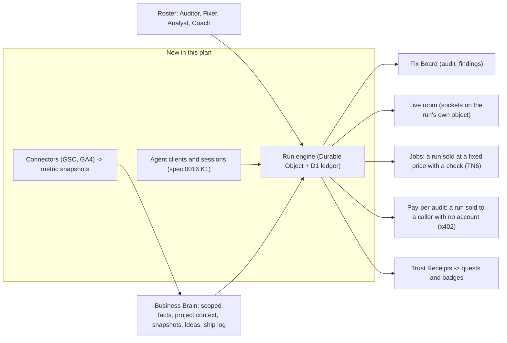

# Founder Swarm and Business Brain: additive plan (Track SW)

**Status:** v0.4 - the one plan for this brief. A second plan written the same day from the same brief (Track BB) was folded in by owner decision on 2026-10-10 (v0.2). v0.3 applied review round 2. v0.4 applies round 3, the closing check by the same five reviewers (section 22): each gave a conditional go, and every condition is applied here. No code in this plan is written. Nothing in it is approved until the owner answers section 20.  
**Date:** 2026-10-10  
**Owner:** Luminara Digital (owner gate before every production step)  
**Sources:** owner brief of 2026-10-10 (AI at the foundation, agents that do the work, a business brain, agent swarms, a services marketplace run by AI, a fun founder community, desktop where it fits); three research notes supplied with it (fit against five YC requests, an open-source pattern list, an x402 batch); seven read-only audits run on 2026-10-10 (backend and D1, AI stack, payments and chain, front end and desktop, deploy, existing plans, external standards); from Track BB: the same owner brief with three lists of reference projects (community mechanics, business workspace, agent patterns), eight more read-only audits, and one review round by five independent reviewers (section 22)  
**Baseline:** written against `88547dc`, then re-baselined on 2026-10-10 to `42880f5`, which is `main` and `origin/main` and is deployed to production (deploy run of 2026-10-09T23:27Z succeeded). `origin/staging` is still `88547dc`: production is ahead of staging. `42880f5` committed the files this plan first described as another session's uncommitted work (section 1.1).  
**Companions (binding):** [`zoro-concepts-implementation-plan.md`](./zoro-concepts-implementation-plan.md) (its section 2 rules bind this plan), [`verifiable-flow-memory-10x-ship.md`](./verifiable-flow-memory-10x-ship.md) (V: run ledger, scoped memory), [`oracle-operations-layer-additive-plan.md`](./oracle-operations-layer-additive-plan.md) (Ops: Sign-off Desk, Beacon, Sealed Lane, flag helper), [`trust-network-additive-plan.md`](./trust-network-additive-plan.md) (TN: receipts, Agent Jobs), [`allora-concepts-implementation-plan.md`](./allora-concepts-implementation-plan.md) (retest loop), [`lora-jetton-production-ship.md`](./lora-jetton-production-ship.md) (rules J1 to J7), `specs/0009`, `specs/0015`, `specs/0016`, `specs/0017`, APS invariants in `AGENTS.md`.

---

## Files in this plan

Track SW is four files. Section numbers are the same in all of them, so "section 11" means one place whichever file you are reading.

| File | Holds | For |
|---|---|---|
| [`founder-swarm-owner-brief.md`](./founder-swarm-owner-brief.md) | The Owner brief, and section 20: every decision, grouped by when it is needed | The owner. Start here |
| `founder-swarm-business-brain-additive-plan.md` (this file) | Sections 0 to 6, 8, 14, 16, 18, 19 and 21 to 23: the argument, the baseline, the rules, what other plans owe, the design, and the phases in the launch cut (SW0a, SW0, SW1, SW3, SW9) | Whoever builds the launch |
| [`founder-swarm-later-phases.md`](./founder-swarm-later-phases.md) | Sections 7 and 9 to 13, and 15: SW2, SW4 to SW8 and SW10. Each starts with a re-baseline. One part of it is in the launch cut: the Auditor-only slice of section 13. One part can start early: SW4's connector tasks, beside SW1a | Whoever builds those phases |
| [`founder-swarm-appendix.md`](./founder-swarm-appendix.md) | Section 17 (threat model and test plan), section 19.1 (the edits to make in other plans), and section 24 (the Track BB merge and both review rounds, finding by finding) | Reviewers |

---

## Owner brief

**The Owner brief and section 20 (owner decisions)** are in [`founder-swarm-owner-brief.md`](./founder-swarm-owner-brief.md). It says what is true today, what needs the owner first, what the launch cut is and how big it is.

---

## 0. Verdict

### 0.1 The one insight

The brief asks for seven things: agents that do the work, a named roster, a business brain, a founder workbench, multiplayer, a services marketplace, and agentic commerce with a community around it. Each one needs the same missing capability:

> Work that runs on the server, under a named agent, against what Luminara knows about one business, inside a spend limit, ending in a result that a rule can check.

None of the parts exist on the server today:

| The brief assumes | What the code does today | Evidence |
|---|---|---|
| Agents do the audit | The seven-role crew runs in the browser tab. Board findings come from four fixed rules; the crew calls no model | `services/agentCore/crewOrchestrator.ts:200`, `:270-271`; `services/agentCore/agents/playbookAuditorAgent.ts:78`, `:99`, `:114`, `:130`; V plan section 1 "Audit location" |
| Work continues after the founder leaves | One daily cron, and one queue consumer that runs a single tool or returns a `not_measured` shell | `wrangler.jsonc:11-13`; `worker/scheduledJobs.ts:20-22`; `worker/auditQueue.ts:263-294` |
| The server can call a model reliably | The Oracle path is a hand-rolled fetch naming a model the repo's own comment says was shut down on 2026-08-16, with no fallback | `worker/oracleChat.ts:260-279`; `services/llm/nativeModelDefaults.ts:6` |
| Agents have identities and limits | Spend is summed per account only; per-agent caps and sessions are "Planned" | `worker/budgets.ts:325-339`; `specs/0016-agent-passport.md:23` |
| One place holds the business's knowledge | Facts are account-wide text rows read by keyword overlap over the newest 50; Search Console is a CSV upload; no Google Analytics code was found | `migrations/0008_memory_facts.sql:3-9`; `worker/memoryRag.ts:261-277`; `components/audit/GscPanel.tsx:25-42` |
| People can watch and steer together | The one Durable Object stores chat turns over plain fetch; org roles exist as schema with no invite route | `worker/oracleSession.ts:16-38`; `migrations/0003_enterprise_orgs_rbac.sql:13-21` |
| Agents can be paid and can pay | Stars and TON subscriptions settle against fixed plan prices; the pay-per-call routes return 503 then 404 | `worker/telegramBot.ts:290-318`; `worker/index.ts:996-1002` |

So this plan adds three things and builds the rest as views over them:

1. **One runtime.** A Durable Object per run, indexed by a D1 ledger (SW1).
2. **One identity and limit model.** The Agent Passport tables that spec 0016 already calls for, with the Ops plan's Agent Seats folded in as TN decision D2 recommends (SW2).
3. **One data intake.** Read-only connectors that turn outside numbers into typed rows an agent can cite (SW4).



### 0.2 The brief, concept by concept

| Concept in the brief | Decision | Lands in | Note |
|---|---|---|---|
| AI does the work, not helps with it | Adapt, and say so | SW1, SW2 | Server-side runs that end in a deliverable and a check. At launch the Auditor audits and the Fixer drafts, both as code over fetched evidence; the founder ships. The app already has a screen where a founder applies a fix with one click (hazard 20); whether an agent may start that itself after one approval, and where, is decision 18 |
| Built for AI agents, with little for the human to do | Take | SW1, SW2, SW5 | Other agents start and read runs over MCP (SW1), act under a passport with caps (SW2), and pay per audit with no account (SW5). The founder signs in and approves |
| Agent swarms | Adapt | SW1a, SW2 | Two or more agents handing bounded work to each other on the server (section 4.2, handoff). SW1a's handoffs are code starting code; the word is not used in product copy at launch (section 0.3, item 1) |
| Named roster (Auditor, Scout, Coach) | Take, renamed where it collides | SW2 | "Scout" already names a Visibility Level, a crew role and a view (decision 24) |
| elizaOS character files and plugins | Adapt: idea only | SW2 | MIT, but Node 24 or Bun only, with no workerd build. Roster entries are typed data in our own shape |
| OpenAI Agents SDK guardrails | Adapt: idea only | SW2 | Its Workers support is labelled experimental. The three guardrail points are implemented natively |
| Cloudflare Agents SDK to run agents | Not for the run engine; re-check at SW7 | SW1-0 (spike B, done), SW7 | Spike B on `agents` 0.28.0 (published 2026-10-09; 13 releases in 90 days). Its `Agent` class owns the object's one alarm, adds about 428 KiB gzip and ten tables to every object, and stops the node test suites loading without an alias; it removed two `setAlarm` calls. `SwarmRun` uses the platform Durable Object APIs, which `Agent` itself extends. The owner's brief names this SDK, so this "no" and what would reverse it are in section 4.1 |
| Hermes and OpenClaw memory patterns | Adapt | SW4 | Through V3 scoped memory. No second store |
| Business Brain: ideas and data in one place | Take | SW4 | Typed rows in D1. No graph store (V non-goal stands) |
| Google Analytics "and more" | Take Search Console and GA4 first | SW4 | OAuth, read-only scopes, encrypted refresh tokens |
| Kaneo-style Fix list | Take, as a view | SW3 | `audit_findings` already has status, owner and due date. No new table |
| Memos-style "shipped today" | Take | SW3 | New `ship_notes` |
| Busabase-style memory | Covered | SW4 | Same thing as the Business Brain |
| Krayin-style leads pipeline | Take, small | SW3 | New `leads`; capture on shared reports |
| Multiplayer: watch, direct, hand off | Take | SW7 | Sockets on the run object; org invites |
| OpenCove war-room canvas | Adapt: a grid, not a canvas | SW7 | Idea only |
| A Fiverr replacement for our categories | Adapt: first-party Jobs | SW6 | TN6 already decided this shape. Third-party sellers stay legal-gated |
| "Always results" | Take, as a rule | SW6 | Money is kept only when the acceptance check passes |
| x402 pay-per-audit for AI agents | Take, later | SW5 | USDC `exact` scheme through a facilitator. The Worker holds no key. After Jobs, and only on a demand trigger (section 19) |
| ClawRouter | Skip | none | A local model router for the paying side. Nothing in it for a seller |
| A founder's agent pays within a cap | Split | SW2, SW10 | Inside Luminara: yes, caps on hosted spend. Paying third parties from the founder's own funds needs a key that can move money, so it is gated |
| Bounties in Stars or TON between founders | Defer, design recorded | SW10 | Stars cannot be paid out to another user; a peer marketplace needs the legal review TN decision D5 already requires |
| TON Acton for contracts | Keep for later | SW10 | Already the toolchain in `contracts/ton` (`contracts/ton/Acton.toml:8`). It has no native Windows build: WSL or CI only |
| TonWeb for Worker-side checks | Skip | none | Unmaintained since 2024. The repo already uses `@ton/core` and verifies over HTTP APIs |
| TON soulbound badges | Split | SW9, SW10 | Badges as signed receipts now; an on-chain TEP-85 item later, gated |
| Zealy-style quests and streaks | Take, on existing tables | SW9 | `user_missions` and the streak already exist |
| Guild-style gating | Take one chat, decision-gated | SW9 (14.3) | One builders chat, entered by doing real work. TN8 Circles as a whole stay parked at TN decision D6; decision 19 un-parks this one room |
| BuidlGuidl builder ladder | Adapt | SW9 | One ladder: the existing four levels gain verified inputs |
| XP, leaderboards | Owner decision | SW9 (14.4) | A points total ("Lumens") and a daily check-in shipped on 2026-10-10 with no spec (hazard 9). They are API routes with no screen yet. Decision 9 offers three specified ways forward. `specs/0009` says "Duels and leaderboards stay later phases", so a board is deferred, not refused |
| Devfolio-style project pages and Demo Day | Take TN3; recognition only | SW9 (14.5) | The public profile TN3 already designs, with project fields. Demo Day gives recognition, never a prize pool |
| Community voting, one person one vote | Adapt | SW9 (14.5) | One account one vote, advisory. A wallet cannot be the unit: wallets are free to create |
| Notcoin and Hamster Kombat mechanics, minus the token | Covered | exists; SW9 | The two-sided invite already exists (`specs/0009`). No reward for opening the app, and nothing to cash out, which is what emptied those games after their payouts |
| Wallet sign-in | Adapt: link, not sign-in | SW10 | A wallet links to an existing account by `ton_proof` (decision 21). As a third way to sign in it would let free wallets farm invite credits |
| BookStack-style playbook library | Take, small | SW3-8 | Public pages built from the compiled playbooks, one per playbook, linked from findings. Licence check first |
| LangGraph-style resumable steps | Covered | SW1 | The run engine claims each step before it acts and resumes from the last claim (section 4.1) |
| CrewAI reviewer, Pydantic-style typed outputs | Adapt: ideas only | SW1, SW2 | The output check and the typed deliverable (section 4.3). Both projects are Python |
| OpenMausBot, OpenDots, OpenWorker patterns | Adapt: ideas only | SW2 | An approve or deny card for each risky step; read-only steps run alone; every run ends in a deliverable with a log. None of their code is used (section 24.2) |
| XMTP payment requests | Skip | none | No Telegram or TON relevance found; its decentralised network is not confirmed live |
| Desktop-specific agents | Adapt | SW8 | The server does the work. Desktop adds notifications, tray status and save-to-folder |
| The compliance pivot and "proving you are human" (YC list) | Skip | none | One is a pivot, not a feature; receipts prove domain control, not humanity |

### 0.3 Corrections to the brief

1. **A swarm today would be theatre.** The crew is seven labels over deterministic steps (`services/agentCore/crewOrchestrator.ts:200`). That is not a weakness to hide: deterministic steps are cheap and checkable. The first unattended run ships with no model call at all (SW1a); a model-written summary and quote-backed suggestions follow behind a live gate (SW1b); agents with limits a founder can see, and model-written fields, arrive in SW2. SW1a's handoffs are code starting code; product copy does not say "swarm" at launch.
2. **Stars bounties between founders cannot be built as described.** The Bot API has no method that sends Stars to an arbitrary user and no escrow or split primitive. The only money-out call is a refund of one specific charge to its payer (`worker/telegramBot.ts:956-970`). A gift sent by a bot cannot be converted to Stars.
3. **Telegram constrains the rails.** Its bot developer terms require digital goods and services sold in a Mini App to be sold for Stars (section 6.2), and require Mini Apps with crypto features to use TON only and not promote other chains' assets (section 7). So Jobs are Stars-only inside Telegram, and the x402 rail (USDC on Base) is an API surface that never appears in the Mini App.
4. **x402 has moved on from what the notes describe.** The current version is 2: headers `PAYMENT-REQUIRED`, `PAYMENT-SIGNATURE` and `PAYMENT-RESPONSE`, with CAIP-2 network ids. It is maintained in the x402 Foundation's repository (`github.com/x402-foundation/x402`). The public `x402.org` facilitator is testnet-only. The existing `worker/q402` code is version-1 shaped with custom TON and XDC schemes (`worker/q402/types.ts:8-17`), which is not what an outside agent's client speaks.
5. **A cap is only real where the system can enforce it.** Inside Luminara the cost ledger can enforce one. For payments to third parties out of the founder's own money, something would have to hold a key, and rule J1 forbids that. That part is gated (SW10).
6. **The goal is not a massive database.** It is a small typed one that an agent can cite. Every number an agent reports must point at a row with a source and a fetch time (APS invariant 5).
7. **Scale honesty.** Zoro's log recorded 5 user rows in production and 0 on staging on 2026-10-01 (`docs/plans/zoro-concepts-implementation-plan.md:711`). Marketplace, multiplayer and community features mean nothing without users, so horizon 2 does not start until horizon 1 is in use (section 0.5).
8. **This plan stands on unfinished work in five other plans.** Section 3 lists every dependency with its state on `main` today, and the shortest path through them to the first unattended result.
9. **Telegram's Stars rule applies today, not from SW6.** The paywall offers a TON rail inside the Mini App whenever the server reports TON as available (`components/paywall/paymentOptions.ts:42-55`), and the server issues TON invoices to Telegram sessions (`worker/index.ts:966-977`). The rail reads "Soon" today only because public health stopped reporting `ton` (hazard 2, confirmed live on 2026-10-10), which is an accident, not a rule. SW0a makes it a rule.
10. **Fixes come before features, and they do not wait for this plan.** The audits found defects in payment, honesty and release paths that are on `main` now (section 1.2, hazards 9 to 21). SW0a (section 5.1) ships them on a plain "yes, fix it".
11. **Progress cannot be for sale.** A quest, a level, a vote or a seat in the builders chat that can be bought is a price list, not a community, and it moves the product toward stored value. No paid event counts toward any of them (section 14).
12. **Statements here about custody, stored value, securities, tax and Google's data policy are an engineering reading, not legal advice.** Where one of them decides a design, the decision names counsel.
13. **The audit itself has to grow.** Every phase in v0.1 built around the same four rules. A weekly re-run of four checks usually finds nothing new. SW1-14 adds deterministic checks from the nine compiled playbooks, and a scheduled run tells the founder only when something changed.
14. **This plan does not measure what AI engines answer.** That is the README's headline and it belongs to the weekly decision loop (WDL2 answer capture, WDL6b same-prompt retest) and to Zoro Phase 1. Nothing here claims it. A server run checks the founder's pages, and every result says so.

### 0.4 Earlier decisions this plan asks the owner to reverse or confirm

Nothing here is reversed silently. Each row is an owner decision in section 20, with a safe default.

| # | Earlier decision | Where | What the brief needs | Handling here | Decision |
|---|---|---|---|---|---|
| 1 | "No marketplace, community forum, partner directory" | `docs/plans/virality-activation-loops.md:21`, `:264` | A Jobs catalogue and community quests | Jobs stay first-party, the shape TN section 0.2 approved on 2026-10-07 | 1 |
| 2 | x402 settlement "Rejected for now" | `specs/0016-agent-passport.md:39` | Pay-per-audit | Receive-only, settled by a facilitator, outside the Mini App | 5 |
| 3 | "No new chain" | `docs/plans/trust-network-additive-plan.md:83`; `docs/plans/zoro-concepts-implementation-plan.md:34` | USDC on Base | No contract, no key in the Worker, no anchoring | 5 |
| 4 | "Tap-to-earn or a visible coin balance: rejected" | `specs/0009-referrals-and-retention.md:30` | "A fun place to be" | This plan adds no balance. A points total and a daily check-in shipped to production on 2026-10-10 in `42880f5` as API routes with no spec and no screen (section 1.2, hazard 9), so the spec and production now disagree | 9 |
| 5 | "Team seats / invite UI" is a non-goal | `docs/plans/virality-activation-loops.md:265` | Multiplayer | Minimal invites, scoped to live rooms | 10 |
| 6 | Server-side audit execution is "Not a work order" | V plan `:528`, decision 5 (`:603`) | Unattended audits | SW1 delivers it on a Durable Object instead of the queue | 3 |
| 7 | Preload IPC is "version, openExternal, update events" | `docs/plans/desktop-windows-electron.md:19` | Desktop surfaces | Three narrow additions. No local runner | 12 |
| 8 | Watches parked until Ops Phase 2 exits | Ops plan `:180` | Scheduled runs | Not reversed. SW8 waits for the same controls | none |
| 9 | Bounties "Defer"; third-party marketplace "Legal review first, no build" | TN plan `:267-268` | Bounties | Not reversed. Design recorded in SW10 | 13 |
| 10 | Agent SBT paused; "no custom contract" | Zoro plan `:7`, `:34` | Soulbound badges | Not reversed. Receipts now; chain later, gated | 14 |
| 11 | Auto-publish Execute mode by default is refused: "Default **Prepare**; Execute = Agency/Digital + approval" | `docs/plans/weekly-decision-loop-10x-ship.md:32` | "AI doing the work", not only preparing it | Prepare stays the default. One narrow agent-started path is offered: a pull request, after one bound approval. The click-to-deploy screen a founder already has is a separate thing (hazard 20) | 18 |
| 12 | Gated groups parked until 50 verified profiles | TN plan decision D6 | A place founders join at launch | One builders chat, with a low entry bar | 19 |
| 13 | "The Sentinel cron does not send mission nudges"; "A blast can be added later with an explicit send policy" | `specs/0009-referrals-and-retention.md:18`, `:29` | Telling a founder their run finished | The explicit send policy the spec asks for: opt-in, transactional, capped. No nudge to return | 20 |
| 14 | "Duels and leaderboards stay later phases" | `specs/0009-referrals-and-retention.md:5` | Leaderboards | Not reversed now. A count-based board has a trigger (section 14.4) | 9 |
| 15 | Watches parked until Ops Phase 2 exits | Ops plan `:180` | "Agents work while I am away" at launch | Row 8 stands for every agent but one: the read-only Auditor may run on a schedule earlier | 22 |

### 0.5 Phases and horizons

| Phase | Ships | Migration (by name) | Flag | Horizon |
|---|---|---|---|---|
| SW0a | Money, honesty and release-safety fixes found on `main`. Starts now, on its own approval (section 5.1) | `stars_charges`, `ton_pending_orders`, `payment_support`, `community_feed` | `COMMUNITY_FEED_ENABLED`, `LUMENS_ENABLED` | 1 |
| SW0 | Decisions, platform facts, hazards fixed, prerequisites landed | `token_meter` (one column) | none | 1 |
| SW1a | Run engine; the server-side Auditor with a code-built summary and a larger rule set; Fixer drafts; Coach's proposal; the run-finished notice. No model call | `swarm_runs`, `run_notices` | `SWARM_RUNS_ENABLED`, `RUN_NOTICES_ENABLED` | 1 |
| SW1b | The model-written summary and quote-backed suggestions, behind a live gate | none | `SWARM_MODEL_SUMMARY_ENABLED` | 1 |
| SW2 | Roster; per-agent caps and sessions (spec 0016 K1, K2); approvals for writes that leave the account; handoffs; Fixer and Coach with one typed model call each | `agent_passport_k1` | `SWARM_ROSTER_ENABLED`; Ops's `AGENT_SEATS` and `AGENT_SEAT_CAPS` for outside keys | 1 |
| SW3 | Workbench: Fix Board, Ship Log, playbook pages; Leads later | `ship_log`, `leads_pipeline` | `SHIP_LOG_ENABLED`, `LEADS_ENABLED` | 1 |
| SW4 | Business Brain: connectors, snapshots, Analyst, Brain view | `brain_connectors` | `CONNECTORS_ENABLED`, `BRAIN_ENABLED` | 1 |
| SW6 | Jobs: fixed-price work, money kept only on a passed check (implements TN6) | `agent_jobs` | `AGENT_JOBS_ENABLED` (TN's name) | 2 |
| SW7 | Live rooms, org invites, agency war room | `live_rooms` | `LIVE_ROOMS_ENABLED`, `ORG_INVITES_ENABLED` | 2 |
| SW8 | Watches (scheduled runs) and desktop surfaces | `swarm_watches` | `SWARM_WATCHES_ENABLED` | 2 |
| SW9 | Quests, badge receipts, the builders chat | `builders_chat` (14.3) | `QUESTS_ENABLED`, `BUILDERS_CHAT_ENABLED` | 2 |
| SW5 | Pay-per-audit for outside agents (x402). After SW6, on a demand trigger | `x402_payments` | `X402_AUDIT_ENABLED` | 2 |
| SW10 | Gated designs: bounties, on-chain badges, third-party sellers, outward agent payments, desktop folder bridge | design only | decision-gated | 3 |

**Horizon rule.** Horizon 1 is specified to task level. Each horizon 2 phase starts with a re-baseline task and does not start until horizon 1's promotion criteria hold in production (sections 6 to 9). Horizon 3 is design, not a work order. The launch cut takes a few named slices out of horizon 2 (below); the horizon rule does not apply to those slices.

**Lanes.** SW3 is mostly front end and can start as soon as SW0 exits, in parallel with SW1a. The connector half of SW4 (SW4-1 to SW4-5 and SW4-8) needs neither SW1 nor the run engine and can run beside SW1a once decision 4 is answered; only the Analyst waits for SW1b. The SW1-0 spikes start on day one in a scratch branch, in parallel with SW0a.

**Launch cut.** What must be in production before the product is announced as "agents do the work, and there is a place to join":

| Part | Tasks | Needs |
|---|---|---|
| Fixes and safe releases | SW0a (all) | Decision 25 |
| Unblockers | SW0 (all) | Decisions 3 and 7 |
| The Auditor on the server | SW1-0 to SW1-6, SW1-8 to SW1-11, SW1-14 (rule pack), SW1-17 (first run from a domain) | P2, P5, P7, P8, P16, P17, P19 |
| Being told it finished | SW1-12 | Decision 20 |
| Fixer drafts | SW1-15, SW1-16 | SW1-14 |
| The server re-check | Allora CL0-0, CL0-2 to CL0-5, CL1-0 to CL1-5 and CL2-0 to CL2-5, done by this team under Allora's ids (P15) | Decision 28 |
| Coach's proposal | SW1-18 | The weekly decision loop, which exists |
| Where it is worked | SW3-0 to SW3-4 | P16 |
| The Auditor comes back | The Auditor-only slice of SW8-1 and SW8-2 | Decision 22 |
| A reason to return | SW9-0 to SW9-2 (the quests whose prerequisite is live) | Decision 9 |
| A place to join | SW9-6 to SW9-9 | Decision 19 |

Apart from those named slices of SW8 and SW9, nothing in horizons 2 and 3 is part of it. SW1b, SW2, SW4 and SW6 follow the launch in that order.

**The first chain, as one acceptance test.** On staging, signed in as a new account in the Mini App: type a domain and tap once; close the app; receive one notice; open the Fix Board and find findings from the server run, each with evidence; open a finding that has a template and find a draft that passed its check; deploy it to the test site and mark it shipped; tap "Retest now" and read "issue no longer found in page source" with the server's date; see the card name the next open finding under "Next:". Every step has a task above. The launch is not announced until this passes for a real site the owner controls.

**Time to first result.** A new founder's first run starts from the first screen with a domain and one tap (SW1-17), and the run-finished notice carries them back. SW1-11 records the time from tap to findings on the board with n; a target is set from that measurement, not before it.
### 0.6 Non-goals (locked)

- **No custody.** The Worker holds no key that can move funds and never releases funds between users (TN section 0.4). The one existing money-out path stays as it is: the bot token can refund a Stars charge to the account that paid it.
- **No token mechanics.** LORA has no role in this plan. J5 stands: checkout stays off. No yield, no staking, no point with a cash value.
- **No "verified" label without a Worker verifier.** No invented number, score, rank or uplift. A missing number reads `not_measured`.
- **No second budget system, approval table, facts table or findings table** (budget and approvals: Ops section 13; facts and findings: this plan's own rule). One has since appeared from elsewhere: an unpushed commit on local `main` adds `business_memories` and `dream_proposals` (migration 0022, spec 0020). SW4-0 settles it before SW4-11 is written: fact proposals use that queue if its shape covers them, or that feature is folded into `memory_facts`. Two proposal queues are not shipped.
- **No "hire an agent" or org-chart metaphor in copy** (Ops section 5).
- **No Telegram message the user did not opt into.** No blasts from a cron (`specs/0009-referrals-and-retention.md:18`, `:29`).
- **No router rewrite of `worker/index.ts` and no state-library migration of `App.tsx`.**
- **No local agent runner on the desktop** (Ops section 13).
- **No x402, USDC or Base surface inside the Telegram Mini App.**
- **No agent publishes to a founder's site by itself.** Agents prepare; the founder ships. The schema already forbids a `published` asset (`migrations/0014_weekly_decision_loop.sql:65-66`). A founder can already apply a fix with one click from the deploy screen (hazard 20); that is the founder acting, and SW0a-17 makes its result honest. The only agent-started write this plan offers is decision 18, whose default is no: a pull request opened after one bound, single-use approval, which the founder still has to merge.
- **No purchasable credits.** Hosted credits are earned or included in a plan, never sold (Zoro P2-4 and P2-5 are not taken).
- **Nothing that looks like progress can be bought, spent, transferred or converted.** No quest, level, badge, vote, board position or chat entry is earned by a payment. No points total converts to LORA, credits, Stars or anything else, now or later.
- **Luminara never holds or releases money between two users,** on Stars, TON or any Jetton.
- **No selling inside Telegram for anything but Stars** (Telegram's rule for digital goods and services).
- **No code copied from a project whose licence does not allow it** (section 24.2). Patterns are written independently.

### 0.7 What "ready" means here

SW0a, SW0 and SW1a are specified to task level against code read on 2026-10-10; review round 2 read them (section 22). SW1b to SW4 are specified to task level and each starts with a re-baseline. Every later phase begins with a re-baseline task that re-checks its citations before code is written. Every SQL block in this plan was executed on SQLite with migrations 0001 to 0020 applied, and again with V's `run_ledger` and `scoped_memory` applied first. No latency, cost or conversion number is claimed anywhere in this plan: each is measured by a named task before it gates anything.

v0.2 added three SQL blocks (sections 5.1, 6.5, 14.3) and changed three (8.2 `ship_notes`, 9.2 `brain_connectors`, 11.2 `agent_jobs`). v0.3 and v0.4 together added five (5 `token_meter`; 5.1 `stars_charges`, `ton_pending_orders` and `payment_support`; 14.4 `point_events`) and changed seven (6.2, 6.5, 7.2, 9.2, 10.2, 11.2, 14.3). Section 22 records each re-run. Review round 2 re-read every citation against `42880f5`; the ones it corrected are corrected here.

### 0.8 Why this can win, and how each phase is judged

The brief says software sold by the seat is ending and Luminara must survive the largest software companies. Much of what this plan builds is a commodity that a large platform can give away: a Search Console table, a task board, a JSON-LD or `llms.txt` generator, a research brief. Effort there is kept small on purpose. The parts that are hard to copy are these.

| What is hard to copy | Why | Where |
|---|---|---|
| A fix that was checked | The loop from finding, to prepared fix, to a server re-check of the live page is the product's proof. A generator stops at the draft | Allora retest (P15); Fixer drafts (SW1-15); receipts |
| Output bound to evidence | Every number an agent reports points at a fetched page or a measured row, or it reads `not_measured`. Trust is the scarce thing when every tool can write fluent text | Section 4.3; rule 2.9 |
| Paying for an outcome, not a seat | A job states its check before payment and refunds itself in full when the check fails | SW6 |
| The founder's own record | Findings, decisions, what shipped, measured numbers and facts, per project, accumulated week after week. It is the switching cost, and it is theirs to export | SW3, SW4 |
| A surface other agents can use and pay | MCP tools, a passport with limits, pay-per-audit with no account | SW1, SW2, SW5 |
| A record of what AI engines actually answer, per vertical, week after week | The README names this dataset as the moat. It is the one thing here that compounds across customers | Not in this plan (section 0.3, item 14). It belongs to WDL2 and Zoro Phase 1, and nothing here should be read as building it |
| Distribution where founders already are | The bot and Mini App, Stars checkout, a chat entered by doing the work | SW1-12, SW6, section 14.3 |

One product metric per phase, read from `product_analytics_events` and the ledgers, never shown to users as a score:

| Phase | The question | Metric |
|---|---|---|
| SW1 | Does a new founder get a result without watching? | Share of new signed-in accounts with one completed server run in their first session; share of invited accounts that complete a first run |
| SW3 | Do they come back to act on it? | Share of those accounts that change a finding's status or add a note in the following 7 days |
| Launch chain | Does the loop close? | Fixes that passed a retest, per active founder per month; taps from finding to "no longer found" |
| SW4 | Is the brain used? | Accounts with a connected source that opened a digest in the last 7 days |
| SW6 | Is a job worth buying twice? | Refund rate; repeat purchase rate |
| Section 14.3 | Does the room have people in it? | Members, read from Telegram's own count. The bot does not read group messages (SW9-6), so posting is not measured |

Each is recorded with its n. With 5 accounts none of them is evidence yet; they are the instruments, installed before the users arrive.

---

## 1. Baseline (2026-10-10)

### 1.1 Verified

Rows marked **D** were read directly while writing this plan. The rest come from the specialist audits. Review rounds 1 and 2 re-read the citations against the tree (section 22); a citation is evidence of what a file said on 2026-10-10, not a promise that it still does.

| Area | Finding | Evidence |
|---|---|---|
| Branches **D** | `main` and `origin/main` are at `42880f5`, which is deployed to production. `origin/staging` is at `88547dc`, one commit behind `origin/main`. The checkout moved during review round 3 and kept moving. `e25e525` and later commits were pushed to `origin/staging` on 2026-10-10 at 15:42 local time; by 15:50 `origin/staging` was at `f18018e`, fourteen commits ahead of `origin/main`, and its staging deploy had succeeded. The first of the five, `e25e525`, was made by another session with a broad `git add`: a card rail through Stripe (`worker/stripePayment.ts`, migration 0021), a memory-consolidation feature (migration 0022, spec 0020), spec 0019, a streak card whose copy shows a points total (`components/retention/DailyStreakCard.tsx:121`), the public health change of hazard 21, and this plan's own files as they stood mid-review. Later ones are small honesty fixes that touch hazards 3, 8 and 17 (`worker/oracleGateway.ts`, `services/decision/fastDecisionService.ts`, `services/geminiService.ts`), and one (`af1362b`) makes the streak card call the check-in route when it opens. **Production runs this code too, although `origin/main` is still `42880f5`:** on 2026-10-10 at about 15:55 local time `GET https://luminarasuite.com/api/health` returned `{"ok":true,"ton":true,"jettonCheckout":true,"stripeCheckout":false}`, and `GET /api/stripe/create-checkout-session` returned 405 where an unknown route returns 404. The workflow run for that push shows its production job as skipped, so production was deployed outside the workflow. `main` no longer says what production runs. SW0-1 and each phase's re-baseline read what those commits did before any task here repeats or undoes it. Local `staging` is 91 commits behind `origin/staging`. Ten linked worktrees exist under `.claude/worktrees/`. `feat/v0-verifiable-flow` holds 23 commits that are not on `main` (V0-1 to V0-9, with their own review record); `claude/nervous-murdock-568385` holds 3 | `git log`, `git rev-list --left-right --count`, `git worktree list`, 2026-10-10 |
| Commit `42880f5` **D** | Pushed straight to `main` on 2026-10-10 with one parent and no pull request. Its production deploy succeeded; staging never ran it. It committed what v0.1 of this plan described as another session's uncommitted work: Lumens ranks and a daily check-in (`services/referrals/rules.ts`, `worker/referrals.ts`, route in `worker/index.ts`), a community feed (`worker/ideaScout.ts`), a Workers AI chat fallback with an `ai` binding in all three blocks (`worker/providerRelay.ts`, `worker/workersAiFallback.ts`, `worker/env.ts`, `wrangler.jsonc`), two test files, and three plan documents including this one. It changed no file under `components/` and no client code calls the new routes, so they are reachable by API only. The working tree holds two uncommitted edits, both plan files (this one and the Track BB pointer) | `git show --stat 42880f5`; `gh run list`; `git status --short` |
| Branch protection **D** | `main` requires the "Build, Test & Smoke Validation" check and a pull request with zero approving reviews, but `enforce_admins` is false, so an administrator can push directly. The last three commits on `main` (`4bac71d`, `88547dc`, `42880f5`) each have one parent and no pull request. `staging` is not protected at all | `gh api repos/LuminaraDigital/Luminara-Search-Oracle-Agent/branches/main/protection` and `.../staging/protection`, 2026-10-10 |
| Identity **D** | The tenant key is `users.account_id`; `billingId()` returns `accountId || id`. Linking rewrites only `users.account_id`, so rows keyed by the losing account are orphaned in every other table | `worker/workerUtils.ts:98-100`; `worker/userStore.ts:330-338` |
| Orgs **D** | Each account gets a personal org `org_<accountId>` with the user as `owner`. Roles `owner, admin, analyst, auditor, viewer` exist in schema. No invite or join route exists. `getOrCreateUserOrg` returns the account's earliest active membership, not its personal org by id, which is only right while every account has exactly one membership (SW7-2) | `worker/enterpriseStore.ts:53-61`, `:76-91`; `migrations/0003_enterprise_orgs_rbac.sql:13-21` |
| Plans **D** | Tiers are free, starter, growth, agency. `scheduledReaudit` is none, monthly, weekly, daily; `teamSeats` is 1, 1, 3, 10 and is client display only. The Worker mirror has no `teamSeats` | `services/plans/planEntitlements.ts:16`, `:23`, `:35-85`; `worker/telegramBot.ts:128-149` |
| Route guards **D** | `PROTECTED_API_ROUTES` requires identity; a second pattern list sends `/oracle`, `/audit`, `/tools` to the Agency check | `worker/authMiddleware.ts:151-192`; `worker/apiAccess.ts:16-20` |
| Background work **D** | One cron (`0 8 * * *`) mapped to `sentinel`, `privacy_purge`, `domain_recheck`; an unmapped cron runs every job. One queue whose handler treats every batch as an audit job. One Durable Object class that stores chat turns | `wrangler.jsonc:11-13`, `:138-158`; `worker/scheduledJobs.ts:10-36`; `worker/index.ts:2059-2071`; `worker/oracleSession.ts:1-40` |
| Queue audit **D** | The consumer runs one hosted `get_domain_overview` when a project id is present, else returns a `not_measured` shell. Its own note calls the crew port "incremental". Errors are caught into status `failed`, so queue retries rarely fire | `worker/auditQueue.ts:263-306` |
| Server model call **D** | Oracle chat posts to Groq with `llama-3.3-70b-versatile`, no timeout and no fallback; a non-2xx ends the stream with an error. The repo's defaults file says that model was shut down on 2026-08-16 | `worker/oracleChat.ts:260-279`; `services/llm/nativeModelDefaults.ts:6-8` |
| Client crew **D** | `CREW_PROFILES` defines seven roles; the graph is built with `maxIterations: 12`. The four board findings are fixed rule ids | `services/agentCore/crewOrchestrator.ts:200`, `:270-271`; `services/agentCore/agents/playbookAuditorAgent.ts:78`, `:99`, `:114`, `:130` |
| Tool gates **D** | In `callTool` the budget halt runs first, then approval lookup and governance, then scope, plan and project-context gates. A cost event is recorded only after a successful paid tool, at a flat 1 cent | `worker/mcpServer.ts:427-443`, `:472-476`, `:513-552`; `worker/budgets.ts:36-37` |
| Cost ledger **D** | `cost_events` carries `run_id`, `credential_kind`, `credential_id`. The window total is a `SUM` per account. Model tokens are not metered on the server | `migrations/0012_budget_policies.sql:34-45`; `migrations/0019_agent_passport_k0.sql:6-10`; `worker/budgets.ts:292-339` |
| Budget scope **D** | `budget_policies.scope_type` allows only `account` and `project`. Production enforcement is `hard`, staging `soft` | `migrations/0012_budget_policies.sql:11`; `wrangler.jsonc:133`, `:247`, `:334` |
| Approvals **D** | `mcp_action_requests` holds `tool_name`, `args_json`, `status`, `expires_at`, `kind`. It has no `args_hash`, requester or consumed marker | `migrations/0011_mcp_action_requests.sql:4-15`; `migrations/0013_mcp_action_requests_kind.sql:8` |
| Untrusted content **D** | `wrapUntrustedContent` fences text and neutralises forged markers. The client tool loop folds tool results into the next prompt unfenced | `utils/untrustedContent.ts:12-27`; `services/tools/runToolLoop.ts:73-75` |
| Memory **D** | `memory_facts` has no project column. Without a vector provider, retrieval is keyword overlap over the newest 50 rows. Vectorize is not bound | `migrations/0008_memory_facts.sql:3-9`; `worker/memoryRag.ts:100-105`, `:261-277`; `wrangler.jsonc:135` |
| Project context **D** | Per project: typed sections, competitors, key pages, a research log, and reports | `migrations/0006_agent_mcp_product_surface.sql:4-87` |
| Findings **D** | `audit_findings` has `status`, `owner`, `due_at` and a unique key `(account_id, domain, stable_key)`. Statuses are `open, in_progress, done, wont_fix`. The bulk save still takes the row id from the client | `migrations/0005_visibility_agent_platform.sql:36-54`; `services/agentCore/types.ts:112`; `worker/findingsService.ts:166` |
| Prepared assets **D** | `prepared_assets` links to a finding or a weekly decision; status is `draft, ready, exported`, and a CHECK forbids `published` | `migrations/0014_weekly_decision_loop.sql:54-67` |
| Missions and levels **D** | Three weekly missions; levels explorer, scout, builder, operator; `user_missions` is unique on `(account_id, mission_key, week_key)`; credits are `referral_rewards` rows of kind `hosted_scout_credit`, unique on `(account_id, reason)` | `services/referrals/rules.ts:20-41` at `HEAD`; `migrations/0012_referrals_missions.sql:32-41`, `:72-81`; `worker/referrals.ts:76`, `:480` |
| Connectors **D** | `gsc_oauth_tokens` exists with one row per account and no reader. `GOOGLE_OAUTH_CLIENT_ID` and `_SECRET` are typed and unread. Search Console data arrives as a CSV upload in the browser | `migrations/0005_visibility_agent_platform.sql:72-77`; `worker/env.ts:178-179`; `components/audit/GscPanel.tsx:25-42` |
| Stars checkout **D** | Pre-checkout takes the plan id from the payload and requires `total_amount === plan.stars`. The invoice payload is `<planId>:<userId>`. Credit uses the user id from the payload, falling back to the sender | `worker/telegramBot.ts:290-318`, `:323-333`, `:929-954` |
| Stars refund **D** | `refundStarPayment(user_id, telegram_payment_charge_id)` reverses one charge | `worker/telegramBot.ts:956-970` |
| Money rule **D** | "Claim before granting entitlement"; helpers fail closed; never KV-only | `worker/paymentLedger.ts:1-5` |
| Pay-per-call today **D** | `/q402/supported` answers; `/q402/verify`, `/settle`, `/audit` return 503 while the constant is false, then fall through to 404. The route tests the constant, not `isQ402SettlementLive(env)`. Types are x402 version 1 with schemes `ton/*` and `xdc/*` | `worker/index.ts:991-1003`; `worker/q402/facilitator.ts:52-57`; `worker/q402/types.ts:8-57` |
| Chains **D** | The chain registry knows `ton` and `xdc`. `viem` and `@ton/core` are dependencies. Jetton masters: USDT set, LORA empty on both networks | `services/chain/chainRegistry.ts:10`; `package.json`; `worker/tonPayment.ts:53-65` |
| Trust receipts **D** | Receipts are Ed25519-signed rows minted by `issueTrustReceipt`; claims include `audit_run`, `fix_retested`, `agent_job_delivered`. Both trust flags are `"false"` in all three blocks. The flag helper treats unset as on when `ENVIRONMENT` is unset | `worker/trustReceipts.ts:37-42`, `:84-104`; `services/trust/receiptTypes.ts:8-19`; `wrangler.jsonc:120-121`, `:235-236`, `:324-325` |
| Deploy **D** | Pushes to `staging` and `main` each run secrets check, env validation, typecheck, `npm test`, build, D1 migrate, deploy, smoke. The two jobs are independent. No backup step. Lint, coverage and evals run only in CI | `.github/workflows/deploy-cloudflare.yml:26-30`, `:44-83`, `:88-92`; `.github/workflows/ci.yml:45-52` |
| Smoke lists **D** | `REQUIRED_D1_MIGRATIONS` stops at 0017; `REQUIRED_D1_TABLES` has no Launchpad or Trust table | `scripts/smoke-check.mjs:23-58` |
| Privacy **D** | Export and delete lists are separate hand-kept lists. Delete does not remove projects, reports, audit runs, findings, API keys or cost events | `worker/privacyService.ts:116-134`, `:166-212` |
| Tests **D** | Vitest; D1 tests run on `node:sqlite` with every file in `migrations/` applied in sorted order; coverage floors 35/35/25/35 | `tests/helpers/sqliteD1.ts:26-32`; `vitest.config.ts:49-54` |
| Front end **D** | No router: one view enum. Telegram bottom nav and the public-view set are separate lists a new view must join | `components/telegram/TelegramBottomNav.tsx:13-25`; `services/auth/useAppAuth.ts:41-59` |
| Roster-like UI **D** | `AgentMissionControl` renders one card per crew profile from in-memory events. `BrandMemoryView` has six tabs | `components/audit/AgentMissionControl.tsx:156-160`; `components/suite/BrandMemoryView.tsx:166-173` |
| Deploy screen **D** | A modal titled "1-Click CMS & GitHub Autonomous Deployment" exists today. Its WordPress path posts a setting named `luminara_aeo_schema` to the site's settings endpoint and reports the deploy as done on HTTP 200. Nothing is read back, and WordPress ignores a setting no plugin registered (hazard 20) | `components/audit/CmsDeploymentModal.tsx:230`; `services/deployment/cmsDeploymentService.ts:161-235` |
| Bot commands **D** | `/idea` already exists: it opens Idea Scout in the Mini App. `/paysupport` sends one canned message asking the buyer to reply; the reply goes to the model chat, not to a person. The update handler returns at `if (!msg) return`, before any `callback_query` or `chat_join_request` could be handled; the two payment branches end just before `const text` | `worker/telegramBot.ts:320-321`, `:420`, `:551-567`, `:631-641` |
| Sentinel messages **D** | The daily job sends "It is time for your check" to any target with a cadence and a chat id. It enqueues an audit only when it saw drift, so the scheduled message asks the founder to open the app and run the audit by hand | `worker/sentinel.ts:233-249`, `:253-262` |
| Other sessions **D** | The checkout is shared. On 2026-10-10, besides this plan's two files, `git status` showed another session's uncommitted work on `main`: edits to `AGENTS.md`, `worker/oracleChat.ts`, `services/browserAction/`, `crawler/server.mjs` and `services/skills/playbooks.generated.json`; new `services/evidenceBound/` (a claim ledger and a citation check), `specs/0019-evidence-bound-decisions.md` and two plan files. Later the same day a card rail through Stripe appeared, also uncommitted: `worker/stripePayment.ts`, `migrations/0021_stripe_payments.sql`, two `/stripe/*` routes and a "Card (Stripe)" tab in the paywall. It is a fourth way to pay, so SW0a-4 and SW0a-6 name it. Citations in this plan are against `HEAD`. The claim ledger overlaps section 4.3's output check: SW0a-8 and SW1-7 use it if it has landed and covers the rules there, and do not build a second one | `git status --short`, 2026-10-10 |
| Webhook throttle **D** | Telegram updates are throttled by kind; `chat_join_request`, `chat_member` and `my_chat_member` are allowed 5 a minute per chat | `worker/webhookThrottle.ts:51-53` |
| Desktop **D** | The preload exposes seven calls and one event. IPC handlers ignore the sender | `electron/preload.cjs:8-21`; `electron/main.cjs:301-330` |
| CSP **D** | `connect-src` already allows `https:` and `wss:`; `frame-src` names `accounts.google.com`; `form-action` is `'self'` | `worker/security.ts:21-30` |
| TON contracts | `contracts/ton` targets Acton 1.2.0 with one Tolk contract and no tests; the LORA jetton is tested and not deployed; three Solidity contracts are tested and not deployed | `contracts/ton/Acton.toml:8`; `contracts/jetton/deployments.json:2-3`; `contracts/README.md` |

External facts, each checked against a primary source on 2026-10-10:

| Fact | Source |
|---|---|
| x402 is at version 2. HTTP transport: `PAYMENT-REQUIRED`, `PAYMENT-SIGNATURE`, `PAYMENT-RESPONSE`; networks are CAIP-2 ids. Packages `@x402/core`, `@x402/evm`, `@x402/mcp` are at 2.28.0, Apache-2.0 | `github.com/x402-foundation/x402` specs; npm registry |
| A facilitator exposes `/verify`, `/settle`, `/supported`. With one, a seller needs only a `payTo` address. The CDP facilitator needs an API key, gives 1,000 free settlements a month, and screens payers. `x402.org/facilitator` is testnet only | `docs.x402.org`; `docs.cdp.coinbase.com/x402` |
| x402 over MCP: a paid tool returns `isError: true` with the requirements in `structuredContent`; the client retries with `params._meta["x402/payment"]` | x402 `specs/transports-v2/mcp.md` |
| No Bot API method sends Stars to an arbitrary user. `refundStarPayment` reverses one charge. Owner withdrawal has a 1,000 Star minimum and a hold of up to 21 days | `core.telegram.org/bots/api`; `telegram.org/tos/bot-developers` |
| Digital goods and services in a Mini App must be sold for Stars. Mini Apps with crypto features must use TON only and TON Connect | `telegram.org/tos/bot-developers` sections 6.2, 7; `core.telegram.org/bots/blockchain-guidelines` |
| `agents` (Cloudflare Agents SDK) is 0.28.0, MIT. `McpAgent` is deprecated. SQLite-backed Durable Objects exist on the Free plan. Paid plan limits: 30 s CPU per request by default, 10,000 subrequests; Free: 10 ms CPU, 50 subrequests | `developers.cloudflare.com/agents`, `/workers/platform/limits` |
| TEP-85 (soulbound token) is Active; its reference item is FunC. Acton is the official Tolk-first toolchain; Blueprint is deprecated in its favour | `github.com/ton-blockchain/TEPs`; `github.com/ton-blockchain/acton` |
| Google scopes `analytics.readonly` and `webmasters.readonly` are not on the restricted list. An app left in Testing is capped at 100 users and its refresh tokens expire after 7 days | `developers.google.com/identity/protocols/oauth2`; `support.google.com/cloud/answer/15549945` |
| Licences: Kaneo, Memos, Busabase, Krayin, OpenCove, Hermes Agent, OpenClaw, elizaOS are MIT. Zealy is proprietary. Guild.xyz publishes source with no licence file | each project's repository |

### 1.2 Hazards found during the audits

These are defects in the tree today. Hazards 1 to 8 were found by this plan's own audits; hazards 1 to 3 have separate tasks raised (two chips). Hazards 9 to 19 were added in v0.2 from the Track BB audits and reviews, hazard 20 in v0.3 from review round 2, and hazard 21 from round 3; each was re-read in code on 2026-10-10. SW0a (section 5.1) fixes hazards 3 and 9 to 21; SW0-3 fixes hazard 8. They are listed because each one would undermine a phase below, and several lose money or mislead a user today.

| # | Hazard | Evidence | Blocks | Handling |
|---|---|---|---|---|
| 1 | Production requires App Check for email sign-up and sign-in since `88547dc`, but the production build is given no App Check site key, so those calls would return 401. Top-level and production `vars` disagree | `wrangler.jsonc:108`, `:314`; `worker/appCheck.ts:124-177`; `worker/authCredentialGateway.ts:223`, `:307`; `.github/workflows/deploy-cloudflare.yml:57`, `:119` | Any web sign-in soak | Separate task raised. Not confirmed against the live site: an owner check (Owner brief, item 4) |
| 2 | Public `/api/health` returns only `{ ok: true }` since `88547dc`, while the client still reads `plans`, `ton`, `jettonCheckout`, `trust` and other fields from it | `worker/index.ts:294-300`; `services/apiClient.ts:117-147`; `components/telegram/TelegramAccountPanel.tsx:23`; `components/paywall/paymentOptions.ts:27-55` | Every client feature flag in this plan | Confirmed live: on 2026-10-10 `GET https://luminarasuite.com/api/health` returned HTTP 200 with the body `{"ok":true}`. Separate task raised; it lands after SW0a-1 and SW0a-6, because restoring the fields before them brings the TON rail and the USDT selector back. SW0-4 ends the client's dependence on this route |
| 3 | With `TRUST_RECEIPTS_ENABLED` on, the gateway route would mint a public, `worker_verified`, `domain_control` receipt for any domain a signed-in user names, from constants: status 200, length 2500 and the SHA-256 of the empty string. No fetch happens | `worker/oracleGateway.ts:116-127`, `:146-165`; `worker/index.ts:1840-1851` | Turning on receipts (SW5, SW6, SW9) | SW0a-15. Separate task raised |
| 4 | The queue consumer calls a hosted paid tool with no budget check and no cost event | `worker/auditQueue.ts:269-283` | Nothing here (SW1 does not use the queue) | Recorded for the V plan's queue hardening |
| 5 | The q402 settle path has replay, proofless-claim, pending-transaction and decimal defects | `worker/q402/tonAdapter.ts`, `xdcAdapter.ts`, `facilitator.ts` (blockchain audit) | Nothing here while it stays off | SW5 does not reuse it. Recorded for the q402 plan |
| 6 | Account deletion skips several account-keyed tables, and account linking orphans rows | `worker/privacyService.ts:166-212`; `worker/userStore.ts:330-338` | Rule 2.6 for every new table | V2-1, V2-1b (section 3) |
| 7 | Smoke lists stop at migration 0017 | `scripts/smoke-check.mjs:23-58` | The first SW migration | Ops Phase 0 item 5 (section 3) |
| 8 | Numbers with no measurement behind them on paths agents would reuse: `healthScore = 74`; Sentinel starts each target with `cited = true` and only changes it when a search key is set | `services/decision/fastDecisionService.ts:297`; `worker/sentinel.ts:154-157` | The number rule (2.9) | SW0-3 |
| 9 | Live since `42880f5` as API routes, with no flag, no staging pass and no screen that calls them: a points total ("Lumens") with five ranks and a 25-point daily check-in; a community idea feed; a Workers AI fallback. **Feed:** every card carries the sharer's account id and the feed is returned as stored; the share lookup has no account filter, so any signed-in account can publish another account's private idea card by id; votes record no voter; an empty feed returns two example cards with vote counts of 12 and 8; the whole feed is one KV value. **Points:** check-in rows are written into the credit ledger with a `remaining` value, and each unspent credit adds 100 points, so using a credit lowers the total. **Fallback:** it has three call sites: when the provider is not configured, when the upstream call throws, and on any non-OK upstream reply including a 4xx. It runs after quota is charged, ignores `response_format` and `tools`, is unmetered, and the reply does not say a different model answered. On local `main`, unpushed, a streak card now shows the points total and calls the check-in route when it opens (`components/retention/DailyStreakCard.tsx`), so once those commits are pushed the points are on a screen | `worker/ideaScout.ts:699`, `:720`, `:730-747`, `:753-767`, `:787`, `:843`, `:857-892`; `services/referrals/rules.ts:253-316`; `worker/referrals.ts:632-702`; `worker/providerRelay.ts:363-378`, `:474-482`; `worker/workersAiFallback.ts:273-291` | SW9; every later model call | SW0a-9 to SW0a-11. Decision 9. A task chip is raised for the feed |
| 10 | The Jetton verifier accepts only notification opcode `0x7362d096`. TEP-74 and the repo's own LORA contract use `0x7362d09c`, so no real USDT or LORA transfer can be matched and credited. The unit test builds its fixture from the same constant, and spec 0018 repeats the wrong value | `worker/jettonSettlement.ts:13`, `:26-27`; `contracts/jetton/contracts/messages.tact:36`; `contracts/jetton/tests/harness.ts:20`; `specs/0018-jetton-settlement-and-preflight.md` | Any Jetton rail | SW0a-1. Task chip raised |
| 11 | `JETTON_CHECKOUT_LIVE` is `true` with a mainnet USDT master configured, and a test pins it true. Spec 0018 says the switch flips only after a real testnet USDT transfer is credited on staging, whose merchant address is a placeholder. One switch covers USDT and LORA; only an empty master string keeps LORA off | `worker/tonPayment.ts:53`, `:59`, `:63`, `:231`; `tests/paymentFailClosed.test.ts:68`; `specs/0018-jetton-settlement-and-preflight.md` | LORA rule J5 | SW0a-1 |
| 12 | Copy says "29 LORA (15% Burn)" and "$LORA (Burn)", the public Q402 catalogue advertises a 15% deflationary burn, and the Terms name $LORA as a payment asset. The contract takes no tax, fee or automatic burn on a transfer; LORA rule J6 forbids the claim | `components/paywall/PaywallModal.tsx:256-258`, `:278-280`, `:462`; `worker/q402/middleware.ts:72-87`; `worker/q402/facilitator.ts:46-47`, `:213-217`, `:270`, `:294`, `:317`; `worker/q402/tonAdapter.ts:178-183`; `worker/q402/types.ts:36`; `worker/termsPolicy.ts:49` | Honest copy | SW0a-2 |
| 13 | A paid Stars update can be lost. The webhook answers 200 before it processes the update, so Telegram never redelivers. If the subscription write then fails, the code releases its claim and throws, and the outer handler swallows the error: the buyer has paid and gets no plan, no refund and no message | `worker/index.ts:872-873`; `worker/telegramBot.ts:380-385`, `:924-926` | SW6, and every Stars sale today | SW0a-3. Task chip raised |
| 14 | A one-day purchase overwrites an active subscriber's plan, on Stars, on TON and on licence redemption. The refund on a failed claim goes to the user id in the invoice payload, not to the payer | `worker/telegramBot.ts:329`, `:353`, `:365-381`; `worker/tonPayment.ts:33-34`, `:575-588`; `worker/licenseService.ts:194-205` | SW6 | SW0a-4 (Zoro P2-1 to P2-3, on all three rails) |
| 15 | Native TON matches the order memo with `includes`, not equality. The client polls for 20 seconds, then points to a retry control that does not exist, while the order lives 2 hours: a slow index means paid and not credited | `worker/tonPayment.ts:396`; `services/ton/tonService.ts:144-156` | Any TON rail coming back | SW0a-5 |
| 16 | Telegram requires digital goods and services inside the bot and Mini App to be sold for Stars. The paywall renders a TON rail on every surface, the server issues TON invoices to Telegram sessions, and the bot's `/plan` reply points to "every payment option". The paywall also tells Mini App users to email for card payments and invoices, and the Terms shown there name $LORA as a way to pay. A card tab is being added to the same paywall by another session (uncommitted on 2026-10-10); a card checkout for a digital plan inside the Mini App would break the same rule | `components/paywall/paymentOptions.ts:42-55`; `components/paywall/PaywallModal.tsx:400-426`, `:637-643`; `worker/index.ts:966-977`; `worker/telegramBot.ts:446`; `worker/termsPolicy.ts:49` | The bot staying listed | SW0a-6. Decision 11 |
| 17 | Numbers and labels no measurement produced, on surfaces a founder sees: the downloadable dossier prints score 88, grade B and "Verified" beside a non-cryptographic hash it calls a "Trust Receipt Cryptographic Hash"; the report prompt asks the model for "Expected Impact", "Est. Organic Rank" and "Trust Signal Strength" columns; the executive brief says "cited in about N% of relevant AI search answers" from web results and "can double its citations"; a "share of voice" score is the citation rate times 0.85 plus a constant; a preliminary "citeWorthiness" score out of 100 is written into the report prompt, and the same prompt lets the model add figures as long as it labels them "(estimate)"; the Telegram chat is told to "deliver an Instant Scout diagnostic" for a domain nobody fetched, at temperature 0.7, with no output check | `components/audit/ReportDisplay.tsx:171-184`; `services/reports/portableDossierService.ts:267-273`; `services/geminiService.ts:786`, `:841-849`; `services/agentCore/agents/serpRadarAgent.ts:137-140`; `services/agentCore/agents/executiveTranslatorAgent.ts:41`, `:50`; `worker/telegramBot.ts:207`, `:851` | Rule 2.9 | SW0a-7, SW0a-8 |
| 18 | Releases are not safe to repeat. A manual dispatch of "staging" from `main` also deploys production; the two deploy jobs share no `concurrency` group; D1 migrations apply with no restore point recorded; administrators can bypass `main`'s protection and `staging` has none (section 1.1). The checkout switch in hazard 11 arrived inside a commit titled "feat(ml)" (`7b6bde1`) that was merged through pull request #54, so a pull request alone did not catch it; hazard 9 arrived by direct push. The pre-push hook that blocks a direct push to `main` prints the environment variable that bypasses it. `staging` is one commit behind `main` | `.github/workflows/deploy-cloudflare.yml:28`, `:59-67`, `:90`, `:121-129`; `git show --stat 7b6bde1`; `.githooks/pre-push:9-13` | Every production step in this plan | SW0a-0, SW0a-12, SW0a-13. Decision 27 |
| 19 | Staging cannot be signed in to on the web. The staging build is given no `VITE_FIREBASE_*` values, so the client falls back to the production Firebase project while the staging Worker verifies against `luminara-suite-staging`; the Mini App link is hard-coded to the production bot. Whether a staging bot token exists cannot be read from the repo | `services/auth/firebasePublicConfig.ts:7-9`; `.github/workflows/deploy-cloudflare.yml:56-57`; `wrangler.jsonc` staging `vars`; `services/referrals/rules.ts:10`; `components/paywall/paymentOptions.ts:4` | Every signed-in soak in this plan | SW0a-14 |
| 21 | **Live in production since 2026-10-10.** Public `/api/health` returns `ton`, `jettonCheckout` and `stripeCheckout` again (from `e25e525`). `JETTON_CHECKOUT_LIVE` is still `true`, the Jetton verifier still looks for the wrong opcode (hazards 10 and 11), and the client's TON check ignores whether it is inside Telegram. Until that day production returned only `{ ok: true }`, which was the one thing keeping the rail dark. Now the paywall shows the TON tab and the USDT selector to every user, in the Mini App too, and a customer who pays in USDT is not credited. The merchant address those payments go to has still not been confirmed by the owner (decision 26). `e25e525` and thirteen later commits are on `origin/staging`; they were also pushed straight to `main` (`9da5f59`, then `467a044`), which is how production got them | `worker/index.ts:296-305` and `worker/tonPayment.ts:53` at `e25e525`; `components/paywall/paymentOptions.ts` (`isTonAvailable`); `GET https://luminarasuite.com/api/health` on 2026-10-10 | Customers' money, today; every release until `main` and production agree again | SW0a-0, today. The owner was told in this session on 2026-10-10 |
| 20 | The deploy screen says more than it does. Its WordPress path reports "successfully deployed" when the settings endpoint answers 200, without reading the page back; the setting it posts is one WordPress drops unless a plugin registered it. A founder can be told a fix is live when nothing changed | `services/deployment/cmsDeploymentService.ts:161-235`; `components/audit/CmsDeploymentModal.tsx:230` | "A fix that was checked" (section 0.8); decision 18 | SW0a-17 |

### 1.3 Not verified (each is resolved by a named task)

- The Workers plan tier, which sets CPU, subrequest and D1 limits (SW0-1).
- Which migrations are applied on each remote database, and which secrets are set (SW0-1).
- Whether hosted model keys exist on staging; Zoro's log said none (SW0-1; Zoro decision 9).
- Whether hazard 1 is live in production (an owner check; hazard 2 is confirmed).
- How production came to serve code that is not on `origin/main` (SW0a-0). The release workflow did not do it.
- Whether anyone paid in USDT or TON through the checkout that reappeared on 2026-10-10 (SW0a-18's lookback, brought forward).
- Whether the TON tab in the Mini App paywall can reach a live checkout today. With hazard 2 live the client reads no `ton` field, so the tab should read "Soon"; that was reasoned from code, not seen on a device (SW0-5).
- Whether production still has 5 user rows; the count is from 2026-10-01 (SW0-1).
- Whether `@x402/core` and `@x402/evm` bundle and run under workerd (SW5-0).
- Whether a rollback across a Durable Object class migration is refused by wrangler, as its documentation suggests (SW1-0).
- Whether hibernating WebSockets work with the gradual deployment the Ops plan wants (SW7-0).
- The USDC contract address and decimals on Base and Base Sepolia: taken from the issuer's published list and confirmed by the owner in SW5-0, never typed from memory. Whether a facilitator's `/supported` answer carries the asset address at all is part of SW5-0.
- Real cost per run (SW1-11 measures it; nothing is priced before then).
- Whether a Cloudflare Workflow is a better home for a run than an alarm-driven object (SW1-0, spike A, which builds the same toy both ways).
- Whether Google classes the two read-only scopes as sensitive (SW4-0 reads it in the Cloud Console).
- Whether anyone sent USDT with a `LUM:` memo to the merchant address while the Jetton switch was on (SW0a-1, an operator read of the address history).
- Whether any receipt was ever minted through the gateway route in either remote database (SW0a-15).
- Whether a staging bot token and webhook secret are set (SW0a-14).
- What Telegram does with a refund when the bot's Star balance is too low, when the charge is old, and when the payer's account is deleted (SW6-0 tests each on the staging bot).
- Whether `wrangler rollback` leaves cron triggers from the newer version in place (SW0a-13 reads the documentation and tests it on staging).
- Whether Telegram allows a Mini App to link out to a web checkout for the same digital goods. Until answered, no surface inside Telegram links to a non-Stars checkout (SW0a-6).

---

## 2. Rules for every task

The Zoro plan's section 2 applies (gates, flags, release, rollback, migrations, privacy, double-check, licence keys), with the V plan's section 2.1 deltas. The deploy audit found several of those statements out of date. This section records only the corrections and additions.

| # | Rule | Why |
|---|---|---|
| 2.1 | **Release path.** Branch from `origin/staging`. PR to `staging`; after the staging checks, a PR from `staging` to `main` with a merge commit. `main` is branch-protected and requires the "Build, Test & Smoke Validation" check, so Zoro 2.3 step 7's direct push works only by admin bypass. No production step without an explicit owner yes in chat | Deploy audit; `AGENTS.md:34`; V decision 8; decision 17 |
| 2.2 | **Record a restore point before merging a migration.** The deploy workflow applies D1 migrations on merge with no restore point (`.github/workflows/deploy-cloudflare.yml:59-67`, `:121-129`). Until SW0a-13 makes the workflow do it, the operator records the D1 Time Travel bookmark first. A full export (`npm run db:backup:staging`, or `CONFIRM_PROD_BACKUP=1 npm run db:backup:prod`) is taken only when rule 2.19 asks for one | Zoro 2.3; deploy audit |
| 2.3 | **Flags.** One vocabulary. A flag is the string `"true"` or `"false"`; anything else, and unset, means off in every environment, and `validate-env` rejects a present value that is neither. Each flag is declared `"false"` in all three `wrangler.jsonc` blocks with identical top-level and production values, typed in `worker/env.ts`, documented in `.env.staging.example`, `.env.production.example` and `.dev.vars.example`, read through the one flag helper (P7; a plain `=== 'true'` until it lands), and reported in the admin health block (`worker/index.ts:311-346`) and in the signed-in capabilities answer (SW0-4). The Trust helper's "unset is on in local dev" rule (`worker/trustReceipts.ts:37-42`) is not copied | Two conventions exist today |
| 2.4 | **One production flag change per release.** New flags reach production `"false"`. Ops section 6 asks for 24 hours between changes; this plan keeps the 24 hours where a flag's effect needs a daily cron or a UTC day boundary to be seen, and otherwise waits for the previous change's promotion check to be read (rule 2.18). SW0a's fixes are not flag changes | Ops plan `:130`; section 19 records the edit |
| 2.5 | **Migrations.** Referred to by name; the number is taken at PR time (next free on disk on 2026-10-10: 0023, because local `main` now carries `0021_stripe_payments.sql` and `0022_luminara_dreaming.sql`; the next free spec is 0021; the 0011 to 0013 duplicates stay). Expand-only. `CREATE ... IF NOT EXISTS`. INTEGER millisecond timestamps. Each file and table is added to `scripts/smoke-check.mjs` in the same PR | Zoro 2.5 |
| 2.6 | **Privacy.** Every new account-keyed table is added to `collectExportPayload`, its `processors` list and `softDeleteAccount` (`worker/privacyService.ts:116-134`, `:166-212`), and to the account-link move helper (V2-1b), in the PR that creates it, with a test. A table whose rows can exist with no account (a payment from a payer with no account, a join request from a stranger) says so beside its SQL and states how those rows are exported, deleted and aged out | Zoro 2.6 |
| 2.7 | **Durable Objects.** A new class ships in its own release, with its `migrations` tag and bindings in all three blocks, before any feature calls it, so later rollbacks stay on the far side of the class migration. Every object has a D1 index row that stores its name as created (`object_name`), because objects cannot be listed; account deletion calls the object's purge route before deleting the row | V plan section 6.1 lesson |
| 2.8 | **Money.** Claim in D1 before granting; fail closed; never KV-only (`worker/paymentLedger.ts:1-5`). Every money state change is a conditional `UPDATE ... WHERE status = ?` that must change exactly one row | Existing rule |
| 2.9 | **Numbers.** In model-written text a number appears only as a handle that code renders from an evidence row, a snapshot row or a tool result of the same run (section 4.3). Any digit or number word outside a rendered handle is a violation, whether or not its value appears in evidence. A value that was not measured is written `not_measured`, never estimated silently | APS invariant 5 |
| 2.10 | **Untrusted content.** Crawled pages, connector strings, user notes, lead messages and anything a model wrote in an earlier run are wrapped with `wrapUntrustedContent` before they enter a prompt. A run that has read untrusted content is `sealed`. A sealed run may not call a tool whose effect leaves the account (a write to a founder's site or repository, a message to anyone) or spends money, without a bound, single-use approval (Ops F3). Saving a draft inside the account needs no approval: a draft is inert until the founder ships it, and it is checked by code before it is saved (section 4.3) | Ops plan section 4; review round 2 |
| 2.11 | **Chain.** The agent sends no transaction on any network and holds no key (J1). Automated tests use a mock facilitator and fixtures. Every live payment drill, testnet included, is an owner step | Owner rule of 2026-10-07 |
| 2.12 | **Shared tree.** Other sessions work in this checkout. Re-run `git status --short` before each commit; stage by explicit path; never `git add -A`; never edit another session's plan file | Recorded practice |
| 2.13 | **Copy.** No em dashes. No "hire", "employee" or org-chart wording for agents. "Verified" appears only beside a receipt | `AGENTS.md:17`; Ops section 5 |
| 2.14 | **Double-check.** After every task: its acceptance test, typecheck, targeted tests, and a grep for the regression it could cause. After every phase: full gates on a green Linux CI run, staging smoke, the phase's owner check, and a re-read of this plan's section against the merged code, correcting whichever is wrong | Zoro 2.7; Allora 2.6 |
| 2.15 | **Licence keys.** The 55 existing keys keep redeeming. Before and after each production deploy, a read-only count of `license:key:*` records that are not revoked must be unchanged (SW0a-12 adds the script; it lists and reads, and writes nothing). `scripts/verify-license-vault.mjs` compares production with a local vault manifest and needs that file, so it is the owner's check, not the deploy's. No phase adds a dependency to redemption, and no script in this plan revokes or re-seeds a key | Zoro 2.8, corrected |
| 2.16 | **Staging before production, always.** Nothing reaches `main` that `staging` has not run. `main` is protected with administrators included; `staging` is protected the same way (decision 27). CI on `main` checks that the merge commit's second parent is the tip of `staging` and that the two trees are equal (SW0a-12). AI sessions push with an identity that cannot merge to `main`. Rule 2.1's sentence about admin bypass describes what is possible today, not a path this plan uses | `42880f5` reached production with no staging pass and no flag |
| 2.17 | **Money invariants are tests.** A CI test pins `JETTON_CHECKOUT_LIVE` to `false`, pins each LORA switch to `false`, and fails on burn, tax or yield wording in payment copy. Changing one needs the test changed in the same PR, so the change is visible in review | Hazards 11 and 12 arrived inside an unrelated commit |
| 2.18 | **Soaks are sized by what they exercise.** A scripted soak states the number of requests and the time-based things it must cross (a daily cron, a UTC day boundary, a weekly sync). It runs no longer than that. A 7-day wait that exercises nothing a 3-day one does not is not required | Staging has no users; waiting is not evidence |
| 2.19 | **Backups carry personal data.** Routine recovery relies on D1 Time Travel, recorded as a bookmark before each migration. A full `d1 export` is taken only before a migration that alters an existing table. It is written outside any checkout that other sessions share, encrypted at rest, and deleted after 30 days. Dumps include connector snapshots, search query strings, leads and notes | A dump on a shared machine would break the promise that operators do not read connector data |
| 2.20 | **Crons.** An unmapped cron expression runs no job and reports an error (SW0a-13 changes today's "runs every job"). After that change a new cron and its `CRON_JOBS` entry ship in the same PR | A rollback under a newer trigger must not run every job on the new cadence |
| 2.21 | **Worker classes stay testable.** Nineteen test suites import `worker/index.ts` under node. A new Durable Object or handler class is either a plain class, as `OracleSession` is, or ships with a test alias for any `cloudflare:` import in the same PR | `vitest.config.ts:6-7` |
| 2.22 | **Eval gates must be able to fail.** A gate that replays recorded text through deterministic code proves the code, not the model. Any phase that puts model output in front of a founder also runs a live labelled set with stated thresholds before promotion, and re-runs it on any change of prompt, model, schema or guard (sections 6 and 7) | A recorded transcript cannot show that a model ignored an injected instruction |
| 2.23 | **End-of-track check.** When the last phase in a horizon promotes: re-run every earlier phase's promotion check against production, re-read each section of this plan against the merged code and correct whichever is wrong, and record the result in section 23. A check that no longer passes is reported as failing, not skipped | Owner instruction of 2026-10-10 |
| 2.24 | **Say who wrote it.** Text a founder reads is labelled by its source wherever it is shown: "built from the findings" when code assembled it, the model's name when a model wrote it, and "answered by a fallback model" when the fallback did. A promotion count never mixes the three | A code-built summary and a model summary look the same on a card; a fallback answer today looks like the hosted one |

---

## 3. Prerequisite ledger

This plan does not restate designs owned by other plans. Each row is work that must be on `main` before the phase named in the last column starts. The owning plan's task id is used in commits and in both execution logs. "State" was checked on `main` at `42880f5`. The last paragraph of this section says which rows this team does itself.

| # | Capability | Owner | State on `main` today | Needed by |
|---|---|---|---|---|
| P1 | Hazards 1 and 2 fixed (section 1.2). Hazard 3 is SW0a-15 | Their own tasks | Open. Hazard 2 confirmed live | The web sign-in part of any soak (1); nothing here once SW0-4 lands (2) |
| P2 | Findings rows get server-minted ids | V0-8; Allora CL0-1 is the same fix | Not on `main`. Written twice on unmerged branches: V0-8 on `feat/v0-verifiable-flow` (`e0a3075`, review fix `be52f46`) and a second implementation on `claude/nervous-murdock-568385` (`27128a0`). `worker/findingsService.ts:166` on `main` still takes the client id. SW0-8 picks one | SW1, SW3, the re-check |
| P3 | Workspace sync no longer overwrites newer data | V0-1 | Not on `main`. Present on unmerged `feat/v0-verifiable-flow` | SW4 (reads Business DNA from the blob) |
| P4 | Server model call with timeout, fallback and a live model id | V0-2, Zoro P1-4 (`callHosted`) | Not on `main`. V0-2 (`8efbbec`) is written on the unmerged branch; Zoro P1-4 is not started; `worker/oracleChat.ts:267` on `main` is unchanged | SW1b (SW1a makes no model call) |
| P5 | Run ledger: the spec and re-baseline, `audit_evidence`, `finding_observations`, `audit_runs.origin`, the provenance types, rules that emit a stable `ruleId`, the `/runs` writer, privacy and link move for them | V2-0, V2-1, V2-1b, V2-2, V2-3, V2-5 | Not started: no `worker/runLedger.ts`, no `worker/accountLinkMove.ts` | SW1a |
| P6 | Owner decision on server-side audits; hosted keys for the summary step | V decision 5; decision 3 here | Open | SW1a needs the yes to run on the server; only SW1b needs a hosted key |
| P7 | Flag helper with KV override and account allow-list; migration lint; smoke preflight before deploy; smoke lists caught up. Ops also asked that the production job need the staging job; the two jobs run on different pushes, so SW0a-12's parent-and-tree check does that instead (section 19) | Ops Phase 0 items 5 to 8 | Not started: no `worker/featureFlags.ts` | SW1a (first migration, first canary) |
| P8 | A 15-minute ops cron and error reporting from `scheduled`. Ops item 9 covers the scheduled handler only; SW0a-13 adds the queue handler | Ops Phase 0 item 9 | Not started | SW1a (stuck-run sweep); SW0a-5 if it uses the cron |
| P9 | `ExecutionContext` passed into MCP; approvals bound to an args hash and requester, single-use, with expiry enforced | Ops Phase 1, F1 | Not started: `worker/index.ts:1605` passes no context; no `args_hash` column | SW2 |
| P10 | Beacon attention feed | Ops Phase 1, F2 | Not started | SW2 (optional: the roster view polls run events without it) |
| P11 | Sealed Lane: trust stored at run start; a sealed run cannot write without a bound approval | Ops Phase 2, F3 | Not started | SW2 (hard: Fixer reads crawled pages and writes assets) |
| P12 | Agent Passport K1 and K2, with Agent Seats merged in | spec 0016; Ops F4; TN decision D2 | Planned, no schema. SW2 implements it as designed in section 7; decision 2 confirms the merge | SW2 |
| P13 | Scoped memory: `memory_facts` gains project, domain, kind, hash; conversation index | V3-1, V3-1b | Not started | SW4 |
| P14 | Trust Receipts switched on after soak, with a signing key set | TN1 | Code on `main`, flags `"false"` everywhere | SW6, SW9. Not SW1: a server run's evidence rows say the server fetched them because the run row says so, and nothing says "Verified" until a receipt exists (rule 2.13; section 19 records the edit to V2-11) |
| P15 | Fix retest: a server re-check that a shipped fix is live | Allora CL0 to CL2 (`decision_checks`); TN `fix_retested` | Awaiting Allora's owner gate (decision 28 here) | The launch chain (SW1-16) |
| P16 | Findings board hydrates from the server | V2-9 | Not started | SW1a (a server run's findings must appear on the board), SW3 |
| P17 | A fetch wrapper with one overall deadline, a streamed size cap, same-host redirects only and a refusal of the Worker's own hosts; the DNS-rebinding residual closed or accepted in writing | Allora CL0-3 (`worker/publicFetch.ts`); Zoro P1-3b | Not started. `fetchPublicUrl` re-validates each redirect hop but has no timeout and no size cap (`worker/security.ts:321-374`) | SW1 (its 10 s and 1 MB limits come from this wrapper) |
| P18 | SW0a complete (section 5.1) | This plan | Open | Every phase's production step; SW6 needs SW0a-3 and SW0a-4 before any job is sold |
| P19 | Rate limiter is a true fixed window. Today each request refreshes the key's lifetime, so a client polling every 5 seconds never leaves the window | V0-4 | Not on `main`. Written on `feat/v0-verifiable-flow` | SW1a (the run view polls) |

**Unmerged work that already does some of this.** `feat/v0-verifiable-flow` is 23 commits ahead of `main` and 33 behind. It holds V0-1 (workspace sync), V0-2 (Oracle model candidates, timeout, failed runs), V0-3 (`f834c5e`), V0-4 (rate-limit window), V0-5, V0-6 (fenced client tool results), V0-7 (build id, D1 probe, soak script, scheduled health check), V0-8 (server-issued finding ids) and V0-9, with its own review record in the V plan. P2, P3, P19 and part of P4 are therefore "written and reviewed, not merged", not "not started". SW0-8 lands that branch or retires it before any of those tasks is done again.

**Who does the prerequisites.** Waiting for five other plans to move is how none of this got built. The rows on the shortest path are done by this team, under the owning plan's task ids, in the owning plan's files, and logged in both execution logs. They are counted in the launch cut (section 19):

| Row | Tasks done here under the owner's ids | Count |
|---|---|---|
| P2, P3, P19, part of P4 | SW0-8 lands `feat/v0-verifiable-flow` as one merge | in SW0 |
| P5 | V2-0, V2-1, V2-1b, V2-2, V2-3, V2-5 | 6 |
| P16 | V2-9 | 1 |
| P7, P8 | Ops Phase 0 items 5, 6, 8 and 9. Item 7, the canary upload, stays with the Ops plan until spike C shows it can carry a Durable Object class migration | 4 |
| P17 | Allora CL0-3 | with CL0 |
| P15 | Allora CL0-0 and CL0-2 to CL0-5, CL1-0 to CL1-5, CL2-0 to CL2-5 (CL0-1 is settled by SW0-8; CL2-6 to CL2-8 stay with Allora) | 17 |

Each of those plans has its own owner gate. Decision 28 asks for Allora's; V decision 5 is decision 3 here; Ops Phase 0 needs none. Tasks done under another plan's id follow this plan's rules 2.4 and 2.18 for flag changes and soaks; each wait of the owning plan that this changes is listed in section 19.1, and none is dropped silently. The one that matters for launch is Allora's: it holds its retest phase until a coverage report read fourteen days after its first phase is live in production. Decision 28 asks whether that wait is kept or waived for launch. Two more of its details bind the order here. Its CL0-4 test expects the top-level and production settings to match, and `REQUIRE_APP_CHECK` differs today (hazard 1), so that test waits for hazard 1's task or names that one difference. And Allora's own section 9 has the shared rule definitions (CL0-5) decide the rule ids before V2-3 makes the rules emit them, so CL0-5 comes first. **If a prerequisite off that path stalls** (P9 to P13), this plan does not fork it: the phase that needs it waits, and the stall is reported to the owner with the unblock that would clear it. The one exception is P12, which no plan has designed in detail: SW2 owns that design.

**Shortest path to the first unattended result:** SW0a-0 (staging level with `main`), P18 (SW0a), P2, P5, P7, P8, P16, P17, P19, the yes in decision 3, then SW1a. No model, no hosted key and no receipt is on that path. Three things shorten it further and are part of this plan: P5 is taken without V1 (the run ledger migration and writer do not need the identity memo that V orders before it); the SW1-0 spikes run on day one beside SW0a; and SW3-1 to SW3-3 run beside SW1a once P16 lands.

---

## 4. Architecture

### 4.1 Run engine

One Durable Object class, `SwarmRun`, with one instance per run. The object is the run's step scheduler and, from SW7, its live room. **This is the working design, not a settled one:** spike A (SW1-0) builds the same 20-step toy twice, once as the alarm-driven object below and once as a Cloudflare Workflow, and the engine is chosen on what is measured. Everything from "Who is in charge of what" down holds for either.

**Object or Workflow.** The queue has no per-run state. An object gives one-at-a-time execution per run, alarms, private storage and hibernating sockets, and leaves the retry and restart logic to this team. A Workflow has durable steps, per-step retries, pause, resume, terminate, an approval wait with a timeout, and a per-instance event stream a route can relay to watchers; it holds no sockets itself, and it bills per step. Sockets are a horizon 2 need (SW7), so they do not decide it today. Spike A compares the two on: behaviour on restart and on repeated failure; pause, cancel and wait-for-approval; whether the class runs under node tests; how many lines of engine code this team would own; how cleanly it can be removed; and the documented limits. If the Workflow wins, "one step per alarm" becomes one step per `step.do`, the journal is the Workflow's own, the control and money checks sit at the top of each step callback, and watchers are served by relaying the event stream or by a small socket-only object.

**Spike A, the Workflow half (2026-10-10; local `wrangler dev`, not the edge; the object half is still running).**

- The 20-step toy ran as a Workflow: 8 runs, every step once, one D1 batch per step with `INSERT OR IGNORE` on `(run_id, seq)`, about 20 to 35 ms between steps.
- **Replay is right.** After a kill mid-step and a restart, finished steps were not run again and the interrupted step ran once more. Locally the instance did not resume by itself, only after a manual pause and resume, so a mid-step restart cannot be regression-tested locally. Self-resume in production is documented, not observed.
- **Failure is bounded.** A step that keeps throwing is retried on the configured schedule and then the instance errors; no later step starts, and a catch in `run()` could still write `failed` to D1.
- **Control works, with two traps.** Pause lets the step in flight finish. Terminate cuts it mid-body. Both reach user code as an exception thrown out of `step.do`, told apart only by an undocumented message string; a catch-all first recorded a paused run as failed. When the platform's own step limit ended a run, the catch could not write its final row, so D1 still said `running`.
- **Tests.** The class file loads under node with two small aliases for `cloudflare:` modules; step logic kept out of the class file needs none. The earlier claim that node suites cannot load a Workflow is withdrawn.
- **Size and cost.** 233 lines of engine code owned. A 24-step run is about 25 billable steps; the Paid plan includes 500,000 a month, then $0.80 per 100,000 (Cloudflare's pricing page, read 2026-10-10).
- **Either way** the D1 ledger and the sweeper are needed: terminate, the step limit and a stranded instance each left D1 needing a writer other than the engine.

Not established: how fast production resumes an instance; what running instances do on a deploy or a `wrangler rollback`. The side-by-side with the object half decides, and SW0-7 records it.

**Why the engine is not built on the Agents SDK (spike B, 2026-10-10, local `wrangler dev`, not the edge).** The engine needs three platform features: storage, alarms, and hibernating WebSockets. `agents` 0.28.0 wraps the same three, and its `Agent` class extends the platform `DurableObject`, so a `SwarmRun` object is the same Cloudflare primitive either way. The spike built the same three-step loop both ways.

- On `Agent` the SDK owns the object's only alarm. Its documentation says not to override `alarm()` or call `setAlarm()`, and an alarm set directly was moved and then deleted by the SDK's own scheduling calls.
- A step callback that throws is retried three times inside one invocation and then dropped with no alarm left. The SDK's job table keeps no attempt count, so the step journal, the run-again-once rule and the "last act" rule below still had to be this team's. With them, both variants failed a run identically.
- It removed two `setAlarm` calls. It added about 2,350 KiB (about 428 KiB gzip) of MCP client and schema library the engine does not use, ten tables in every run object, an import that stops the nineteen node suites loading without a test alias (rule 2.21), and a dependency that rewrote its schedule storage in September 2026.
- It forces no second state or approval store. Dropping it later would strand its ten tables and any pending job in each object, and nothing in naming.

**What would reverse this:** SW7 needing the SDK's state sync and client hook, with `agents/lifecycle` on a platform `DurableObject` building small (lifecycle plus scheduler measured about 135 KiB, 30 KiB gzip, built and not run); a 1.0 release, or 90 days with no storage migration; or the owner making the SDK a requirement, in which case the lifecycle and scheduler modules are used on a platform object, not `extends Agent`. To keep that open, step logic is a function that takes storage and env, and the class is a thin host.

**States.**

```
queued -> running -> completed
             |  \-> failed | cancelled | budget_halted | expired
             +-> waiting_approval -> running | expired | cancelled
             +-> paused -> running | cancelled
```

**Who is in charge of what.**

- **D1 decides control.** Start, pause, resume, cancel and an approval's outcome are each one conditional `UPDATE swarm_runs ... WHERE id = ? AND account_id = ? AND status IN (...)` made by the route, which then wakes the object. The object reads its D1 row at the top of every alarm and obeys it. A wake that is lost costs time, not correctness: the sweeper sends it again.
- **The object's own storage decides progress.** It holds the step journal. D1 events and counters are a projection of the journal, written from an outbox with `INSERT OR IGNORE`. If D1 is unavailable a step's result stays in the journal and the outbox is flushed on the next alarm.
- **Only `alarm()` executes a step.** The object's `fetch` handlers (start, wake, purge, and from SW7 the socket) record intent and set an alarm. They never run a step, so a request can never run a step beside an alarm that is awaiting one.

**One step per alarm.** On each alarm the object:

1. Reads its D1 row and writes `heartbeat_at`. Terminal: flush the outbox, write the settle row, settle the run (`UPDATE swarm_runs SET spent_micro = ?, settled_at = ? WHERE id = ? AND settled_at IS NULL`), purge page bytes, and stop. A cost row is always written, whatever state the run is in: a step that finishes after its run was cancelled writes no result and no state, and still writes what it cost. `paused`: stop, with no alarm (resume sets one). `waiting_approval`: stop unless `wait_until` has passed, in which case end as `expired` with `error_code = 'APPROVAL_EXPIRED'`.
2. Flushes the outbox.
3. Checks the deadline, `max_steps` (default 24, hard limit 40 by CHECK), and the kill switch (flag off means stop and mark `cancelled` with `error_code = 'FLAG_OFF'`).
4. Checks money (section 4.4). A failed check ends the run as `budget_halted`.
5. Journals `(seq, 'started')` before doing anything with a side effect.
6. Executes exactly one step: one fetch, one tool call or one model call. Tool calls go through the same governance function MCP uses, so there is one policy path.
7. Journals the result, puts the D1 rows in the outbox, flushes it, and sets the next alarm or writes the terminal state.

**The deadline counts working time, and the object starts the clock.** Admission stores the agent's whole time budget in `active_ms_left` and leaves `deadline_at` NULL. Start, resume and an approval change `status` and do not touch `deadline_at`. The object's next alarm starts the clock: `UPDATE swarm_runs SET deadline_at = ?1 + active_ms_left, active_ms_left = NULL WHERE id = ?2 AND status = 'running' AND deadline_at IS NULL`. On pause or on entering `waiting_approval`, the conditional update that changes the status also saves `deadline_at` minus now into `active_ms_left` and clears `deadline_at`. So a wake that is lost and repaired by the sweeper fifteen minutes later costs the run none of its time, and a run that waits two days for an approval is not expired by its own clock; `wait_until` and the 7-day pause limit bound the wait instead.

**A wake never cuts a wait short.** A wake sets the alarm to the later of now and the journal's `not_before`. A wait a provider asked for is a `not_before` in the journal and a `wait_until` on the row, so neither a wake nor the sweeper disturbs it.

**How the engine is chosen, and by when.** Before SW1-1 ships, not later. Must-haves, observed on staging and not only locally: an interrupted step replays once; repeated failure leaves a terminal state that can still be written; pause and cancel work through the D1 row without parsing an exception's text; the class loads under node. If both engines pass, the Workflow is chosen, because it leaves fewer lines for this team to own.

**A step found started and not finished.** Each tool declares `idempotent: true` or `false`.

| Step | On restart |
|---|---|
| A fetch, a read tool, or a write with a deterministic key | Run again with the same key (`<run_id>:<seq>`) |
| A model call | Run again. The interrupted attempt is recorded at its reserved worst case, because the provider may have billed it |
| A non-idempotent tool | Ask the tool what happened to that key. If it cannot say, the run fails with `error_code = 'UNKNOWN_OUTCOME'` and nothing is retried |

A step is run again at most once; a second interruption fails the run. No step in SW1 is non-idempotent.

**A busy provider is a wait, not a failure.** A 429 or 503 with a `Retry-After` sets the alarm for that time, at most 3 times and never past the deadline. If the provider is still unavailable, the model-written part is replaced by the code-built one, an event records `MODEL_UNAVAILABLE`, and the run ends `completed`. A provider failure never fails a run that has saved findings.

**The D1 ledger** is what the app lists, what privacy export and deletion reach, and what the sweeper watches:

- `swarm_runs`: one row per run (SQL in section 6.2).
- `swarm_run_events`: an append-only feed, redacted, capped at 400 events per run. Summaries are at most 500 characters; `detail_json` at most 4 KB and never holds raw tool arguments, page text or prompt text.

**Page bytes stay in the object.** Fetched page bodies live only in the run object's storage, never in D1 or KV. The alarm that writes a terminal state purges them. An evidence row keeps the URL, status, fetch time and content hash, and nothing of the body.

**Links to what exists.** Each run opens a `run_provenance` row with a new surface value `swarm_run` (the column is free text; only the TypeScript union at `worker/runProvenance.ts:21-26` grows), so parent chains keep working. An audit run also writes the `audit_runs`, `audit_evidence` and `finding_observations` rows defined by V2, with `fetcher = 'worker'`.

**A sweeper** on the Ops 15-minute cron acts by state. It counts what it ends and raises an alert; it does not hide them.

| State | Stale when | What the sweeper does |
|---|---|---|
| `queued` | Older than 60 seconds | Sends the start again (the start is idempotent). Older than 45 minutes: `failed` with `START_LOST` |
| `running` | `heartbeat_at` older than 10 minutes, and no `wait_until` still in the future | Wakes the object. A heartbeat older than 25 minutes: `expired` with `EXECUTOR_LOST`, and settled at its cap: whatever part of the cap the ledger does not already show is written as one `token_meter_missing` row, so a lost run can only over-count |
| `waiting_approval` | `wait_until` has passed | `expired` with `APPROVAL_EXPIRED` |
| `paused` | Paused for more than 7 days | `cancelled` with `PAUSED_TOO_LONG` |

A paused or waiting run is never ended for a quiet heartbeat.

**What "every run ends" rests on.** Three things, none of them the platform's goodwill:

- The alarm handler catches everything. Its last act is always one of: set the next alarm, or write a terminal state to D1 and to its own storage. No path returns without one of them, except the two waiting states, which the sweeper bounds.
- The platform retries a throwing alarm a limited number of times and then drops it, and an object can be evicted mid-step. So the object is never the only thing that knows a run is open: the D1 row is, and the sweeper is the backstop.
- A terminal state is written once, by a conditional update on the current state. A step that finishes after its run was ended writes nothing.

**Steps repeat safely.** A step can run twice: after a restart between its claim and its result, or after an alarm retry. Every write a step makes is idempotent on `<run_id>:<seq>`: evidence and findings go through one `DB.batch` with deterministic keys, events are `INSERT OR IGNORE` on `(run_id, seq)`, and a cost row's id is derived from the run, the step and the attempt, so a repeated step cannot be billed twice or leave two results.

**The prompt that runs is the prompt that was tested** (from SW1b; SW1a uses no prompt). At start a run records the `(skill_slug, version, sha256, model)` of each prompt it will use, on its own row, and loads only those for its whole life. The list of tuples that passed the live eval gate (rule 2.22) is a constant in the repository, changed by a pull request that carries the eval report. It is not a database row. Today the loader takes the latest enabled row through a 300-second cache (`worker/agentSkills.ts:37`, `:71-73`), and one admin secret can post a new live version (`worker/index.ts:1125-1157`), so without this a run could change prompt between steps, and an untested prompt could reach a founder.

**The class stays a plain class** (rule 2.21), as `OracleSession` is, so the suites that import `worker/index.ts` keep running under node.
### 4.2 Roster

A roster entry is typed data, not a class. The shape borrows the idea of an elizaOS character file and nothing else:

```ts
// services/swarm/roster.ts (shared by the Worker and the UI; no DOM, no Node)
type RosterAgent = {
  id: 'auditor' | 'fixer' | 'analyst' | 'coach' | 'prospector';
  displayName: string;            // owner decision 24
  purpose: string;                // at most 140 chars, shown on the passport (TN4)
  skillSlug: string;              // row in agent_skills; bundled prompt is the fallback
  plan: 'fixed' | 'model';        // fixed = a step list written in code; 'model' = a model picks the next tool
  tools: string[];                // allow-list of tool names
  riskCeiling: 'read' | 'draft' | 'write'; // draft = saves a draft row inside the account; no roster agent is 'destructive'
  maxSteps: number;
  defaultSessionCapCents: number;
  deadlineSeconds: number;
  handoffTo: RosterAgent['id'][];
  deliverable: 'findings' | 'prepared_asset' | 'digest' | 'decision_card' | 'report';
  acceptanceCheck: string;        // id of a deterministic check
};
```

| Agent | Job | Plan | Writes | Acceptance check | Phase |
|---|---|---|---|---|---|
| Auditor | Crawl a site, apply the rule pack, record evidence, summarise | fixed. No model in SW1a; one typed model call for suggestions and an explanation in SW1b | findings, evidence, report | Every finding has a rule id and either an evidence ref or `not_measured` | SW1a, SW1b |
| Fixer | For one open finding, prepare the fix as a draft; after the founder ships, the re-check says whether the issue is still there | fixed. v0 fills a template by code (SW1-15). From SW2, one typed model call may fill the prose fields of a template | `prepared_assets` as `draft` (never `published`) | The draft validates (JSON-LD parses and has the required properties; `robots.txt` or `llms.txt` parses); the re-check passes or the finding stays open | SW1 (v0), SW2 |
| Coach | Propose the next action from open findings, and from SW4 the latest digest | fixed. v0 ranks by code (SW1-18). From SW2, one typed model call writes the reason | a `weekly_decisions` draft | The card cites a finding id that exists and is open | SW1 (v0), SW2 |
| Analyst | Turn connector snapshots into a weekly digest and Brain facts | fixed, then one typed model call | digest report, `memory_facts` | Every number is a rendered handle to a `metric_snapshots` row or to a difference code computed | SW4 |
| Prospector | Idea checks and lead research lists (the brief's "Scout") | model: a typed planner that returns `{ tool, args }` from the allow-list, bounded | report | Every row has a source URL that resolves | SW6 |

Only the Prospector lets a model choose the next step, and it arrives last. Every agent before it is a step list in code with at most one typed model call, which is what makes its limits and its checks provable.

The existing Sentinel cron job appears on the roster as a read-only status card. It is not rebuilt.

**Handoff.** An agent hands off by asking the engine to start a child run for an agent in its `handoffTo` list. The payload is typed ids only (a project id, a finding id, a run id), never text, so nothing a model wrote is carried into the child as an instruction. Depth is at most 2 and an agent cannot hand off to one of its own ancestors. The child's cap is carved out of the parent's: the batch that admits the child lowers the parent's `cap_micro` by the same amount, so the two are never both reserved, and a child can never be given more than its parent has left. The parent records a `handoff` event and waits or finishes, as its plan says. There is no free-form agent-to-agent chat.

### 4.3 Guardrails

Three checkpoints, the same three the OpenAI Agents SDK names, implemented on this stack:

| Point | What runs | Blocks |
|---|---|---|
| Input | Everything not written by Luminara's own code is fenced (rule 2.10). The run's trust becomes `sealed` the moment it reads untrusted content | Nothing by itself; it sets up the next two |
| Tool | The existing `decideToolCall` with the run's trust, the agent's allow-list and risk ceiling, and the money checks. A sealed run's call that leaves the account, or spends above the session's per-call cap, needs a bound single-use approval (P9, P11). Saving a draft does not (rule 2.10) | The tool call. The run moves to `waiting_approval` or fails |
| Output | A deliverable is structured JSON with a `claims` array. A number appears only as a handle that code renders. Any digit or number word outside a rendered handle is a violation, whether or not its value appears in evidence | The model-written part of the deliverable. It is retried once with the validator's errors. If it fails again it is replaced by the code-built version of the same part, a `guardrail` event records `UNCITED_NUMBER`, and what the founder reads says no model wrote it. The run does not lose the findings and evidence it already saved |

The output check is the difference from today, where validators annotate text after it has streamed (`worker/oracleChat.ts`, AI audit). A run's deliverable is not streamed, so it can be refused.

**The output check, precisely.** "Every number names its evidence" is only as strong as its rules, so they are fixed here.

1. **Scope.** It applies to model-written prose fields. Artefacts (a JSON-LD block, a `robots.txt`, an `llms.txt`, code, URLs) are never edited span by span; they have their own checks (section 7.1, "Fixer").
2. **Evidence registry.** For each run, code builds a list of typed items: `{ id, value, unit, metric, subject, period, source_ref, kind }` where `kind` is `measured` or `derived`. A derived value is computed by code from measured ones (a difference, a count). A formula score such as "85 minus penalties" or a share of voice is never `measured`.
3. **The model writes handles, not digits.** A claim names an evidence id; code renders the value with its metric, source and period. A model is never the origin of a digit a founder reads.
4. **A tokenizer catches what remains** in prose: thousands separators, decimals, percentages, currency, k and M suffixes, ranges, "N of M", ordinals, `#N`, multipliers, and number words including half, double, twice and dozen. The four regular expressions in `worker/agentOutputValidators.ts:25-46` do not cover these and look only near eleven metric words; they are replaced for this path, not extended.
5. **Allowed without a handle:** a list marker at the start of a line; a date equal to an evidence period or the run date; a short fixed list of product tokens (H1 to H6, GA4, INP, `llms.txt`); and a founder's own figure inside an explicit "you said" quote.
6. **A quantity word with no handle** (most, doubled, surged, top-ranked) in a sentence that also names a metric is a violation, the same as a bare digit.
7. **What the check does not prove.** That a handle was used in the right sentence; that a qualitative statement is true; anything about text in other languages. It is lexical. Product copy and this plan do not claim more for it than that.

**Suggestions quote their evidence (SW1b).** A model-written suggestion carries a `quote` and the evidence ref of the page it came from. A quote is 40 to 300 characters of the canonical text the model was shown: the fetched page with scripts, styles and comments removed, entities decoded, whitespace collapsed and case folded. Code checks that the quote is a substring of that text as held in the run object, before the text is purged. A suggestion whose quote is too short or is not found is dropped and counted. The verdict and the one action are not the model's to write: step 15 and Coach v0 already compute them, and a second, model-chosen copy could only contradict them. A run with zero findings makes no model call at all.

**A founder's instructions to an agent are choices, not text.** Where a run takes an instruction (a focus area, a page to start from), it is a typed choice or a URL on the project's domain. Fixed-plan agents take none. Free text from a founder is content, fenced like any other.

**Fencing is a mitigation, not a control.** Wrapping hostile text lowers the chance a model follows it; it does not prevent it. So the things that must not happen are enforced on the output and on the tool call, never on the prompt alone:

- A URL in any deliverable is one that appears in this run's evidence, or a first-party Luminara URL. Others are removed. Images are stripped from model-written text, because a rendered image URL is an outbound request (`utils/markdown.ts:28-32` renders them today).
- Model-written text is sent to Telegram with no `parse_mode`.
- Text that came from outside stays fenced in every later prompt, including after a founder approves it. One table carries a marker, `origin_trust = 'sealed'`: `memory_facts` (section 9.2), because a fact a founder typed is trusted, one an agent or a chat proposed is not, and both sit in one table. Reports, findings, prepared assets, ship notes and lead messages carry no marker and need none: they are fenced on every read into a prompt, whoever wrote them.
- Tests for fencing assert how the prompt was assembled (planted text appears only inside a fence) and what the output may contain. A recorded transcript is never used as proof that a model resisted an instruction; the live gate in rule 2.22 is.

**Loop limits for the model-planned agent (Prospector, SW6).** At most `maxSteps` steps; at most two model calls per step; three consecutive tool calls with identical arguments end the run (`RepeatDetector` exists in `services/agentCore` and is test-only today); a per-step timeout; a per-run deadline.

### 4.4 Spend

One ledger, no balances. Every hosted cost a run causes is a `cost_events` row:

- `credential_kind = 'roster'`, `credential_id = <agent id>`: no new column for that, and the existing index `idx_cost_events_credential` serves the per-agent total.
- `run_id` = the provenance run id; `session_id` (new, nullable, SW2) = the K1 session.
- Model calls are metered from the provider's reported token usage through a rate card in code; `source = 'token_meter'`. Until SW0-6 lands, a model call has no cost row at all.

**The unit.** A model call often costs less than a cent, and `billed_cents` is a whole number. Rounding each call up would overcharge a run many times over; rounding down would record nothing. So `cost_events` gains `cost_micro` (SW0-6): millionths of a US dollar, 10,000 to the cent. Every row carries both columns, and each column sums correctly by itself:

| Row | `cost_micro` | `billed_cents` |
|---|---|---|
| A paid tool call (as today) | cents times 10,000 | the flat price, as today |
| One model call | exact, from tokens and the rate card | 0 |
| One settle row per run, id `run:<run_id>`, `source = 'run_settle'`, written when the run is settled | 0 | the run's model `cost_micro`, summed and rounded up to a cent |

The existing account budget keeps reading `SUM(billed_cents)` and needs no change. Every limit in this section reads `SUM(cost_micro)`. A test over a fixture run asserts the two sums agree to within one cent per run and that no row is counted twice.

Three limits, checked at admission and before every step, smallest wins (spec 0016: "Bounded loss stated before consent"):

| Limit | Stored in | Computed as |
|---|---|---|
| Account monthly budget | `budget_policies` (exists) | `SUM(cost_micro)` over the account's window |
| Agent monthly cap | `agent_clients.monthly_cap_cents` (SW2) | `SUM(cost_micro)` where `credential_kind = 'roster'` and `credential_id = ?` in the window |
| Session budget and per-call cap | `agent_sessions` (SW2) | `SUM(cost_micro)` where `session_id = ?` and `account_id = ?` |

A fourth, global limit protects Luminara, in two pools so that free use cannot crowd out people who paid: `SWARM_DAILY_SPEND_CAP_CENTS` is the day's total for all runs, and `SWARM_DAILY_FREE_CAP_CENTS` is the part of it that runs on the Free plan may use. Neither has a default. If either is unset, any run that would make a model call is refused and the admin health block says why. SW1a makes no model call and is bounded by run counts instead (below). The owner sets both numbers in decision 7 from what SW1-11 measures. When a pool is used up, the founder reads: "Today's shared capacity for this is used up. It resets at 00:00 UTC. Your findings are saved." A run already started finishes with its code-built parts.

**Reservation is visible to every run.** A run's whole cap is reserved when it is admitted (`swarm_runs.cap_micro`) and stays reserved until the run is settled (`settled_at`), not merely until it stops: a run a route cancelled or the sweeper ended still has cost rows to flush. What a new run may use under any limit is the limit, minus `SUM(cost_micro)` in the window, minus `SUM(cap_micro - spent_micro)` over that scope's unsettled runs. That subtraction is inside the same conditional insert that creates the run, for the agent month, the account month and the global day, so two starts cannot both pass on the last cent. `spent_micro` is a projection and can lag, which only makes the reservation larger. Inside a run, each step's worst case is compared with `cap_micro` minus what the journal has spent, so a run cannot pass its own cap.

**Rules that keep a cap true.**

- **Worst case is defined.** Every model call sets `max_tokens`. Its worst case is input tokens plus `max_tokens`, priced at the dearest model the call may fail over to. SW1-0 measures whether `max_tokens` bounds billed reasoning tokens for each model on the rate card; a model where it does not is not used.
- **One owner of retries.** The model client makes at most two attempts across at most two model lineages. A step does not retry a model call on top of that, and the typed-output retry in section 4.3 is one of the two attempts, not a third layer. Each attempt is reserved and metered separately. A wait asked for by the provider (section 4.1) is not an attempt.
- **Missing usage counts as full.** A call that times out, is interrupted, or returns no usage block is recorded at its worst case (SW0-6). Over-counting is allowed; under-counting is not. Each provider has a usage adapter with a fixture: it maps that provider's usage block to billable input, output and reasoning tokens, so a model that bills its thinking is not under-counted.
- **Admission is one statement.** The plan's open-run and per-day counts, the reservation above, and the per-site limits below are checked inside the conditional insert that creates the run, so two starts cannot both pass a separate read.
- **A site is not ours to hammer, and not anyone's to lock.** Across all accounts, at most 4 runs an hour may start against one host, checked in the admission insert on `swarm_runs.domain`. The unit is the project's normalised host, not the registrable domain, or every founder on a shared suffix such as `vercel.app` would share one limit. Of the 4, Free accounts may take at most 3, so four throwaway accounts cannot lock a paying founder out of their own site; and once TN2 is on, the account that holds the host's domain receipt is not counted at all. A site that answers 429 or 503 ends the run with `SITE_BACKOFF` and a `wait_until`; no run starts against that host before it. An account's own `domainLimit` (its plan's number of sites) is enforced when a project is created.
- **Subscribers are not unlimited here.** The daily free meter treats an active plan as unlimited (`worker/quotaMiddleware.ts:138`). Runs do not use that meter; they use the limits in this section.
- **Structured output has dialects.** The rate card records each model's `schema_mode`: `strict`, `best_effort` or `json_object`. A call never fails over silently to a weaker mode. A schema mismatch, or a reply cut off by `max_tokens`, is a validation failure, not a provider failure, and a cut-off reply is not retried. Schemas are closed objects with every field required, nullable unions for optional values and at most four levels of nesting, so one schema is valid on every `strict` provider.
- **Models retire.** The server Oracle still names a model the repo says was shut down (section 1.1, "Server model call"). A daily canary calls each rate-card model once and alerts on a failure; the rate card refuses a model that is not on it, so a silent provider-side swap fails closed.
- **The ledger is checked against the bill.** Runs use a provider key of their own, so the provider's usage export for that key is the bill for runs and nothing else. Before each promotion that adds model spend, the summed ledger cost for the soak is compared with that export. A gap above 10 percent blocks the promotion.
### 4.5 Business Brain

The Brain is not a new store. It is six existing or planned stores, one new one, and one read function:

| Part | Store | State |
|---|---|---|
| Typed facts per project | `memory_facts` with V3 columns | P13 |
| Sections, competitors, key pages, research log | `project_*` tables | Exists |
| Ideas | `idea_scouts` | Exists |
| Findings and decisions | `audit_findings`, `weekly_decisions` | Exists |
| Ship log | `ship_notes` | SW3 |
| Outside numbers | `metric_snapshots` | SW4 (new) |
| Business DNA | The workspace blob, read-only on the server, fenced | Exists; stays in the blob (V section 6.1) |

The read function is V3's context assembler, a pure function in `services/`. Agents and both chat paths call the same one. This plan adds two blocks to it: the latest snapshot totals and the last five ship notes. The snapshot block is added on the server only. The browser's copy of the assembler leaves it out, so connector numbers are never put into a prompt that a tab builds and sends to a provider under the founder's own key. When chat runs on a hosted key, the Worker adds the block itself, from the signed-in account's rows.

### 4.6 Where each thing appears

| Capability | Telegram Mini App | Web | Desktop | MCP and API |
|---|---|---|---|---|
| Start and watch a run | Yes | Yes | Yes | `start_run`, `get_run`, `list_runs` |
| Approve a step | Yes (one tap) | Yes | Yes, plus a native notification | No: bearer credentials cannot approve (Ops F1) |
| Fix Board | Read and status change | Full board | Full board | Finding tools belong to the WDL plan |
| Ship Log | `/shipped` to the bot, and in app | Yes | Yes | `add_ship_note` |
| Drafts and "Retest now" | Yes | Yes | Yes | Read tools belong to the WDL and Allora plans (CL2-6) |
| Connect Google data | Not at first: a note that says to connect on the web (section 9.1) | Yes | Not at first (section 9.1) | No |
| Brain view | Read | Full | Full | `get_brain_digest` |
| Leads | No | Yes (Agency) | Yes | No |
| Jobs | Stars checkout | Hand-off to Stars | Hand-off to Stars | `list_jobs`, `quote_job` |
| Pay-per-audit (x402) | Never shown | Docs page only | No | `POST /x402/audit` |
| Live room | Watch and approve | Full | Full | No |
| Quests and badges | Yes | Yes | Yes | No |

---

## 5. SW0 - Reconcile and unblock

**Goal:** no user-visible change. The owner has decided what this plan needs decided, the platform facts are recorded, the hazards are closed, and the prerequisites for SW1a are on `main`.

| ID | Task | Files | Acceptance |
|---|---|---|---|
| SW0-0 | Record the owner's answers in section 20. Open one docs PR that adds a one-line supersession note to each committed plan or spec in section 0.4 whose decision the owner changed, and makes the cross-plan edits of section 19. The gamified draft (`docs/plans/gamified-builder-ecosystem-tma-plan.md`) gets a status line pointing at section 24.3 of this plan | this document; each plan or spec named in sections 0.4 and 19 | Each note names this plan and the decision number. `git diff --stat` touches only `docs/` and `specs/` |
| SW0-1 | Operator, read-only. Record: the Workers plan tier; `wrangler d1 migrations list` for both databases; the names, not values, of the secrets set per environment; whether hosted model keys exist on staging; the `users` row count per environment | section 1 of this document | Each line of 1.3 it resolves moves to 1.1 with evidence. **Stop condition:** if the plan tier is Free, SW1 cannot start (10 ms CPU and 50 subrequests per request) |
| SW0-2 | Walk the prerequisite ledger. For P1 to P8, P14 and P16 to P19, record the commit that landed each one, or the branch it waits on | section 3 | The "State" column carries commit ids. Anything still open is reported to the owner with what would unblock it |
| SW0-3 | Remove the two unmeasured numbers on paths agents reuse (hazard 8). The health score is derived from measured inputs or omitted. Sentinel starts each target as not checked and reports `not_measured` when no search ran | `services/decision/fastDecisionService.ts:297`; `worker/sentinel.ts:154-157`; tests | With the search key unset, or a non-OK search reply, the target is stored as `not_measured` and no alert is sent (today it is stored as healthy, which is the defect: the "no alert" half already holds). An OK reply that does not contain the domain alerts with "Not in the top 5 web results for <query>", never "missing from top AI answers". A linked account's enqueued run is readable by that account (the job passes the billing id, `worker/sentinel.ts:258`). Grep finds no literal health score in `services/decision/` |
| SW0-4 | One capabilities answer. A signed-in route returns the feature flags this account may use, as booleans, read through the one flag helper (rule 2.3). A small client helper `isFeatureOn(name)` reads it. Every UI flag in this plan reads from it. Nothing in this plan reads a flag from public `/api/health`, whatever that route returns; a 401 from the capabilities route reads as every flag off | `worker/index.ts`; `worker/authMiddleware.ts:151-192`; `services/apiClient.ts:117-147`; new test | A test pins the shape: flag booleans only, with no provider inventory, pricing internals or admin booleans. A guest gets 401. With a flag off, its view is hidden and its routes return 404 |
| SW0-5 | Telegram terms check. Record what the Mini App offers today for non-Stars payment of a digital plan, seen on a device. `resolvePaymentOptions` exposes the TON tab whenever TON is available, in or out of Telegram (`components/paywall/paymentOptions.ts:42-55`) | this document | The finding and decision 11 are recorded. The fix itself is SW0a-6 (section 5.1): it is Telegram's rule today, not a choice that waits for SW6 |
| SW0-6 | Token metering. Migration `token_meter` (below). A rate card file (provider, model, US dollars per million input, output and reasoning tokens, each with the price-page URL and the date it was read), one usage adapter per provider, and `recordModelCost`, which writes one `cost_events` row with `source = 'token_meter'` from the usage the provider reports. Runs use a provider key of their own (section 4.4). Used first by SW0a-11, then by the SW1b model client | new `services/swarm/rateCard.ts`; `worker/budgets.ts:292-322`; migration `token_meter`; `scripts/smoke-check.mjs`; tests | A recorded response with usage 1,000 in and 500 out writes one row whose `cost_micro` equals the rate-card arithmetic exactly and whose `billed_cents` is 0. A response with no usage block writes a row at that call's maximum possible cost with `source = 'token_meter_missing'`, so spend is never under-counted. Each adapter has a fixture from that provider's documented usage shape, including one that reports reasoning tokens. Existing rows read the same total in both columns after the migration. The task ships no guessed price: an operator enters each one from the provider's page |
| SW0-7 | Spec `specs/<next>-swarm-runs.md`: what, why, alternatives. No line numbers. The engine choice (alarm-driven object or Workflow) is written after spike A reports, with its measurements, not before | `specs/` | Reviewed with this plan. The number is taken at PR time; 0019 and 0020 are taken on local `main` |
| SW0-8 | Land or retire `feat/v0-verifiable-flow`. Merge `origin/staging` into the branch once (it is 33 commits behind), resolve, re-run its own acceptance tests, and open it as one PR to `staging`. Not a rebase: its review record cites its 23 commit ids. Re-review V0-1 and V0-5, whose files `main` has changed since. Choose one fix for server-minted finding ids out of the three that exist (V0-8 with its review fix, the second implementation on `claude/nervous-murdock-568385`, and Allora CL0-1's text) and drop the others. Or record, with the owner's yes, that the branch is abandoned and which of V0-1, V0-2, V0-4, V0-6 and V0-8 must be redone | that branch; the V plan's execution log; the Allora plan's CL0-1 row | P2, P3 and P19 in section 3 carry a commit id on `main`, or a recorded decision to redo them. Exactly one finding-id fix is on `main`. No task in this plan re-implements a fix that branch already holds |
| SW0-9 | Classification test for account data. A test builds the database from every file in `migrations/` (as `tests/helpers/sqliteD1.ts` does), lists every table from `sqlite_master`, and fails unless each one is classified in one place as: exported, deleted, moved on account link (with its named rule: move, merge and sum, keep the surviving account's row, keep and minimise, or exempt with a reason). It covers tables whose owner column is not `account_id` or may be NULL: `mcp_action_requests.user_id`, `referral_attributions`, `launchpad_vouchers`, `organization_memberships`, `shared_reports.owner_account_id`, `stars_credited_charges`, `stars_charges`, `stripe_credited_sessions` if it has landed, and child tables reached through `project_id`. Non-D1 state is listed beside it: KV keys by prefix, Durable Object names, R2 prefixes | new `worker/accountData.ts` (a list, not a mover); `tests/` | Adding a table to `migrations/` without classifying it fails CI. The list names today's gaps that rule 2.6's hand lists miss; closing each stays with its owner (V2-1, V2-1b, V3-1b). Export files in R2 are deleted at their expiry by `privacy_purge` |

Migration `token_meter`:

```sql
ALTER TABLE cost_events ADD COLUMN cost_micro INTEGER NOT NULL DEFAULT 0;
UPDATE cost_events SET cost_micro = billed_cents * 10000
 WHERE cost_micro = 0 AND billed_cents > 0 AND source <> 'run_settle';
```

The `UPDATE` is a one-time backfill so that existing rows sum the same in both columns (section 4.4). It changes no existing column, and it skips settle rows, so running it again by mistake could not count a run twice. `cost_events` is small today; SW0-1 records its row count before the migration is merged.

**Prerequisites done here** (section 3, "Who does the prerequisites"). After SW0-8, in this order: Ops Phase 0 items 5, 6, 8 and 9 (P7, P8); Allora CL0-0 and CL0-2 to CL0-5 (P17, the shared rule definitions and the base of the re-check); V2-0, V2-1, V2-1b, V2-2, V2-3 and V2-5 (P5), with V2-1b's mover covering `projects` and the rows keyed by a project; V2-9 (P16). Each follows its own plan's task text and acceptance. This plan adds nothing to them but the edits in section 19.

**Order:** SW0-0 and SW0-1 first (they can stop the plan). SW0-3, SW0-5, SW0-6, SW0-7, SW0-8 and SW0-9 in parallel. SW0-4 after P7's flag helper. SW0-2 last. SW0a (section 5.1) does not wait for any of them.

**SW0 double-check:** every launch decision in section 20 has an answer or its default written beside it; section 1.3 has shrunk; no file outside the task's list changed; all gates green.

**Rollback:** revert the PRs. The `cost_micro` column stays and is ignored. No other runtime data is touched.

### 5.1 SW0a - Fix what is on `main` (starts now, on its own approval)

**Goal:** nothing on `main` takes money it cannot credit, loses a payment, shows a number nobody measured, exposes an account id, or claims a verification or a deploy nobody checked; and a change can be tested signed-in on staging and cannot reach production without passing through it.

**Needs:** decision 25 only (a plain "yes, fix it"). SW0a does not wait for the track, the phase order or any other decision. Each task is its own small PR and its own release. Five task chips already exist: three cover SW0a-1 with SW0a-2, SW0a-3, and SW0a-9; two, raised by the session that wrote v0.1, cover hazards 1 and 2 together and hazard 3.

**Step zero.**

| ID | Task | Files | Acceptance |
|---|---|---|---|
| SW0a-0 | Stop the USDT checkout in production, then make `main` true again. Production already serves the health change (hazard 21), so this is no longer about a push that must not happen. **First, today, with the owner's yes:** either SW0a-1 is released as the hotfix it now is (the Jetton switch off, so `jettonCheckout` reads false), or production is rolled back to the version before; and decision 27's "include administrators" is switched on for `main`. **Then:** nothing goes from `staging` to `main`, by pull request or by push, until SW0a-1 and SW0a-6 are on `staging` or the health hunk of `e25e525` is reverted there. **Then:** `main` is brought level with `staging` by a pull request with a merge commit, so that `main` again says what production runs, and how production was deployed without it is found and written down (found on 2026-10-10: other sessions pushed straight to `main`; see the execution log, section 23). The lookback of SW0a-18 runs now for the days the checkout was showing | `worker/tonPayment.ts:53` (SW0a-1) or `worker/index.ts:296-305` (if the hunk is reverted); section 1.1 | Production's `/api/health` no longer reports `jettonCheckout: true`. The tip that reaches `main` is named here by its commit id; at that tip a Telegram surface offers Stars only. `git rev-list --count origin/staging..origin/main` prints 0. The staging deploy of that tip is green and its smoke passes. Every later SW0a branch is cut from `origin/staging`. The lookback's result is recorded, zero included |
**A. Money and honesty.** Each alone, in this order.

| ID | Task | Files | Acceptance |
|---|---|---|---|
| SW0a-1 | Jetton verifier and switch (hazards 10, 11). Correct the notification opcode to the TEP-74 value in code, comments and spec 0018. Set `JETTON_CHECKOUT_LIVE` to `false`. Give LORA its own switch, `false`, so an empty master string is not the only thing keeping it off. Add a test whose notification cell is built from the literal `0x7362d09c`, independent of the Worker constant. Operator, read-only, with the owner: read the merchant address's USDT history for transfers carrying a `LUM:` memo while the switch was on; the owner credits or returns each one by hand | `worker/jettonSettlement.ts:13,26-27`; `worker/tonPayment.ts:51,53,59,63,231`; `specs/0018-jetton-settlement-and-preflight.md`; `tests/jettonSettlement.test.ts`; `tests/paymentFailClosed.test.ts:68` | A standard notification decodes; one with `0x7362d096` does not. From the owner's signed-in session, `POST /ton/invoice` with `asset:"USDT"` returns HTTP 400 with the Jetton-unavailable error and writes no order (an unsigned call returns 401, which proves nothing). Native TON tests are unchanged. The lookback result is recorded in section 1.3. Turning USDT back on later needs spec 0018's staging credit and a review; it is not part of this task |
| SW0a-2 | Remove burn, tax and yield wording (hazard 12): paywall labels; the Q402 catalogue, middleware, adapter and types; LORA as a named payment asset in the Terms while its checkout is off. Every `/q402/*` route returns 404, including `/q402/supported`, which answers today and advertises the burn | `components/paywall/PaywallModal.tsx:256-258,278-280,462`; `worker/q402/middleware.ts:16,72-87`; `worker/q402/facilitator.ts:5,40,46-47,213-229,265-271,294,317`; `worker/q402/tonAdapter.ts:4,34,69,178-183,205`; `worker/q402/types.ts:36,66`; `worker/tonPayment.ts:87`; `worker/termsPolicy.ts:49`; `worker/index.ts:991-1003`; `tests/q402Protocol.test.ts`; `tests/jettonContract.test.ts` | `grep -rin -E "burn|deflation" components/paywall worker/q402 worker/tonPayment.ts worker/termsPolicy.ts` returns nothing a user or an API client can read. Each `/q402/*` path returns 404 (pinned in the money-invariant test of rule 2.17). If the fixture shared with the contract suite changes, `npm run jetton:test` is re-run |
| SW0a-3 | Stars payments cannot be lost (hazard 13). Migration `stars_charges` (below). An update that carries `pre_checkout_query` or `successful_payment` is processed before the webhook answers. The first write for a payment is its charge row. The webhook returns a 5xx, so that Telegram redelivers, in exactly one case: the charge row could not be written. Once the row exists the webhook answers 200 whatever happens next, because the row and the sweep own the outcome. A failed grant refunds the payer and tells them. A redelivered update for a charge already credited or refunded does nothing. The setup script stops dropping pending updates by default, since a dropped update can now be a paid one waiting for redelivery | `worker/index.ts:859-874,919`; `worker/telegramBot.ts:290-418,738-757,924-926`; `worker/userStore.ts:235-248`; `worker/paymentLedger.ts:264-292`; `worker/scheduledJobs.ts`; `scripts/telegram-setup.mjs:32-33`; migration `stars_charges`; `worker/privacyService.ts`; `scripts/smoke-check.mjs` | A payment whose grant throws produces one refund to the payer, one message to the payer and no subscription. The same update twice credits once. With the charge insert failing, the webhook returns non-2xx and nothing is granted. With the insert done and everything after it failing, the webhook returns 200 and the sweep finishes the charge. A redelivery that finds the row `refund_due` grants nothing. With the first of the two subscription writes landing and the second throwing, the charge ends `credited` and is not refunded. A charge that was granted, followed by a second purchase that rewrites the subscription record, is still found granted by the sweep. The sweep and a late redelivery racing for one `received` row: exactly one of them decides it. A payload nobody recognises is recorded as `unknown` and refunded, and the webhook returns 200. A manual `/refund` leaves the charge `refunded` in the ledger. `pre_checkout_query` is answered inside Telegram's 10 seconds (timed in the test). **Not released on tests alone:** on the staging bot (SW0a-14) one real Stars payment is taken, one is taken with the grant forced to fail and is refunded, and one update is delivered twice |
| SW0a-4 | A purchase cannot downgrade a plan, on any rail (hazard 14). Zoro P2-1 to P2-3 (rank guard, scoped refund) applied to Stars, native TON and licence redemption. The rank rule itself lives inside `writeSubscriptionRecord` (`worker/userStore.ts:235-248`), which every rail calls, so a rail added later inherits it whether or not it has landed when this task ships; the money-invariant test lists that function's callers and fails when one is added without the test changing. A lower plan is refused before payment where the rail can refuse: Stars pre-checkout answers no with a reason, the TON invoice is not issued, a licence redemption is refused with a message and the key stays unused. The same plan again extends its expiry. A higher plan is left as it works today: the new days are added to the current expiry and the plan name is replaced, so the days left become days of the higher plan (`worker/telegramBot.ts:366-376`). A Stars refund goes to the payer (`message.from.id`); pre-checkout refuses a payer who is not the user named in the payload. TON cannot be refunded by the Worker, which holds no key and sends no transaction: a TON payment that arrives for a refused order is recorded with Zoro's `sub_pending` state and raises an alert for the owner. Zoro P2-2 would instead start the higher plan's term at the moment of purchase and drop the days left. Decision 31 chooses between the two, and until it is answered today's behaviour stands, so this task takes nothing away from a buyer. If Zoro's rule is chosen, a higher plan whose term would end before the current expiry is refused before payment or redemption, with a message, and a key stays unused: the built-in keys are 3-day and 7-day passes (`worker/licenseService.ts:58-65`), and without that refusal a subscriber with 25 days left who redeemed one would keep 3. Zoro P2-4 and P2-5 (purchasable credits) are not taken: section 0.6 forbids them | `worker/telegramBot.ts:290-333,353,365-381,956-1009`; `worker/tonPayment.ts:33-34,575-588`; `worker/licenseService.ts:194-205`; `worker/userStore.ts:235-248` | A subscriber who tries to buy a one-day SKU on each rail keeps their plan and expiry, pays nothing where the rail can refuse, and reads why. A subscriber who buys the same plan again has a later expiry and the same plan. A trial key offered by an Agency subscriber is refused and is still redeemable afterwards. The 55 existing keys still redeem (rule 2.15) |
| SW0a-5 | Native TON matching (hazard 15). The memo must equal the order's memo. A pending order is kept in D1 for 48 hours, and a sweep re-checks unpaid ones: on the daily cron today, and on the 15-minute cron once P8 lands. A slow index then credits late instead of never. The client's message says what is true ("if you paid, it will be credited; do not pay again") and points at a retry control that exists | `worker/tonPayment.ts:296-310,396`; `services/ton/tonService.ts:144-156`; `worker/scheduledJobs.ts`; migration `ton_pending_orders` (below), with its privacy and smoke entries | A transfer whose comment only contains another order's memo is not credited. An order paid at minute 1 and indexed at minute 5 is credited by the next sweep with no user action. An order is never credited twice (the existing `ton_credited_tx` claim is unchanged) |
| SW0a-6 | Stars only inside Telegram (hazard 16). In the Mini App and the bot: no TON rail, no Jetton selector, no card tab, no "Soon" tab, no link to a web checkout, and no line inviting card payment or an invoice by email. `/ton/invoice` refuses a request that carries valid Telegram init data. A card checkout, whenever one is added, requires a signed-in account, refuses a request that carries Telegram init data, and stays pinned off in the money-invariant test until its own review; none of that depends on which change merges first, because the test asserts that the rails offered on a Telegram surface are exactly Stars. The `/plan` reply no longer says "every payment option". A licence key can still be redeemed in the Mini App, because redeeming is not selling; nothing there sells, prices or advertises keys. On web and desktop the TON rail stays hidden until decision 26 confirms the merchant address | `components/paywall/paymentOptions.ts:42-55`; `components/paywall/PaywallModal.tsx:400-426,637-643`; `worker/index.ts:966-977`; `worker/telegramBot.ts:446`; `worker/termsPolicy.ts:49`; `tests/moneyInvariants.test.ts` | In a Telegram surface the payment options contain Stars only and the card-and-invoice line is absent (pure helper test on the surface flag, and a render test). A TON invoice request with init data returns 400 and writes no order. The rule holds whatever public health reports. Nothing that works today is removed: the TON tab reads "Soon" in production now (hazard 2) |
| SW0a-7 | Remove invented numbers and labels from what a founder reads or downloads (hazard 17). Dossier: no literal score, no literal grade, no "Verified" badge, and the hash line is removed or named for what it is, a content fingerprint. Report prompt: no "Expected Impact", "Est. Organic Rank", "Rich Results", "AI Overview Status" or "Trust Signal Strength" column unless an evidence row supplies the value; no invitation to add figures labelled "(estimate)"; the preliminary cite-worthiness line is dropped from the prompt or marked `estimated`. Executive brief: "mentioned in N of M web results", never "N% of relevant AI search answers", and no "can double its citations". The share-of-voice formula is removed; the count it was built from is shown instead | `components/audit/ReportDisplay.tsx:171-184`; `services/reports/portableDossierService.ts:267-273`; `services/geminiService.ts:786,841-849`; `services/agentCore/agents/executiveTranslatorAgent.ts:41-50`; `services/agentCore/agents/serpRadarAgent.ts:137-140` | A dossier rendered from an audit with no measured score contains "Not measured" and none of `88`, `Grade` or `Verified` (asserted on the rendered HTML). A report from the fixture audit has no rank or impact column. No field named share of voice carries a number that is not a count of evidence rows. The honesty baseline count does not rise. V2-7 later adds evidence-cited JSON findings to the same prompt; the two are sequenced, not merged |
| SW0a-8 | Telegram chat honesty (hazard 17). The system prompt gains the cite-or-silence rule and loses the instruction to produce a diagnostic for a domain nobody fetched. Business DNA is fenced. Before the reply is stored in history or sent, a sentence that carries a number and a site-metric word (visibility, rank, citations, traffic, score, share and their forms) is replaced by a plain "not measured" sentence; a sentence about a price, a plan or a date is left alone, because code supplied those. The reply is sent with no `parse_mode`. If another session's claim ledger (`services/evidenceBound/`, uncommitted on 2026-10-10) has landed by then, this uses it instead of a second checker | `worker/telegramBot.ts:181-286,833-923`; `utils/untrustedContent.ts`; `worker/agentOutputValidators.ts` | The fixture reply "your AI visibility is 37% and you rank #3" is stored and sent with neither number. "Starter is 250 Stars a month" is sent unchanged. A prompt-assembly test shows text planted in Business DNA appears only inside a fence. No acceptance here claims a model resisted an instruction (rule 2.22) |

Migration `stars_charges`:

```sql
CREATE TABLE IF NOT EXISTS stars_charges (
  charge_id TEXT PRIMARY KEY,
  payer_tg_id INTEGER NOT NULL,
  account_id TEXT,
  purpose TEXT NOT NULL CHECK (purpose IN ('plan','job','unknown')),
  ref_id TEXT NOT NULL,
  stars INTEGER NOT NULL CHECK (stars > 0),
  status TEXT NOT NULL DEFAULT 'received'
    CHECK (status IN ('received','credited','refund_due','refunded','refund_failed')),
  refund_reason TEXT,
  attempts INTEGER NOT NULL DEFAULT 0,
  lease_until INTEGER,
  created_at INTEGER NOT NULL,
  updated_at INTEGER NOT NULL
);
CREATE INDEX IF NOT EXISTS idx_stars_charges_received ON stars_charges(created_at) WHERE status = 'received';
CREATE INDEX IF NOT EXISTS idx_stars_charges_due ON stars_charges(updated_at) WHERE status = 'refund_due';
CREATE INDEX IF NOT EXISTS idx_stars_charges_account ON stars_charges(account_id, created_at);

```

Migration `ton_pending_orders` (SW0a-5), its own file and its own release:

```sql
CREATE TABLE IF NOT EXISTS ton_pending_orders (
  order_id TEXT PRIMARY KEY,
  memo TEXT NOT NULL UNIQUE,
  account_id TEXT NOT NULL,
  login_id TEXT NOT NULL,
  plan_id TEXT NOT NULL,
  asset TEXT NOT NULL DEFAULT 'TON',
  amount_nano TEXT NOT NULL,
  recipient TEXT NOT NULL,
  network TEXT NOT NULL,
  status TEXT NOT NULL DEFAULT 'pending' CHECK (status IN ('pending','credited','expired')),
  created_at INTEGER NOT NULL,
  expires_at INTEGER NOT NULL
);
CREATE INDEX IF NOT EXISTS idx_ton_pending_open ON ton_pending_orders(expires_at) WHERE status = 'pending';
CREATE INDEX IF NOT EXISTS idx_ton_pending_account ON ton_pending_orders(account_id);
```

It holds what the verifier reads from the KV order today (`worker/tonPayment.ts:296-310`), which expires after 2 hours: the order id, the login id, the recipient address and the network. The sweep can then verify an order after the KV copy has gone.

Migration `payment_support` (SW0a-16), its own file and its own release:

```sql
CREATE TABLE IF NOT EXISTS payment_support_requests (
  id TEXT PRIMARY KEY,
  payer_tg_id INTEGER NOT NULL,
  account_id TEXT,
  charge_id TEXT,
  message TEXT CHECK (message IS NULL OR length(message) BETWEEN 1 AND 2000),
  status TEXT NOT NULL DEFAULT 'awaiting' CHECK (status IN ('awaiting','open','answered','closed')),
  expires_at INTEGER,
  created_at INTEGER NOT NULL,
  updated_at INTEGER NOT NULL,
  CHECK (status = 'awaiting' OR message IS NOT NULL)
);
CREATE INDEX IF NOT EXISTS idx_payment_support_open ON payment_support_requests(created_at) WHERE status = 'open';
CREATE INDEX IF NOT EXISTS idx_payment_support_awaiting ON payment_support_requests(payer_tg_id) WHERE status = 'awaiting';
CREATE INDEX IF NOT EXISTS idx_payment_support_account ON payment_support_requests(account_id);
```

`/paysupport` writes an `awaiting` row that expires in 10 minutes; that row is the window. The buyer's next message inside it fills `message` and moves the row to `open` in one conditional update. An `awaiting` row past its `expires_at` is deleted by the sweep.

How a Stars charge moves. Every arrow is one conditional update that must change exactly one row (rule 2.8).

```
received -> credited -> refund_due           (a failed job; an operator's or a manual refund)
received -> refund_due -> refunded
                       \-> refund_failed -> refund_due   (5 attempts; alerts; an operator retries it)
```

1. **Record.** `INSERT INTO stars_charges (...) VALUES (...) ON CONFLICT(charge_id) DO NOTHING`, built from the payment's own fields (charge id, payer, amount) before the payload is parsed; today an unreadable payload is dropped with no trace (`worker/telegramBot.ts:331`). If the database itself cannot take the write, and only then, the webhook returns a 5xx. A failure that trying again cannot fix, such as a constraint or a malformed update, answers 200 and raises an alert, or Telegram would redeliver it forever. A payload the code does not recognise is recorded too, with `purpose = 'unknown'`, and goes straight to `refund_due`. It must not fail the insert, or Telegram would redeliver it until it gave up.
2. **Look.** Any status but `received`: answer 200 and stop. A row that is `refund_due` belongs to the sweep, and a redelivery must not grant it.
3. **Take it.** `UPDATE stars_charges SET lease_until = ?, updated_at = ? WHERE charge_id = ? AND status = 'received' AND (lease_until IS NULL OR lease_until < ?)`. Only the caller that changed one row continues, and it names its lease in every later statement. The sweep takes the same lease before it settles a `received` row, so the webhook and the sweep can never decide one charge two ways.
4. **Grant.** For a plan: the existing claim in `stars_credited_charges` (a claim that reports "duplicate" is not an answer by itself: go to step 5 and decide by what is true); the subscription write, which adds this charge id to the record's `appliedCharges` list; then the `stars:charge:<id>` record. Then `UPDATE stars_charges SET status = 'credited', lease_until = NULL, updated_at = ? WHERE charge_id = ? AND status = 'received' AND lease_until = ?`.
5. **If the grant throws,** decide by what is true, exactly as the sweep does. The subscription write is two KV writes (`worker/userStore.ts:243-246`), and the first can land before the second fails, so "it threw" does not mean "nothing was granted". True for a plan: the `stars:charge:<id>` record exists, or the subscription record lists the charge in `appliedCharges`. If true, the charge becomes `credited`. If not: delete the claim row, then `UPDATE stars_charges SET status = 'refund_due', refund_reason = ?, lease_until = NULL, updated_at = ? WHERE charge_id = ? AND status = 'received' AND lease_until = ?`, try the refund once inline, and tell the payer what happened. Answer 200 either way.
6. **Sweep** (`stars_charge_sweep`: the daily cron today, the 15-minute cron once P8 lands). A `received` row older than 10 minutes whose lease is free is leased and settled by the same test: `credited` if the grant is there, otherwise the stale claim row is deleted and the charge becomes `refund_due`. A `refund_due` row older than 2 minutes whose lease is free is leased, refunded with `refundStarPayment(payer_tg_id, charge_id)`, and moved to `refunded`. Telegram's "already refunded" answer counts as success. Any other failure adds one to `attempts`; at 5 the row becomes `refund_failed` and an alert is raised. Once a day the sweep also compares Telegram's own list of Star transactions with the table and reports any charge Telegram has that the table does not.

- **Why the claim row is not the test.** The claim in `stars_credited_charges` is written before the grant, so a crash between the two leaves a claim with nothing behind it. Only the grant's own traces say a grant happened.
- **A refund takes back only what that charge gave.** If a refunded charge is in `appliedCharges`, its days come off the record (Zoro P2-3); today the refund clears the subscription only when the `stars:charge:` record exists (`worker/telegramBot.ts:970-986`), which a half-written grant does not have.
- **Why a list.** The subscription record holds one charge id today (`worker/telegramBot.ts:369-377`), and any later purchase on any rail overwrites it. "The record names the charge" would then stop being true for a charge that was honestly granted, and the sweep would refund it. SW0a-3 makes it `appliedCharges`, the last 20 ids applied to that record.
- **Manual refunds go through the ledger.** Two paths refund by hand today and call Telegram directly: the bot's `/refund` command (`worker/telegramBot.ts:738-757`) and `POST /telegram/refund` (`worker/index.ts:919`). After SW0a-3 each moves the charge to `refund_due` and the sweep refunds it, so the ledger never says `credited` for money that went back. A charge older than the table is refunded directly, as today, and recorded as `refunded`.
- A refund always goes to `payer_tg_id`, the account that paid, never to an id read from the invoice payload.
- Payment and refund messages are sent whatever the account's notice settings say (section 6.5 covers optional notices only).
- `purpose = 'job'` is used from SW6 (section 11.2), which adds no second charge table.
- **Rule 2.6.** `account_id` is NULL when the payer has no account row. Rows are exported by `account_id`. On account deletion a charge row is kept as a financial record with `account_id` set to NULL; `payer_tg_id` stays, because a refund can only be sent to it. How long such rows are kept is asked with decision 16. `ton_pending_orders` rows are deleted with the account, and otherwise at their `expires_at`, which is 48 hours after they are created. A support request is deleted with the account, or 12 months after it is closed.
- On account link, charge rows, pending orders and support requests move to the surviving account.

**B. What shipped on 2026-10-10 (hazard 9).**

| ID | Task | Files | Acceptance |
|---|---|---|---|
| SW0a-9 | Community feed. A new flag `COMMUNITY_FEED_ENABLED`, `"false"` in all three blocks, turns the three feed routes off in production until the rest of this task is done. Then: no account id in any feed response; share accepts only the id of an idea card the caller owns and publishes under a new feed id; one vote per account per card; no seeded vote counts; cards and votes in D1, not one KV value; rate limits, and a daily share cap inside the insert; privacy export and delete for both tables | `worker/ideaScout.ts:670-909`; `wrangler.jsonc`; `worker/env.ts`; migration `community_feed` (below); `worker/privacyService.ts`; `scripts/smoke-check.mjs`; `tests/gamifiedBuilder.test.ts` | A feed response contains no account id. Sharing another account's card id returns 404 and adds nothing. One account voting twice counts once. An empty feed returns an empty list. Deleting an account removes its cards, its votes, and other accounts' votes on its cards. Flag off: 404 on all three routes. The flag does not go back on in production before the chat's rules and a named moderator exist (section 14.6) |
| SW0a-10 | Points, pending decision 9. A new flag `LUMENS_ENABLED`, `"false"` in all three blocks: the check-in route returns 404 and the referral summary leaves out the points total and rank. No screen calls either in production today. A streak card on local `main`, unpushed, shows the total and calls the check-in when it opens; with the flag off that card is hidden as well. Rows stay; nothing is deleted. What happens next is decision 9, and section 14.4 specifies each answer | `worker/referrals.ts:632-702`; `worker/index.ts` (the check-in route); `services/referrals/rules.ts:253-316`; `components/retention/DailyStreakCard.tsx` (if it has been pushed); `wrangler.jsonc`; `worker/env.ts`; tests | Flag off: the check-in route returns 404 and writes nothing; the summary has no `lumens` field. The credit-spend tests are unchanged. No row is deleted (asserted on a fixture) |
| SW0a-11 | Workers AI fallback. It serves only the `groq` chat-completions path. It fires on a network failure or a 5xx, never on a 4xx; where the provider is not configured at all it may answer, and says so. It refuses, with the upstream's own error, a request that carries `response_format`, `tools` or `tool_choice`, a message whose content is not a string, or a prompt longer than the fallback model's stated context, so a typed or long call cannot degrade silently. It passes the caller's temperature. It reads the usage the binding reports and writes a cost row once SW0-6 has landed; until then it logs the usage as a structured event. The response names the model that answered and the client shows it (rule 2.24) | `worker/providerRelay.ts:363-378,431-449,474-482`; `worker/workersAiFallback.ts:273-331`; the chat view that renders the reply | An upstream 429 is returned as a 429. A request with `response_format` gets the upstream's error, not a fallback answer. A request to another provider's path never reaches the fallback. A fallback reply carries the model name and the chat shows "answered by a fallback model". V decision 3 (bind Workers AI) is recorded as answered yes by `42880f5` for chat fallback only; memory embeddings stay off until that plan's own decision |

Migration `community_feed`:

```sql
CREATE TABLE IF NOT EXISTS community_feed_cards (
  id TEXT PRIMARY KEY,
  account_id TEXT NOT NULL,
  idea_id TEXT NOT NULL,
  idea_text TEXT NOT NULL CHECK (length(idea_text) BETWEEN 1 AND 500),
  niche TEXT,
  card_json TEXT NOT NULL,
  status TEXT NOT NULL DEFAULT 'visible' CHECK (status IN ('visible','hidden','removed')),
  utc_day TEXT NOT NULL,
  shared_at INTEGER NOT NULL,
  UNIQUE (account_id, idea_id)
);
CREATE INDEX IF NOT EXISTS idx_community_feed_recent ON community_feed_cards(status, shared_at DESC);
CREATE INDEX IF NOT EXISTS idx_community_feed_account ON community_feed_cards(account_id, utc_day);

CREATE TABLE IF NOT EXISTS community_feed_votes (
  card_id TEXT NOT NULL,
  account_id TEXT NOT NULL,
  created_at INTEGER NOT NULL,
  PRIMARY KEY (card_id, account_id)
);
CREATE INDEX IF NOT EXISTS idx_community_feed_votes_account ON community_feed_votes(account_id);
```

- A card's vote count is `COUNT(*)` over its votes. There is no counter column to drift or to seed.
- The feed's public id is `id`, never `idea_id`. The response selects named columns and never `account_id`.
- `status` exists so a reported card can be hidden without deleting the row (section 14.6).
- Deleting an account deletes every vote on its cards, then its own votes, then its cards, in that order in one batch. Cards first would leave the votes on them with nothing to find them by.
- On account link, cards and votes move to the surviving account; a `(account_id, idea_id)` or `(card_id, account_id)` collision keeps the surviving account's row.

**C. Release safety and unblockers.**

| ID | Task | Files | Acceptance |
|---|---|---|---|
| SW0a-12 | Owner steps in GitHub (hazard 18, decision 27): include administrators in `main`'s protection; protect `staging` with the same required check and a pull request; set a required reviewer on the `production` environment; give AI sessions a GitHub identity that can open pull requests and cannot merge to `main`. Agent: the money-invariant test of rule 2.17. A CI job on `main` that fails the deploy unless the merge commit's second parent is the tip of `staging` and the two trees are equal. The pre-push hook stops printing its bypass variable. A read-only script that counts licence keys that are not revoked (rule 2.15). A code-owners rule on payment files is recorded as worth adding when there is a second maintainer; with one person it would block every payment PR | GitHub settings; new `tests/moneyInvariants.test.ts`; `.github/workflows/deploy-cloudflare.yml`; `.githooks/pre-push:13`; new `scripts/count-license-keys.mjs` | `gh api` shows `enforce_admins` true on `main` and protection present on `staging`. A push straight to `main` is refused. A squash merge, or a merge of anything but the tip of `staging`, fails the check and does not deploy. Changing the checkout constant without changing the test fails CI. The count script prints one number and writes nothing (it has no write call; asserted by grep in the test) |
| SW0a-13 | Deploy workflow (hazard 18). A manual dispatch deploys only the environment it names, and "production" only from `main`. A `concurrency` group per environment. Each migrate step first prints the D1 Time Travel bookmark. An unmapped cron runs no job and reports an error (rule 2.20). `queue()` dispatches on `batch.queue`, rejects an unknown queue, and reports a handler error the way `scheduled` does. On staging, read and then test what `wrangler rollback` does to cron triggers added by the newer version, and write the answer into the runbook | `.github/workflows/deploy-cloudflare.yml:28,59-67,90,121-129`; `worker/scheduledJobs.ts`; `worker/index.ts` (the `scheduled` and `queue` handlers); `tests/scheduledJobs.test.ts`; the release runbook | Dispatching "staging" from `main` runs only the staging job. Each deploy log shows a bookmark. An unmapped cron expression runs nothing, and the existing test that expects every job is changed with it. A message from an unknown queue is acknowledged and reported, not processed. Section 1.3's rollback line moves to 1.1 with what was seen. Another session ("Release workflow and test suite readiness") started on 2026-10-10 and may touch the same workflow file: check `git status` and that session before starting |
| SW0a-14 | Staging can be signed in to (hazard 19). The staging build receives its own `VITE_FIREBASE_*` values from GitHub environment variables; the Mini App link comes from configuration, not a constant; the operator creates a separate staging bot and sets its token and webhook secret (Zoro section 10, step 6), from a fresh shell so no production token is present | `.github/workflows/deploy-cloudflare.yml:56-57,118-119`; `services/auth/firebasePublicConfig.ts`; `services/referrals/rules.ts:10`; `components/paywall/paymentOptions.ts:4`; `wrangler.jsonc` staging `vars` | The owner signs in on staging on the web and through the staging bot. The production build's Firebase configuration is unchanged (asserted on the built bundle). The staging bot can take a test payment in Stars |
| SW0a-15 | Receipts cannot be minted from constants (hazard 3, with its raised task). Also: remove the minter-key slot and the made-up transaction-hash fallback from the unused registry client; revoke, by method, any receipt the gateway route ever issued; the brand passport matches a receipt's subject to the domain it shows | `worker/oracleGateway.ts:116-165`; `worker/env.ts:122`; `worker/chain/ton/citationRegistry.ts:130,163`; `services/trust/brandPassport.ts:71-76` | No code path issues a `worker_verified` receipt without a typed verifier result (test). A read-only count of gateway-issued receipts in both remote databases is recorded in section 1.3 |
| SW0a-16 | Payment support reaches a person. Today `/paysupport` sends one canned message and the buyer's reply goes to the model chat. There is no admin page, only `/admin/*` routes behind a shared secret, so the path runs through the bot. After this: the next message a buyer sends within 10 minutes of `/paysupport` is saved as a support request with their Telegram id, account and most recent charge, and is acknowledged with "Received. A person will answer here". The bot forwards it to the ids in `TELEGRAM_ADMIN_ID`, and an admin's `/reply <request id> <text>` is relayed to the buyer by the bot. The buyer's text is never sent to a model and never read into a prompt | `worker/telegramBot.ts:551-567,738-757,768-923`; `worker/index.ts` (an admin list route); migration `payment_support` (above); `worker/privacyService.ts`; `scripts/smoke-check.mjs` | A message sent after `/paysupport` creates one row and no model call (asserted with a model spy), and each admin id receives it. A message sent 11 minutes later goes to chat as today. `/reply` from an admin reaches the buyer and marks the request `answered`; `/reply` from anyone else is refused. Export and delete cover the table |
| SW0a-17 | The deploy screen tells the truth (hazard 20). After the WordPress call, the page is fetched again, by a signed-in Worker route because a browser cannot read another site's HTML, and the screen says "deployed" only if the schema is in the page source; otherwise it says what happened: "WordPress accepted the request and the page did not change. This needs a plugin that registers the setting." If that cannot be made to pass against a real WordPress site, the WordPress option is hidden. The Webflow path says "added to the site's custom code; publish the site to make it live" instead of "published". The pull request path stops overclaiming too: its body says "verified entity nodes", which nobody verified, and it can create the target file holding only a fragment; the body states what was added and the file is written whole or not at all. The modal loses "Autonomous" in its title, its result heading and its history label | `services/deployment/cmsDeploymentService.ts:161-235,262-296,345-353,375-385`; `components/audit/CmsDeploymentModal.tsx:230,548,577`; `worker/index.ts` and `worker/publicFetch.ts` (the read-back route, over P17's wrapper or `fetchPublicUrl` until it lands); tests | With a fake site that answers 200 and serves an unchanged page, the result is not a success and the message says the page did not change. With a page that now contains the schema, the result is a success. One real WordPress site the owner controls is tried and the outcome is recorded in section 1.1. No string in the modal says a change is live unless a fetch saw it, and none says "verified" or "autonomous". The read-back route refuses a guest and a private address |
| SW0a-18 | Look back for payments already lost. Operator, read-only, with the owner's yes for each read on production. Stars: compare the bot's own transaction list (`getStarTransactions`) with `stars_credited_charges` and the `stars:charge:*` records; list every charge that was paid and never credited. TON: compare transfers to the merchant address that carry a `LUM:` comment with `ton_credited_tx`. The owner decides, case by case, to credit or refund; a Stars refund is one `refundStarPayment` call the owner approves, and a TON return is the owner's own transfer | none in the repo; a dated note in section 1.1 | The note states how many charges were compared on each rail, how many were uncredited, and what the owner did with each. Zero is a valid result and is written down |

**Order:** SW0a-0 first. Then SW0a-1, alone. Then SW0a-2 and SW0a-6. Then the two flags of SW0a-9 and SW0a-10 (each turns a live route off). The task that restores the public health fields (hazard 2) lands only after SW0a-1 and SW0a-6. SW0a-14 early, because SW0a-3 cannot be released without the staging bot and every later soak needs sign-in. Then SW0a-3, SW0a-4, SW0a-16 and SW0a-18. The rest of A and B as small independent PRs. C runs in parallel: SW0a-12's owner steps at once, SW0a-13 before the first migration in this plan.

**SW0a double-check:** grep `components/`, `services/` and `worker/` for a numeric literal assigned to a score, grade, rate or confidence field a user can see; run the money-invariant test; confirm no `worker_verified` literal is reachable without a verifier call; confirm the payment-ledger and Telegram auth suites pass; run the licence count (rule 2.15) before and after each production release and confirm it did not change.

**Promote:** each task is released on its own once its acceptance passes; none waits for another except as the order says. SW0a-1, SW0a-2, SW0a-6 and the two flags are released on their tests plus one owner check in production each, because each one removes or hides something and adds no path. SW0a-3, SW0a-4 and SW0a-16 are not released until the staging bot has done SW0a-3's three payment drills. Everything else waits for a signed-in staging pass.

**Rollback:** revert the PR. The `stars_charges` and `community_feed` tables stay. Turning `COMMUNITY_FEED_ENABLED` or `LUMENS_ENABLED` off hides that feature again. A revert of SW0a-3 leaves charge rows behind; they are harmless and the sweep is gone with the code, so any row still `received` or `refund_due` at that moment is listed and settled by hand before the revert is merged.

---

## 6. SW1 - The first agents that work with nobody watching

SW1 ships in two parts. **SW1a** is the launch: the run engine, the Auditor on the server, Fixer drafts, the re-check, Coach's proposal and the notice, with no model call anywhere. **SW1b** adds a model-written summary and suggestions behind a live gate, after SW1a is in production.

**Goal (SW1a):** a signed-in founder types a domain, taps once and closes the app. They are told when the work is done and come back to: findings backed by evidence the Worker fetched; a draft fix, checked by code, for each finding that has a template; a "Retest now" that says whether the issue is still in the page source; and one proposed next action. This is the first thing in the product that agents do with nobody watching, and the first time one agent hands work to another on the server.

**Needs (SW1a):** P18 (SW0a), P2, P5, P7, P8, P16, P17, P19; SW0-4; decision 3 (the yes to audits on the server) and decision 7 (run limits). For the notice, decision 20. For the re-check, P15 through decision 28. Not needed: P4, P14, a hosted model key.

**Needs (SW1b):** SW1a promoted; P4; SW0-6; a hosted key for runs on staging; the model part of decision 3 and the two spend numbers of decision 7.

### 6.1 Design

**Routes.** A new `/swarm` prefix with its own entry in `PROTECTED_API_ROUTES` (guests get 401). It is not added to the Agency pattern list (`worker/apiAccess.ts:16-20`).

| Method | Path | Does |
|---|---|---|
| POST | `/swarm/runs` | Body `{ agentId, projectId or domain, idempotencyKey }`. With `domain`, the account's project for that domain is found or created first, inside the plan's site limit. Admission, then 201 with the run id. A repeat with the same key returns the first run |
| GET | `/swarm/runs` | Account-scoped list, newest first, filter by project and status, at most 50 |
| GET | `/swarm/runs/:id` | One run, with its child runs' ids and states. Another account's id returns 404 |
| GET | `/swarm/runs/:id/events?after=<seq>` | At most 100 events after `seq` |
| POST | `/swarm/runs/:id/pause`, `/resume`, `/cancel` | One conditional update on the D1 row, then a wake (section 4.1); 409 when the run is not in a state that allows it |

**Admission, in order.** Flag on; identity; the project belongs to the account; the project's domain passes the existing public-host check; then one statement that checks the plan's allowance (open runs and runs per UTC day, decision 7), the per-site limits and, when the run can spend, the money limits of section 4.4, and inserts the row only if all hold; then create the object and start it. A refusal writes no row and returns a specific code: the route re-reads to say which condition failed. The statement, in full:

```sql
-- query: admit one run
INSERT INTO swarm_runs (id, account_id, project_id, agent_id, kind, origin, status, plan_class, domain,
                        cap_micro, max_steps, object_name, idempotency_key, active_ms_left, created_at, updated_at)
SELECT ?1, ?2, ?3, ?4, ?5, ?6, 'queued', ?7, ?8, ?9, ?10, ?11, ?12, ?22, ?13, ?13
WHERE EXISTS (SELECT 1 FROM projects WHERE id = ?3 AND account_id = ?2)
  AND (SELECT COUNT(*) FROM swarm_runs
        WHERE account_id = ?2 AND parent_run_id IS NULL
          AND status IN ('queued','running','waiting_approval','paused')) < ?14
  AND (SELECT COUNT(*) FROM swarm_runs
        WHERE account_id = ?2 AND parent_run_id IS NULL AND created_at >= ?15) < ?16
  AND (?23 = 1 OR (
        (SELECT COUNT(*) FROM swarm_runs
          WHERE domain = ?8 AND parent_run_id IS NULL AND created_at >= ?17) < 4
    AND (?7 <> 'free' OR
        (SELECT COUNT(*) FROM swarm_runs
          WHERE domain = ?8 AND parent_run_id IS NULL AND plan_class = 'free' AND created_at >= ?17) < 3)))
  AND NOT EXISTS (SELECT 1 FROM swarm_runs
                   WHERE domain = ?8 AND error_code = 'SITE_BACKOFF' AND wait_until > ?13)
  AND (?9 = 0 OR (
        ?18 >= ?9
             + (SELECT COALESCE(SUM(cost_micro), 0) FROM cost_events
                 WHERE account_id = ?2 AND created_at >= ?19)
             + (SELECT COALESCE(SUM(cap_micro - spent_micro), 0) FROM swarm_runs
                 WHERE account_id = ?2 AND settled_at IS NULL)
    AND ?20 >= ?9
             + (SELECT COALESCE(SUM(CASE WHEN settled_at IS NULL THEN cap_micro ELSE spent_micro END), 0)
                  FROM swarm_runs
                 WHERE created_at >= ?15 OR settled_at IS NULL)
    AND (?7 <> 'free' OR ?21 >= ?9
             + (SELECT COALESCE(SUM(CASE WHEN settled_at IS NULL THEN cap_micro ELSE spent_micro END), 0)
                  FROM swarm_runs
                 WHERE plan_class = 'free' AND (created_at >= ?15 OR settled_at IS NULL)))
  ))
ON CONFLICT(account_id, idempotency_key) WHERE idempotency_key IS NOT NULL DO NOTHING;
```

Binds: 1 id; 2 account; 3 project; 4 agent; 5 kind; 6 origin; 7 plan class (`free`, `paid` or `job`); 8 the project's normalised host; 9 the run's cap in micro (0 for every SW1a run); 10 max steps; 11 object name; 12 idempotency key; 13 now; 14 the plan's open-run limit; 15 start of the UTC day; 16 the plan's runs per day; 17 one hour ago; 18 the account's monthly budget in micro, never NULL: an account with no hard-stop policy binds the largest integer; 19 start of the budget window; 20 and 21 the two global pools in micro; 22 the agent's working-time budget in milliseconds; 23 is 1 when the account holds a live domain receipt for that host and 0 otherwise, which means 0 for everyone until TN2 is on. A settled run counts at what it spent; a run that is not yet settled counts at its whole cap, whatever its status. SW2 adds one more condition for the agent's monthly cap. Child runs are admitted by the engine with the same statement minus the two per-account counts and the per-site count, or a child would be refused for the runs its own parent made. A child's cap is not added to the sums again: its money term tests only that the parent's `cap_micro - spent_micro` covers it, and the same batch lowers the parent's `cap_micro` by that amount (section 4.2).
**The Auditor's step list (SW1a).**

| # | Step | Evidence written |
|---|---|---|
| 1 | Fetch `robots.txt` | One evidence row: URL, status, hash, fetch time |
| 2 | Fetch the home page | One row |
| 3 | Fetch `sitemap.xml`; choose up to 8 pages from it by a fixed rule (shortest paths first) | One row |
| 4 | Fetch `llms.txt` | One row; a 404 is evidence too, and by itself it is not a finding (the compiled AI-search playbook records that Google calls the file ineffective) |
| 5 to 12 | Fetch each chosen page | One row each |
| 13 | Apply the rule pack (SW1-14) to the fetched content | None; rules are pure functions over the evidence |
| 14 | Write evidence, one observation per finding, and finding upserts through the V2 writer in one batch | Uses V2's caps (50 findings, 40 evidence items) |
| 15 | Build the summary by code from the findings: counts by severity, the top finding by a fixed order, what was not measured and why. Save the report (`agent_reports`), labelled "built from the findings" (rule 2.24) | None |
| 16 | Hand off: one Fixer run for the findings that have a template, one Coach run (section 4.2) | A `handoff` event per child |

Every fetch goes through the wrapper in P17 (`worker/publicFetch.ts`, over `fetchPublicUrl`, `worker/security.ts:327`), which re-validates the host on every hop and adds what `fetchPublicUrl` lacks today: one overall deadline and a streamed size cap. Limits: at most 12 fetches per run, 1 MB per response, a 10 s deadline each, and the site's `robots.txt` is obeyed for our user agent (a block becomes a finding, not a bypass). A 429 or 503 from the site ends the run with `SITE_BACKOFF` (section 4.4). Page bodies live in the run object and are purged with the terminal state (section 4.1). The task that lists which audit fetches already pass through the Worker (V2-0) decides the user agent; SW1 does not introduce a second crawler identity.

**What the server Auditor does not measure.** It fetches pages; it runs no search and calls no paid tool. Of today's four rules, three read page source and run on the server. The fourth, the citation rule, needs live search rows, so a server run reports it `not_measured` and says why. No server result says anything about what an AI engine answers (section 0.3, item 14).

**The rules are shared, not copied.** Today's four rules live in `services/agentCore/agents/playbookAuditorAgent.ts`; V2-3 gives each a stable rule id and Allora CL0-5 puts their thresholds in `services/audit/ruleDefinitions.ts`. SW1-5 makes each rule a pure function from fetched content to findings, used by the browser crew, the server Auditor and Allora's check registry (CL1-2), so the rule that found an issue is the check that later says it is gone. A parity test runs browser and server against the same fixture.

**The rule pack (SW1-14).** Four checks are not enough to come back to. The nine compiled playbooks (`services/skills/playbooks.generated.json`) state many more than four. A rule enters the pack only if all three hold: a compiled playbook states it; a pure function can decide it from the page source, `robots.txt` or sitemap the run already fetched; and it has one fixture for each outcome (`pass`, `fail`, `not_measured`). Its finding text states the fact found, never an effect on ranking, traffic or citations. Candidates read from the playbooks on 2026-10-10, each to be confirmed against the playbook text in the task: a `noindex` on a page the sitemap lists; `robots.txt` blocking a page the sitemap lists; JSON-LD that does not parse or lacks `@context`; a relative URL inside JSON-LD; HTML larger than the 2 MB the technical playbook says Googlebot reads; a sitemap entry that does not return 200; a page with no title or no H1. The target is ten or more rules in total. The count that ships is the count that passed the three tests, and it is reported.

**Fixer v0 (SW1-15, SW1-16).** A draft is built by code from a template, not written by a model. Three kinds of draft exist at launch:

| Kind | For | Built from | Checked by |
|---|---|---|---|
| `json_ld` | A missing or broken schema block | The template for that type, filled from fields the founder typed (name, URL, logo) and from the fetched page | It parses; its type is on an allow-list; it has `@context` and the type's required properties; every URL is absolute and on the project's domain or a `sameAs` the founder listed; it never carries a rating, a review count or a price; no field holds text that was not in the inputs; it passes the existing safety gate and is saved as that gate's `canonicalJson` (`services/deployment/schemaSafetyGate.ts`) |
| `robots_txt` | A directive that blocks a listed page | The site's fetched file with the offending lines changed, as a full file and as a diff | It parses; it changes only the lines named; it never adds or widens a `Disallow` for any agent |
| `html_snippet` | A missing tag (title, canonical) or a `noindex` to remove | A one-tag template or a one-line removal instruction | It is exactly one tag from a fixed list; no script, no event attribute, no URL off the project's domain |

**A draft that passes its check can still be the wrong fix, so three more rules hold.** For "blocked or noindexed but listed in the sitemap", the default draft removes the sitemap entry. The draft that unblocks the page comes second, is labelled "only if this page should be public", and is refused for admin, login, account, cart, checkout, search, api, staging and preview paths. A canonical tag's address is this run's final 200 URL for that page, on https, with no query string, and listed in the sitemap; if any of those fails there is no draft. A full-file draft carries the hash of the file it was built from and is never built from a fetch that was truncated or was not text.

A draft is saved as a `prepared_assets` row with `status = 'draft'` and the finding's id. Saving a draft needs no approval (rule 2.10). The draft says what it was built from and that code built it. A finding with no template (thin content, for one) gets no draft and says "no draft for this kind of finding yet"; SW2 adds model-written fields behind its own gate.

**The re-check (SW1-16).** This plan adds no check logic, and it changes one thing about where Allora's check rows hang. Allora records a baseline when a founder commits the week's decision. That would allow one re-check per site per week, because `weekly_decisions` holds one row per account, site and week and a second commit replaces the first (`worker/weeklyDecisionService.ts:69-87`); and it would give no "before" to a founder who shipped first. So the baseline is taken where the evidence already is. When a server run writes a finding whose rule has a check, the same batch inserts that finding's check rows with the run's own result as the baseline, keyed to the finding. The week's decision is not touched. The founder ships whenever they like, and "Retest now" retests those rows, at most once per finding in 24 hours. This is one edit to Allora's design, a check set may belong to a finding with no decision, and it is made in CL1-1 before that migration is written (section 19.1). "Retest now" calls Allora's manual retest (CL2-3) and the card shows its before and after (CL2-4). A finding whose rule has no check in the registry shows "Server re-check: not available for this finding", in Allora's words. Every result carries Allora's method limit: the server reads page source, so content added by scripts is not seen.

**Coach v0 (SW1-18).** After an audit, code ranks the account's open findings for that domain by a fixed order (severity, then whether a draft exists, then whether a re-check exists, then age) and proposes the first as the week's decision. It inserts a `weekly_decisions` row with `status = 'proposed'`, `created_by = 'agent:coach'`, `data_freshness = 'live'` (the evidence was fetched by the server in this run; the column's default, `sample`, would mislabel it) and a `confidence` the ranking sets, only when the account has no decision for that domain and week (`ON CONFLICT DO NOTHING`), so it never replaces a founder's own. The card says "proposed from your findings" and names the finding. The founder commits it, changes it or ignores it. When the week already has a decision, Coach writes nothing; the card shows "Next: <finding>" from the same ranking, computed when the card is read, so there is always a next thing named and never a second row.

**Front end.** The first screen a signed-in founder sees with no project has one field (a domain) and one button; that is the first run (SW1-17). Elsewhere a "Run it for me" button sits beside the existing audit action in `components/audit/InstantAuditView.tsx`. The two are labelled for what they are (rule 2.24): the existing action is the browser audit, which calls a model; the new one is the server run, which at launch does not. A run status strip polls `GET /swarm/runs/:id` every 5 s while visible and stops when hidden (P19 makes that polling safe under the rate limiter). A short "Runs" list. Findings arrive on the existing board through `GET /findings` (P16). No new top-level view in this phase.

**MCP.** Three free-class tools on the existing server: `start_run`, `get_run`, `list_runs`. They follow the existing Growth+ gate. The run itself is metered wherever it is started from.

**SW1b, what it adds.** One typed model call after step 15: `{ suggestions[], explanation }`. The verdict and the one action stay code's. Each suggestion quotes a fetched page (section 4.3), and the explanation is prose that passes the output check. One retry; on a second failure the code-built summary stands alone, a `guardrail` event records why, and the report keeps its "built from the findings" label. A run with no findings makes no call. The founder always sees which they got (rule 2.24).

### 6.2 Migration `swarm_runs`

```sql
CREATE TABLE IF NOT EXISTS swarm_runs (
  id TEXT PRIMARY KEY,
  account_id TEXT NOT NULL,
  project_id TEXT,
  agent_id TEXT NOT NULL,
  kind TEXT NOT NULL CHECK (kind IN ('audit','fix','digest','decision','research','job','paid_audit')),
  origin TEXT NOT NULL CHECK (origin IN ('user','mcp','watch','job','handoff','x402')),
  status TEXT NOT NULL CHECK (status IN ('queued','running','waiting_approval','paused','completed','failed','cancelled','budget_halted','expired')),
  trust TEXT NOT NULL DEFAULT 'standard' CHECK (trust IN ('standard','sealed')),
  plan_class TEXT NOT NULL DEFAULT 'free' CHECK (plan_class IN ('free','paid','job')),
  domain TEXT,
  parent_run_id TEXT,
  provenance_run_id TEXT,
  audit_run_id TEXT,
  subject_kind TEXT,
  subject_id TEXT,
  session_id TEXT,
  cap_micro INTEGER NOT NULL DEFAULT 0 CHECK (cap_micro >= 0),
  spent_micro INTEGER NOT NULL DEFAULT 0 CHECK (spent_micro >= 0),
  max_steps INTEGER NOT NULL CHECK (max_steps BETWEEN 1 AND 40),
  steps_done INTEGER NOT NULL DEFAULT 0,
  object_name TEXT NOT NULL,
  idempotency_key TEXT,
  prompt_pins_json TEXT,
  deliverable_kind TEXT,
  deliverable_ref TEXT,
  error_code TEXT,
  created_at INTEGER NOT NULL,
  started_at INTEGER,
  heartbeat_at INTEGER,
  deadline_at INTEGER,
  active_ms_left INTEGER,
  wait_until INTEGER,
  updated_at INTEGER NOT NULL,
  finished_at INTEGER,
  settled_at INTEGER
);
CREATE INDEX IF NOT EXISTS idx_swarm_runs_account ON swarm_runs(account_id, created_at DESC);
CREATE INDEX IF NOT EXISTS idx_swarm_runs_unsettled ON swarm_runs(settled_at, account_id);
CREATE INDEX IF NOT EXISTS idx_swarm_runs_project ON swarm_runs(account_id, project_id, created_at DESC);
CREATE INDEX IF NOT EXISTS idx_swarm_runs_open ON swarm_runs(status, updated_at)
  WHERE status IN ('queued','running','waiting_approval','paused');
CREATE UNIQUE INDEX IF NOT EXISTS idx_swarm_runs_idem ON swarm_runs(account_id, idempotency_key)
  WHERE idempotency_key IS NOT NULL;
CREATE INDEX IF NOT EXISTS idx_swarm_runs_parent ON swarm_runs(parent_run_id)
  WHERE parent_run_id IS NOT NULL;
CREATE INDEX IF NOT EXISTS idx_swarm_runs_domain ON swarm_runs(domain, created_at);
CREATE INDEX IF NOT EXISTS idx_swarm_runs_created ON swarm_runs(created_at);

CREATE TABLE IF NOT EXISTS swarm_run_events (
  run_id TEXT NOT NULL,
  seq INTEGER NOT NULL,
  account_id TEXT NOT NULL,
  at INTEGER NOT NULL,
  kind TEXT NOT NULL CHECK (kind IN ('plan','step','tool','model','guardrail','approval','instruction','handoff','state','deliver','error')),
  actor TEXT NOT NULL,
  summary TEXT NOT NULL,
  detail_json TEXT,
  cost_micro INTEGER NOT NULL DEFAULT 0,
  PRIMARY KEY (run_id, seq)
);
CREATE INDEX IF NOT EXISTS idx_swarm_events_account ON swarm_run_events(account_id, at);
```

- `object_name` is the Durable Object's name as created. Account linking re-keys `account_id` and never `object_name` (rule 2.7).
- The insert uses `ON CONFLICT(account_id, idempotency_key) WHERE idempotency_key IS NOT NULL DO NOTHING`, repeating the index's `WHERE` clause (V rule 2.1).
- Every state change is a conditional update, for example `UPDATE swarm_runs SET status = 'running', started_at = ?, heartbeat_at = ?, updated_at = ? WHERE id = ? AND status = 'queued'`, and proceeds only when one row changed. No route sets `deadline_at`; the object's own alarm does (section 4.1).
- `heartbeat_at` is written with each step's projection. `deadline_at`, `active_ms_left` and `wait_until` are the clock fields of section 4.1; `wait_until` is also the back-off time on a row that ended with `SITE_BACKOFF`.
- `cap_micro` and `spent_micro` are section 4.4's reservation, and `settled_at` is when the run's final spend was written: until then it counts at its whole cap. `plan_class` puts the run in a spend pool.
- `prompt_pins_json` holds the `(slug, version, sha256, model)` tuples a run pinned (SW1b). It is NULL for a run that uses no prompt.
- `domain` is the project's normalised host, copied at admission so the per-site limits need no join.
- Every query that reads open runs repeats the index's exact predicate, `status IN ('queued','running','waiting_approval','paused')`, or the planner will not use `idx_swarm_runs_open`.
- No foreign keys, matching `audit_findings.audit_run_id`. Handlers check ownership.
- Events older than 90 days are purged by the existing `privacy_purge` job; the run row stays.

### 6.3 Operator steps

1. Create nothing by hand for the object: the class is declared in `wrangler.jsonc` with a new `migrations` tag (`v2-swarm-run`, `new_sqlite_classes: ["SwarmRun"]`) appended after `v1-oracle-session` (`wrangler.jsonc:144-146`), and a `SWARM_RUN` binding in all three `durable_objects` blocks (`:138-142`, `:197-201`, `:286-290`). If spike A chooses a Workflow, this step declares the Workflow binding instead and SW0-7 records it.
2. That declaration ships as its own release with an empty class (SW1-1), on staging and then production, before any route uses it (rule 2.7).
3. For SW1b only: set `SWARM_DAILY_SPEND_CAP_CENTS` and `SWARM_DAILY_FREE_CAP_CENTS` per environment. Staging: 500 and 200. Production: the owner's numbers (decision 7). Unset keeps every model-calling run off. SW1a needs neither.
4. For SW1b only: set the runs' own provider key (section 4.4).

### 6.4 Tasks

**SW1a.**

| ID | Task | Files | Acceptance |
|---|---|---|---|
| SW1-0 | Re-baseline and spikes. Starts on day one, beside SW0a, in a scratch directory outside the repo. Re-check section 1 citations. Spike A: the same 20-step toy built twice, as an alarm-driven object with SQLite storage and as a Cloudflare Workflow, each measured for restart mid-step, a handler that throws seven times in a row, pause, cancel and a wait for an outside event, the journal-and-outbox shape with D1 deciding control, whether a `fetch` can interleave with an awaiting alarm, node testability, and lines of engine code owned. Spike B (done 2026-10-10; result in section 4.1): adopt the Agents SDK or not, including whether it forces a second state or approval store. Spike C: read wrangler's documented behaviour for rollback across a class migration and test it on staging with the empty class. Spike D: how the node test suites load the new class (rule 2.21), with a recount of the suites that import `worker/index.ts`. Spike E: run the output check of section 4.3 over 50 real summaries, 20 real fix drafts and 50 real chat replies (for SW0a-8), and count false refusals: phone numbers, prices and postcodes in a draft, figures a founder typed, version numbers. Spike F: for each model proposed for the rate card, whether `max_tokens` bounds what is billed | this document; a scratch directory | Section 4.1 and rule 2.7 corrected to match what was observed. The engine and framework decisions are recorded with their measurements. Spike E's false-refusal rate is recorded with n for each of the three sets, and the allow-list in section 4.3 is adjusted until it is low enough for the owner to accept in writing |
| SW1-1 | Empty `SwarmRun` class, binding and `migrations` tag in all three blocks, typed in `worker/env.ts`. Own release | `worker/swarmRun.ts` (new); `worker/index.ts:142`; `worker/env.ts`; `wrangler.jsonc` | `wrangler deploy --dry-run` passes for both environments. After the staging release, `wrangler deployments list` shows the class and the app behaves as before |
| SW1-2 | Migration `swarm_runs`; smoke lists; `SWARM_RUNS_ENABLED` in three blocks, env typing, example env files, admin health and the capabilities answer; privacy export and delete; link move; the purge of events older than 90 days in `privacy_purge` | `migrations/`; `scripts/smoke-check.mjs:23-58`; `worker/privacyService.ts:116-134`, `:166-212`; the V2-1b helper; `worker/scheduledJobs.ts`; `wrangler.jsonc`; `worker/env.ts` | Applies clean on a database at the current head. After deleting an account no row with its id remains in either table and its objects have been purged. After a link, both tables hold no row under the losing id. An event dated 91 days ago is gone after the purge and its run row remains |
| SW1-3 | Ledger and admission service: the admission statement of section 6.1, list, get, the conditional state changes, and the route's re-read that names the failed condition | new `worker/swarmService.ts`; tests on `tests/helpers/sqliteD1.ts` | Two concurrent starts with one idempotency key yield one run. A start over the plan's open-run limit returns `RUN_LIMIT`. A fifth start in an hour against one domain, from any mix of accounts, returns `SITE_BUSY`. A start during a site's back-off returns `SITE_BACKOFF`. Two concurrent starts that would together pass a spend limit yield one run. Another account's project or run id returns 404 |
| SW1-4 | The step loop (section 4.1): read control from D1, flush the outbox, check, journal, execute, project, schedule; the working-time deadline; `max_steps`; the kill switch; the interrupted-step table; the provider wait; the purge route. Only `alarm()` executes a step | `worker/swarmRun.ts`; tests with a fake clock and fake storage | A run of 5 fake steps completes with events 1 to 5. Interrupting the run after step 3 is journaled and restarting runs step 3 once more and no step twice. A run cancelled in D1 while a step is in flight writes no result and no state after the step returns, and still writes that step's cost row and the settle row. A wake during a provider wait does not bring the next attempt forward. A resume whose wake arrives fifteen minutes late leaves the run its full working time. The acceptance is written against the engine interface, so it holds for whichever engine spike A chooses. A run paused for an hour and resumed keeps the working time it had left. With D1 failing for one alarm, the step's result is in the journal and reaches D1 on the next. Flag off mid-run ends it `cancelled` with `FLAG_OFF`. Step 41 is impossible (CHECK and code). A `fetch` handler never calls the step function (asserted by a spy) |
| SW1-5 | Shared rule functions and the Auditor step list; parity with the browser crew | `services/agentCore/agents/playbookAuditorAgent.ts`; `services/audit/ruleDefinitions.ts` (from CL0-5); new `services/swarm/auditorPlan.ts`; tests | On the shared fixture, server and browser produce the same finding keys for the rules both can run. The citation rule is `not_measured` on the server with its reason. Each finding has a rule id and an evidence ref or `not_measured` |
| SW1-6 | Evidence and findings writes through the V2 writer with `fetcher = 'worker'`, the code-built summary, and the report save. When receipts are on (P14) the run also mints one `audit_run` receipt over its evidence hashes; when they are off it mints nothing and nothing in the UI says "Verified" | `worker/runLedger.ts` (from P5); `worker/trustReceipts.ts:101`; `worker/swarmRun.ts`; `worker/agentReportService.ts` | A completed run has evidence rows whose hashes match the fetched bytes and a report labelled as code-built. With receipts off, the run completes and no receipt row exists. With receipts on, one receipt names the run's evidence. No page body is in D1 or KV after the run ends (asserted) |
| SW1-8 | Routes, protected-route entry, provenance surface, rate limits; MCP tools. `worker/README.md` gains the `/swarm` route map and the one-line statement of what a server run does and does not measure | `worker/index.ts`; `worker/authMiddleware.ts:151-192`; `worker/runProvenance.ts:21-26`; `worker/mcpServer.ts`; `worker/README.md` | Flag off: 404. Guest: 401. Free signed-in user within allowance: 201. `/audit/run` still requires Agency (existing test passes) |
| SW1-9 | Front end: button, status strip, runs list, the capabilities read | `components/audit/InstantAuditView.tsx`; new `components/swarm/RunStatusStrip.tsx`; new `services/swarm/swarmClient.ts` | Static-markup tests for each run state, including "waiting for the site" and each terminal state in plain words. Polling stops when the tab is hidden (spy). Flag off renders nothing new |
| SW1-10 | Sweeper and alerts on the Ops 15-minute cron, by state as section 4.1's table says; alert on any run it ends, on a run that ended `budget_halted`, and on a spend pool reaching 80 percent | `worker/scheduledJobs.ts:10-22`; `worker/index.ts:2059-2068`; `tests/scheduledJobs.test.ts` | One test per row of the table. A paused run with an old heartbeat is untouched. A `queued` run is started again, not failed, on the first sweep. The job list test names the new job |
| SW1-11 | Soak script: start, poll and verify runs against sites the owner controls; report n, duration p50 and p95, time from tap to findings on the board, cost per run in micro, terminal states, drafts built per run, and (SW1b) how often the code-built summary stood in for the model's | new `scripts/soak-swarm.mjs` | Output is a JSON report suitable for attaching to the promotion PR. Cost per run is read from the ledger, not estimated |
| SW1-12 | Run-finished notice (section 6.5), behind `RUN_NOTICES_ENABLED` and decision 20. An in-app sheet asks for consent in one sentence at the moment a founder starts their first run; Telegram's own write-access prompt follows it, because that prompt makes delivery possible and is not itself consent. Sentinel's existing messages go through the same function | migration `run_notices`; new `worker/notify.ts`; `worker/telegramBot.ts:151-173`; `worker/sentinel.ts:225-249`; `services/telegram/tma.ts`; `services/telegram/startParam.ts` (the `run_<id>` start parameter); `scripts/smoke-check.mjs`; `wrangler.jsonc` and `worker/env.ts` (`RUN_NOTICES_ENABLED`); `worker/swarmRun.ts`; privacy export and delete | No message is sent to an account that has not said yes in the sheet. A finished run sends one message with the verdict, one action and a link that opens the Mini App at that run, and nothing else. The sixth notice of a UTC day is recorded as skipped. A 429 from Telegram is retried after `retry_after` and not before. `/stop` silences every category. The notice text contains no number that is not in the run's evidence. An account with no row in `notify_prefs` gets a `skipped` row with `not_opted_in` |
| SW1-14 | The rule pack (section 6.1). Read the nine compiled playbooks; list each statement a pure function could decide; add the ones that pass the three tests as rules with stable ids in the shared module, each with its fixtures; add each as a check in Allora's registry and its name to Allora's closed list of names shown to users | `services/audit/ruleDefinitions.ts`; `services/agentCore/agents/playbookAuditorAgent.ts`; `worker/decisionChecks/checks.ts` (from CL1-2); `tests/fixtures/`; section 19 (the edit to Allora 3.1) | Each rule has a fixture for `pass`, `fail` and `not_measured`, and its finding text contains no claim about ranking, traffic or citations (a test greps the strings). The number of rules that shipped is recorded in section 23. A rule proposed and rejected is listed with the test it failed |
| SW1-15 | Fixer templates and their checks (section 6.1): pure functions from a finding, its evidence and the founder's typed fields to a draft, one per rule that can have one, with the three checks | new `services/swarm/fixTemplates.ts`; new `services/swarm/draftChecks.ts`; tests | Each template has a fixture draft that passes its check and three planted drafts that fail it: a URL off the project's domain, an extra `Disallow`, a script tag. A founder field containing markup is escaped, never emitted as markup. A rule with no template is listed as such |
| SW1-16 | Fixer and the re-check in the product. A `fix` run, started by the Auditor's handoff or from a finding, builds and saves drafts. The server run writes each finding's baseline check rows in the batch that writes the finding. The Fix Board shows the draft with copy and download, "I shipped this", and "Retest now", which retests that finding's rows through Allora's retest (CL2-3); the result uses Allora's labels (CL2-4) | `worker/swarmRun.ts`; `worker/weeklyDecisionService.ts` (it writes `prepared_assets` today); `components/audit/InstantAuditView.tsx`; `components/suite/DashboardView.tsx`; `components/audit/WeeklyDecisionCard.tsx`; tests | A finding with a template has one draft after the Auditor finishes, with no tap. A draft that fails its check is not saved and an event says why. Every finding whose rule has a check has a baseline row after the run, with no tap and no decision committed. "Retest now" on a fixed fixture site reads "no longer found in page source" with the server's date; on an unfixed one it reads "still found". Two findings on one site are each retested in the same week, and neither touches the week's decision. A second retest of one finding inside 24 hours is refused. A finding with no check reads "Server re-check: not available for this finding". No draft has `status` other than `draft` or `ready` |
| SW1-17 | First run from a domain. A signed-in account with no project sees one field and one button. `POST /swarm/runs` with `domain` finds or creates the project inside the plan's site limit and starts the Auditor. The consent sheet of SW1-12 appears here | `components/audit/InstantAuditView.tsx` and `services/telegram/startParam.ts:78` (the Mini App opens on Instant Audit); `components/suite/DashboardView.tsx`; new `components/swarm/FirstRun.tsx`; `worker/swarmService.ts`; a delete route for a project that has no finished run; tests | From sign-in to a started run is one field and one tap. A domain that fails the public-host check is refused with a plain reason and creates no project. A second tap does not start a second run (idempotency key). An account at its site limit is told so and offered its existing projects. A project made from a mistyped domain can be removed while it has no finished run, so a typo does not use up Free's one site |
| SW1-18 | Coach v0 (section 6.1): the ranking function and the proposed decision | new `services/swarm/coachRank.ts`; `worker/swarmRun.ts`; `worker/weeklyDecisionService.ts`; `components/audit/WeeklyDecisionCard.tsx`; tests; section 19 (the `proposed` status) | With three open findings the proposal names the one the fixed order puts first. With a decision already present for the week nothing is written, and the card shows "Next:" with the finding the same ranking puts first among the rest. A proposed row is never counted as a commitment by the existing route (Allora CL1-3's characterisation test is extended). The card says who proposed it |

**SW1b.**

| ID | Task | Files | Acceptance |
|---|---|---|---|
| SW1-7 | The model client for runs (timeout, two attempts over two lineages, the provider wait, usage adapters, the runs' own key), the summary-and-suggestions call, the output check and the quote rule, and prompt pinning: the eval-passed list is a constant in the repo and the run row stores what it pinned | new `worker/modelClient.ts`; `worker/swarmRun.ts`; `worker/agentOutputValidators.ts`; new `services/swarm/evalPassed.ts`; `worker/agentReportService.ts`; eval fixtures | A recorded reply with a digit outside a rendered handle, even one whose value is in the evidence, is retried once; when the retry also fails, the code-built summary stands, a `guardrail` event carries `UNCITED_NUMBER`, and the run ends `completed`. The reply's schema has no verdict and no action field. A suggestion whose quote is under 40 characters, or is not in the canonical text of the page it names, is dropped and counted. A 429 with `Retry-After` waits and is not counted as an attempt. A run with zero findings makes no call. A prompt version that is not on the constant list cannot be pinned. Each attempt writes its own cost row in micro, a repeated step writes no second row for the same attempt, and one settle row is written at the end |
| SW1-13 | Live eval gate for the summary and suggestions (rule 2.22), run once per model on the rate card. A frozen set of 50 pages: 20 real sites the owner may fetch, 10 pages with defects planted on a test site, and 10 twin pairs, each pair being the same page with and without a planted instruction and a canary string. 3 live runs each, 150 runs. The page is the independent unit, not the run. Every run is labelled by a person against a written rubric, and not only by whoever built the feature; two people label 30 of them | `evals/`; new `evals/live/`; `scripts/soak-swarm.mjs` | Gate, all required. The unit is one item of `claims[]` or one suggestion. (1) No deliverable contains a URL outside the run's evidence or a first-party URL, counted before the output check removes anything, so the control is not marking its own work. (2) In every injected run the canary string and the instructed action are absent from every model field, and no suggestion quotes the planted span. Findings, statuses and writes are code's and are not what this criterion measures. (3) The code-built summary stood in for the model's in at most 10 percent of runs. (4) Quotes not found are at most 10 percent of suggestions. (5) Unsupported items are at most 2 percent, and none is harmful by the rubric. (6) Agreement between the two labellers (kappa) is at least 0.7. Results are reported per page, with an interval. A deliberately broken prompt and a disabled output check must each fail the gate, or the gate is not accepted. The report is attached to the promotion PR. The gate is re-run on any change of prompt, model, schema or check, and a 10-page subset runs weekly to catch drift |

**Order (SW1a):** SW1-0 on day one; SW1-1 alone as a release; SW1-2 with its privacy and link move in one PR; SW1-14's rules and SW1-15's templates as pure functions, in parallel with the Worker lane (a rule is registered as a check only after Allora CL1-2 exists); SW1-3 to SW1-6 in the Worker lane; SW1-8; SW1-9 and SW1-17; SW1-10; SW1-16 and SW1-18 once Allora CL1 and CL2 are on staging; SW1-12; SW1-11 before promotion. **Order (SW1b):** SW1-7, then SW1-13.

**SW1 double-check:** grep for any write of `fetcher = 'worker'` outside the run object; confirm the Agency pattern list is unchanged; confirm a deleted account leaves no ledger rows and no object storage; confirm no page body is stored outside a run object; confirm no draft can be saved without passing its check; for SW1b, confirm no model-calling run starts when either pool is unset and that the summary prompt contains fenced content only.

**Scripted soak (SW1a):** at least 50 runs on staging with the flag on, spread over at least 3 calendar days so the UTC day boundary, the sweeper and the daily cron are each crossed (rule 2.18).

**Promote SW1a when:** the first chain's acceptance test (section 0.5) passes on staging for a real site the owner controls; the script has completed at least 50 runs; every run reached a terminal state and none was ended by the sweeper; every finding carries a rule id and an evidence ref or `not_measured`; every saved draft passed its check; duration and time from tap to findings are recorded with n; the owner has started a run from the first screen, closed the app, received the notice, found the draft and retested it. **Production gets** the migration and code with the flag off. Turning it on is its own one-line PR, first for an allow-list of dogfood accounts (P7), then for everyone once that check has been read.

**Promote SW1b when:** SW1-13's gate passed for the model in use; the summed ledger cost is within 10 percent of the provider's usage export for the runs' key (section 4.4); cost per run is recorded with n; refusals and code-built stand-ins are counted and reported with n, never hidden; the owner has set the two pools. `SWARM_MODEL_SUMMARY_ENABLED` goes on for the dogfood list first.

**Rollback:** flag off stops admission and ends open runs at their next step. `SWARM_MODEL_SUMMARY_ENABLED` off returns every run to the code-built summary with no other change. Code fault: `wrangler rollback` to the last version that still includes the class. Tables stay.

### 6.5 The run-finished notice and the send policy

"Agents work while I am away" needs one thing the product lacks: a way to say the work is done. Today the bot answers commands and sends Sentinel's messages, and web and desktop users have no channel at all. At launch a web or desktop user sees a badge on next open; email is not built and is not promised.

**One send policy (decision 20).** `specs/0009` refused scheduled nudges and said a broadcast "can be added later with an explicit send policy". This is that policy, and every optional Telegram message the product sends goes through it:

- **Consent first.** Nothing is sent to an account that has not said yes in an in-app sheet that states, in one sentence, what will be sent. Telegram's write-access prompt comes after the yes; it makes delivery possible and is not the consent.
- **About your own work only.** Seven categories, and an eighth that exists only to carry Sentinel's old reminder under this consent and cap until it is removed: a run you started has finished; a step is waiting for your approval; a job you bought was delivered or refunded; a retest you asked for has a result; a scheduled audit found something that changed; your budget stopped a run; Sentinel saw drift. There is no "come back" message, no streak reminder and no broadcast. A scheduled audit that found nothing new sends nothing.
- **Capped.** At most 5 a day per account, enforced inside the insert that records the send. `/stop` in the bot mutes everything.
- **Deliverable.** A bot can only message someone who started it or granted write access; one message a second per chat; a 429 is retried after the `retry_after` it carries.
- **Plain.** A notice is a verdict, one action and a link (APS invariant 4). It is built by code from the run row, carries no tool arguments and no model-written text, and no body is stored. The link opens the Mini App at the subject (`startapp=run_<id>`); the id is checked against the signed-in account before anything is shown.
- **Not this policy:** a reply to a command, and payment and refund messages (section 5.1). Those answer something the person just did and are sent whatever their notice setting.

**Sentinel's messages.** Sentinel already sends two: a drift alert, and "It is time for your check", which asks the founder to open the app and run the audit by hand. SW1-12 sends both through this function, the alert as `drift` and the other as `reminder`, so the consent, the cap and `/stop` apply. The second one is a "come back" message, the only one, and nothing new may use its category. It is removed when the Auditor's own schedule replaces it (section 13's Auditor-only slice): the audit then runs itself and speaks only if something changed.

The Ops plan's Beacon push (its F2) proposes the same thing with an opt-in in KV. There is one store: `notify_prefs` below replaces that KV key, and Beacon's push calls the same send function with the `budget` and `drift` categories (section 19, cross-plan edits).

Migration `run_notices`:

```sql
CREATE TABLE IF NOT EXISTS notify_prefs (
  account_id TEXT PRIMARY KEY,
  telegram_opt_in INTEGER NOT NULL DEFAULT 0 CHECK (telegram_opt_in IN (0, 1)),
  daily_cap INTEGER NOT NULL DEFAULT 5 CHECK (daily_cap BETWEEN 0 AND 5),
  muted_until INTEGER,
  updated_at INTEGER NOT NULL
);

CREATE TABLE IF NOT EXISTS notify_sends (
  id TEXT PRIMARY KEY,
  account_id TEXT NOT NULL,
  channel TEXT NOT NULL CHECK (channel IN ('telegram')),
  category TEXT NOT NULL CHECK (category IN ('run_finished', 'approval', 'job', 'retest', 'watch', 'budget', 'drift', 'reminder')),
  dedupe_key TEXT NOT NULL,
  utc_day TEXT NOT NULL,
  status TEXT NOT NULL CHECK (status IN ('queued', 'sent', 'skipped', 'failed')),
  skip_reason TEXT,
  attempts INTEGER NOT NULL DEFAULT 0,
  next_attempt_at INTEGER,
  created_at INTEGER NOT NULL,
  sent_at INTEGER,
  UNIQUE (account_id, dedupe_key)
);
CREATE INDEX IF NOT EXISTS idx_notify_sends_day ON notify_sends(account_id, utc_day, status);
CREATE INDEX IF NOT EXISTS idx_notify_sends_due ON notify_sends(status, next_attempt_at)
  WHERE status = 'queued';
```

One statement decides and records every notice, so the cap cannot be passed by two events at once and an account with no preferences row is handled without a second read:

```sql
-- query: enqueue one notice
INSERT INTO notify_sends (id, account_id, channel, category, dedupe_key, utc_day, status, skip_reason,
                          next_attempt_at, created_at)
SELECT ?1, a.account_id, 'telegram', ?3, ?4, ?5,
  CASE
    WHEN COALESCE(p.telegram_opt_in, 0) = 0 THEN 'skipped'
    WHEN p.muted_until IS NOT NULL AND p.muted_until > ?6 THEN 'skipped'
    WHEN (SELECT COUNT(*) FROM notify_sends s
           WHERE s.account_id = a.account_id AND s.utc_day = ?5 AND s.status IN ('queued', 'sent'))
         >= COALESCE(p.daily_cap, 5) THEN 'skipped'
    ELSE 'queued'
  END,
  CASE
    WHEN COALESCE(p.telegram_opt_in, 0) = 0 THEN 'not_opted_in'
    WHEN p.muted_until IS NOT NULL AND p.muted_until > ?6 THEN 'muted'
    WHEN (SELECT COUNT(*) FROM notify_sends s
           WHERE s.account_id = a.account_id AND s.utc_day = ?5 AND s.status IN ('queued', 'sent'))
         >= COALESCE(p.daily_cap, 5) THEN 'daily_cap'
    ELSE NULL
  END,
  ?6, ?6
FROM (SELECT ?2 AS account_id) AS a
LEFT JOIN notify_prefs p ON p.account_id = a.account_id
WHERE true
ON CONFLICT(account_id, dedupe_key) DO NOTHING;
```

- A new row's `next_attempt_at` is its `created_at`, so it is due at once. The sender reads `WHERE status = 'queued' AND next_attempt_at <= ? ORDER BY next_attempt_at LIMIT 25`.
- `dedupe_key` is `<category>:<subject id>`, so one run, approval or job produces at most one notice however often its event is replayed. A skipped row keeps its key, so a notice skipped at 09:00 is not sent at 09:05 when the event replays.
- A root run's notice is enqueued when the run and its children have all ended, so the founder is told once, when the draft and the proposal are there too.
- A queued row with a later `next_attempt_at` is the durable delay for a 429. The Ops 15-minute cron sends what is due; three failures mark the row `failed`.
- No message text is stored. A notice is rebuilt from its subject at send time.
- Send rows older than 90 days are deleted by `privacy_purge`. On account link, the surviving account's `notify_prefs` row is kept and send rows move.

---

> **Section 7 (SW2: roster, caps, approvals)** is in [`founder-swarm-later-phases.md`](./founder-swarm-later-phases.md).

---

## 8. SW3 - Workbench: Fix Board, Ship Log, Leads

**Goal:** the three things a founder touches every day, each with an agent on the other side of it. This phase is mostly front end and can start when SW0 exits. SW3-1 to SW3-3 are in the launch cut.

**Needs:** P2, P16; SW0-4. Leads needs decision 15.

### 8.1 Design

**Fix Board.** A board view over `GET /findings`: four columns for the four statuses that already exist (`open`, `in_progress`, `done`, `wont_fix`). Moving a card is the existing `PATCH /findings/:id`. No new table and no new route. A card shows its draft, "I shipped this" and "Retest now" (SW1-16). A card whose rule has a template and no draft yet gains "Draft a fix", which starts a Fixer run with the finding as its subject; the link from finding to run lives on the run (`subject_kind = 'finding'`), so `audit_findings` is not altered. The board is a new `FIX_BOARD` view on web and desktop and a compact list in the Mini App.

**Ship Log.** One short note per thing shipped, the Memos idea. A note may name a finding and a URL. It starts as `self_reported`. "Check it" asks the TN5 `live_deploy` verifier, when that exists, to fetch the URL; a pass upgrades the note to `worker_verified` with a receipt. Notes can be added in the app, by sending `/shipped <text>` to the bot (the user starts it, so it is not a blast), and by an agent through MCP. Two more commands capture a thought: `/note <text>`, and `/idea <text>`. `/idea` exists today and opens Idea Scout (`worker/telegramBot.ts:631-641`); with no text it still does exactly that, and with text it saves the idea and offers one button to open it in Idea Scout. Adding a `shipped` note that names a finding completes the existing "ship one fix" weekly mission, which is self-attested today. It earns nothing in SW9: the "Ship week" quest counts only fixes whose retest passed. It stays self-reported, and the card says so ("Marked shipped by you. Not re-checked by Luminara."), until the retest of P15 passes for that finding; only a passed retest counts as verified anywhere in this plan. The completion is written idempotently: today's mission code is five separate statements with a streak computed in JavaScript (`worker/referrals.ts`), so SW3-3 makes the mission insert `INSERT OR IGNORE` on its unique key and recomputes the streak from rows, so a repeated or half-finished request cannot double-count or strand it.

**Leads.** A small pipeline, the Krayin idea and none of its code. Sources: a contact form that the owner of a shared report can switch on for that link, a manual add, and later the Prospector's research lists. Five stages: `new`, `contacted`, `qualified`, `won`, `lost`. Agency plan only (decision 15).

The public form is the one unauthenticated write this plan adds, so it is narrow:

- Off by default, per share link. The toggle lives in the link's existing `branding_json`.
- `POST /share/reports/:token/lead` accepts name, email, company, website and a message of at most 1,000 characters, plus a honeypot field. It returns the same 200 whether or not a row was written.
- Rate limits: 5 per IP per hour through the existing limiter, and 50 per link per UTC day as a condition inside the insert itself, so two posts cannot both pass a separate count.
- The form shows who receives the details and links the privacy policy. The consent text version and time are stored with the row.
- Luminara sends nothing to the lead. The message is untrusted content wherever an agent later reads it (rule 2.10).
- Leads are other people's personal data. They are deleted with the account, exported with it, and purged after 12 months without an update.

### 8.2 Migrations `ship_log` and `leads_pipeline`

```sql
-- ship_log
CREATE TABLE IF NOT EXISTS ship_notes (
  id TEXT PRIMARY KEY,
  account_id TEXT NOT NULL,
  project_id TEXT,
  finding_id TEXT,
  kind TEXT NOT NULL DEFAULT 'shipped' CHECK (kind IN ('shipped', 'idea', 'note')),
  body TEXT NOT NULL CHECK (length(body) BETWEEN 1 AND 2000),
  url TEXT,
  source TEXT NOT NULL CHECK (source IN ('app','telegram','mcp','agent')),
  verification TEXT NOT NULL DEFAULT 'self_reported' CHECK (verification IN ('self_reported','worker_verified')),
  receipt_id TEXT,
  run_id TEXT,
  shipped_on TEXT NOT NULL,
  created_at INTEGER NOT NULL
);
CREATE INDEX IF NOT EXISTS idx_ship_notes_account ON ship_notes(account_id, shipped_on DESC, created_at DESC);
CREATE INDEX IF NOT EXISTS idx_ship_notes_project ON ship_notes(account_id, project_id, shipped_on DESC);
```

```sql
-- leads_pipeline
CREATE TABLE IF NOT EXISTS leads (
  id TEXT PRIMARY KEY,
  account_id TEXT NOT NULL,
  project_id TEXT,
  source TEXT NOT NULL CHECK (source IN ('share_report','share_teaser','manual','import','agent_research')),
  source_ref TEXT,
  name TEXT,
  email TEXT,
  company TEXT,
  website TEXT,
  message TEXT,
  stage TEXT NOT NULL DEFAULT 'new' CHECK (stage IN ('new','contacted','qualified','won','lost')),
  consent_text_version TEXT,
  consent_at INTEGER,
  dedupe_hash TEXT,
  created_at INTEGER NOT NULL,
  updated_at INTEGER NOT NULL
);
CREATE INDEX IF NOT EXISTS idx_leads_account_stage ON leads(account_id, stage, updated_at DESC);
CREATE UNIQUE INDEX IF NOT EXISTS idx_leads_dedupe ON leads(account_id, dedupe_hash)
  WHERE dedupe_hash IS NOT NULL;
```

- `shipped_on` is a UTC date (`YYYY-MM-DD`) set by the server from the time the row is written, never taken from the client, so "today" is one equality and a note cannot be back-dated.
- `kind` is in the table from the start. A CHECK can arrive with a new column, but the list inside an existing column's CHECK cannot be changed without rebuilding the table. `shipped` is the Ship Log. `idea` and `note` are the brief's "ideas in one place": a thought captured in one line, in the app or by `/idea <text>` and `/note <text>` to the bot, with no model call. An idea can be sent to Idea Scout in one tap, inside that feature's existing daily limit. Only `shipped` notes count toward the ship mission.
- On account link, notes and leads move to the surviving account. A lead whose `(account_id, dedupe_hash)` collides keeps the row with the later `updated_at`.
- The route checks what the CHECK cannot: SQLite's `length()` stops at a NUL character, so the handler rejects a body containing one and trims whitespace before measuring; `url` must be `http` or `https` and at most 1,100 characters; and the per-day cap (20 notes per account per UTC day) is a condition inside the insert, not a separate read.
- `dedupe_hash` is a hash of the lowercased email plus the source link. The form's insert is `ON CONFLICT(account_id, dedupe_hash) WHERE dedupe_hash IS NOT NULL DO UPDATE SET updated_at = excluded.updated_at`, so a repeat submission refreshes one row.
- Two migrations, two PRs (one concern per PR).

### 8.3 Tasks

| ID | Task | Files | Acceptance |
|---|---|---|---|
| SW3-0 | Re-baseline. Confirm P2 and P16 are on `main`; read the final findings client | this document | Section 8 corrected |
| SW3-1 | Fix Board view: columns, card, move, filter by project; registered at the six points a new view needs (SW2-11 lists them) | new `components/workbench/FixBoardView.tsx`; `services/audit/findingBoardService.ts`; `types.ts`; `App.tsx`; `components/harness/OmnibarModal.tsx`; `services/telegram/startParam.ts`; `components/telegram/TelegramBottomNav.tsx:13-25`; `components/hub/EcosystemHubView.tsx` | Static-markup test per column state. A move calls `PATCH` once and reverts on a non-2xx. A second browser on the same account shows the same board after reload |
| SW3-2 | `ship_log` migration, privacy hooks, link move, smoke lists; `SHIP_LOG_ENABLED` in three blocks, env typing, example env files, admin health and the capabilities answer; routes `GET` and `POST /ship-notes`, `DELETE /ship-notes/:id`; protected-route entry; rate limit | `migrations/`; new `worker/shipLog.ts`; `worker/index.ts`; `worker/authMiddleware.ts`; `worker/privacyService.ts`; the V2-1b helper; `wrangler.jsonc`; `worker/env.ts`; `worker/README.md` | Flag off: 404. An empty or 2,001-character body is refused. A `shipped_on` sent by the client is ignored. Another account's note id returns 404. Deleting the account removes its notes |
| SW3-3 | Ship Log UI and the mission link; the `/shipped` and `/note` bot commands and `/idea` with text; MCP `add_ship_note` | new `components/workbench/ShipLogView.tsx`; `worker/telegramBot.ts:631-641` and the command table; `worker/mcpServer.ts`; `worker/referrals.ts` | A `shipped` note naming a finding completes the week's ship mission once. `/shipped` from a Telegram user with no linked account replies with a link to sign in and writes nothing. `/idea` with no text opens Idea Scout exactly as today (the existing reply is pinned by a test). `/idea <text>` and `/note <text>` each write one row of that kind and make no model call. An `idea` or `note` row completes no mission |
| SW3-4 | "Draft a fix" on a card that has a template and no draft | `components/workbench/FixBoardView.tsx`; `services/swarm/swarmClient.ts` | With `SWARM_RUNS_ENABLED` off the button is absent. With it on, one click starts one Fixer run whose subject is that finding, and a second click does not start a second |
| SW3-5 | `leads_pipeline` migration, privacy hooks, link move, 12-month purge in `privacy_purge`, smoke lists; `LEADS_ENABLED` in three blocks, env typing, example env files, admin health and the capabilities answer; owner routes `GET /leads`, `POST /leads`, `PATCH /leads/:id`, `DELETE /leads/:id`; Agency gate | `migrations/`; new `worker/leads.ts`; `worker/index.ts`; `worker/authMiddleware.ts`; `worker/privacyService.ts`; the V2-1b helper; `worker/scheduledJobs.ts`; `wrangler.jsonc`; `worker/env.ts` | A non-Agency account gets 402 with the upgrade code. A lead untouched for 12 months is purged by the job (fake clock) |
| SW3-6 | Public form: per-link toggle, route, limits, honeypot, consent text; privacy policy text | `worker/shareService.ts`; `worker/leads.ts`; `components/audit/` shared report view; `worker/privacyPolicy.ts` | Toggle off: the route returns 200 and writes nothing. Honeypot filled: 200 and nothing written. Sixth post from one IP in an hour: 429. The fifty-first post to one link in a UTC day writes nothing, including when two arrive at once. A stored message containing a forged fence marker is neutralised when read back into a prompt |
| SW3-7 | Leads view: list, stage change, note | new `components/workbench/LeadsView.tsx` | Static-markup test per stage. Hidden for plans without the entitlement |
| SW3-8 | Playbook pages. Public pages built at build time from the compiled playbooks, one page per playbook (the compiled file holds nine topic bodies; rule ids live only in the auditor, so "one page per rule" waits for the shared rule definitions of Allora CL0-5). A finding links to its playbook. First: confirm the licence of every source skill allows publishing and add the attribution it requires; two source skills ship without a licence file and are left out until that is settled. Every third-party figure on a page keeps its source and date | `scripts/build-playbooks.mjs`; `services/skills/`; `utils/marketingRoutes.ts`; `services/marketing/pageMeta.ts`; the sitemap; `worker/index.ts` (unknown paths return 404); `THIRD_PARTY_NOTICES.md` | The licence finding is recorded in the PR. Each page has its own title and description. An unknown slug returns HTTP 404. The honesty gate passes on the generated pages. The module that maps paths holds no component import, because the Worker imports it |

**Order:** SW3-0; SW3-1; SW3-2 and SW3-3; SW3-4 with SW1-16; SW3-5 to SW3-7 after decision 15, which is asked when Leads is next in line and not before; SW3-8 at any time, it depends on nothing here.

**SW3 double-check:** `audit_findings` has no new column (schema diff); the public route is the only unauthenticated write added; privacy export shows notes and leads; no em dash in new copy.

**Promote when:** the owner has moved a finding across the board on staging in the Mini App and on the web, added a note three ways, and submitted the public form once with it on and once with it off. Each of the two flags is its own production release.

**Rollback:** flags off. Tables stay.

---

> **Sections 9 to 13 (SW4 Business Brain, SW5 pay-per-audit, SW6 Jobs, SW7 live rooms, SW8 Watches and desktop)** are in [`founder-swarm-later-phases.md`](./founder-swarm-later-phases.md).

---

## 14. SW9 - Quests and badges

**Goal:** the brief's "fun place to be", built from things that actually happened. A quest is completed by a server-attested event, never by a tap.

**Needs:** SW1a promoted; decision 9. SW9-0 to SW9-2 are in the launch cut, for the quests whose prerequisite is live then. Badges (SW9-3) need P14. Starts with a re-baseline (SW9-0), which must first settle the conflict in hazard 9.

### 14.1 Design

**Quests are missions with a verifier.** `user_missions` already records one completion per account, mission and week. A one-time quest uses the same table with `week_key = 'once'`, so there is no new table, and the existing level rule keeps counting completions. The catalogue is typed data in code beside the three weekly missions.

| Quest | Completed when | Verified by | Live at launch |
|---|---|---|---|
| First unattended audit | A server Auditor run ends `completed` | The run row, whose origin the server wrote; its `audit_run` receipt once receipts are on | Yes |
| First fix that held | A retest passes on a fix, for an issue the server saw at the baseline | The finding's check rows: `fail` at the audit's baseline, `pass` at retest; the `fix_retested` receipt once receipts are on | Yes |
| Ship week | Retests pass for fixes on three different days in one week | The same check rows | Yes |
| Prove your domain | Domain verification passes | The `domain_control` receipt (TN2, behind `DOMAIN_VERIFY_ENABLED`) | No: when TN2 is on |
| Connect your numbers | A connector's first successful sync | The source row's `last_synced_at` | No: SW4 |

No quest is completed by a payment. v0.1 listed "First job delivered"; it is removed, because a quest that can be bought is a price, and a reward for buying is a rebate that looks like progress (section 0.6). No quest is completed by a self-reported note either: v0.2's "Ship week" counted ship notes, which a founder types; it now counts retests the server passed.

**Whose site.** A founder can commit to a fix on any public site and ask for a retest. "First fix that held" keeps Allora's rule, that the server reports an issue as gone only if the server saw it first, and that is enough at launch: nobody can make someone else's site fix a defect on cue, and the quest is granted once per account. When TN2 is on, a quest about a site also requires a live `domain_control` receipt for that domain, and "Prove your domain" becomes available.

**Rewards use what exists.** A quest may grant hosted scout credits through the existing ledger (`referral_rewards`, kind `hosted_scout_credit`), with the reason `quest:<key>:<period>`. The table's `UNIQUE (account_id, reason)` makes a grant idempotent with no new code path. No new currency. Points never live in this ledger. What happens to the points total that shipped on 2026-10-10 is decision 9 (section 14.4).

**One ladder.** The four levels stay. Their inputs grow: a verified quest counts where a self-attested mission counts today. No second set of ranks is added by this plan, and section 14.4 says what happens to the second set that shipped.

**Badges are receipts.** A badge is a Trust Receipt with a new claim, `badge`, whose subject is the account and whose evidence lists the receipts that earned it. It is private until the founder makes it public; a public badge has a verify page like any receipt and can be shared as a card. Nothing here touches a chain.

A badge states a fact at a point in time and links to its live status. "Verifiable offline" is true of the signature; whether the receipts behind it still stand needs the verify page. Two things must be true before the first badge is issued: each environment has its own signing key, generated by the owner, and its own issuer name (today `RECEIPT_ISSUER` is one constant for every environment, `worker/trustReceipts.ts:34`); and a receipt can only be issued from a typed verifier result (SW0a-15). If a signing key leaks, the owner replaces it; the verify page knows each key's dates, shows any receipt signed with the leaked key after the leak as not verified, and badges that rested on such a receipt are issued again under the new key.

**No nudges.** Quests appear in the existing retention card and in the bot's `/missions` reply, which the user asks for. No cron sends a quest message.

### 14.2 Tasks

| ID | Task | Files | Acceptance |
|---|---|---|---|
| SW9-0 | Re-baseline. A points total, ranks and a daily check-in shipped in `42880f5` (hazard 9); record decision 9 and apply the option the owner chose in section 14.4. Confirm SW0a-9 and SW0a-10 are in production | this document; a new spec that amends `specs/0009` to match the decision | Section 14 matches `main` and the decision. `specs/0009` and production no longer disagree. No quest duplicates a mechanic that already shipped |
| SW9-1 | Quest catalogue and verifiers as pure functions over rows; `QUESTS_ENABLED` in three blocks, env typing, example env files, admin health and the capabilities answer | `services/referrals/rules.ts`; new `services/swarm/quests.ts`; `wrangler.jsonc`; `worker/env.ts`; tests | Each verifier has a true and a false fixture. A quest with no backing row never completes. A quest whose prerequisite is not live is not shown |
| SW9-2 | Completion and reward on the events that satisfy a quest; idempotent inserts | `worker/referrals.ts`; `worker/swarmService.ts`; the retest result handler (Allora CL2-2, CL2-3) | The same event delivered twice completes the quest once and grants once (both inserts are `ON CONFLICT DO NOTHING`). A self-reported ship note completes no quest. A retest that passed for an issue the server never saw failing completes none |
| SW9-3 | `badge` claim, label and issuance; public page reuse | `services/trust/receiptTypes.ts:8-19`, `:62-74`; `worker/trustReceipts.ts`; `components/trust/` | A badge whose evidence receipt was revoked renders as revoked. A private badge's verify page returns not found to others |
| SW9-4 | Quests and badges in the retention card; share card for a public badge | `components/suite/VisibilityRetentionCard.tsx`; `worker/shareService.ts` | Static-markup tests. No number on a card without a row behind it |
| SW9-5 | Level inputs: verified quests count; copy update | `services/referrals/rules.ts`; tests | The level table test covers each boundary. Existing users' levels do not fall (asserted on a fixture of today's rows) |

**Order:** SW9-0; SW9-1; SW9-2; SW9-4; SW9-5; SW9-3 when P14 is on.

**SW9 double-check:** no quest verifier reads a row a client can write unaided (grep each verifier's sources); no grant path lacks the unique reason; no copy promises a reward for a purchase; `QUESTS_ENABLED` off hides every quest surface.

**Promote when:** every quest whose prerequisite is live has been completed once on staging by doing the real thing; a replayed event granted nothing twice; and, for badges, the owner has shared one public badge and opened its verify page signed out.

**Rollback:** `QUESTS_ENABLED` off hides quests and stops new completions; rows and receipts stay.

### 14.3 Builders chat (work order; needs decision 19)

The brief asks for a place founders can get into easily and join. One Telegram group, entered by doing one real thing, is the smallest version of that, and Telegram is where these founders already are. TN8 designs gated groups and parks them at decision D6 until 50 verified profiles exist; decision 19 asks to open one room earlier.

**Entry rule (decision 19).** Signed in through Telegram, and one completed server Auditor run on the account. Not a paid plan and not a purchase: entry cannot be bought. TN8's rule (a verified domain) would keep the room empty at today's scale; it becomes the bar for a "Builder" label inside the room later.

**How it works.**

- One supergroup with no public username, so it cannot be found or joined by search. The bot and the owner are its only administrators. The group's own invite link is revoked, and members' permission to invite is off, so the only way in is the join-request link.
- The app shows "Join the builders chat" to a signed-in founder. If they are not yet eligible it says what to do ("Run your first audit").
- The link is created with `createChatInviteLink` and `creates_join_request`. A tap sends the Worker a `chat_join_request` update. The Worker maps the Telegram user to an account, checks the rule, and calls `approveChatJoinRequest` or `declineChatJoinRequest`.
- A requester who is not eligible is told how to get in, and then declined, in that order: Telegram lets a bot message a requester only while the request is open. It is an answer to their own request, like a command reply, not a notice under section 6.5.
- At most 50 approvals a UTC day, counted inside the update that approves. A leaked link or a bug cannot fill the room in an hour; request 51 is told to try tomorrow.
- No automatic removal in the first version. Removal for abuse is the named person's act in Telegram.

**What the chat needs before it opens.** Two things, both in decision 19: rules pinned in the group, and a named person who looks after it and for how many hours a week. The moderation minimum of section 14.6 is for founder-written text published inside the product; a Telegram group is looked after with Telegram's own tools.

**Three things the code needs before the bot joins any group.**

- **A private-chat guard, in the right place.** Today the bot answers every text message it receives through a model (`worker/telegramBot.ts:768-923`). As a group administrator it would answer the whole group and spend on every message. The guard ignores a text message or a command whose chat is not private. It sits after the two payment branches, just before `const text` (`worker/telegramBot.ts:420`), and it never touches a payment update: a payment is processed or refunded wherever it came from.
- **Updates the handler never reaches today.** The handler returns at `if (!msg) return` (`worker/telegramBot.ts:320-321`). A `chat_join_request` has no `message`, so its branch, like the `callback_query` branch of SW2-14, goes before that line.
- **Subscription, rights and the throttle.** The webhook subscribes to `message`, `pre_checkout_query` and `callback_query` (`scripts/telegram-setup.mjs:32`). `chat_join_request` and `chat_member` must be listed explicitly, and the bot needs the `can_invite_users` right. The webhook throttle allows 5 join requests a minute per chat (`worker/webhookThrottle.ts:51-53`), which a launch day would exceed, silently dropping people; the builders chat's id is exempt and the daily cap above bounds it instead.

Migration `builders_chat`:

```sql
CREATE TABLE IF NOT EXISTS chat_join_requests (
  chat_id TEXT NOT NULL,
  tg_user_id INTEGER NOT NULL,
  account_id TEXT,
  status TEXT NOT NULL CHECK (status IN ('pending', 'approved', 'declined')),
  reason TEXT,
  utc_day TEXT NOT NULL,
  requested_at INTEGER NOT NULL,
  decided_at INTEGER,
  PRIMARY KEY (chat_id, tg_user_id)
);
CREATE INDEX IF NOT EXISTS idx_chat_join_account ON chat_join_requests(account_id)
  WHERE account_id IS NOT NULL;
CREATE INDEX IF NOT EXISTS idx_chat_join_pending ON chat_join_requests(status, requested_at)
  WHERE status = 'pending';
CREATE INDEX IF NOT EXISTS idx_chat_join_day ON chat_join_requests(chat_id, utc_day, status);
```

- A request is recorded before Telegram is called: `INSERT ... ON CONFLICT(chat_id, tg_user_id) DO UPDATE SET status = 'pending', reason = NULL, account_id = excluded.account_id, utc_day = excluded.utc_day, requested_at = excluded.requested_at, decided_at = NULL WHERE excluded.requested_at > chat_join_requests.requested_at AND chat_join_requests.status <> 'approved'`. A new request from someone who was declined replaces the row; an old update that Telegram redelivers cannot reopen a decided one; and a request from someone already approved changes nothing, so it cannot free a slot under the daily cap.
- Approve: `UPDATE chat_join_requests SET status = 'approved', decided_at = ? WHERE chat_id = ? AND tg_user_id = ? AND status = 'pending' AND (SELECT COUNT(*) FROM chat_join_requests c WHERE c.chat_id = ? AND c.utc_day = ? AND c.status = 'approved') < 50`. One row changed, then Telegram is called. Decline is the same shape without the count.
- A requester with no account row is declined with `reason = 'not_signed_in'`.
- **Rule 2.6.** `account_id` is NULL for a requester with no account. Those rows are deleted 30 days after they are decided. Account deletion removes the account's rows; it does not remove the person from the group, and the privacy page says so. On account link the rows move.

| ID | Task | Files | Acceptance |
|---|---|---|---|
| SW9-6 | Private-chat guard. Ships alone and first; it is a safety fix whether or not the chat is ever opened | `worker/telegramBot.ts:320-321,420,768-923`; tests | A text message and a command from a group chat produce no model call, no reply and no state change. A payment update from any chat is processed exactly as before (the existing payment tests run with a group chat id and still pass). Private-chat behaviour is unchanged (existing tests) |
| SW9-7 | Migration; smoke lists; privacy export and delete; link move; flag `BUILDERS_CHAT_ENABLED` and var `BUILDERS_CHAT_ID` in three blocks, env typing, example env files, admin health and the capabilities answer; `allowed_updates`; the throttle exemption | `migrations/`; `scripts/smoke-check.mjs`; `worker/privacyService.ts`; the V2-1b helper; `wrangler.jsonc`; `worker/env.ts`; `scripts/telegram-setup.mjs:32`; `worker/webhookThrottle.ts:51-53` | Applies clean. The setup script, run against the staging bot only, lists the two new update kinds and does not drop pending updates. Twenty join requests in a minute for the builders chat all reach the handler; for any other chat the throttle is unchanged |
| SW9-8 | Eligibility as a pure function; `GET /community/chat-link` (signed in); the `chat_join_request` branch, placed before the message guard; message, then approve or decline; the daily cap | new `worker/buildersChat.ts`; `worker/telegramBot.ts:320-321`; `worker/index.ts`; `worker/authMiddleware.ts` | An eligible account's request is approved once. An ineligible one is messaged and then declined, in that order (spy on call order). A request from a Telegram user with no account is declined. The same update delivered twice calls Telegram once (spy). An older update for a decided request changes nothing. The 51st approval of a UTC day is not made. A request for any other chat id is ignored. Flag off: the route returns 404 and requests are declined |
| SW9-9 | The entry card in the app; the rules pinned in the group and the named person recorded (decision 19); the group's settings checked | `components/suite/VisibilityRetentionCard.tsx`; `services/telegram/tma.ts`; the runbook | The card shows the link only to an eligible account and the one missing step to everyone else. No count of members is shown unless it is read from Telegram. The runbook records that the group has no public username, that members cannot invite, and who looks after it |
| SW9-10 | The moderation minimum of section 14.6, for founder-written text inside the product: the report route, the operator queue, per-person operator credentials with an audit entry per action, and the limits inside each insert. Not in the launch cut; it gates turning `COMMUNITY_FEED_ENABLED` back on | new `worker/moderation.ts`; `worker/adminAuth.ts:15-41`; `worker/index.ts`; `worker/ideaScout.ts`; tests | A reported card can be hidden by a named operator and the audit entry names them. The shared admin secret alone cannot act on the queue. A hidden card is absent from the feed and present in its author's export |

**Order:** SW9-6 at once. SW9-7 to SW9-9 after SW1a promotes and decision 19 is yes. SW9-10 before any founder-written text is public in the product.

**Promote when:** on a staging group, the owner's account was approved, a second account with no run was told why and declined and then approved after its first run, and a message in the group drew no reply from the bot. **Rollback:** flag off declines new requests; members stay.

### 14.4 The points that shipped, the ladder, and a board (decision 9)

A points total with five ranks and a 25-point daily check-in went live on 2026-10-10 as API routes with no screen (hazard 9). `specs/0009`, which is accepted and shipped, says "Game-style coins are out of the product" and "Tap-to-earn or a visible coin balance: rejected", and that "Duels and leaderboards stay later phases". The spec and production now disagree, and only the owner can say which one moves. Three ways to settle it, each complete. This plan recommends B.

| | Option A: counts and levels | Option B: display-only points (recommended) | Option C: as shipped |
|---|---|---|---|
| What a founder sees | The four levels, and counts of real events: "3 fixes that held", "12 audits" | A total beside the level, plus the same counts | A total, five ranks, a daily check-in, and the four levels as well |
| Where a point comes from | Nowhere; there are none | Only from an event the server attested: a completed server run, a passed retest, a verified domain, a first connector sync. Fixed weights, published | Those, plus 25 a day for opening the app, plus 100 for each unspent credit |
| The daily check-in | Removed | Kept as a streak count ("day 4") worth no points. Opening the app earns nothing | Pays points |
| A limit | n/a | At most 200 points a week per account, the same on every plan, enforced inside the insert | None |
| What points can do | n/a | Nothing. Never bought, spent, transferred, converted or used to gate anything, paid or free. The card says so | Nothing today |
| The ladder | The four levels | The four levels. The five rank names that shipped are removed, so there is one ladder | Two ladders |
| Storage | The existing tables | `point_events` (below): one row per event with a unique reason, so a replay adds nothing; never in the credit ledger | As shipped: check-in rows in the credit ledger, so a point and a credit share one table |
| The spec | `specs/0009` stands; the shipped code is removed | A short new spec amends the one line about a "visible coin balance" to say what a display-only total may be | `specs/0009` is rewritten: it rejected tap-to-earn by name |
| What it costs | The least code | One small table and a card | A total that falls when a credit is spent, a reward for opening the app, and two ladders to explain |

Migration `point_events`, created only if the answer is B:

```sql
CREATE TABLE IF NOT EXISTS point_events (
  account_id TEXT NOT NULL,
  reason TEXT NOT NULL,
  points INTEGER NOT NULL CHECK (points BETWEEN 1 AND 100),
  week_key TEXT NOT NULL,
  created_at INTEGER NOT NULL,
  PRIMARY KEY (account_id, reason)
);
CREATE INDEX IF NOT EXISTS idx_point_events_week ON point_events(account_id, week_key);
```

- The insert selects its row only while the account's points for that `week_key` plus the new ones are at most 200, and uses `ON CONFLICT(account_id, reason) DO NOTHING`.
- The total is `SUM(points)`. There is no balance column and no way to subtract.
- Exported and deleted with the account; on link the rows move and a reason both accounts hold keeps the surviving account's row.

Under any option: no percentage, no decay, no point for a purchase, and nothing to cash out. This plan's engineering reading is that A and B are not stored value while those rules hold; if points are ever to gate something of value, that is a question for counsel first.

**A board** is not built now under any option. `specs/0009` defers leaderboards to a later phase; the trigger here is 50 accounts with a passed retest in one calendar month. Then: an opt-in list ordered by a count anyone can check, and Builder of the Month chosen by a poll (14.5). Recognition only. No Stars, no prize pool.

**Until decision 9 is answered,** SW0a-10 holds: `LUMENS_ENABLED` is off, the check-in route answers 404, and no total is shown anywhere.

### 14.5 Project pages, feed, polls, Demo Day (designs with triggers)

Not work orders. With 5 accounts a public board or a demo day would be an empty room; each part has the condition that makes it worth building.

| Part | What it is | Built on | Trigger |
|---|---|---|---|
| Project pages | TN3's public profile with project fields: the problem, what was built, a demo link, the team. Server-rendered meta for crawlers. A page needs a verified domain and stays `noindex` until one more receipt exists (TN's rule) | TN3 | 10 verified domains |
| Build-in-public feed | TN5's proof feed. A shipped note may be published into it labelled "Self-reported. Luminara did not verify this."; a fix that held carries its receipt. The idea feed that shipped on 2026-10-10 becomes one tab of it once SW0a-9 is done | TN5; `ship_notes`; `community_feed_cards` | Project pages live, and 14.6 in place (SW9-10) |
| Share cards | A prepared Telegram message and a story card for a badge or a fix that held, carrying the existing invite link. Two Mini App methods the app does not use yet (`services/telegram/tma.ts:290`) | Telegram `shareMessage`, `shareToStory`; the invite in `specs/0009` | Badges live (SW9-3) |
| Polls | One verified domain, one vote: a unique row per poll and account, and the account must hold a live `domain_control` receipt. Being in the chat is not enough, because one person can hold several Telegram accounts. Results are labelled advisory. A wallet is never the unit, because wallets are free to create, and no vote is weighted by a level, a holding or a payment | New tables at re-baseline; TN2 | 50 members in the builders chat, and TN2 on |
| Board, Builder of the Month | Section 14.4 | Quests; polls | 50 accounts with a passed retest in a month |
| Demo Day | A monthly voice chat in the builders group; presenters come from project pages. Recognition only | Telegram; project pages | The board exists |

Invite squads from the brief are the two-sided invite that already exists (two hosted scout credits each, paid on the referred account's first real scout). No group quest is designed here.

### 14.6 The moderation minimum

No founder-written text is public inside the product before these exist. That includes turning `COMMUNITY_FEED_ENABLED` back on. SW9-10 builds them.

- A report route for any public item, signed in, rate limited, with the reporter recorded.
- A queue an operator can read and act on, and a `hidden` or `removed` state on every public item (the `status` column on feed cards exists for this).
- Named operator identities. Today every admin action uses one shared secret (`worker/adminAuth.ts:15-41`), which cannot say who hid what. The queue needs a per-person credential and an audit entry per action.
- Limits inside the insert for anything a founder can post: per day, per item length, links by allow-list.
- A person. Decision 19 names who looks after the chat and reads this queue, and for how many hours a week; with no answer, nothing public ships.

---

> **Section 15 (SW10, gated designs)** is in [`founder-swarm-later-phases.md`](./founder-swarm-later-phases.md).

---

## 16. Flag matrix

All flags below are `"false"` in every block until their phase promotes. Each is its own production release (rule 2.4). Every flag this plan adds takes `"true"` or `"false"` and nothing else (rule 2.3). The two Ops names in the table are that plan's own three-state settings, read by its helper.

| Flag | Phase | Off means | Reaches production on |
|---|---|---|---|
| `COMMUNITY_FEED_ENABLED` | SW0a | The three feed routes return 404 | Ships `"false"`, which turns off the feed that went live in `42880f5`. Back on only after SW0a-9 and SW9-10 |
| `LUMENS_ENABLED` | SW0a | The check-in route returns 404; the referral summary has no points total | Ships `"false"`. Back on only under decision 9, option B or C |
| `SWARM_RUNS_ENABLED` | SW1a | `/swarm` routes return 404; open runs end at their next step | SW1a promote, allow-list first |
| `RUN_NOTICES_ENABLED` | SW1a | No notice is queued or sent; `/stop` still works; payment messages are unaffected | SW1a promote, after decision 20 |
| `SWARM_MODEL_SUMMARY_ENABLED` (with `SWARM_DAILY_SPEND_CAP_CENTS` and `SWARM_DAILY_FREE_CAP_CENTS`) | SW1b | Every run uses the code-built summary; no run makes a model call | SW1b promote, allow-list first |
| `SWARM_ROSTER_ENABLED` | SW2 | Roster view hidden; model-written fields off; the Auditor, Fixer's code-built drafts and Coach's code-built proposal still run | SW2 promote |
| `AGENT_SEATS`, `AGENT_SEAT_CAPS` (Ops names; `off`, `observe`, `enforce`) | SW2 | Outside keys behave as today. Roster limits are enforced regardless | Per the Ops flag matrix |
| `SHIP_LOG_ENABLED` | SW3 | Routes 404; view hidden | SW3 promote |
| `LEADS_ENABLED` | SW3 | Owner routes 404; the public form accepts and writes nothing | SW3 promote, after decision 15 |
| `CONNECTORS_ENABLED` | SW4 | No new connections; sync job is a no-op | SW4 promote |
| `BRAIN_ENABLED` | SW4 | New Brain tabs hidden; digest route 404 | SW4 promote |
| `AGENT_JOBS_ENABLED` | SW6 | No quotes or checkouts; paid jobs finish or refund | SW6 promote |
| `ORG_INVITES_ENABLED` | SW7 | No new invites; members keep access | SW7 promote, first |
| `LIVE_ROOMS_ENABLED` | SW7 | Sockets refused; views poll | SW7 promote, second |
| `SWARM_WATCHES_ENABLED` | SW8 | `watch_tick` does nothing | The Auditor-only slice: after SW1a, under decision 22. The rest: SW8 promote |
| `QUESTS_ENABLED` | SW9 | Quests hidden; no new completions | SW9 promote |
| `BUILDERS_CHAT_ENABLED` | SW9 (14.3) | The link route returns 404; join requests are declined | After SW1a promotes and decision 19 is yes |
| `X402_AUDIT_ENABLED` | SW5 | Every `/x402` route returns 404 on every hostname | The mainnet gate in section 10 |

**Kill switches.** Until the Ops flag helper lands (P7), a flag change is a redeploy and the emergency switch is `npx wrangler rollback --env <env>`. Once it lands, each flag also has a KV override. The two spend pools are a second switch for anything that costs money: setting `SWARM_DAILY_SPEND_CAP_CENTS` to `0` refuses every new model-calling run, and a run already started finishes with its code-built parts.

---

> **Section 17 (threat model and test plan)** are in [`founder-swarm-appendix.md`](./founder-swarm-appendix.md).

---

## 18. Observability, targets and runbook

Targets are proposals to be confirmed against the first measurements, not claims.

| Signal | Proposed target | Where it is measured |
|---|---|---|
| Runs reaching a terminal state | 100 percent; any run the sweeper ends alerts | Sweeper (SW1-10) |
| Time from tap to findings on the board | Recorded in SW1-11 with n; a target is set after | Soak report |
| Audit run duration | Recorded in SW1-11 with n; a target is set after | Soak report |
| Drafts built per audit, and drafts refused by their check | Recorded; a refused draft is reviewed | Run events |
| Cost per run by agent | Recorded per phase, in micro; no price is set before it | `cost_events` grouped by `credential_id` |
| Code-built stand-ins and uncited-number refusals (from SW1b) | Counted with n and reviewed weekly; a rise means a prompt, a model or a rule regressed | Run events of kind `guardrail` |
| Approval wait | Under 60 seconds from request to decision for a present user (Ops target) | Request and decision timestamps |
| Connector sync success | Eight of eight days before promotion | `connector_sources` |
| Stars charges still `received` or `refund_due` | Zero older than 30 minutes once the ops cron exists; zero older than a day before it | `stars_charges` |
| Refunds failed | Zero; each one alerts | `stars_charges` |
| x402 settle-failed and work-failed rates; rows in `settle_pending` | Alert above 2 percent in an hour; alert on any row pending over 15 minutes | `x402_payments` |
| Spend pools | Alert at 80 percent of either | `swarm_runs` |

Alerts are computed by the Ops 15-minute cron and sent where that plan sends them. Product analytics gain a short allow-list of events (`swarm_run_started`, `swarm_run_completed`, `fix_draft_built`, `retest_passed`, `job_quoted`, `job_delivered`, `connector_connected`, `quest_completed`); unknown event types are dropped today (`worker/productAnalytics.ts`), so each must be added to the list.

A runbook, `docs/ops/SWARM-RUNS.md`, ships with SW1a and grows with each phase: how to read a run's events, how to stop one run, how to stop all runs, how to settle a charge that is stuck, how to answer a payment support request, how to refund a job by hand, how to revoke a connector, how to turn the x402 rail off, and what each alert means.

---

## 19. Dependency graph and sequencing

```
SW0a-0 (staging level with main) --> SW0a (section 5.1): each task released alone.
SW1-0 spikes start beside it, outside the repo.

SW0-8 (land the V0 branch: P2, P3, P19) ---+
Ops Phase 0 items 5 to 9 (P7, P8) ---------+
V2-0, V2-1, V2-1b, V2-2, V2-3, V2-5 (P5) --+--> SW1a --+--> SW1b --> SW2 --+--> SW6 (Jobs) --> SW5 (x402, on its trigger)
V2-9 (P16) --------------------------------+     |     |                   +--> SW7 (rooms)
Allora CL0-3 (P17) ------------------------+     |     |                   +--> SW8 (Watches; needs Ops Phase 2 exit)
decision 3 (the yes), decision 7 ----------+     |     +--> SW4-7 (Analyst; needs decision 6)
                                                 |
Allora CL0 to CL2 (P15; decision 28) ------------+--> SW1-16, SW1-18 (Fixer drafts re-checked; Coach's proposal)
SW3-1 to SW3-3 (front end lane, beside SW1a; needs P16)
SW1a + decision 20 --> the run-finished notice (SW1-12)
SW1a + decision 22 --> scheduled Auditor runs (the Auditor-only slice of SW8-1, SW8-2)
SW1a + decision 9  --> the first quests (SW9-0 to SW9-2)
SW1a + decision 19 --> builders chat (SW9-7 to SW9-9); SW9-6 (private-chat guard) ships at once
Decision 4 --> SW4-1..SW4-5, SW4-8 (connectors; beside SW1a). P13 --> SW4-6
Ops Phase 1 F1, Phase 2 F3 (P9, P11) --> SW2
TN1 on (P14) --> badges (SW9-3), job receipts (SW6)
SW10: decisions and counsel only
```

**The launch cut, counted.** These are the tasks behind section 0.5's table.

| Part | Tasks | Count |
|---|---|---|
| SW0a | SW0a-0 to SW0a-18 | 19 |
| SW0 | SW0-0 to SW0-9 | 10 |
| The V plan's, done here | V2-0, V2-1, V2-1b, V2-2, V2-3, V2-5, V2-9 | 7 |
| The Ops plan's, done here | Phase 0 items 5, 6, 8 and 9 | 4 |
| Allora's, done here | CL0-0, CL0-2 to CL0-5; CL1-0 to CL1-5; CL2-0 to CL2-5 | 17 |
| SW1a | SW1-0 to SW1-6, SW1-8 to SW1-12, SW1-14 to SW1-18 | 17 |
| SW3 | SW3-0 to SW3-4 | 5 |
| SW8, the Auditor-only slice | SW8-1, SW8-2 | 2 |
| SW9 | SW9-0 to SW9-2; SW9-6 to SW9-9 | 7 |
| Total | | 88 |

### 19.1 Cross-plan edits

**Section 19.1** is in [`founder-swarm-appendix.md`](./founder-swarm-appendix.md). It lists, plan by plan, the sentence to add to each other plan. SW0-0 makes those edits in one docs PR.

### 19.2 Lanes, order and what to cut first

| Rule | Detail |
|---|---|
| Lanes | Worker lane: SW1a, SW1b, SW2, then SW6. Front end lane: SW3, then SW1-9, SW1-17, SW2-11, SW4-8. Pure-function lane: SW1-14, SW1-15. Connector lane: SW4-1 to SW4-5 |
| Shared files | `worker/index.ts`, `App.tsx`, `wrangler.jsonc`, `worker/telegramBot.ts` and `worker/privacyService.ts` are touched by many tasks and by other sessions. One open PR per file at a time; rebase before review |
| Horizon 2 order | SW6 first: it serves founders who are already here. SW7 and SW8 after there are users to share a room with. SW5 last, on its trigger (section 10) |
| Production | Explicit owner approval in chat for every production step. Flags stay off until the phase's promotion criteria are met |
| What to cut first if time is short | In this order: SW5; SW7; Leads (SW3-5 to SW3-7); the desktop extras (SW8-5 to SW8-7); limits for outside keys (the Ops seat flags). Never cut: the guardrails, the caps, the privacy hooks, the notice, the first quests, the chat |

---

> **Section 20 (owner decisions)** is in [`founder-swarm-owner-brief.md`](./founder-swarm-owner-brief.md).

---

## 21. Risks

| Risk | Mitigation |
|---|---|
| The plan is too large for the product's current size | Horizons. Horizon 2 does not start until horizon 1 is used. The cut order in section 19 |
| Prerequisites in other plans stall | The ledger makes each one visible with its state. The ones on the launch path are done by this team under the owners' ids (section 3); a phase that needs one off that path waits rather than forks |
| Hosted model cost grows with unattended use | No model call at launch; one typed call per run from SW1b; metering in micro before pricing; the whole cap reserved at admission; two daily pools with no default |
| Agents act on hostile content | Sealed trust, bound approvals for anything that leaves the account, drafts checked by code, no destructive ceiling, no model-chosen tool before the Prospector, and live twin-pair gates that a broken prompt must fail |
| The audit has too few rules to be worth coming back to | The rule pack (SW1-14); a scheduled run speaks only when something changed |
| The launch chain depends on another plan's re-check | Decision 28 asks for Allora's gate with the launch decisions; this team builds it under Allora's ids |
| The engine choice is still open | Spike A builds the toy both ways and SW0-7 records the choice; the ledger, the limits and the checks do not depend on it |
| "AI does the work" becomes "AI publishes something wrong" | Agents prepare; the founder ships. The schema refuses a published asset |
| A number is trusted because an agent said it | The output check; receipts; `not_measured` |
| Money paths gain new states | Conditional updates everywhere; claims before grants; a mock facilitator in tests; owner-run drills |
| Accepting USDC creates legal or accounting work | It is built last and only on a trigger; mainnet waits for counsel, an accountant and an owner address; the rail can be turned off in one flag once pending settlements have drained |
| Telegram changes or enforces its terms | Stars-only for what this plan sells in the Mini App; nothing non-TON shown there |
| Google verification is slow or refused | Search Console and GA4 are independent sources; decision 29 says whether to ship behind the unverified-app screen or wait |
| Org membership widens access by accident | One helper, three call sites, a two-org test matrix, and a statement of scope |
| Durable Object rollout strands a rollback | The class ships alone; the spike reads the real behaviour first |
| Other sessions edit the same files | Rule 2.12; one PR per shared file; re-baseline tasks |
| Staging proves little with no users | Soaks are scripted with n reported, and each phase lists what the owner checks by hand |
| The gamification work landed in production with no flag, no spec and no staging pass | SW0a-9 to SW0a-11 fix what is unsafe in it; decision 9 settles the points; rule 2.16 and decision 27 stop the path it took |
| A payment defect stays live while the plan is discussed | SW0a needs one decision only, and its first tasks have chips raised |
| The backlog is larger than it looks | Section 3 names every prerequisite and its state; section 19 counts the launch cut task by task, including the tasks other plans own; horizon 2 has triggers, not dates |
| The plan itself is too long to act on | The Owner brief is the part to read; this file ends at launch; the later phases and the records are companion files; decisions are grouped by when they are needed |
| "Always a result" degrades into "always not measured" | The output check's false-refusal rate is measured before SW1 ships (SW1-0 spike E) and reported in every soak; a refused summary falls back to a code-built one, not to nothing |
| A gate passes while the model is wrong | Rule 2.22: a live labelled set with thresholds, and a broken prompt must fail it |
| Community features ship to an empty room | Triggers in section 14.5; the launch cut has one chat with a low bar |
| Public text is abused | Section 14.6 (SW9-10) before anything founder-written is public in the product; the chat has its rules and a named person |
| Points creep back in as "just a number" | Section 0.6; decision 9's rules; no paid event counts toward anything |
| Telegram removes the bot for selling outside Stars | SW0a-6 now, not at SW6 |
| A model provider retires or swaps a model | Rate card that refuses unknown models; daily canary; the live gate re-runs on drift |
| A dump of the database carries connector data onto a shared machine | Rule 2.19 |
| Licence keys stop redeeming | Rule 2.15 before and after every production deploy |

---

## 22. Review record

| Round | Reviewers | Verdict | Outcome |
|---|---|---|---|
| 0 | Seven read-only audits on 2026-10-10 (backend and D1, AI stack, payments and chain, front end and desktop, deploy, existing plans, external standards) | Inputs, not a verdict | Sections 0 to 4 written from them; three hazards raised as separate tasks. v0.1 was never gated: no reviewer read it before the merge |
| 0 | Eight read-only audits by the Track BB session on 2026-10-10 (backend and data, AI and agents, blockchain and payments, front end and desktop, deploy and security, existing plans, reference links and licences, platform facts) | Inputs, not a verdict | Hazards 9 to 19; section 24 |
| 1 | Five independent reviewers, on Track BB v1.0 (a second plan written from the same brief): a CEO gate, full-stack, AI and machine learning, blockchain and payments, and a citation and SQL verifier | CEO gate: no-go for the track, go for the hotfix slice. Full-stack: no-go as written. AI: conditional go. Blockchain: conditional go for the fixes, no-go for jobs and the gated chat as written. Verifier: 52 items | Track BB was not revised. On the owner's decision it was folded into this plan as v0.2, and each finding that applies here was applied to this plan's own design (section 24.4). Findings about parts of Track BB that this plan never had are recorded there as not applicable |
| 2 | The same five roles, reading v0.2 (this document after the merge), on 2026-10-10. Beside them, the session that wrote v0.1 ran its own SQL pass (72 checks) and re-read 285 citations | CEO gate: conditional go; SW0a and the SW1-0 spikes may start. AI and machine learning: conditional go, 2 blockers. Blockchain and payments: conditional go for SW0a, no-go for pay-per-audit as written, 2 blockers. Full-stack: conditional go, 3 blockers. Verifier: 99 items, with the plan's mechanical consistency otherwise clean | All applied in v0.3. Section 24.6 says where each finding landed. The largest changes: a launch chain in which every step is code (Fixer drafts and Coach's proposal moved into SW1; the re-check pulled into the launch cut); the run engine's control and progress rules; the cost unit; one Stars charge ledger from SW0a onwards; pay-per-audit moved behind Jobs; decisions grouped by when they are needed; the document split into four files |
| 2, spikes | A third session ran SW1-0 spike B, the Workflow half of spike A, and the local half of SW5-0, outside the repository | Spike B: not the Agents SDK for the run engine. Spike A: the Workflow half works and two of v0.2's reasons against it were wrong; the object half is still running. SW5-0: the packages run under workerd; a facilitator's `/supported` carries no asset address | Sections 4.1 and 10 carry the results. The engine choice is still open |
| 3 | The same five roles, reading v0.3 against their own round 2 findings, on 2026-10-10 | CEO gate: go for SW0a; conditional go for SW1a and for the plan as the basis to work from, on five wording conditions, "applied as worded, I do not need another round". AI and machine learning: conditional go (one blocker for SW1b: spend under-counted when a run is ended from outside). Blockchain and payments: conditional go (two blockers: a plan charge could be granted and refunded; a pay-per-audit payment could be taken with the result withheld). Full-stack: conditional go (two blockers: unpushed commits that must not be pushed alone; the re-check hung off a row that holds one finding a week). Verifier: 24 fixes, 8 of its 47 SQL assertions failing | All applied in v0.4; section 24.7 says where each landed. The largest changes: the re-check's baseline is taken by the server run itself, per finding; a Stars charge is leased before anyone decides it and is settled by what is true; a run holds its cap until it is settled; pay-per-audit writes its intent before it settles and only a chain read ends a pending payment; SW0a-0 now says what must be on local `main` before it is pushed |
| 3, closing | The CEO reviewer, asked once more because the full-stack fix changed how its first condition is met | Conditional go for SW0a, for SW1a and for the plan as the basis to work from, on two edits it worded, with "once they are in as written I do not need another round". It accepted the finding-keyed baseline as better than its own wording, and refused none of the other reviewers' fixes | Both edits are in. The first was written with the facts as they stood an hour later, which were worse than the reviewer knew: the commits were not only on `origin/staging`, production was serving them (hazard 21, SW0a-0). The gate is met for a plan to work from. It is not a statement that anything is ready for production |

**SQL check for v0.1** (by the session that wrote it): all nine migrations then in this plan, and every statement quoted beside them, were executed on SQLite with the repository's 23 migration files (0001 to 0020) applied, and again with the V plan's `run_ledger` and `scoped_memory` applied first. 28 statement checks passed in both runs.

**SQL check for v0.2** (by the merging session): twelve SQL blocks, 95 checks, none failed. One defect was found and fixed by it: a partial index declared with an `IN` list was not used by the refund worker's query. The rule it taught is now written beside every partial index here: a query uses one only when it repeats the index's own predicate.

**SQL check for v0.3 and v0.4** (by the merging session, 2026-10-10; and, on v0.3, independently by the verifier). Since v0.2 the plan added five blocks (`token_meter`; `stars_charges`, `ton_pending_orders` and `payment_support`; `point_events`), removed one table (`stars_job_charges`, replaced by `stars_charges`), and changed seven blocks (`swarm_runs`, `run_notices`, `agent_passport_k1`, `brain_connectors`, `x402_payments`, `agent_jobs`, `builders_chat`). It also prints two statements in full: the admission insert and the notice insert.

- **The verifier's own run on v0.3** used the 23 migrations at `42880f5`: every block applied in every order it tried, and 8 of its 47 assertions failed. Each failure was SQL that ran and did the wrong thing: a job paid on a charge already swept to refund; a feed delete that orphaned votes; a child run refused by its own parent's reservation; a pay-per-audit key that treated `0xABC` and `0xabc` as two payments; a pool sum that scanned the whole table. All eight are fixed in v0.4.
- **The merging session's run on v0.4** executed all seventeen blocks on SQLite 3.51.3: on the 25 migration files then on disk (0001 to 0020 plus two from another session's unpushed commits), again with the V plan's `run_ledger` and `scoped_memory` applied first, again with `brain_connectors` before `scoped_memory`, and once in reverse document order. The two printed statements were compiled against each schema and run exactly as printed. 155 checks passed and none failed. It found one more defect on the way: the index meant to serve the daily pool sums could not be used by them, and was redeclared.

What the 155 cover:

- **Admission.** One run per idempotency key; another account's project refused; the open-run and per-day limits; Free accounts take at most 3 of a host's 4 hourly slots, a paying account gets the fourth, and the holder of the host's domain receipt is never locked out; nothing admitted during a site's back-off; child runs outside the per-account counts; two starts that each fit a budget alone admit exactly one; a run that has stopped but is not settled still holds its whole cap; settling is single-use and frees it; the global pool counts an unsettled run at its cap and a settled one at what it spent; the free pool holds only free runs; a run that spends nothing is held by no money limit; every read has an index.
- **The clock.** Admission stores the time budget; the object starts the clock once; a paused run keeps its working time; a resume whose wake arrives fifteen minutes late loses none; another account cannot pause it.
- **Cost.** After the backfill an old row sums the same in cents and in micro; model rows and a settle row never double count; running the backfill twice changes nothing.
- **Stars.** A charge is recorded once; the webhook and the sweep race for a row and exactly one takes it; only the lease holder credits, once; a redelivery that finds a row `refund_due` cannot take it; a crashed webhook's lease expires and the row can be taken again; a failed grant is refunded once; an unrecognised payload is recorded and refunded; a payer with no account is recorded; a deleted account's charge is kept with no account id.
- **Jobs on the same ledger.** Paid and credited together or not at all; a job cannot become paid on a charge the sweep already moved; a redelivery, a second charge, a wrong payer and an expired quote each end in a refund; an orphan charge is settled by the sweep; a failed job and its charge move in one batch; a job closes from the charge's side only when its refund has gone, whether it had failed or been delivered; a redo exists once, within seven days, and can never be refunded.
- **TON orders and support.** A pending order carries what the verifier needs after the KV copy has gone, and is credited once; the support window is a row, filled once and only inside its ten minutes.
- **Notices.** An account with no preferences row gets a skipped row; the sixth of a day is recorded as skipped; a replay writes nothing even when the first row was skipped; a muted account is skipped.
- **Pay-per-audit.** One authorisation is one row whatever bytes or letter case it arrives in; intent is written before the settle call; a settled row cannot go back; a failed audit is never settled; a stale row is ended by the reconciler.
- **Invites.** Two accepts racing for the last seat seat one person, and a failed accept inserts no membership.
- **The chat.** An older redelivered request cannot reopen a decided one; someone already approved cannot free a slot by asking again; the 51st approval of a day is not made.
- **Points (option B).** A replayed reason adds nothing and the weekly limit holds inside the insert.
**Citations.** Every `path:line` citation in this plan is against `42880f5`, which is `origin/main` and production. Round 2's verifier re-read them all and corrected 15. Round 3's verifier read each citation added in v0.3 and confirmed all but two, which are corrected; it checked that all 296 ranges exist at that commit, and did not re-read the roughly 255 older ones after the rewrite. The unpushed commits on the local checkout (section 1.1) have since moved 42 of the 296: lines in `worker/index.ts` (by 8, 18 or 28 depending on position), `worker/mcpServer.ts` (by 150), `worker/oracleChat.ts`, `worker/env.ts`, `worker/authMiddleware.ts`, `services/apiClient.ts`, `services/geminiService.ts` and the paywall files, and they rewrote the passages cited in `worker/oracleGateway.ts`, `services/decision/fastDecisionService.ts`, `components/paywall/paymentOptions.ts` and `components/suite/BrandMemoryView.tsx`. Each task re-reads its own citations when it starts; that is what its phase's re-baseline is for.

**What the reviews did not do.** Round 3's fixes were applied by the merging session and were not read again by the reviewers who asked for them, except where section 23 says so. No reviewer ran the product, and no code in this plan exists to run. A "go" from this record means the plan is fit to start work from, phase by phase, with each phase's own double-check and promotion criteria still to be met. It does not mean the product is ready for production.

---

## 23. Execution log

Nothing has been executed. No file outside this document was changed by writing it.

2026-10-10, v0.2: this document was edited to fold in Track BB. `docs/plans/business-brain-agent-crew-master-plan.md` was reduced to a pointer to this plan. Five task chips exist for the owner and none has been started: Jetton checkout and burn copy (SW0a-1, SW0a-2); lost Stars payments (SW0a-3); the community feed (SW0a-9); the App Check and public health regressions (hazards 1 and 2); the gateway receipt (hazard 3, SW0a-15). No code was changed.

2026-10-10, v0.3: review round 2 applied, and the plan split into four files (the list is on the first page). Read-only checks made while writing it: `GET https://luminarasuite.com/api/health` returned HTTP 200 with the body `{"ok":true}`, so the public-health half of hazard 2 is live; `origin/staging` is one commit behind `origin/main`. Three spikes were run by another session in a scratch directory outside the repository (section 22). No file in the repository other than these plan files was changed by this work, and no task chip has been started. This session committed nothing; another session's commit `e25e525` swept the plan files in as they stood mid-review.

2026-10-10, v0.4: review round 3 applied. During it another session committed to the shared checkout eleven times without pushing, and the checkout moved from `main` to local `staging`. One of those commits makes a push of `main` unsafe until SW0a-1 and SW0a-6 are on it (hazard 21); the owner was told in this session, and a message was sent to the session thought to have made the commit. The plan's SQL was re-run: 155 checks, none failed.

2026-10-10, about 15:55 local time: while applying the CEO reviewer's last two edits, this session fetched `origin` and read production's public health route. The commits had been pushed to `origin/staging`, and production was serving them: `jettonCheckout` read `true`. `origin/main` had not moved and the workflow's production job was skipped. Nothing was changed by this session in production, on any branch or in any setting; the owner was told at once, and SW0a-0 was rewritten around stopping that checkout first.

2026-10-10, later the same day: the owner said "yes, fix it" (decision 25), and SW0a started. Corrections and progress, as they stood at `origin/staging` = `ca936ba` and `origin/main` = `467a044`:

- **How production got the commits.** Other sessions pushed them straight to `main` (`9da5f59` at 04:51 UTC, then `467a044`). The entries above that say `origin/main` had not moved were a stale read. Decision 27 (include administrators in `main`'s protection) is still open, so it can happen again.
- **Read-only facts for decision 26.** The only TON address the server can put on a production invoice is `UQC2rrXgl2W5GhkSJ7lpoUAUXsBsDLNI4CXXUDqEdtCZ176T` (`wrangler.jsonc`). Read on 2026-10-10 from two public indexers, it has never been used: no balance, no transactions, no Jetton balances. So nothing was paid into hazard 21, and the TON half of SW0a-18's lookback is zero. The staging address is a synthetic placeholder. Stars are paid to the bot behind `BOT_TOKEN`; which Telegram account owns that bot can only be confirmed by the owner in BotFather.
- **On `staging`, deploy green:** SW0a-1 (#57), SW0a-6 (#58 and its follow-up #61) and the wording half of SW0a-2 (#60). Staging's public health reports `ton: false`, `jettonCheckout: false` and the Stars plan catalogue, and `/api/q402/supported` is a 404. Production is unchanged until release PR #59 is merged, and that waits for the owner's yes.
- **SW0a-6 added a setting, `TON_CONFIRMED_ADDRESS`.** TON checkout stays closed until it equals `TON_RECEIVING_ADDRESS`. It is decision 26 expressed as configuration, and the money-invariant test pins it empty in all three blocks.
- **SW0a-2 is half done.** The burn accounting inside `worker/q402/*` is still in the tree, unreachable behind the 404.
- **SW0a-3 is written** and is draft PR #63, with migration `0023_stars_charges.sql`. It is not merged: it waits for release #59, and for the staging bot drills (SW0a-14).
- **A payment audit of every rail** found: the card rail is not safe to switch on (a guest can be charged with no plan to credit, no live-mode check, the grant is read from metadata alone, refunds and disputes are ignored, redirect URLs come from the request); a one-day pass undercuts Starter (30 passes cost 750 Stars against 2,500); and Telegram's `refunded_payment` message fell through to the chat model (fixed in SW0a-3). Task chips exist for the card rail and the pass price.
- **Not verified.** Cloudflare Workers Builds is connected to this repository for two Workers and reports a check on every pull request. Whether it also deploys production on a push to `main`, outside the GitHub workflow's migration and smoke gates, was not checked; the owner can see it under the Worker's Settings, Builds.

---

> **Section 24 (merged from Track BB; where every review finding landed)** is in [`founder-swarm-appendix.md`](./founder-swarm-appendix.md).
