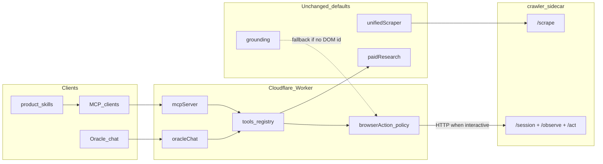

# Indexed DOM Action Agent (additive Jev-pattern layer)

**Goal:** Add a Jev Ultrafast-style **indexed DOM action space** so AI agents can observe and act on live pages without replacing Instant Audit scraping, DataForSEO tools, MCP free tools, Oracle, or PointerBench grounding.

**Date:** 2026-09-21  
**Status:** Implemented (pending deploy approval) - B0-B5 complete; offline ≥5× protocol-unit gate green on fixture  

**Pattern library:** [browser-use/jev-ultrafast](https://github.com/browser-use/jev-ultrafast) (MIT; do not fork into product tree)  
**Companion plans:** `agent-mcp-product-surface.md`, `gui-grounding-pointerbench.md`, `e2e-visibility-agent-platform.md`

---

## Locked decisions

1. **Additive only.** Do not change the default path of `unifiedScraper`, `siteEvidencePack`, paid DFS tools, `services/grounding/*`, or existing MCP free tools.
2. **DOM before pixels.** Prefer indexed controls when a real browser session exists. Use PointerBench grounding only when the surface is screenshot-only or DOM snapshot misses the control (canvas, custom widgets).
3. **No TypeSafe dependency.** Replicate the *contract* (operation + operation-specific targets in one decision) with Luminara's existing LLM / tool-calling stack.
4. **No nested Python app.** Keep `jev-ultrafast` as an external pattern lab. Port ideas into Luminara-shaped TypeScript + the existing Patchright crawler.
5. **Browser execution stays in `crawler/`.** Cloudflare Workers cannot drive Chromium. Worker/MCP/Oracle call the crawler over HTTP (same trust model as today's `/scrape`).
6. **Model never emits selectors, coordinates, or executable JS.** Targets are observed element ids only.
7. **`DONE` is not proof.** Independent verifiers required for SEO claims; otherwise `not_measured` / `unknown`.
8. **Deploy** only after explicit operator approval.

---

## Why this is additive and ~10x for agents

### What agents have today

| Capability | Where | Gap |
| --- | --- | --- |
| Static HTML / markdown evidence | `unifiedScraper` → Patchright `/scrape` | One-shot page dump; no click/type loop |
| Sitewide pack | `siteEvidencePack` | Multi-URL scrape, still non-interactive |
| Paid research | `services/tools/paidResearch` + MCP | SERP / KW / backlinks; not page interaction |
| Pixel click gate | `services/grounding/` | Screenshot pointing; not a full browse agent |
| MCP / Oracle tools | `worker/mcpServer.ts`, `oracleChat.ts` | No browse observe/act tools |

### What Jev proved (external evidence)

From their published matched runs (Google Flights demo): median browser protocol calls **1,092 → 101** (~10.8× fewer), median task time **9.450 s → 7.092 s** (~25% faster). That is one task, three pairs; not a Luminara product SLA. We treat **~10× fewer browser round-trips per interactive goal** as the engineering target analogy, not a marketing claim.

### What "10x for the AI Agent" means here (measurable)

Define success as all of:

1. **Coverage:** Agents can complete interactive SEO tasks that static scrape cannot (cookie dismiss, open nav, expand FAQ accordion, switch pricing tab, submit search on competitor site) with independent outcome checks.
2. **Cost shape:** Median Patchright CDP/protocol calls per interactive goal drop by **≥5×** vs a naive "screenshot every step + full a11y tree" baseline (aim for order-of-magnitude toward Jev's ~10×).
3. **Latency:** Interactive evidence for a bounded goal (≤15 steps) returns in **<30 s** median on warm crawler (excludes cold Chromium start).
4. **No regression:** Existing scrape, Instant Audit, MCP free tools, and grounding gate scores remain unchanged when the new layer is off or unused.

---

## Placement (studied against this repo)

### Put new code here

```text
crawler/                          # EXTEND existing Patchright sidecar
  actionSnapshot.mjs              # NEW: atomic DOM index (Jev snapshot.js port)
  sessionStore.mjs                # NEW: short-lived sessions + node id maps
  server.mjs                      # ADD routes; keep /health /scrape /serp

services/browserAction/           # NEW: policy + types (parallel to grounding/)
  types.ts
  actionSpace.ts                  # indexed elements + op→target maps
  choose.ts                       # one LLM decision: operation + targets
  fieldText.ts                    # TYPE_TEXT helper (strict JSON {"text"})
  loop.ts                         # predict / act / tick + stale guards
  verify.ts                       # independent DONE checkers
  catalogue.ts                    # tool meta for MCP/Oracle
  index.ts

services/scraping/
  patchrightClient.ts             # ADD session/observe/act client methods
                                  # do NOT change scrape() contract

services/tools/
  registry.ts                     # wire executeBrowserActionTool
  (paidCatalogue.ts unchanged)

worker/
  mcpServer.ts                    # ADD browse_* tools
  oracleChat.ts                   # optional: include tools when crawler up
  env.ts                          # PATCHRIGHT_URL / CRAWLER already exist via config

plugins/luminara/skills/
  luminara-browse/SKILL.md        # thin: context → observe → act → verify → save_report

specs/0008-indexed-dom-action-space.md   # public design record (after plan freeze)
tests/
  browserAction*.test.ts          # offline: actionSpace, choose validation, stale
  crawler/actionSnapshot tests    # node --test or vitest on snapshot fixtures
```

### Explicit non-homes

| Wrong place | Why |
| --- | --- |
| Inside `services/grounding/` | Different job (pixels). Keep planner/pointer pure. |
| Inside `services/agentCore/` first | Crew orchestration can *call* browserAction later; core should not own CDP. |
| New top-level `jev-ultrafast/` or `browser-agent/` app | Violates professional-repo-structure; crawler already owns browser. |
| Pure Worker-only implementation | No Chromium on Workers; must relay to crawler or Browserbase. |
| Replacing `/scrape` | Scrape remains the cheap evidence path for Instant Audit. |

### Dependency direction



---

## Architecture

### Session model (crawler)

1. `POST /session` → `{ sessionId, startUrl }` opens tab (reuses Patchright browser pool pattern in `server.mjs`).
2. `POST /session/:id/observe` → runs `actionSnapshot.mjs` in-page; returns:
   - `url`, `title`, `text` (visible, capped)
   - `actions[]` with stable `id` (`e1`…), `kind` (`click`|`fill`|`select`|`scroll`|`wait`), `label`, `role`, `value`, `node`
   - `fingerprint` / `marker` for stale detection
   - optional screenshot only for human inspector / grounding fallback (off by default for agents)
3. `POST /session/:id/act` → `{ fingerprint, actionId, text? }`:
   - Reject if fingerprint mismatch (`StalePage`)
   - Resolve current geometry + hit-test; reject covered/disabled
   - Execute; log action; then re-observe
4. `DELETE /session/:id` + TTL (e.g. 5-10 min idle)

Hard bans (from Jev, keep):

- Skip `password`, `file`, `hidden` inputs
- Cap actions (~250) + visible text (~6k)
- Never retry a mutation; only re-predict after observe
- Never execute model-supplied selectors/JS

### Policy model (`services/browserAction`)

Mirror Jev's split without TypeSafe:

1. Build `actionSpace(actions)` → elements table + per-operation target maps + control ops (`SCROLL_*`, `WAIT`, `DONE`, `BLOCKED`).
2. One LLM call returns:
   - `operation` choice among offered ops
   - speculative `*_target` heads; **consume only the selected operation's target**
3. If `TYPE_TEXT`: call `fieldText` with OpenAI-compatible helper already used in Worker (`OPENROUTER_API_KEY` / provider relay). Require `{"text":"..."}` only.
4. Loop: `tick = predict + act` until `DONE` / `BLOCKED` / max steps (default 15).

Reuse `runToolLoop` patterns and provider tool-calling where helpful; do not require a second policy vendor.

### MCP / Oracle tools (additive catalogue)

| Tool | Class | Behavior |
| --- | --- | --- |
| `browse_observe` | free (Growth+ MCP) | Open or reuse session; return indexed element table + visible text. No mutation. |
| `browse_act` | paid or Agency `apiAccess` / hosted crawler quota | Single act with fingerprint. |
| `browse_goal` | paid (same gate) | Run bounded loop for a natural-language goal; return history + final observe + verifier result. |
| `browse_close` | free | End session. |

APS invariants still apply:

- Prefer `get_project_context` before long `browse_goal` jobs.
- Append research log on successful `browse_goal` summaries.
- Chat / MCP returns verdict + one action + report link when saving via `save_report`.

When crawler URL is unset: tools return instructive `not_measured` / `BROWSER_UNAVAILABLE` (same honesty pattern as visibility stubs).

### Coexistence rules

| Situation | Path |
| --- | --- |
| Homepage evidence for Instant Audit | Unchanged: `unifiedScraper` / `siteEvidencePack` |
| Rank / KW / backlinks | Unchanged: paid DFS tools |
| "Click the Excel cell in this PNG" | Unchanged: `services/grounding` |
| "Open competitor pricing and capture the Pro tier features after expanding FAQ" | **New:** `browse_goal` |
| Observe finds no matching control | Optional grounding pointer on last screenshot; do not delete DOM path |

### Entitlements (proposal)

| Plan | observe | act / goal |
| --- | --- | --- |
| free | web UI local crawler only | no MCP |
| starter | BYOK crawler via app | BYOK |
| growth | MCP `browse_observe` | BYOK crawler or metered |
| agency | observe + act/goal | hosted crawler quota + BYOK |

Exact credit numbers: align with Sentinel later; do not invent in v1.

---

## Implementation waves

### Wave B0: Spec + fixtures (0.5-1 day)

- Freeze this plan; add `specs/0008-indexed-dom-action-space.md` (what/why/alternatives; no secrets).
- Offline fixtures: HTML pages with buttons, fills, native select, aria roles.
- MIT attribution note in `actionSnapshot.mjs` header (Browser Use / jev-ultrafast lineage).

**Exit:** Spec accepted; fixtures green for pure snapshot parsing.

### Wave B1: Crawler observe/act (2-3 days)

- Port snapshot into `crawler/actionSnapshot.mjs`.
- Session store + routes on `server.mjs`.
- Extend `patchrightClient.ts` with `createSession` / `observe` / `act` / `close` (additive methods).
- Keep `/scrape` byte-compatible; existing tests must pass unchanged.

**Exit:** `curl` session → observe → click → observe works against local fixture; SSRF + token + rate limits still apply.

### Wave B2: Policy loop in `services/browserAction` (2-3 days)

- `actionSpace`, `choose`, `fieldText`, `loop`, `verify` with vitest (no live browser in unit tests).
- Validate choice probabilities / ids; reject invalid model JSON without acting.
- Text-helper cache only when entire helper input unchanged (Jev invariant).

**Exit:** Offline tests cover stale fingerprint, invalid target, TYPE_TEXT JSON gate, DONE without verifier fails closed.

### Wave B3: MCP + Oracle wiring (1-2 days)

- Catalogue entries + `executeBrowserActionTool` in registry.
- MCP handlers; Oracle includes tools only when `PATCHRIGHT_URL` / crawler health ok.
- Research-log append on `browse_goal` success.

**Exit:** MCP `tools/list` shows new tools; paid gate blocks act without Agency/BYOK; observe works for Growth+.

### Wave B4: Product skill + optional UI inspector (1-2 days)

- `plugins/luminara/skills/luminara-browse/SKILL.md`.
- Optional minimal inspector (numbered overlays) for Electron/local debug; not required for MCP.
- Optional later: agentCore scout node calls `browse_goal` for competitor flows.

**Exit:** Skill docs match APS thin-skill pattern; one end-to-end competitor FAQ expand demo recorded.

### Wave B5: Measurement harness (1 day)

- Script: same interactive fixture goal under (A) naive full-tree loop stub vs (B) indexed action loop.
- Report protocol-call count, wall time, verifier pass/fail.
- Gate claim: ≥5× protocol reduction on fixture before any "10x" language in product copy.

**Exit:** Numbers checked into `docs/` or test snapshot; marketing copy stays honest.

---

## Security and abuse (non-optional)

Already strong on crawler (`ssrf.mjs`, token, concurrency, rate limit). Add for sessions:

1. Session ownership keyed by account id hash from Worker (crawler trusts Worker token only; never expose raw session to anonymous web).
2. Max steps / max session TTL / max concurrent sessions per account.
3. Block navigation to non-public targets (reuse `assertPublicTarget`).
4. No password/file inputs in action space.
5. Act tools are paid/gated; observe is free but rate-limited.
6. Do not log field values that look like secrets (heuristic redaction in history).

---

## What we deliberately do not build in v1

- TypeSafe / Browser Harness / Chrome profile attach
- Shadow DOM / iframe / canvas full support (document limits; fall back to grounding or `BLOCKED`)
- Booking/checkout automation marketing demos
- Replacing Firecrawl / Jina / DFS
- Training a custom click model
- Nested `jev-ultrafast` checkout inside this monorepo

---

## Senior sequencing recommendation

1. **B0 → B1 → B2** before any MCP exposure (prove crawler + policy offline).
2. **B3** only when observe/act are boring and safe.
3. **B4-B5** for agent UX and honest performance claims.
4. Keep grounding and scrape PRs on separate tracks; no shared refactors required.

---

## Open choices (need operator call before B3)

1. **Hosted crawler for Agency:** extend existing Docker crawler fleet vs Browserbase sessions for multi-tenant isolation?
2. **Credit metering:** count `browse_goal` steps as provider quota units, or flat per-goal credit?
3. **Default MCP surface:** ship `browse_observe` alone first (lowest risk), then `browse_goal`?

Recommendation if no preference: **observe-first MCP**, Browserbase later only if multi-tenant isolation demands it; meter `browse_goal` like other paid tools with research-log reuse.
