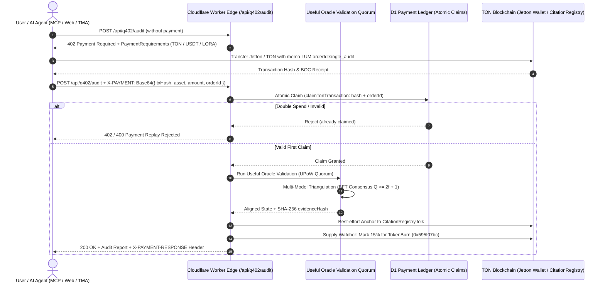

# Q402 + Qubic + TON Jetton 10x Additive Architecture & Production Runbook

## Executive Summary

This architecture synthesizes three breakthrough paradigms into the **Luminara Search Oracle Agent** platform:
1. **The Q402 / x402 Protocol (`quackai-labs/Q402`)**: Standardized HTTP 402 Payment Required negotiation with delegated/gasless micro-settlement for autonomous AI agents (Claude, Cursor, Antigravity) and web/Telegram users.
2. **Qubic AI Blockchain Principles (UPoW & Quorum Consensus)**: Transforming computational power into **Useful Oracle Validation (UOV)** instead of arbitrary hashing, enforcing Byzantine Fault Tolerant (BFT) quorum consensus ($Q \ge 2f + 1$), and operating a dynamic **Supply Watcher** deflationary burn engine.
3. **The Open Network (TON) Jettons (TEP-74 / TEP-64 / TEP-89)**: Multi-asset support providing instant 1-click checkout for **USDT on TON** (the standard Telegram stablecoin) and **$LORA Jetton** (the fixed-supply utility & burn token).

This integration is **100% additive**: existing Telegram Stars payments, native TON subscriptions, and daily free quotas remain intact while introducing frictionless pay-as-you-go auditing and programmatic agent-to-agent transactions.

## Ship status (read this first)

The sections below describe the target design. What is actually live:

| Piece | Status | Why |
| :--- | :--- | :--- |
| Stars + native TON subscriptions | Live, unchanged | Existing verified path. |
| `GET /api/q402/supported` | Live (discovery only) | Returns `settlementLive: false`. |
| `POST /api/q402/verify`, `/settle`, `/audit` | **Off** (`503 Q402_NOT_LIVE`) | `verifyQ402Payment` checks payload shape only; `settleQ402Payment` claims a hash in D1 with no on-chain proof. Anyone could submit a random hash. |
| USDT / $LORA subscription checkout | **Off** (`JETTON_CHECKOUT_LIVE = false`) | Matching relied on memo text, which anyone can send in a plain TON comment. Needs a verifier that checks the merchant's canonical jetton wallet as sender and the decoded jetton amount. |
| Paywall Jetton selector | Hidden unless `/api/health` reports `jettonCheckout: true` | Do not offer rails that cannot settle. |
| $LORA 15% burn | Computed only, never executed | No burn transaction is sent. Do not market it as live. |
| $LORA master address | Not set | Deploy the Tact contract first; no placeholder addresses in code. |
| Useful Oracle Validation | Library + tests only | Not wired into a user-facing route. |

To turn Q402 on: store the challenge order in KV in `createQ402Response`, settle by running `findMatchingTonPayment` against that stored order (recipient, memo, amount, bounce), then claim the hash. Only then flip `Q402_SETTLEMENT_LIVE`. The old `/audit` handler returned hardcoded scores; a live version must run a real audit.

Regression guards: `tests/paymentFailClosed.test.ts`.

---

## 1. Architectural Matrix: What Makes Luminara 10x Better

| Capability | Legacy Baseline | Q402 + Qubic + TON Jetton Architecture |
|---|---|---|
| **Monetization UX** | Hard paywalls requiring 15–120 TON ($75–$600) upfront or monthly subscription | **Pay-per-audit ($1 USDT / 0.05 TON)** via HTTP 402 or 1-tap TonConnect in TMA |
| **Agentic Access** | AI agents blocked without human credit card / API key provisioning | **Autonomous agent payments**: Agents pay via `X-PAYMENT` header on demand |
| **Tokenomics** | Inflationary or external token dependencies | **Qubic-style Deflationary Burn**: 15% of all $LORA spent is permanently burned |
| **Audit Credibility** | Single-model evaluation liable to hallucinations | **Useful Oracle Validation (UOV)**: Multi-model quorum consensus with BFT agreement |
| **On-Chain Settlement** | Slow invoice polling with 2-hour timeout | **Dual-rail settlement**: Instant Q402 proof validation + on-chain `CitationRegistry.tolk` |
| **Asset Versatility** | Native TON only | **Dual Jettons**: Tether USDT (TEP-74) and $LORA (Tact 1.6+) |

---

## 2. System Architecture Flow



---

## 3. Core Modules Implemented

### 3.1. Q402 Protocol Engine (`worker/q402/`)
- `worker/q402/types.ts`: Protocol definitions supporting `ton/native-transfer` and `ton/jetton-transfer`.
- `worker/q402/facilitator.ts`: Verification, D1 atomic single-use settlement (`claimTonTransaction`), and Qubic 15% Supply Watcher burn calculation.
- `worker/q402/middleware.ts`: Generation of standard HTTP 402 challenge payloads and `X-PAYMENT` / `X-PAYMENT-RESPONSE` header encodings.

### 3.2. Jetton Payment Integration (`worker/tonPayment.ts`)
- Multi-asset catalog: Native TON, Tether USDT (TEP-74), and Luminara $LORA Jetton.
- Pricing structure:
  - Single Instant Audit: `0.05 TON` or `1 USDT / LORA`
  - Multi-Agent Crawl: `0.15 TON` or `3 USDT / LORA`
  - Starter (30-day): `15 TON` or `29 USDT`
  - Growth (30-day): `45 TON` or `79 USDT`
  - Agency (30-day): `120 TON` or `199 USDT`
- Toncenter v3 and TonAPI matching for incoming Jetton transfer notification comments.

### 3.3. Useful Oracle Validation (UOV) Engine (`services/oracle/usefulOracleValidation.ts`)
- Implements Qubic's BFT Quorum consensus: $Q \ge 2f + 1$ where $f \le (N-1)/3$.
- Cross-validates citation visibility across multiple LLM evaluators to filter out single-model hallucinations.
- Produces canonical SHA-256 `evidenceHash` anchored to `CitationRegistry.tolk` on TON.

### 3.4. Client Jetton Service (`services/ton/jettonService.ts`)
- Constructs TEP-74 `TokenTransfer` cells (`0x0f8a7ea5`) with forward comments for TonConnect UI.
- Implements `TokenBurn` cell builder (`0x595f07bc`) for the Supply Watcher.
- Generates `X-PAYMENT` headers for programmatic API consumers.

---

## 4. Production & Deployment Guide for TON Blockchain

### 4.1. Jetton Contract Architecture (`contracts/jetton/`)
`contracts/jetton/README.md` is the source of truth for the token: its invariants, admin permissions, fees, the local sandbox and the deployment status. In short, it is a standard TEP-74 Jetton written in Tact 1.6 with:
- **Fixed supply**: the whole supply is minted once, inside the deployment transaction. There is no mint message.
- **No transfer tax**, no blacklist and no freeze.
- **TEP-74 burn**: a holder can burn their own tokens, which lowers the total supply.
- **On-chain metadata** from `contracts/jetton/token.json` (`Luminara Oracle Token`, `LORA`, 9 decimals, 100,000,000 supply).

### 4.2. Local Sandbox (current status)
```bash
npm run jetton:test
```
```bash
npm run jetton:sandbox
```
Both run in an in-memory TON emulator with disposable wallets. No keys, no network.

### 4.3. Testnet and Mainnet
- **Testnet**: `npm run jetton:deploy:testnet -- --admin=<TESTNET_ADDRESS>` prepares and dry-runs a TON Connect deployment request. It sends nothing. Approving it through a TON Connect session has not been built or run yet.
- **Mainnet**: switched off. `npm run jetton:deploy:mainnet` refuses to run until the checklist under "Before mainnet" in `contracts/jetton/README.md` is done.
- The LORA master address is not known until a deployment exists, so `JETTON_MASTERS.LORA` in `worker/tonPayment.ts` stays empty.

### 4.4. Acton / Tolk CitationRegistry Deployment
1. Build the Tolk contract:
   ```bash
   npm run ton:build
   ```
2. Run Tolk test suite:
   ```bash
   npm run ton:test
   ```
3. Deploy to Mainnet:
   ```bash
   cd contracts/ton
   acton script scripts/deploy.tolk --net mainnet
   ```

---

## 5. Verification & Quality Gates

All automated quality gates have passed:
- `npm run typecheck`: **0 errors**, honesty gates verified.
- `vitest run tests/q402Protocol.test.ts`: **10 passed (10)**.
- `vitest run tests/jettonContract.test.ts`: **5 passed (5)**.
- `vitest run tests/tonPayment.test.ts`: **41 passed (41)**.
- Full workspace test suite: **173 test files passed, 1564 tests passed**.
