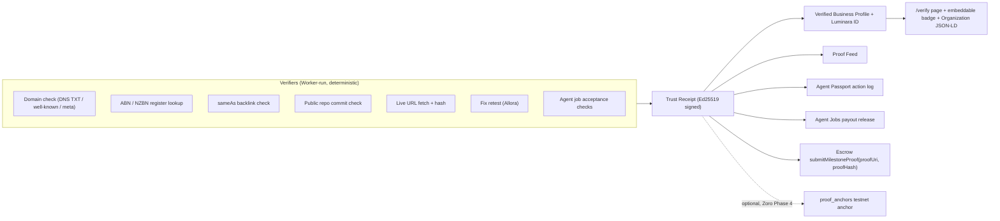

# Trust Network: additive plan (Track TN)

**Status:** v0.2. Approved 2026-10-07. TN0, TN1, TN2 implemented on `feat/trust-network-tn0-tn1` behind flags (default off). Spec: `specs/0017-trust-receipts.md`.
**Date:** 2026-10-07
**Pattern source:** six concepts supplied by the owner (verified founder profile, agent passport, proof-of-work feed, trusted communities, milestone funding, agent services marketplace). Concepts only; Luminara brand, tables, and copy.
**Companions (binding):** `specs/0015-smb-launchpad.md`, `specs/0016-agent-passport.md`, `docs/plans/oracle-operations-layer-additive-plan.md`, `docs/plans/zoro-concepts-implementation-plan.md` (owns evidence hashing and anchoring), `docs/plans/verifiable-flow-memory-10x-ship.md`, `docs/plans/allora-concepts-implementation-plan.md` (retest loop), APS invariants in `AGENTS.md`.

---

## 0. Verdict

### 0.1 The one insight

Luminara already sells **evidence about a business** (audits, findings, measured vs not measured). Every one of the six concepts is a variation of the same thing: *a claim, the evidence for it, who verified it, and how.* The repo already has most of the parts, scattered:

| Existing part | Where | State |
|---|---|---|
| Hash-chained audit log | `worker/auditLog.ts` (`recordAuditLog`, `verifyAuditChain`) | Live, but `verifyAuditChain` has no route and concurrent writes can fork the chain |
| Self-reported audit digest | `worker/attestationService.ts`, `components/audit/VerifyAttestationView.tsx`, `/verify/*` | KV only, badge off |
| Proof ledger | `proof_anchors` (0017), `worker/proofAnchors.ts` | Only `ton_payment` rows written |
| Credential attribution | `McpCredential`, `cost_events.credential_*` (0019, uncommitted K0) | In progress |
| Governance and approvals | `worker/mcpGovernance.ts`, `mcp_action_requests` | Live |
| Non-custodial milestone escrow | `contracts/src/MilestonePreorderEscrow.sol` (`submitMilestoneProof(i, proofUri, proofHash)`) | Tested, not deployed |
| Business identity | Business DNA, `projects`, `organizations` + RBAC (0003) | Live / RBAC mostly unwired |
| Distribution | Share links, teasers, referrals, Telegram bot | Live |

**Missing:** a way to prove a user *owns* a domain or business, and a **server-signed, publicly verifiable receipt** format. Both are small. Everything else in this plan composes them.

So the plan adds one primitive, **Trust Receipts**, and builds the six concepts as views over it. No new chain, no token, no custody.



### 0.2 Concepts: take, adapt, skip

| Concept | Decision | Lands in | Why it helps a Luminara user |
|---|---|---|---|
| Domain verification | **Take** | TN2 | Unlocks public profile, proof feed, scheduled re-checks; stops anyone publishing proofs about a domain they do not own |
| KYB-lite (company registry) | **Adapt**: ABN Lookup (AU) + NZBN API only, name-match against Business DNA | TN3 | Launchpad already collects `abn_nzbn` and only regex-checks it |
| Team credentials | **Adapt**: "member holds a verified email at the verified domain" only | TN3 | Cheap, honest, needs no third party. LinkedIn/degree verification skipped |
| Social proof | **Adapt**: verify `sameAs` profiles link back to the domain | TN3 | Same links feed Organization schema, a core AEO entity signal |
| Portable Luminara ID | **Adapt**: public profile page + signed receipt bundle (JSON). W3C VC shape deferred | TN3 | One link a founder can paste anywhere |
| Agent Passport fields (owner, purpose, tools, spend cap, model, signed log) | **Take, inside spec 0016** (K1, K3, K4). Adds `purpose` and `model` fields and signed log export | TN4 | Name already owned by spec 0016; do not fork |
| Wallet permissions | **Skip, state it**: passport shows "No wallet access. Luminara never signs or holds funds." | TN4 | Non-custody is load-bearing for AUSTRAC posture (spec 0015) |
| Proof-of-work feed | **Take** with three verification levels | TN5 | Turns audits and shipped fixes into public, verifiable progress |
| Revenue screenshots hashed on-chain | **Adapt**: allowed only as `self_reported`, never labelled verified | TN5 | A hash proves a file existed at a time, not that the revenue is real. APS invariant 5 |
| Trusted community spaces | **Defer, decision-gated**; narrow MVP: verified directory + Telegram gated groups + report queue | TN8 | Moderation cost is real; no existing surface |
| Milestone funding | **Take what exists** (Launchpad escrow) and wire Proof Feed into `submitMilestoneProof` | TN7 | Backers see Luminara-verified evidence during the challenge window |
| Grants | **Adapt**: Grant Scout (research and matching, no money flow) | TN7 | Same shape as Idea Scout; zero regulatory surface |
| Bounties | **Defer, decision-gated**: non-custodial bounty escrow contract needs its own audit | TN7 | Custodial bounties trigger AUSTRAC |
| Securities-like token fundraising | **Skip, locked non-goal** | none | Contradicts spec 0015's design to stay outside AFSL/MIS. See 0.4 |
| Agent services marketplace | **Adapt**: first-party **Agent Jobs** with fixed quote, acceptance checks, pay on verified delivery | TN6 | Matches README "done-for-you priced per finding"; third-party agents later |

### 0.3 Corrections to the brief (pushback)

1. **"Hashed on-chain" is not verification.** On-chain anchoring proves *when* a digest existed. It says nothing about whether the content is true. The plan keeps verification level (who checked, how) separate from anchoring (timestamp), and anchoring stays inside Zoro Phase 4, testnet first.
2. **Token fundraising.** Spec 0015 hard-codes non-custody, no investment marketing, and goods-or-services consideration specifically to avoid a managed investment scheme. Adding securities-like tokens would undo that and require an AFSL. Locked out.
3. **Agent Passport is already a track.** Spec 0016 (K1-K6) and Oracle Ops F4 "Agent Seats" both plan per-agent caps. Two plans for one table is a defect; TN4 asks the owner to merge them (decision D2).
4. **Third-party agent marketplace.** Being the intermediary that releases payment between two parties is "arranging" and potentially custody. First-party jobs keep Luminara the seller, using existing Stars/TON/credits rails and the existing Stars refund path.

### 0.4 Non-goals (locked)

- No token, no securities-like offering, no yield, no DAO, no staking (Zoro non-goals stand).
- No custody: the Worker never holds keys or funds, never releases funds between users.
- No new chain. Anchoring only through Zoro Phase 4 on existing rails.
- No "verified" label on anything a Worker verifier did not check. No invented scores, ranks, or uplift.
- No claim that verification improves AI citations (not measured).
- No router rewrite of `worker/index.ts` or state-library migration of `App.tsx`.

---

## 1. User-facing outcome ("easier for the user")

One new surface, **Trust**, reachable from the Suite menu and Settings, shaped as a checklist, not a form:

| Step | User effort | Result |
|---|---|---|
| Verify domain | Copy one TXT record (or upload one file), click Check | Receipt `domain_control` |
| Add ABN/NZBN | Paste number | Receipt `business_registry` if name matches Business DNA, else shown as mismatch |
| Link profiles | Paste LinkedIn/X/GitHub URLs (prefilled from Business DNA competitors/socials where present) | Receipt per profile that links back |
| Invite teammates | Enter emails | Receipt per member with verified email at the domain |
| Publish | Toggle | Public `/p/<slug>`, badge embed snippet, Organization JSON-LD with verified `sameAs` |

Every audit, shipped fix, and agent job afterwards can be one-click published to the Proof Feed. MCP gets the same via new free tools (TN3, TN5) so agents can do this for the user.

---

## 2. Rules for every task

Inherit Zoro section 2 and the V plan section 2.1 deltas: branch from `origin/staging`; migration and spec numbers assigned at PR time (next free today: migration 0020, spec 0017; note duplicate prefixes 0011-0013 exist); new routes get their own prefix and protected-route entry; every endpoint added to `worker/README.md`; one concern per PR; flags default `"false"` in all three `wrangler.jsonc` blocks, typed in `worker/env.ts`, reported in `/api/health`; new tables added to `worker/privacyService.ts` delete and export lists; no em dashes in copy.

**Do not touch the uncommitted K0 working set** (`worker/mcpServer.ts`, `worker/budgets.ts`, `worker/auditLog.ts`, `migrations/0019_*`, etc.) until it lands. TN0 starts after K0 merges.

---

## 3. Phases

| Phase | Ships | Migration (by name) | Flag | Depends on |
|---|---|---|---|---|
| TN0 | Prereqs: audit chain fork fix, chain verify route, signing key + key discovery | none | none | K0 merged |
| TN1 | Trust Receipts primitive + public verify | `trust_receipts` | `TRUST_RECEIPTS_ENABLED` | TN0 |
| TN2 | Domain verification | `domain_verifications` | `DOMAIN_VERIFY_ENABLED` | TN1 |
| TN3 | Verified Business Profile + Luminara ID | `trust_profiles` | `TRUST_PROFILE_ENABLED` | TN2 |
| TN4 | Agent Passport surface (= spec 0016 K1, K3, K4 amended) | per spec 0016 | spec 0016 flags | TN1, D2 |
| TN5 | Proof Feed | `proof_events` | `PROOF_FEED_ENABLED` | TN2 |
| TN6 | Agent Jobs (first-party services) | `agent_jobs` | `AGENT_JOBS_ENABLED` | TN4 (K1/K2), TN1 |
| TN7 | Funding rails: escrow proof wiring, Grant Scout; bounties decision-gated | `grant_scouts` | `GRANT_SCOUT_ENABLED` | TN5, Launchpad gates |
| TN8 | Circles (verified directory, gated Telegram groups, reports) | `circles`, `trust_reports` | `CIRCLES_ENABLED` | TN3, D6 |

### TN0: Prerequisites

| ID | Task | Files | Acceptance |
|---|---|---|---|
| TN0-1 | Make `recordAuditLog` fork-proof: conditional insert that fails if `prev_hash` is no longer the head, retry once | `worker/auditLog.ts`, tests on `tests/helpers/sqliteD1.ts` | Two concurrent writers for one org produce a linear chain; `verifyAuditChain` passes |
| TN0-2 | `GET /trust/audit-chain/verify` (owner only) returns `{ ok, length, headHash, brokenAt? }` | `worker/index.ts`, `worker/auditLog.ts` | Tampered fixture row reports `brokenAt` |
| TN0-3 | Ed25519 signing: `RECEIPT_SIGNING_KEY` secret (PKCS8), `kid`; public keys at `/.well-known/luminara-receipt-keys.json`; rotation keeps old public keys. Spike first: confirm WebCrypto `Ed25519` sign/verify under workerd and Node (V plan open item) | new `worker/receiptSigning.ts`, `worker/env.ts`, `.dev.vars.example` | Sign in Worker, verify in a browser and in a plain Node script with only the published key |

### TN1: Trust Receipts

A receipt is a signed statement, never a copy of the evidence.

```ts
type TrustReceipt = {
  v: 1; id: string; kid: string; issuedAt: string; expiresAt?: string;
  subject: { kind: 'domain' | 'business' | 'account' | 'agent' | 'project'; id: string };
  claim: 'domain_control' | 'business_registry' | 'same_as' | 'team_member'
       | 'live_deploy' | 'repo_commit' | 'fix_retested' | 'audit_run'
       | 'agent_job_delivered' | 'agent_action_log' | 'self_reported_file';
  level: 'worker_verified' | 'registry_verified' | 'self_reported';
  method: string;                    // e.g. 'dns_txt', 'abr_lookup', 'http_fetch_sha256'
  evidence: { ref: string; sha256?: string; url?: string; fetchedAt?: string }[];
  measurementStatus: 'measured' | 'estimated' | 'not_measured';
};
// signature = Ed25519 over canonical JSON (same canonicaliser as attestationService)
```

```sql
CREATE TABLE IF NOT EXISTS trust_receipts (
  id TEXT PRIMARY KEY, account_id TEXT NOT NULL,
  subject_kind TEXT NOT NULL, subject_id TEXT NOT NULL,
  claim TEXT NOT NULL, level TEXT NOT NULL CHECK (level IN ('worker_verified','registry_verified','self_reported')),
  payload_json TEXT NOT NULL, signature TEXT NOT NULL, kid TEXT NOT NULL,
  visibility TEXT NOT NULL DEFAULT 'private' CHECK (visibility IN ('private','public')),
  revoked_at TEXT, revoked_reason TEXT, created_at TEXT NOT NULL
);
CREATE INDEX IF NOT EXISTS idx_trust_receipts_subject ON trust_receipts(subject_kind, subject_id, claim);
CREATE INDEX IF NOT EXISTS idx_trust_receipts_account ON trust_receipts(account_id, created_at);
```

Routes: `GET /trust/receipts` (owner), `GET /trust/receipts/:id` (public only if `visibility='public'` and not revoked), `POST /trust/receipts/:id/visibility`, `POST /trust/receipts/:id/revoke`. Reuse `VerifyAttestationView` at `/verify/r/<id>`: shows claim, level, method, evidence hashes, signature check done **in the browser** against the published key. Revocation list is part of the public read.

Acceptance: a receipt verifies offline with only the public key; a single-byte change fails; revoked receipts render as revoked; no route can mint `worker_verified` from client-supplied content.

### TN2: Domain verification

- Methods (user picks one): DNS TXT `luminara-verify=<token>` via DoH (`cloudflare-dns.com/dns-query`, JSON); `https://<domain>/.well-known/luminara-verify.txt`; `<meta name="luminara-verify">` on the home page. Fetch through the existing SSRF guard (`safePublicHostname`), no redirect follow beyond same host.
- Token: random 128-bit, stored hashed, 7-day TTL.
- Weekly cron re-check (existing scheduled handler); loss of proof for 2 consecutive checks revokes the receipt and emits a Beacon event.
- Effects (each behind its own check, never widening existing guards): public profile and proof feed require it; share pages and teasers show "domain owner verified" only when a live receipt exists.
- Fixes PAPERCUT: replaces the over-claiming "Verified" on `EntityAuthorityCard` with the real receipt state.

Acceptance: DNS, file, and meta fixtures pass; a token for account A cannot verify for account B; a removed record revokes after two cycles; private IPs and redirects to other hosts are refused.

### TN3: Verified Business Profile + Luminara ID

- **Registry (KYB-lite):** ABN Lookup JSON (`ABR_GUID` secret) and NZBN API (`NZBN_API_KEY`). Records entity name, status, GST flag, and match result against Business DNA name (normalised). Mismatch is shown, never hidden. Results cached 30 days. Launchpad `abn_nzbn` reuses the receipt instead of the regex.
- **sameAs:** fetch each profile URL; pass if it links to the verified domain (`rel="me"` or plain link). X/LinkedIn that block fetches return `not_measured`, shown as "unverified link".
- **Team:** Firebase `email_verified` + email domain equals a verified domain gives `team_member`. Org membership uses existing `organization_memberships`, which also wires RBAC routes the worker report flagged as missing.
- **Luminara ID:** `/p/<slug>` public page (marketing shell, server-rendered meta for crawlers), JSON at `/p/<slug>.json` = profile + public receipts bundle, embeddable SVG badge linking to `/verify`. Generated Organization JSON-LD lists only verified `sameAs` (ties to the seo-schema playbook; no FAQ/HowTo per deprecation rules).
- **MCP (free, Growth+):** `get_trust_profile`, `get_verification_status`.

Acceptance: profile never shows a claim without a live receipt; registry outage shows `not_measured`; JSON-LD validates; public page has no account id, email, or ABN details beyond the public register fields.

### TN4: Agent Passport surface (amends spec 0016, does not fork it)

Map the brief onto spec 0016 waves:

| Brief field | Spec 0016 home | Amendment |
|---|---|---|
| Owner | Account tier | Shows verified business name if TN3 receipt exists |
| Purpose | none | **Add** `purpose` (free text, 140 chars) on agent client and session |
| Allowed tools | K0 scopes + Ops F4 `tool_allowlist_json` | Merge F4 into K1 (decision D2) |
| Wallet permissions | none | Fixed line: "No wallet access" |
| Spend cap | K1 client cap + session cap | none |
| Model/version | none | **Add** self-declared `model` on client (labelled self-declared), plus Luminara-side model ids recorded on `run_provenance` |
| Signed action log | Audit chain + K4 receipts | **Add** `agent_action_log` receipt: signs `{agentId, fromSeq, toSeq, headHash}` on demand; export JSON verifiable with TN0 key |

UI is spec 0016 K3 ("Agents" tab). Public passport page optional (owner toggles), showing only owner, purpose, scopes, cap, and log head receipt.

### TN5: Proof Feed

```sql
CREATE TABLE IF NOT EXISTS proof_events (
  id TEXT PRIMARY KEY, account_id TEXT NOT NULL, project_id TEXT, domain TEXT NOT NULL,
  kind TEXT NOT NULL,              -- 'audit_run'|'fix_retested'|'live_deploy'|'repo_commit'|'agent_job'|'milestone'|'self_reported'
  title TEXT NOT NULL, body TEXT,
  receipt_id TEXT NOT NULL,        -- every event rests on a receipt
  visibility TEXT NOT NULL DEFAULT 'private',
  created_at TEXT NOT NULL
);
CREATE INDEX IF NOT EXISTS idx_proof_events_domain ON proof_events(domain, visibility, created_at);
```

Verifiers (Worker-run): `live_deploy` (fetch URL, record status + sha256, host must be verified domain or subdomain); `repo_commit` (GitHub public API: commit exists, repo owner equals a verified `sameAs` GitHub account); `fix_retested` (from Allora retest, only when the server re-check passed); `audit_run` (from V2 run ledger, `fetcher` honesty preserved); `agent_job` (TN6). `self_reported`: user uploads a file, only its sha256 is stored, UI label "Self-reported. Luminara did not verify this."

Relationship to Beacon (Ops F2): Beacon is the private attention feed; Proof Feed is the public record. They share producers, not tables.

Optional anchoring: a daily Merkle-free batch digest of public receipts handed to Zoro Phase 4's anchor path (testnet first). Shown as "timestamped", never "verified".

### TN6: Agent Jobs (first-party services)

Bounded, fixed-price jobs run by Luminara's own agents under a K1 session:

| Job | Deliverable | Acceptance check (deterministic) |
|---|---|---|
| Schema fix pack | JSON-LD blocks for verified entity | Validates; `sameAs` only verified links |
| `llms.txt` / robots AI policy | File content | Parses; served at domain after user deploys (live fetch) |
| Competitor research brief | Report via `save_report` | Every metric cites evidence or says `not_measured` (`agentOutputValidators`) |
| Lead research list | CSV of public businesses | Each row has a source URL that resolves |
| Support reply drafts | Drafts in report | Passes honesty gate; no invented facts flag |
| Landing page draft | HTML artifact | Lighthouse/PageSpeed run returns measured scores (no target promised) |

Flow: quote (K2 `estimate_cost`, fixed price in credits/Stars/TON) → user approves (Sign-off Desk) → credits reserved → job runs under a session cap → checks run → pass: charge + `agent_job_delivered` receipt + optional Proof Feed event; fail: release reservation (Stars refund path for Stars). Human done-for-you jobs from Luminara Digital use the same table with `fulfiller='human'`.

Third-party agents (true marketplace): **out of scope** until D5 (legal) and a published passport requirement.

### TN7: Funding rails

- **Escrow proof wiring:** `EscrowPanel` "Submit milestone proof" picks a public Proof Feed event; `proofUri = https://luminarasuite.com/verify/r/<receiptId>`, `proofHash = sha256(canonical receipt)`. Contract unchanged. Backers verify during the challenge window.
- **Grant Scout:** like Idea Scout. Given Business DNA + verified registry data, list matching AU/NZ grants from official sources (business.gov.au, callaghaninnovation.govt.nz) with source links and deadlines; eligibility shown as "likely / unclear", never guaranteed. No money flow.
- **Bounties:** decision D4. Option A: new non-custodial `BountyEscrow` (funder deposits, single assignee, release on funder approval or timeout refund) needing its own external audit. Option B: defer. Recommendation: defer until Launchpad mainnet gates pass, because it shares the audit and legal path.

### TN8: Circles (decision-gated)

Narrow MVP only if D6 approves:
- Verified directory: public profiles opt in; ordering by count of public `worker_verified` receipts in the last 90 days (a transparent count, not a "reputation score").
- Gated Telegram groups: bot issues single-use `createChatInviteLink` (member_limit 1) only to accounts with a domain receipt; join-request approval for re-joins.
- Scam reports: `POST /trust/reports` → admin queue; a revoked receipt or upheld report removes directory listing. Rate limited, reporter identity required.

---

## 4. Owner decisions

| # | Decision | Recommendation |
|---|---|---|
| D1 | Approve Trust Receipts (Ed25519 server key) as the single proof primitive, generalising spec 0016 K4 | Yes |
| D2 | Merge Oracle Ops F4 Agent Seats into spec 0016 K1 (one table, one flag set) | Yes, before either is built |
| D3 | Which plans get Trust features: domain verify + profile free for all signed-in users (growth loop), Proof Feed publishing Growth+, Agent Jobs pay-per-job | As stated |
| D4 | Bounties: build `BountyEscrow` now or defer | Defer |
| D5 | Third-party agent marketplace: pursue after legal review or drop | Legal review first, no build |
| D6 | Circles: build TN8 MVP or park | Park until TN3 has 50+ verified profiles |
| D7 | Register API keys: obtain `ABR_GUID` and NZBN key | Operator step before TN3 |
| D8 | Order relative to V plan V0-V2 and Ops Phase 1 | TN0-TN2 can run in parallel with V0/V1; TN5 waits on V2 run ledger |

## 5. Risks

| Risk | Mitigation |
|---|---|
| Over-claiming "verified" | `level` is mandatory; honesty gate (`scripts/check-honesty-gates.mjs`) extended to flag "verified" copy not bound to a receipt |
| Signing key leak | Secret only; `kid` rotation; revocation list; receipts carry `kid` |
| Profile pages used for spam/SEO abuse | Domain receipt required, `noindex` until 1+ registry or sameAs receipt, report queue |
| Registry PII | Store only public register fields |
| Scope creep vs. V and Zoro plans | Section 3 dependencies; TN does not open a second proof or anchoring track |

## 6. Verification plan

Per task: acceptance test, `npm run typecheck`, targeted tests. Per phase: `npm run typecheck && npm run lint && npm test && npm run test:coverage && npm run build` plus `npm run evals`; staging smoke with the flag on; independent review; `worker/README.md` and specs updated. New spec `specs/00NN-trust-receipts.md` (what, why, alternatives) at TN1. Owner manual checks: verify a real domain on staging (DNS and file), verify a receipt offline with the published key, publish a profile and validate its JSON-LD in Google's Rich Results test.

## 7. Suggested first PRs (after approval)

1. TN0-3 spike: Ed25519 under workerd (tiny, unblocks everything).
2. TN0-1/TN0-2: audit chain fork fix + verify route (fixes a live defect regardless of TN).
3. TN1 receipts + `/verify/r/<id>`.
4. TN2 domain verification + Trust tab checklist step 1.
