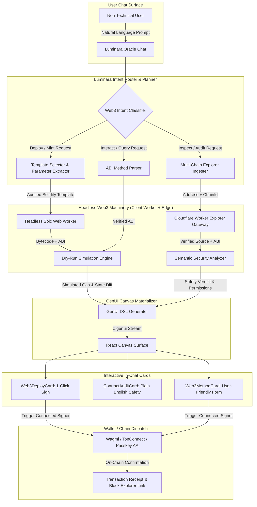

# Architectural Implementation Plan: Luminara Web3 Oracle (100x Conversational Smart Contract Engine)

**Status:** Ready for Review / Engineering  
**Owner:** Luminara Digital (Senior Architect / Full-Stack)  
**Version:** 1.0.0  
**Date:** 2026-10-10  
**Parent PRD:** `docs/plans/onchain-trust-production-ship.md`, `docs/plans/genui-canvas-100x-architecture.md`  
**Referenced Repositories:** `jeremiah-eth/Solidity-IDE`, `solide-project/solide`  

---

## 0. Executive Verdict

Non-technical users should **never** be handed a raw Web3 IDE. Split-pane Monaco editors, compiler error traces, ABI JSON arrays, and manual gas configuration create overwhelming cognitive friction and catastrophic financial risk (honeypots, reentrancy vulnerabilities, failed deployment gas burns).

However, the **underlying technical machinery** demonstrated in `jeremiah-eth/Solidity-IDE` (client-side compilation, gas estimation, execution dispatch) and `solide-project/solide` (multi-chain verified explorer fetching, automated dependency resolution, browser-worker solc) is exceptionally powerful.

By extracting these engine patterns, removing the IDE chrome, and routing them through Luminara's **Oracle Agent** and **GenUI Canvas streaming engine**, we create a **100x Conversational Web3 Agent**:
1. Non-technical users state their intent in plain English (*"Deploy a community token with 5% treasury tax on Base"*, or *"Is this contract address safe?"*).
2. The agent parses intent, injects parameters into **pre-audited, battle-tested templates** (OpenZeppelin / Solady), compiles headlessly in a client Web Worker, and dry-runs the transaction via RPC simulation.
3. The response streams an interactive **GenUI Action Card** directly in the chat with a human-readable summary, exact gas cost in USD, and a 1-click **[Approve & Sign]** button.

---

## 1. 100x Architecture Comparison Matrix

| Architectural Vector | Vanilla Web3 IDEs (`Solidity-IDE` / `solide`) | Luminara 100x Conversational Web3 Oracle |
| :--- | :--- | :--- |
| **Interface Surface** | Full Monaco code editor, file tree, compiler tabs, raw console | **Zero-Code Conversational Canvas**: Natural language chat streaming interactive GenUI action cards. |
| **Contract Generation** | Manual code writing or risky dynamic LLM Solidity hallucination | **Bounded Parameter Injection**: LLM selects from a vetted library of audited OpenZeppelin/Solady templates. |
| **Contract Ingestion** | Manual file upload or copy-paste (`Solidity-IDE`) | **Multi-Chain Explorer Gateway**: Automated verified source and ABI fetching across 25+ EVM chains (`solide` pattern). |
| **Compilation Layer** | Visible compiler panel with cryptic syntax error alerts | **Invisible Headless Worker**: Client-side background Web Worker compiling in <800ms without UI freezing. |
| **Pre-Flight Safety** | Basic regex audit (`Solidity-IDE`) or none (`solide`) | **Dry-Run RPC Simulation (`eth_call`)**: Exact state diff preview, honeypot detection, and USD gas estimation. |
| **Wallet & Signing** | Raw hex data signatures with MetaMask | **Account Abstraction & Human Receipts**: Passkey / ERC-4337 or standard wallet with human-verified execution cards. |
| **Infrastructure Cost** | Heavy backend compilation servers | **Zero Cloud Compute**: 100% client-side worker compilation + Cloudflare Worker edge caching for explorer requests. |

---

## 2. System Architecture & End-to-End Data Flow



---

## 3. Core Subsystems Specification

### 3.1 Audited Template Catalog (`services/web3/templateCatalog.ts`)
Dynamic LLM Solidity generation is strictly prohibited for deployment to protect non-technical users from reentrancy, integer errors, and front-running vulnerabilities. Instead, the agent maps intent to parameter sets for audited templates:

1. **ERC-20 Standard & Capped**: Name, symbol, decimals, initial supply, max supply, mintable/burnable.
2. **ERC-20 Community / Fee**: Treasury fee (capped at 5%), liquidity fee, fee recipient, anti-whale transaction limits.
3. **ERC-721A / 1155 Launchpad**: Collection name, symbol, max mint per wallet, mint price, base URI, royalty fee (ERC-2981).
4. **Payment Splitter & Escrow**: Array of recipient addresses and basis points, release trigger, timelock delay.

```typescript
export interface ContractTemplate {
  id: string;
  name: string;
  category: 'token' | 'nft' | 'payments' | 'governance';
  description: string;
  solidityVersion: string;
  sourceTemplate: string; // Jinja-style or replace tokens
  schema: {
    paramKey: string;
    label: string;
    type: 'string' | 'number' | 'address' | 'percent';
    required: boolean;
    defaultValue?: any;
    validationRegex?: RegExp;
  }[];
}
```

### 3.2 Edge Explorer Proxy (`worker/chain/evmExplorer.ts`)
Adopt the verified contract retrieval logic from `solide` (`lib/evm/explorer.ts`), but shift API requests to the Cloudflare Worker edge with Cloudflare KV caching:

- **Security**: Explorer API keys (Etherscan, BaseScan, Arbiscan, PolygonScan) never leak to the client.
- **Latency**: Fetched ABIs and source codes are cached in Cloudflare KV for 24 hours.
- **Supported Chains**: Ethereum (1), Base (8453), Arbitrum (42161), Polygon (137), Optimism (10), XDC (50/51), and Sepolia/Base-Sepolia testnets.

```typescript
// worker/chain/evmExplorer.ts
export async function getVerifiedContract(
  chainId: string | number,
  address: string,
  env: Env
): Promise<{ source: string; abi: any[]; name: string; compiler: string } | null> {
  const cacheKey = `evm_source:${chainId}:${address.toLowerCase()}`;
  const cached = await env.EVM_CACHE?.get(cacheKey, 'json');
  if (cached) return cached;

  const endpoint = getExplorerEndpoint(chainId);
  const apiKey = getExplorerApiKey(chainId, env);
  
  const res = await fetch(`${endpoint}?module=contract&action=getsourcecode&address=${address}&apikey=${apiKey}`);
  const data = await res.json();
  
  if (data.status !== '1' || !data.result?.[0]?.SourceCode) {
    return null;
  }
  
  const record = {
    source: data.result[0].SourceCode,
    abi: JSON.parse(data.result[0].ABI),
    name: data.result[0].ContractName,
    compiler: data.result[0].CompilerVersion,
  };
  
  await env.EVM_CACHE?.put(cacheKey, JSON.stringify(record), { expirationTtl: 86400 });
  return record;
}
```

### 3.3 Headless Compiler Web Worker (`services/web3/compilerWorker.ts`)
Extracted clean-room from `Solidity-IDE` and `solide`:
- Runs inside a standard browser `Worker` with zero UI thread jank.
- Dynamically loads the required `soljson.js` compiler version from CDN.
- Returns standard Standard-JSON-Input compilation output (bytecode, ABI, gas estimates).

### 3.4 Dry-Run Simulation & Gas Estimator (`services/web3/simulationEngine.ts`)
Before any transaction is offered to a non-technical user, the agent runs a dry-run:
1. Calls `eth_estimateGas` and queries current Base/L1 gas fees.
2. Converts estimated gas into native token (ETH) and real-time USD equivalent (`services/crypto/priceService`).
3. Executes `eth_call` to verify the constructor or method will not revert.
4. Generates a **plain-English balance diff** (e.g., *"You will pay $0.08 in network fees. You will receive 1,000,000 $LUMN tokens."*).

### 3.5 GenUI Web3 Action Components (`services/genui/components/web3/`)

Three dedicated GenUI components are registered into `services/genui/registry.tsx`:

#### 1. `Web3DeployCard`
Renders deployment preview with live gas, token details, and a primary CTA:
```text
:::genui
deploy = Web3DeployCard(
  "Luminara Token ($LUMN)",
  "Base Mainnet",
  "1,000,000",
  "$0.04 (0.000015 ETH)",
  @Action("web3_deploy", "erc20_standard", {"name": "Luminara Token", "symbol": "LUMN", "supply": 1000000})
)
:::
```

#### 2. `ContractAuditCard`
Renders plain-English safety breakdown of any on-chain contract:
```text
:::genui
audit = ContractAuditCard(
  "0x140C07055B0B85efe91b80e765BCc24b3dd647d9",
  "Base",
  "94/100 (Safe)",
  [
    ["Honeypot Check", "Passed", "Verified"],
    ["Ownership Privileges", "Renounced", "Verified"],
    ["Mint Function", "Disabled", "Verified"]
  ],
  @Action("web3_inspect", "0x140C07055B0B85efe91b80e765BCc24b3dd647d9", 8453)
)
:::
```

#### 3. `Web3MethodCard`
Renders an accessible form for calling read/write methods on verified contracts without knowing what an ABI is:
```text
:::genui
claim = Web3MethodCard(
  "Claim Community Rewards",
  "StakingPool",
  "0x8787...4E2",
  "Free (Gas ~$0.02)",
  @Action("web3_call", "claimRewards", [])
)
:::
```

---

## 4. Security & Safety Invariants

1. **Non-Custodial Guarantee**: Private keys never touch Luminara servers or client memory. All executions dispatch to the user's browser provider (MetaMask, Rabby, Coinbase Smart Wallet, TonConnect).
2. **Mandatory Simulation**: No write transaction card can render an enabled `[Sign]` button without a successful pre-flight `eth_call` simulation.
3. **Fail-Closed Permissions**: The agent refuses to compile or recommend code containing hidden mints, arbitrary balance burning, or unconstrained proxy upgrades.
4. **Honesty Invariant (APS Principle 5)**: Never invent gas prices, token reserves, or liquidity figures. If RPC data is unavailable, display `not_measured` or `unknown`.

---

## 5. Phased Engineering Rollout

```
Phase 0: Edge Explorer Gateway + KV Cache
   │     - Port `solide` explorer resolution into `worker/chain/evmExplorer.ts`
   │     - Add multi-chain caching & rate-limiting
   ▼
Phase 1: Headless Web Worker Compiler & Template Catalog
   │     - Port `solc-worker` into zero-dependency background client worker
   │     - Establish audited OpenZeppelin template registry
   ▼
Phase 2: GenUI Web3 Micro-Components
   │     - Implement `Web3DeployCard`, `ContractAuditCard`, `Web3MethodCard`
   │     - Register in `services/genui/registry.tsx` and GenUI streaming lexer
   ▼
Phase 3: Conversational Contract Inspector (Read Mode)
   │     - User pastes any address -> Agent fetches verified source -> Streams plain English audit card
   ▼
Phase 4: 1-Click Conversational Deployer (Write Mode)
         - Simulation engine (`eth_estimateGas` + USD conversion)
         - Dispatch to connected wallet / Account Abstraction
```

### Phase Acceptance Criteria
- **Phase 0 Gate**: `worker/chain/evmExplorer.ts` resolves verified contracts across Base and Ethereum in <300ms from KV.
- **Phase 1 Gate**: `compilerWorker.ts` compiles standard ERC-20 template in <1.2s in a background browser thread with zero UI frame drop.
- **Phase 2 Gate**: `Web3DeployCard` renders cleanly in Oracle Chat with responsive design and theme-matching glassmorphism.
- **Phase 3 Gate**: Non-technical user can ask *"What does 0x... do?"* and receive a verified plain-English permission breakdown without seeing code.
- **Phase 4 Gate**: Successfully deploy a contract to Base Sepolia testnet directly from a chat card click in 1 transaction.
